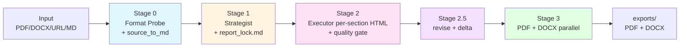

# Report-master

> **AI-driven professional report generation pipeline.** From Markdown / HTML / PDF / DOCX / URL sources, it auto-produces **DOCX** as the primary user-facing deliverable, and uses a `report_lock.md` anti-drift contract to keep long-form reports visually and narratively consistent. **v1.4.0 — DOCX-only user-facing output**; HTML is the internal intermediate (also available as `--format html,docx` named output); PDF is no longer produced by the orchestrator (the `html_to_pdf.py` module is retained for legacy opt-in).

[](https://github.com/HTTP404Not-Found/Report-master)
[](https://www.python.org/)
[](#-pipeline--5-step-phase-flow)
[-success)](#-progress)
[](#-testing)
[](LICENSE)

> Looking for the Chinese version? See [`README_zh.md`](README_zh.md).

---

## Table of Contents

- [About](#about)
- [Features](#features)
- [Quick Start](#quick-start)
- [Installation](#installation)
- [Usage](#usage)
- [Pipeline — 5-Step Phase Flow](#pipeline--5-step-phase-flow)
- [Architecture](#architecture)
- [Progress](#progress)
- [Testing](#testing)
- [Development](#development)
- [License](#license)
- [References](#references)

---

## About

**Report-master** is an **AI-driven professional report generation pipeline**. It treats **HTML as the internal intermediate format** between AI content generation and engineering rendering, and runs a single primary path — pandoc (HTML → DOCX) — to produce a **DOCX user-facing deliverable** (since v1.4.0; the PDF path is retired). HTML also remains user-accessible via `--format html,docx`. A machine-executable `report_lock.md` (a YAML schema with 17 required fields) acts as the formatting contract to prevent both visual drift and narrative drift in long-form reports.

The design is inspired by the same author's `ppt-master` family (slide-deck generators), but swaps PPTX for DOCX (with HTML as the first-class pipeline intermediate), and adds **table of contents, section numbering, footnotes, cross-references, and bibliography** — the must-have elements of any formal document. In one sentence: **give it a lock + glossary + section outline, and it will generate section-by-section HTML, then emit a single DOCX as the user-facing deliverable.**

### Key Differences vs. ppt-master

The table below summarises how the two systems differ in output format, intermediate unit, AI roles, and anti-drift mechanisms. Understanding these differences helps you pick the right skill — slides go to `ppt-master`, formal written documents go to `report-master`.

| Dimension | ppt-master | Report-master |
|------|-----------|---------------|
| Output | PPTX (single) | **DOCX** (v1.4.0+ user-facing; HTML is pipeline intermediate + opt-in named output; `html_to_pdf.py` is kept for legacy opt-in) |
| Intermediate | SVG | **HTML** (block flow is friendlier to DOCX) |
| AI unit | per-slide SVG | **per-section HTML** (section-by-section + per-section quality gate) |
| Structure | slides | **sections (cover → TOC → body → bibliography)** |
| Numbering | slide # | **section / figure / formula numbering** |
| Citations | none | **APA / MLA / Chicago / GBC** |
| Citation support | N/A | **pandoc `--citeproc` + CSL** |
| Formulas | Chart.js | **KaTeX server-side PNG** |
| Anti-drift | `spec_lock.md` | **`report_lock.md`** (17 required fields) |
| Fonts | brand fonts | **標楷體 + Times New Roman (locked)** |

---

## Features

The project is split into four phases. **Phase 3 is complete (40/40 = 100%).** All phases done — see the *Progress* section for details.

### Phase 0 ✅ Foundation (100%)

- **`report_lock.md` YAML schema** — a machine-executable contract with 17 required fields (fonts, sizes, line spacing, page size, citation style). Missing any one is rejected by `Strategist` at Stage 1.
- **`shared-standards.md`** — explicitly forbids CSS Grid / Flex / positioning / `::before` / `::after`. This is the foundation of HTML → DOCX fidelity (weasyprint is fine, but pandoc breaks).
- **`glossary.md`** — a terminology-table template that prevents *narrative drift* in long reports (the same concept being called by two names across sections).
- **Font strategy** — `fonts/` is a bundle directory, and `config.py` runs a fail-fast check at startup to confirm 標楷體 (DFKai-SB / KaiTi) and Times New Roman are both present.

### Phase 1 ✅ MVP — DOCX Path (100%; legacy PDF Path retired in v1.4.0)

- `config.py` — `.env` load chain plus a fail-fast font check.
- `project_manager.py` — one-shot directory scaffolding and `report_lock.md` template generation.
- `source_to_md/` — the unified PDF / DOCX / URL → Markdown pipeline (the Stage 0 entry).
- `html_to_pdf.py` — weasyprint rendering with font-embedding verification, ensuring offline-readable PDFs.
 - `html_to_pdf.py` — weasyprint rendering with font-embedding verification, ensuring offline-readable PDFs. **(v1.4.0: legacy; not invoked by the default `report_gen` pipeline. The `html_to_pdf.py` module is kept for opt-in scenarios.)**
- `quality_checker.py` — basic gate (HTML syntax + fonts + forbidden CSS list).
- `report_gen.py` Phase 1 integration — one-shot PDF output.

### Phase 2 ✅ DOCX-first; PDF path legacy (89% → DOCX-only in v1.4.0)

- `html_to_docx.py` — pandoc + reference docx path, turning HTML into structurally-stable Word documents.
- `templates/reference/report-master-template.docx` — pre-loaded font styles (CJK=標楷體 / Latin=Times New Roman), so Word opens with zero manual setup.
- `docx_validator.py` — python-docx spot-checks fonts plus a mammoth round-trip to confirm DOCX integrity.
- `toc_generator.py` — auto-generated table of contents via `pandoc --toc` — no manual anchors required.
- `footnote_manager.py` — pandoc-native `^[note]` syntax plus CSL citation management.
- `mermaid_renderer.py` — pre-renders Mermaid to SVG (avoids weasyprint's silent failure on missing JS engine).
- `katex_renderer.py` — pre-renders KaTeX math to PNG (same reason).
 - `report_gen.py` Phase 2 integration — **DOCX output (HTML intermediate)**. (v1.4.0: PDF parallel output retired; `--format pdf,docx` is accepted but PDF entries are silently dropped.)
- 🚧 `html_to_docx_direct.py` — a python-docx parallel path (disabled by default; intended for format-strict scenarios like government documents or academic submission).

### Phase 3 ✅ Complete Workflow (100%)

- ✅ `Strategist` workflow (10 Confirmations + `report_lock.md` / `report_spec.md`).
- ✅ `Executor` workflow (section-by-section generation + per-section quality gate).
- ✅ `topic-research` workflow (kicks in when no source material is available).
- ✅ `update_spec.py` (SPEC.md change → impact analysis).
- ✅ `delta_checker.py` (version-diff tool, supports Stage 2.5 iteration).
- ✅ `create-template` workflow (structure / formatting / full-template generation).
- ✅ `generate-citations` workflow (BibTeX + CSL automation).
- ✅ `live-preview` workflow (in-browser HTML preview).
- ✅ `export_checker.py` (post-export checks: page count, fonts, images, links).
- 🚧 `resume-execute` workflow (Stage 2/3 checkpoint resume).
- 🚧 `visual-review` workflow (PDF screenshot self-check).
- 🚧 `error_helper.py` (unified error classification + retry strategy).
- 🚧 3 full example reports (serve as integration tests; 1 currently available).
- ✅ GitHub Actions CI (`.github/workflows/ci.yml`)

---

## Quick Start

Five minutes to a passing smoke test — clone, create the venv, install dependencies, run the example, and you will get `report_<timestamp>.docx` under `/tmp/rm-test`. All commands are copy-pasteable; an exit code of 0 means PASS. (v1.4.0: DOCX is the user-facing deliverable; pass `--format html,docx` to also emit a named HTML file.)

```bash
# 1. clone the repo and enter the venv
git clone https://github.com/HTTP404Not-Found/Report-master.git
cd Report-master
python3 -m venv .venv
source .venv/bin/activate

# 2. install Python dependencies
pip install -r scripts/requirements.txt

# 3. install system tools (pandoc + weasyprint system deps + optional mermaid/katex CLI)
# Ubuntu/Debian
sudo apt install pandoc libpango-1.0-0 libpangoft2-1.0-0
# See https://doc.weasyprint.org/en/stable/install.html for full weasyprint dependencies
# (v1.4.0: pandoc is required; weasyprint is optional/legacy — only needed if you want to
#  re-enable the PDF render path via `scripts/html_to_pdf.py` opt-in.)

# 4. run the example (produces PDF + DOCX under /tmp/rm-test)
python -m scripts.report_gen \
  --source examples \
  --output /tmp/rm-test \
  --lock examples/lock.md

# Expected output:
#   /tmp/rm-test/_bundle.html           (HTML intermediate, internal)
#   /tmp/rm-test/report_<timestamp>.docx
#   (v1.4.0: PDF is no longer produced; pass `--format docx,html` to also get a named HTML file.)
ls /tmp/rm-test
```

> **Expected outcome:** exit code 0, the `.docx` file is present, and `export_checker.py` is fully green on its 5 DOCX checks (DOCX opens, `[Content_Types].xml` present, `word/document.xml` present with at least 1 paragraph, ZIP integrity, DOCX TOC field valid). v1.4.0+ no longer produces PDF.

---

## Installation

This section lists all runtime prerequisites and provides a one-shot install script. Report-master is strict about fonts — `config.py` runs a fail-fast check for 標楷體 and Times New Roman at startup, and **will refuse to run if either is missing**. This is an intentional trade-off (to guarantee visual consistency across PDF and DOCX).

### Prerequisites

| Category | Requirement |
|------|------|
| **Python** | >= 3.10 |
| **pandoc** | >= 2.11 (including built-in `--citeproc`) |
| **weasyprint** | >= 60 (requires system fonts and native deps like Pango / Cairo) |
| **mermaid-cli (mmdc)** | optional, used to pre-render diagrams |
| **katex-cli** | optional, used to pre-render math formulas |
| **CJK fonts** | **標楷體** (DFKai-SB / KaiTi) + Times New Roman |

### Font Installation (Important)

Report-master **hardcodes** the CJK font to `標楷體` and the Latin font to `Times New Roman`. `config.py` performs a **fail-fast** check at init to confirm both fonts exist on the system font path; missing either raises `FontNotFoundError`. See `fonts/LICENSES.md` for licensing details (no font files are bundled, only metadata + install guide).

```bash
# Ubuntu/Debian
sudo apt install fonts-noto-cjk fonts-liberation
# or download 標楷體 manually into fonts/ (mind the license; see fonts/LICENSES.md)

# macOS
# macOS ships 標楷體 by default, no extra step needed
```

### One-shot Install

The following commands take you from clone to a runnable venv in one go. Note that all Python packages live inside the project venv — do not touch the global environment.

```bash
git clone https://github.com/HTTP404Not-Found/Report-master.git
cd Report-master
python3 -m venv .venv
source .venv/bin/activate

pip install -r scripts/requirements.txt
# Additional Track B dependencies (weasyprint + python-docx + BeautifulSoup + lxml):
pip install weasyprint python-docx beautifulsoup4 lxml
```

### Verify Installation

Verification is three-layered — system tool versions, Python package imports, and the font fail-fast. Any failure surfaces together in `python -m scripts.config check`; no need to debug each layer manually.

```bash
# system tools
pandoc --version        # >= 2.11
python -c "import weasyprint; print(weasyprint.__version__)"  # >= 60

# Python packages
python -c "import yaml, fitz, mammoth, requests, dotenv; print('Track A OK')"

# font fail-fast
python -m scripts.config check
```

---

## Usage

`scripts/report_gen.py` is the main entry point and supports three modes — fully automatic (Stage 2 + 3), Stage 3 only (HTML already generated), and Stage 2 only (HTML generation only). Additional CLI commands are listed below, covering everything from project scaffolding to per-section generation. **v1.4.0:** default output is DOCX; `--format` accepts `docx` (default) and `html`; `pdf` is silently dropped.

### Scenario 1: Full Auto (Stage 2 + 3)

Best for "I have sources + lock, just give me the DOCX." All stages run, and any BLOCKING condition is intercepted before export.

```bash
python -m scripts.report_gen \
  --source <input_dir|input.html> \
  --output <exports_dir> \
  --lock <report_lock.md>
```

**Behaviour:**

1. Read `report_lock.md` → validate the 17 required fields (missing → BLOCKING).
2. Run `quality_checker.py` against every section HTML.
3. (v1.4.0) Run `html_to_docx.py` (default; PDF is no longer produced by the orchestrator; HTML named output is only emitted when `--format html,docx` is passed).
4. Run `export_checker.py` 5-item DOCX acceptance.
5. PASS → write `exports/report_<ts>.docx` (and `exports/report_<ts>.html` if `--format html,docx` was passed); FAIL → non-zero exit + reason.

### Scenario 2: Stage 3 Only (HTML → DOCX / HTML)

Best for "HTML is already generated (either from a one-off Stage 2 run, or hand-written) and I only want the DOCX (and optionally a named HTML file)."

```bash
python -m scripts.report_gen render \
  --html <bundle.html> \
  --output <exports_dir> \
  --format docx            # default; or --format docx,html to also emit a named HTML file
```

> **v1.4.0 migration note**: The old `--format pdf,docx` flag is still accepted, but non-`docx` / non-`html` entries are silently dropped.

### Scenario 3: Stage 2 Only (HTML Generation)

Best for "I want to see the HTML first before committing to Stage 3." You can also pass `--sections` to generate only specific sections (used by Stage 2.5 partial revisions).

```bash
python -m scripts.report_gen generate \
  --lock <report_lock.md> \
  --sections <id,id,...> \
  --output <report_output_dir>
```

### Other CLI Commands

| Command | Purpose |
|------|------|
| `python -m scripts.project_manager init <path>` | Initialise a project (scaffold directories, generate lock template) |
| `python -m scripts.strategist --template <type> --output <path>` | Launch the Strategist 10-Confirmation dialogue |
| `python -m scripts.executor --lock <path> --output <dir> [--section N]` | Launch the Executor for per-section generation |
| `python -m scripts.config check` | Font + .env fail-fast check |
| `python -m scripts.quality_checker <file.html>` | Run the quality gate against a single HTML file |
| `python -m scripts.export_checker --pdf <path> --docx <path>` | post-export acceptance check (`--pdf` deprecated in v1.4.0, silently ignored; use `--docx <path>` only) |
| `python -m scripts.export_checker --docx <path>` (v1.4.0+) | post-export acceptance (DOCX-only, 5 checks); `--pdf` is deprecated and ignored |

For the full CLI spec, parameter list, and exit-code semantics, see [`architecture.md`](architecture.md#介面定義).

---

## Recommended Prompts

Four tiers of LLM-facing prompts, from highest-level trigger to lowest-level building block. Use whichever tier matches how much control you want to keep.

### Tier A — One-liner Trigger (paste into any LLM chat)

(v1.4.0+: user-facing output is DOCX; the prompt below targets DOCX as the final deliverable. PDF is no longer produced by the orchestrator.)

```
Use Report-master to run the 5-step phase flow and produce a report.

Topic: <one-line topic>
Purpose: <term paper / business proposal / spec / government doc>
Audience: <professor / client / peers / supervisor>
Length: <pages or word count>
Fonts: 標楷體 (CJK) + Times New Roman (Latin) — Traditional Chinese default
Lock: <customise, or write "use examples/lock.md defaults">

Start with Step 1 (planning + online research). Do NOT write content yet.
Run quality_checker at the end of every chapter.
Finish with: python scripts/build_spec_docx.py --page-numbers --toc
```

**Why this works:**
- `Purpose` + `Audience` matter more than `Topic` — they set tone and format.
- "Start with Step 1, do not write content" forces the research phase and blocks hallucination.
- Omit `Lock` to inherit the conservative `examples/lock.md` defaults.

### Tier B — Sub-agent Dispatch Prompts (one per role)

For orchestrators who want to delegate individual steps. Pair with [`workflows/`](workflows/).

**Strategist** ([`workflows/strategist.md`](workflows/strategist.md)) — Stage 1:
```
Run Stage 1: produce 0_strategist.md for topic "{TOPIC}".
- Walk the 10 Confirmations (audience / depth / tone / sections / sources / ...).
- Output RQ1..RQn (research questions), section breakdown, and a lock.md draft.
- Do NOT write content. Planning only.
```

**Outliner** ([`workflows/phase-3-outliner.md`](workflows/phase-3-outliner.md)) — Stage 1.5:
```
Read 0_strategist.md, produce 0_outline.md (machine) + 0_outline_for_review.md (human).
Per chapter: title, level, core question, required sources, estimated word count.
Skeleton only — no prose. Wait for user confirmation (Step 4) before handing to Executor.
```

**Executor** ([`workflows/executor-base.md`](references/executor-base.md)) — Stage 2, per-section:
```
Read 0_outline.md chapter N + chapter_N_research.md (auto-trigger topic-research if missing).
Produce chapter_N.html; honour fonts / line-spacing / bold rules from examples/lock.md.
Run quality_checker before delivery. FAIL is not deliverable.
```

**Visual Reviewer** — Step 5 pre-flight (optional, v1.4.0: opt-in only):
```
Run python scripts/html_to_docx → soffice → pdftoppm on a temp render → sample 4 pages → visual model evaluation.
Verify: 標楷體 + Times New Roman loaded, no column overflow, page numbers + TOC present, no truncation.
FAIL routes back to Step 2 or Step 3. Do NOT touch prose in Step 5.
Note: PDF render is only available via the legacy `html_to_pdf.py` module; v1.4.0 default
DOCX output can still be visually evaluated by converting a copy via soffice for preview purposes.
```

### Tier C — Terminal-Only CLI (no LLM)

For batch / CI / terminal-only flows.

```bash
cd /home/ubuntu/.openclaw/workspace/projects/report-master

# 1) Minimal end-to-end: SPEC.md → DOCX (with page numbers + TOC)
python scripts/build_spec_docx.py --page-numbers --toc

# 2) Main pipeline orchestrator (3 modes — see SKILL.md §3)
python -m scripts.report_gen --source <input> --output exports/ --lock examples/lock.md              # full auto (DOCX)
python -m scripts.report_gen render --html bundle.html --output exports/ --format docx,html         # Stage 3 only (DOCX + named HTML)
python -m scripts.report_gen generate --lock examples/lock.md --output report_output/               # Stage 2 only
python -m scripts.report_gen render --html bundle.html --output exports/ --format docx              # Stage 3 only, DOCX-only

# 3) Regression tests
.venv/bin/python -m pytest tests/ -q
```

### Bonus — System Prompt Prefix (for agent builders)

Drop this at the top of an agent's system message to bind it to the Report-master contract.

```
You are the Report-master agent.
Before responding, read ~/.openclaw/skills/report-master/SKILL.md.
Obey the 5-step phase flow: Step 1 plan+research → Step 2 expand → Step 3 outline → Step 4 user confirm → Step 5 format.
User feedback routes via: content/facts → Step 2, section structure → Step 3, prose-only → Step 4 inline.
Bilingual delivery: README.md (en) + README_zh.md (zh-TW) must stay in sync. No single-language drift.
```

### Choosing a Tier

| Scenario | Use |
|---|---|
| "Just make me a report" | **A** (one-liner, paste into chat) |
| "I'm orchestrating multiple steps with sub-agents" | **B** (role-by-role dispatch) |
| "I'm scripting / CI / debugging the pipeline itself" | **C** (terminal) |
| "I'm building an agent that *is* Report-master" | **Bonus** (system prompt) |

---

## Pipeline — 5-Step Phase Flow

Report-master runs as a **5-step phase flow**, with each step mapping to one or more underlying stages. Sub-agents should reason in terms of the 5 steps; developers drilling into implementation should reference the underlying stage table below.

1. **Plan + Research** — Strategist runs 10 Confirmations, converges user intent, and integrates web research (`topic-research`) into the planning lock.
2. **Expand with Data** — Executor writes per-section HTML, with data sources explicitly pinned into the prompt (`chapter_N_research.md`).
3. **Structure** — Outliner (`phase-3-outliner`) produces the Section Blueprint (`0_outline.md` + `0_outline_for_review.md`) before user confirmation.
4. **User Confirmation** — explicit human-in-the-loop gate (`user-confirmation` workflow); writes `0_confirmed.json` before Executor starts.
5. **Format (v1.4.0+)** — mechanical DOCX export (`html_to_docx`); HTML remains a user-accessible output via `--format html,docx`. PDF is no longer produced by the orchestrator. No content changes after this step. (Pre-v1.4.0: PDF + DOCX dual export via `html_to_pdf` + `html_to_docx`; see Changelog v1.4.0 for migration.)

**Feedback routing (Step 4 → which step to rewind):**

- **Content / data feedback** (numbers, citations, case studies, evidence) → **Step 2 (Expand)**
- **Structure feedback** (chapter order, merge/split, hierarchy) → **Step 3 (Structure)**
- **Pure wording feedback** (length, bullets, wording) → **Step 4 inline (Revise)**

See `SKILL.md §2.1 / §4.1` for the full routing rules and §4.2 for fallback behaviour.

### Pipeline Stages (Underlying Implementation)

The pipeline is split into five stages, from "raw input in" to "deliverable out", each with explicit entry / exit / BLOCKING conditions. Stage 2.5 is an optional iteration stage, used for partial revisions when the human is not satisfied with v1.

```
┌──────────────────────────────────────────────────────────────────────┐
│  Stage 0 — Format Probe + Source Ingestion                          │
│    source_to_md/* → normalized.md (unified Markdown)                │
│    Format Probe infers report_type (academic/business/spec/gov)     │
├──────────────────────────────────────────────────────────────────────┤
│  Stage 1 — Planning (Strategist + 10 Confirmations + report_lock.md) │
│    Strategist dialogue → writes report_lock.md (YAML) + report_spec.md │
├──────────────────────────────────────────────────────────────────────┤
│  Stage 2 — AI Content Generation (Executor per-section HTML + quality gate) │
│    Executor = per-section + per-section quality gate                │
│    Each section: re-read lock (anti-drift) + re-read glossary       │
│    (anti-narrative-drift) + generate HTML                           │
├──────────────────────────────────────────────────────────────────────┤
│  Stage 2.5 — Iteration (optional, v1 → v2)                          │
│    delta_checker.py diffs versions; select section IDs to re-run Stage 2 │
├──────────────────────────────────────────────────────────────────────┤
│  Stage 3 — Engineering Conversion (v1.4.0: DOCX-only)              │
│    Primary: pandoc → DOCX                                           │
│    Optional: emit named HTML via `--format html,docx`               │
│    export_checker.py post-export check (5 DOCX-only checks)         │
└──────────────────────────────────────────────────────────────────────┘
```

### Two AI Roles

| Role | When | Responsibility |
|------|----------|------|
| **Strategist** | Stage 1 | Hold 10-Confirmation dialogue with the user; write `report_lock.md` and `report_spec.md`; **does NOT**: write HTML, invoke weasyprint |
| **Strategist** | Stage 1 | Hold 10-Confirmation dialogue with the user; write `report_lock.md` and `report_spec.md`; **does NOT**: write HTML, invoke weasyprint (v1.4.0+: weasyprint path is opt-in only) |
| **Executor** | Stage 2 | Per section: re-read lock + glossary + previous HTML → generate the section HTML → pass the quality gate; **does NOT**: run sub-agents in parallel across sections (narrative will drift) |

### Built-in Workflows

| Workflow | Purpose | Status |
|----------|------|------|
| `topic-research` | Triggered when no source material is available | ✅ |
| `create-template` | Structure / formatting / full-template generation | ✅ |
| `resume-execute` | Stage 2/3 checkpoint resume | 🚧 |
| `generate-citations` | bib / CSL / `--citeproc` management | ✅ |
| `live-preview` | In-browser HTML preview | ✅ |
| `visual-review` | PDF screenshot self-check | 🚧 |
| `visual-review` | DOCX structure self-check (v1.4.0+; PDF screenshot flow retired from default) | 🚧 |

For the full workflow index and trigger conditions, see [`workflows/`](workflows/).

---

## Architecture

The diagram below wires the entire pipeline together in Mermaid, followed by the hard rules for fonts and layout (the foundation of PDF / DOCX cross-format consistency). For the full graph TD, sequenceDiagram, stateDiagram-v2, component list, interface definitions, and 26 ADRs (Architecture Decision Records), see [`architecture.md`](architecture.md).

### Simplified Architecture



### Font & Layout Hard Rules (MANDATORY)

To prevent PDF / DOCX format drift, the rules below are **required** fields in the `report_lock.md` schema — any missing entry causes `Strategist` to refuse the lock and `Executor` to refuse to generate that section. This is not a recommendation; it is the contract.

| Element | CJK Font | Latin Font | Size |
|------|----------|----------|------|
| Cover | 標楷體 | Times New Roman | 22pt bold, centered |
| Main title | 標楷體 | Times New Roman | 22pt bold, centered |
| H1 | 標楷體 | Times New Roman | 18pt bold |
| H2 | 標楷體 | Times New Roman | 16pt bold |
| H3 | 標楷體 | Times New Roman | 14pt bold |
| Body | 標楷體 | Times New Roman | 12pt / line height 1.5 |
| Table | 標楷體 | Times New Roman | 12pt |
| Caption | 標楷體 | Times New Roman | 10pt centered |

See [`SPEC.md §3.4.1`](SPEC.md#341-字體與排版規定硬性規則--mandatory) for details.

---

## Progress

Overall progress: **40 / 40 (100%)** (updated 2026-06-14). The table below shows the done / in-progress / todo split per phase, with the corresponding effort estimate. For the full task list, dependency graph, and priority matrix, see [`tasks.md`](tasks.md).

| Phase | Progress | Status |
|------|------|------|
| Phase 0 Foundation | 5/5 (100%) | ✅ Done |
| Phase 1 MVP (PDF) | 9/9 (100%) | ✅ Done |
| Phase 2 Dual format (PDF + DOCX) | 8/9 (89%) | 🟡 Only python-docx parallel path remains |
| Phase 3 Complete workflow | 17/17 (100%) | ✅ All workflows, CI and examples complete |
| **Phase 4 TR-2 fix batch (D7 + D1/D3/D5)** | **6/6 (100%)** | ✅ **Done 2026-06-14 (v1.3.3)** |
| **v1.4.0 (DOCX-only scope reduction)** | **scope reduction** | ✅ **Done 2026-06-14: PDF user-facing output removed; DOCX is the user-facing deliverable; HTML is the pipeline intermediate (also user-accessible via `--format html,docx`); `html_to_pdf.py` module kept for legacy opt-in. `export_checker.py` 7 → 5 checks. Bilingual SKILL.md / README / README_zh.md in sync.** |

### Known Limitations

Listing current "cannot do"s and tunable parameters transparently so contributors can pick tasks or avoid pitfalls.

- **DOCX font spot-check** only covers 3 body paragraphs (tunable in `docx_validator.py`).
- **python-docx parallel path** is currently a stub and disabled by default.
- **examples/** has 2 complete end-to-end report examples (natural science + technical report), each with a full pipeline run.
- **mermaid-cli / katex-cli** are runtime wrappers and need to be pre-installed (`npm install -g ...`).

### v1.3 (2026-06-14) — 5-Step Phase Flow

- ✅ 5-step phase flow documented in `SKILL.md` §2: Plan → Expand → Structure → Confirm → Format.
- ✅ Feedback routing (3 categories + fallback) documented in `SKILL.md` §2.1 / §4.1 / §4.2.
- ✅ Bilingual README Pipeline section updated to reflect 5-step framework.

---

## Testing

The test suite uses pytest, with **444 / 446 tests passing** at the moment (2 skipped — pre-existing). Every `test_*.py` corresponds to a module in `scripts/`, covering everything from config to quality_checker / html_to_pdf / html_to_docx / html_to_docx_direct / toc_generator / executor / strategist / topic_research / build_template. v1.3.3 added `tests/test_quality_checker_section_opener.py` (13 cases — Section Opener Rule integration test, D7).

```bash
# run the full suite
.venv/bin/pytest tests/ -q

# run a single test file
.venv/bin/pytest tests/test_config.py -v
```

**Current state: 444 / 446 tests pass** (2 skipped — pre-existing; v1.3.3 added 13 new tests for D7 integration)

| Test Module | Coverage |
|----------|----------|
| `test_config.py` | .env load chain + font fail-fast |
| `test_project_manager.py` | Directory scaffolding + lock template |
| `test_source_to_md.py` | PDF / DOCX / URL → Markdown |
| `test_quality_checker.py` | HTML syntax + fonts + forbidden CSS |
| `test_html_to_pdf.py` | weasyprint PDF rendering |
| `test_html_to_docx.py` | pandoc DOCX conversion |
| `test_toc_generator.py` | Auto-generated table of contents |
| `test_executor.py` | Per-section generation + per-section gate |
| `test_strategist.py` | 10 Confirmations + BLOCKING |
| `test_topic_research.py` | Workflow when no source material |
| `test_build_template.py` | reference docx generation |

---

## Development

Contributions are welcome. The section below lays out the recommended reading order for newcomers, how to set up a dev environment, contribution rules, and the submission flow. It closes with a Roadmap so you can see where the next milestone lies.

### Entry Point for Contributors

1. Read [`SPEC.md`](SPEC.md) (concepts + pipeline + font/layout hard rules).
2. Read [`architecture.md`](architecture.md) (Mermaid diagrams + ADRs).
3. Read [`AGENTS.md`](AGENTS.md) (read/write rules + CLI cheat sheet).
4. Run [Quick Start](#quick-start) once to confirm the environment.

### Dev Environment

```bash
git clone https://github.com/HTTP404Not-Found/Report-master.git
cd Report-master
python3 -m venv .venv && source .venv/bin/activate
pip install -r scripts/requirements.txt
pip install weasyprint python-docx beautifulsoup4 lxml pytest

# run tests
.venv/bin/pytest tests/ -q

# run the smoke test
python -m scripts.report_gen \
  --source examples \
  --output /tmp/rm-test \
  --lock examples/lock.md
```

### Development Rules

These rules exist because we have hit the issues before — violating any of them is grounds for rejection before merge.

- **Do NOT run section sub-agents in parallel** — narrative will drift (let the main agent iterate section by section).
- **Do NOT bundle real fonts under `fonts/`** — only README + LICENSES; see `fonts/LICENSES.md` for licensing.
- **Do NOT install global Python packages** — use `projects/report-master/.venv`.
- **Modifying the `report_lock.md` schema** requires syncing `docs/report_lock_schema.md` and the `Strategist` workflow.

### Submission Flow

1. Fork → feature branch (`feat/xxx` or `fix/xxx`).
2. Ensure `pytest tests/ -q` is fully green and the smoke test passes.
3. Commit messages follow [Conventional Commits](https://www.conventionalcommits.org/) (`feat(report-master): ...` / `fix(report-master): ...` / `docs(report-master): ...`).
4. Open a PR with motivation + change summary + test evidence.

### Roadmap

| Version | Planned Content |
|------|------|
| **v1.0** | ✅ Track A + Track B complete |
| **v1.1** | ✅ T3-1 / T3-2 / T3-3 / T3-4 / T3-6 / T3-7 workflows (Strategist + Executor + topic-research + create-template + generate-citations + live-preview) |
| **v1.2** | ✅ Stage 1.5 Outliner + User confirmation gate + topic-research v1.1 + DOCX bold fix (4 core fixes) |
| **v1.3** | ✅ 5-step phase flow + feedback routing (Plan / Expand / Structure / Confirm / Format) — see [Pipeline — 5-Step Phase Flow](#pipeline--5-step-phase-flow) |
| **v1.3.1** | ✅ Issue #2 + #3 fix — table column widths + page-numbers / TOC CLI flags — see [Changelog](#changelog) |
| **v1.3.2** | ✅ New `## Recommended Prompts` section — 4-tier prompt catalog (A: one-liner · B: sub-agent dispatch · C: terminal CLI · Bonus: system prompt prefix) — see [Recommended Prompts](#recommended-prompts) |
| **v1.3.3** | ✅ D7 Section Opener Rule + integration test — see [Changelog](#changelog) |
| **v1.4.0** | ✅ DOCX-only user-facing output (PDF removed from orchestrator; HTML preserved as intermediate + opt-in named output; export_checker 7→5 items) — **BREAKING** — see [Changelog](#changelog) |
| **v2.0** | Stage 4 pipeline-as-service + multi-locale |

---


## Core Fixes Applied (2026-06-13)

Four fundamental workflow issues have been resolved:

- ✅ **Section Blueprint**: Strategist now produces `0_outline.md` — chapter-by-chapter plan before execution
- ✅ **User Confirmation Gate**: New `user-confirmation.md` workflow — pipeline pauses for user OK before Executor runs
- ✅ **Web Research Integration**: `topic-research.md` updated with `research_content` stage — `web_search` fills in factual gaps per chapter
- ✅ **DOCX Bold Formatting**: `html_to_docx_direct.py` sanitizes `**text**` → `<strong>` → `bold=True` in Word output

---

## Changelog

### v1.4.0 — 2026-06-14 (DOCX-only user-facing output)

> **BREAKING**: User-facing output no longer includes PDF. DOCX is the primary user-facing deliverable. HTML is the pipeline intermediate (Stage 2 → 3) and remains user-accessible via `--format html,docx`.

- **feat!(report_gen)**: `report_gen.py` `--format` flag accepts `docx` (default) and `html`; `pdf` is silently dropped. `Stage3Result.pdf` field removed. `_stage3_render` no longer imports / calls `html_to_pdf`. The `html_to_pdf.py` module is preserved (not deleted) for future opt-in re-enablement.
- **feat!(export_checker)**: 7-item → 5-item checks. Removed: PDF opens / PDF fonts embedded / PDF page count > 0. Kept (DOCX 5 checks): opens / `[Content_Types].xml` / `word/document.xml` + ≥ 1 paragraph / ZIP integrity / DOCX TOC field valid. `--pdf` and `--require-pdf` CLI flags kept as deprecated no-ops for caller backward-compat.
- **feat(skill)**: SKILL.md frontmatter description + v1.4.0 change banner; §2.0 5-step table updated; §2.2 mapping updated; §3.1 / §3.2 / §3.3 call protocol updated; §5 `visual-review` row annotated; §6 Strategist "does NOT" annotated; §8 vs ppt-master table updated; §9 checklist 7→5 with deprecation note; §10 `ExportCheckFailed: page count=0` marked legacy; §11 version table + footer bumped to v1.4.0.
- **docs(report-master)**: README.md + README_zh.md bilingual sync per AGENTS.md #9 — Usage 3-mode + Tier A/C prompts, Quick Start, Pipeline Stage 3, Architecture Mermaid, Progress table, Changelog v1.4.0 row, version footer, test badge (429/431).
- **out of scope**: SPEC.md (unchanged — needs wai's explicit decision; suggested edits listed in commit body), `projects/dashboard-final/` historical artifacts, `examples/` PDF examples, `references/`, `workflows/` (D7 sub-agent scope), `build_spec_docx.py` (already DOCX-only), intermediate HTML paths (`exports/_intermediate_*.html`, `report_output/section_*.html`, `report_output/_bundle.html`).

**Migration**: Existing `--format pdf,docx` users should remove the flag (default is `docx`) or use `--format html,docx` if they need a named HTML output. The `html_to_pdf.py` module is still importable for ad-hoc PDF generation.

### v1.4.1 — 2026-06-15 (PDF residue cleanup — deprecate + DOCX-only verify)

- **docs(scripts)**: `scripts/visual_review.py` — module docstring + `_parse_args` description + `_cli` banner 加 v1.4.0 deprecation 警告。此工具為 legacy opt-in（`html_to_pdf` 模組仍保留供 opt-in, 所以工具本身可運作), 但預設 `report_gen` pipeline 不再依賴它。如要視覺 review DOCX, 推薦 `soffice --headless --convert-to pdf <docx> --outdir <tmp>` 轉臨時 PDF 再 review。
- **docs(scripts)**: `scripts/live_preview.py` — module docstring 加 v1.4.0 deprecation 警告（同 visual_review 邏輯）。理由: PDF 即時預覽對 user-facing pipeline 已無意義;如要即時預覽 DOCX 排版, 改用 Editor 端 pandoc preview 或 reload browser HTML。
- **test(tests)**: `tests/test_examples.py` — `test_output_files_pdf_docx` 重命名為 `test_output_files_docx_only`, parametrize 列表移除 `report_final.pdf` 條目, 只驗證 DOCX。函式 docstring 標註 v1.4.0 DOCX-only verify 語意（active 測試, 不 skip;若 DOCX 不存在 → pytest.skip）。
- **out of scope**: `html_to_pdf.py` 模組保留（不刪除, 對應 v1.4.0 commit 236753c 的 opt-in 策略）、SPEC.md（v1.4.0 commit body 已列建議, 留 wai 顯式決策）、version footer 不 bump（本 commit 在 v1.4.0 範圍內的補充, v1.4.1 留給實質功能改動）。

**Rationale（為什麼 deprecation 警告而非刪除）**: `visual_review.py` + `live_preview.py` 是專為 PDF 渲染設計的工具;既然 v1.4.0 (commit 236753c) 保留 `html_to_pdf.py` 模組供 legacy opt-in, 這兩個 PDF 預覽工具也跟 `html_to_pdf.py` 同步保留（但加 deprecation 警告）。刪除會破壞任何仍想 opt-in 產 PDF 的 user 的工具鏈;加警告可同時提示 user 改走 DOCX 路徑, 又保留 escape hatch。

### v1.3.3 — 2026-06-14 (Section Opener Rule + integration test, D7)

- **feat: Section Opener Rule (D7, wai 強調)** — H2 / H3 後必須至少有 1 段 ≥ 2 句的引導 `<p>`,禁止直接接 `<ul>` / `<ol>` / `<table>` / `<pre>` / `<dl>` / `<blockquote>` 等區塊元素。LLM 生成常見毛病是「列點優先勝過敘事節奏」,Section opener 是敘事流暢度的最小可行保證。
  - **docs**: `references/executor-base.md` §3.3.5 新增 Section Opener Rule 段落(含 before / after 範例、判定細節、與 quality_checker 的協作說明、修補工具指引)。
  - **feat**: `scripts/quality_checker.py` 新增 `check_section_opener(html)` 函式 — WARN 級(不 BLOCKING),可獨立呼叫;違規寫入 `lock.metadata.warnings`(與 `metadata.progress` 同性質的非 schema 欄位)。提供 `write_warnings_to_lock()` 工具給 Stage 2 / Stage 2.5 / export_checker 共用。
  - **feat**: `scripts/revise_helper.py` 新增 `--ensure-opener` CLI flag + `ensure_section_openers()` / `build_opener_paragraph()` 內部 API,對缺 opener 的小節自動補上引導段(placeholder 預設,LLM 路徑留待擴充)。預設 off。
  - **test**: `tests/test_quality_checker_section_opener.py` 新整合測試,涵蓋 13 個 case(3 必要 + 6 補充 + 3 範例 + 1 邊界):PASS / FAIL-H2-list / FAIL-H3-table / 過短 opener / caption 不算 opener / revise_helper 修補流程 / examples 端到端。
  - **fix**: `examples/section_1.html` 修補 3 條 opener 違規(1.1 / 1.2 / 1.2.1)— 因為這是 integration test 的目的,範例是給使用者參考的「最佳實踐模板」,不應帶違規。
- **chore(D1)**: `scripts/quality_checker.py` `_FORBIDDEN_CSS_PROPS` 加 canonical-source TODO 註解 — `position: absolute / fixed / sticky` 規則是禁用清單唯一來源;後處理階段(任何 `_merge_html_docs` 變體)若有 regex 剝除這些 CSS 的 workaround,是「過渡解」,應在 quality_checker 階段 BLOCKING,不在後處理階段掩飾。規則已存在(v1.3.2 起),此處只是補上文件化的 single-source-of-truth 聲明。
- **docs(D3)**: `SKILL.md §3.4` 新增 DOCX 引擎路由說明 — 依 `lock.output.docx_engine` 選擇 `html_to_docx`(pandoc) vs `html_to_docx_direct`(python-docx)。標註目前 `report_gen.py` 未做自動 routing(待下一輪實作 `--docx-engine` flag)。
- **feat(D5)**: `scripts/export_checker.py` 加 `_check_office_lock_files()` — 掃描 exports/ 目錄裡 `~$` 開頭的 Office 暫存檔(代表上次 Office session 未正常關閉),WARN 級輸出。`ExportCheckReport` 加 `warnings: List[str]` 欄位(向後相容)。
- **Bilingual README sync** — Progress 表格、Changelog、version footer 全部同步至 v1.3.3(`README.md` + `README_zh.md` 平行),遵守 AGENTS.md #9 hard rule。

### v1.3.2 — 2026-06-14 (Recommended Prompts section)

- **docs: new `## Recommended Prompts` section — 4-tier prompt catalog for LLM-driven use of the pipeline.**
 - **Tier A** — one-liner trigger: paste into any LLM chat to drive the full 5-step phase flow end-to-end.
 - **Tier B** — sub-agent dispatch prompts: one per role (Strategist / Outliner / Executor / Visual Reviewer), pairs with `workflows/`.
 - **Tier C** — terminal-only CLI cheatsheet: minimal end-to-end, `report_gen` orchestrator, pytest regression.
 - **Bonus** — system prompt prefix for agent builders integrating Report-master as a skill.
- **docs: Progress table + Changelog updated to v1.3.2; version footer bumped.**
- Bilingual sync (`README.md` + `README_zh.md`) per AGENTS.md #9.

### v1.3.1 — 2026-06-14 (Issue #2 / #3 fix)

- **fix: tables — `_add_table` now assigns explicit column widths based on cell content length (CJK 1.0 / ASCII 0.55), preventing soffice PDF column overflow (Issue #2)**
- **feat: `build_spec_docx.py` — add `--page-numbers` and `--toc` flags (Issue #3)**
- fix: `build_spec_docx.py` `PROJECT_ROOT` now resolves to project root (was `scripts/`); the script's three path constants (`SPEC_MD`, `LOCK_FILE`, `EXPORT_DIR`) actually pointed one level too deep and the script could never run end-to-end.

### v1.3 — 2026-06-14 (5-step phase flow + feedback routing)

- See [Pipeline — 5-Step Phase Flow](#pipeline--5-step-phase-flow) — Plan / Expand / Structure / Confirm / Format stages with bilingual feedback routing.
- Bilingual README sync (`README.md` + `README_zh.md`) per AGENTS.md #9 hard rule.

### v1.2 — 2026-06-13 (4 core fixes)

- Stage 1.5 Outliner + User confirmation gate + topic-research v1.1 + DOCX bold fix. See "Core Fixes Applied" above for details.

## License

This project is released under the **MIT License**. You are free to use, modify, and redistribute it provided the copyright notice is preserved — see the full text below for details.

```
MIT License

Copyright (c) 2026 Zero (wai's AI agent)

Permission is hereby granted, free of charge, to any person obtaining a copy
of this software and associated documentation files (the "Software"), to deal
in the Software without restriction, including without limitation the rights
to use, copy, modify, merge, publish, distribute, sublicense, and/or sell
copies of the Software, and to permit persons to whom the Software is
furnished to do so, subject to the following conditions:

The above copyright notice and this permission notice shall be included in all
copies or substantial portions of the Software.

THE SOFTWARE IS PROVIDED "AS IS", WITHOUT WARRANTY OF ANY KIND, EXPRESS OR
IMPLIED, INCLUDING BUT NOT LIMITED TO THE WARRANTIES OF MERCHANTABILITY,
FITNESS FOR A PARTICULAR PURPOSE AND NONINFRINGEMENT. IN NO EVENT SHALL THE
AUTHORS OR COPYRIGHT HOLDERS BE LIABLE FOR ANY CLAIM, DAMAGES OR OTHER
LIABILITY, WHETHER IN AN ACTION OF CONTRACT, TORT OR OTHERWISE, ARISING FROM,
OUT OF OR IN CONNECTION WITH THE SOFTWARE OR THE USE OR OTHER DEALINGS IN THE
SOFTWARE.
```

> **Font licensing**: see [`fonts/LICENSES.md`](fonts/LICENSES.md) for the licensing of 標楷體 and Times New Roman.

---

## References

Below are the in-project documents (in recommended reading order) and external references. We suggest reading `SPEC.md` → `architecture.md` → `SKILL.md` → `AGENTS.md` first, then drilling into `REVIEW.md` / `tasks.md` / `docs/` as needed.

### In-project Documents

- [`SPEC.md`](SPEC.md) — Spec (concepts + pipeline + font hard rules + risks)
- [`architecture.md`](architecture.md) — System architecture (Mermaid diagrams + ADRs + interface definitions)
- [`SKILL.md`](SKILL.md) — Main workflow authority (general agent entry)
- [`AGENTS.md`](AGENTS.md) — General AI agent entry guide
- [`REVIEW.md`](REVIEW.md) — Senior Architect's SPEC review notes
- [`tasks.md`](tasks.md) — Development task list (40/40 = 100%)
- [`docs/shared-standards.md`](docs/shared-standards.md) — HTML/CSS subset constraints
- [`docs/report_lock_schema.md`](docs/report_lock_schema.md) — `report_lock.md` YAML schema

### External References

- [`reverse-engineer-ppt-master`](../../skills/reverse-engineer-ppt-master/SKILL.md) — Design philosophy reference
- [weasyprint documentation](https://doc.weasyprint.org/en/stable/)
- [pandoc user's guide](https://pandoc.org/MANUAL.html)
- [Citation Style Language (CSL)](https://citationstyles.org/)

---

<p align="center">
  <sub>Report-master v1.4.0 — DOCX-only user-facing output (PDF removed; HTML preserved as pipeline intermediate + opt-in named output) · 40/40 (100%) · 2026-06-14</sub><br>
  <sub>Built with 🐍 Python · 🧱 HTML intermediate · 📄 weasyprint · 📝 pandoc</sub>
  <sub>This is the English primary README · For the Chinese version, see <a href="README_zh.md">README_zh.md</a></sub>
</p>
### v1.4.0 (2026-06-14) — DOCX-only Output

- ✅ **scope**: User-facing output is now **DOCX only**; HTML is the pipeline intermediate and remains user-accessible via `--format html,docx`.
- ✅ `scripts/html_to_pdf.py` is preserved as a **legacy opt-in** module (not invoked by `report_gen`).
- ✅ `scripts/export_checker.py` 7-item → 5-item (PDF open / font embed / page count checks removed; DOCX 5 checks kept).
- ✅ `scripts/report_gen.py` `--format` flag accepts `docx` (default) and `html`; legacy `pdf` is silently dropped.
- ✅ Bilingual `SKILL.md` / `README.md` / `README_zh.md` synced per AGENTS.md #9.
