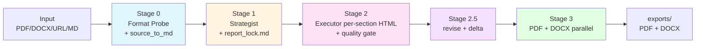

# Report-master

> **AI-driven professional report generation pipeline.** From Markdown / HTML / PDF / DOCX / URL sources, it auto-produces **dual deliverables (PDF + DOCX)** and uses a `report_lock.md` anti-drift contract to keep long-form reports visually and narratively consistent.

[](https://github.com/HTTP404Not-Found/Report-master)
[](https://www.python.org/)
[](#-pipeline-stages)
[-orange)](#-progress)
[](#-testing)
[](LICENSE)

> Looking for the Chinese version? See [`README_zh.md`](README_zh.md).

---

## Table of Contents

- [About](#about)
- [Features](#features)
- [Quick Start](#quick-start)
- [Installation](#installation)
- [Usage](#usage)
- [Pipeline Stages](#pipeline-stages)
- [Architecture](#architecture)
- [Progress](#progress)
- [Testing](#testing)
- [Development](#development)
- [License](#license)
- [References](#references)

---

## About

**Report-master** is an **AI-driven professional report generation pipeline**. It treats **HTML as the intermediate format** between AI content generation and engineering rendering, then runs two independent paths — weasyprint (HTML → PDF) and pandoc (HTML → DOCX) — to produce **dual deliverables (PDF + DOCX)**. A machine-executable `report_lock.md` (a YAML schema with 17 required fields) acts as the formatting contract to prevent both visual drift and narrative drift in long-form reports.

The design is inspired by the same author's `ppt-master` family (slide-deck generators), but swaps PPTX for PDF + DOCX, and adds **table of contents, section numbering, footnotes, cross-references, and bibliography** — the must-have elements of any formal document. In one sentence: **give it a lock + glossary + section outline, and it will generate section-by-section HTML, then emit PDF and DOCX in parallel.**

### Key Differences vs. ppt-master

The table below summarises how the two systems differ in output format, intermediate unit, AI roles, and anti-drift mechanisms. Understanding these differences helps you pick the right skill — slides go to `ppt-master`, formal written documents go to `report-master`.

| Dimension | ppt-master | Report-master |
|------|-----------|---------------|
| Output | PPTX (single) | **PDF + DOCX (dual deliverables)** |
| Intermediate | SVG | **HTML** (block flow is friendlier to PDF/DOCX) |
| AI unit | per-slide SVG | **per-section HTML** (section-by-section + per-section quality gate) |
| Structure | slides | **sections (cover → TOC → body → bibliography)** |
| Numbering | slide # | **section / figure / formula numbering** |
| Citations | none | **APA / MLA / Chicago / GBC** |
| Citation support | N/A | **pandoc `--citeproc` + CSL** |
| Formulas | Chart.js | **KaTeX server-side PNG** |
| Anti-drift | `spec_lock.md` | **`report_lock.md`** (17 required fields) |
| Fonts | brand fonts | **標楷體 + Times New Roman (locked)** |

---

## Features

The project is split into four phases. **Phases 0, 1, and 2 are effectively complete, while Phase 3 is in progress** (currently 32/40 = 80%; see the *Progress* section for details).

### Phase 0 ✅ Foundation (100%)

- **`report_lock.md` YAML schema** — a machine-executable contract with 17 required fields (fonts, sizes, line spacing, page size, citation style). Missing any one is rejected by `Strategist` at Stage 1.
- **`shared-standards.md`** — explicitly forbids CSS Grid / Flex / positioning / `::before` / `::after`. This is the foundation of HTML → DOCX fidelity (weasyprint is fine, but pandoc breaks).
- **`glossary.md`** — a terminology-table template that prevents *narrative drift* in long reports (the same concept being called by two names across sections).
- **Font strategy** — `fonts/` is a bundle directory, and `config.py` runs a fail-fast check at startup to confirm 標楷體 (DFKai-SB / KaiTi) and Times New Roman are both present.

### Phase 1 ✅ MVP — PDF Path (100%)

- `config.py` — `.env` load chain plus a fail-fast font check.
- `project_manager.py` — one-shot directory scaffolding and `report_lock.md` template generation.
- `source_to_md/` — the unified PDF / DOCX / URL → Markdown pipeline (the Stage 0 entry).
- `html_to_pdf.py` — weasyprint rendering with font-embedding verification, ensuring offline-readable PDFs.
- `quality_checker.py` — basic gate (HTML syntax + fonts + forbidden CSS list).
- `report_gen.py` Phase 1 integration — one-shot PDF output.

### Phase 2 ✅ Dual Format PDF + DOCX (89%)

- `html_to_docx.py` — pandoc + reference docx path, turning HTML into structurally-stable Word documents.
- `templates/reference/report-master-template.docx` — pre-loaded font styles (CJK=標楷體 / Latin=Times New Roman), so Word opens with zero manual setup.
- `docx_validator.py` — python-docx spot-checks fonts plus a mammoth round-trip to confirm DOCX integrity.
- `toc_generator.py` — auto-generated table of contents via `pandoc --toc` — no manual anchors required.
- `footnote_manager.py` — pandoc-native `^[note]` syntax plus CSL citation management.
- `mermaid_renderer.py` — pre-renders Mermaid to SVG (avoids weasyprint's silent failure on missing JS engine).
- `katex_renderer.py` — pre-renders KaTeX math to PNG (same reason).
- `report_gen.py` Phase 2 integration — **parallel PDF + DOCX output**.
- 🚧 `html_to_docx_direct.py` — a python-docx parallel path (disabled by default; intended for format-strict scenarios like government documents or academic submission).

### Phase 3 🟡 Complete Workflow (59%)

- ✅ `Strategist` workflow (10 Confirmations + `report_lock.md` / `report_spec.md`).
- ✅ `Executor` workflow (section-by-section generation + per-section quality gate).
- ✅ `topic-research` workflow (kicks in when no source material is available).
- ✅ `update_spec.py` (SPEC.md change → impact analysis).
- ✅ `delta_checker.py` (version-diff tool, supports Stage 2.5 iteration).
- ✅ `create-template` workflow (structure / formatting / full-template generation).
- ✅ `generate-citations` workflow (BibTeX + CSL automation).
- ✅ `live-preview` workflow (in-browser HTML preview).
- ✅ `export_checker.py` (post-export checks: page count, fonts, images, links).
- 🚧 `resume-execute` workflow (Stage 2/3 checkpoint resume).
- 🚧 `visual-review` workflow (PDF screenshot self-check).
- 🚧 `error_helper.py` (unified error classification + retry strategy).
- 🚧 3 full example reports (serve as integration tests; 1 currently available).
- 🚧 GitHub Actions CI.

---

## Quick Start

Five minutes to a passing smoke test — clone, create the venv, install dependencies, run the example, and you will get `report_<timestamp>.pdf` and `report_<timestamp>.docx` under `/tmp/rm-test`. All commands are copy-pasteable; an exit code of 0 means PASS.

```bash
# 1. clone the repo and enter the venv
git clone https://github.com/HTTP404Not-Found/Report-master.git
cd Report-master
python3 -m venv .venv
source .venv/bin/activate

# 2. install Python dependencies
pip install -r scripts/requirements.txt

# 3. install system tools (pandoc + weasyprint system deps + optional mermaid/katex CLI)
# Ubuntu/Debian
sudo apt install pandoc libpango-1.0-0 libpangoft2-1.0-0
# See https://doc.weasyprint.org/en/stable/install.html for full weasyprint dependencies

# 4. run the example (produces PDF + DOCX under /tmp/rm-test)
python -m scripts.report_gen \
  --source examples \
  --output /tmp/rm-test \
  --lock examples/lock.md

# Expected output:
#   /tmp/rm-test/_bundle.html           (HTML bundle)
#   /tmp/rm-test/report_<timestamp>.pdf
#   /tmp/rm-test/report_<timestamp>.docx
ls /tmp/rm-test
```

> **Expected outcome:** exit code 0, both `.pdf` and `.docx` files present, and `export_checker.py` is fully green (page count > 0, fonts embedded, TOC links valid).

---

## Installation

This section lists all runtime prerequisites and provides a one-shot install script. Report-master is strict about fonts — `config.py` runs a fail-fast check for 標楷體 and Times New Roman at startup, and **will refuse to run if either is missing**. This is an intentional trade-off (to guarantee visual consistency across PDF and DOCX).

### Prerequisites

| Category | Requirement |
|------|------|
| **Python** | >= 3.10 |
| **pandoc** | >= 2.11 (including built-in `--citeproc`) |
| **weasyprint** | >= 60 (requires system fonts and native deps like Pango / Cairo) |
| **mermaid-cli (mmdc)** | optional, used to pre-render diagrams |
| **katex-cli** | optional, used to pre-render math formulas |
| **CJK fonts** | **標楷體** (DFKai-SB / KaiTi) + Times New Roman |

### Font Installation (Important)

Report-master **hardcodes** the CJK font to `標楷體` and the Latin font to `Times New Roman`. `config.py` performs a **fail-fast** check at init to confirm both fonts exist on the system font path; missing either raises `FontNotFoundError`. See `fonts/LICENSES.md` for licensing details (no font files are bundled, only metadata + install guide).

```bash
# Ubuntu/Debian
sudo apt install fonts-noto-cjk fonts-liberation
# or download 標楷體 manually into fonts/ (mind the license; see fonts/LICENSES.md)

# macOS
# macOS ships 標楷體 by default, no extra step needed
```

### One-shot Install

The following commands take you from clone to a runnable venv in one go. Note that all Python packages live inside the project venv — do not touch the global environment.

```bash
git clone https://github.com/HTTP404Not-Found/Report-master.git
cd Report-master
python3 -m venv .venv
source .venv/bin/activate

pip install -r scripts/requirements.txt
# Additional Track B dependencies (weasyprint + python-docx + BeautifulSoup + lxml):
pip install weasyprint python-docx beautifulsoup4 lxml
```

### Verify Installation

Verification is three-layered — system tool versions, Python package imports, and the font fail-fast. Any failure surfaces together in `python -m scripts.config check`; no need to debug each layer manually.

```bash
# system tools
pandoc --version        # >= 2.11
python -c "import weasyprint; print(weasyprint.__version__)"  # >= 60

# Python packages
python -c "import yaml, fitz, mammoth, requests, dotenv; print('Track A OK')"

# font fail-fast
python -m scripts.config check
```

---

## Usage

`scripts/report_gen.py` is the main entry point and supports three modes — fully automatic (Stage 2 + 3), Stage 3 only (HTML already generated), and Stage 2 only (HTML generation only). Additional CLI commands are listed below, covering everything from project scaffolding to per-section generation.

### Scenario 1: Full Auto (Stage 2 + 3)

Best for "I have sources + lock, just give me the PDF + DOCX." All stages run, and any BLOCKING condition is intercepted before export.

```bash
python -m scripts.report_gen \
  --source <input_dir|input.html> \
  --output <exports_dir> \
  --lock <report_lock.md>
```

**Behaviour:**

1. Read `report_lock.md` → validate the 17 required fields (missing → BLOCKING).
2. Run `quality_checker.py` against every section HTML.
3. Run `html_to_pdf.py` and `html_to_docx.py` in **parallel**.
4. Run `export_checker.py` for final acceptance.
5. PASS → write `exports/report_<ts>.{pdf,docx}`; FAIL → non-zero exit + reason.

### Scenario 2: Stage 3 Only (HTML → PDF/DOCX)

Best for "HTML is already generated (either from a one-off Stage 2 run, or hand-written) and I only want the PDF / DOCX."

```bash
python -m scripts.report_gen render \
  --html <bundle.html> \
  --output <exports_dir> \
  --format pdf,docx
```

### Scenario 3: Stage 2 Only (HTML Generation)

Best for "I want to see the HTML first before committing to Stage 3." You can also pass `--sections` to generate only specific sections (used by Stage 2.5 partial revisions).

```bash
python -m scripts.report_gen generate \
  --lock <report_lock.md> \
  --sections <id,id,...> \
  --output <report_output_dir>
```

### Other CLI Commands

| Command | Purpose |
|------|------|
| `python -m scripts.project_manager init <path>` | Initialise a project (scaffold directories, generate lock template) |
| `python -m scripts.strategist --template <type> --output <path>` | Launch the Strategist 10-Confirmation dialogue |
| `python -m scripts.executor --lock <path> --output <dir> [--section N]` | Launch the Executor for per-section generation |
| `python -m scripts.config check` | Font + .env fail-fast check |
| `python -m scripts.quality_checker <file.html>` | Run the quality gate against a single HTML file |
| `python -m scripts.export_checker --pdf <path> --docx <path>` | post-export acceptance check |

For the full CLI spec, parameter list, and exit-code semantics, see [`architecture.md`](architecture.md#介面定義).

---

## Pipeline Stages

The pipeline is split into five stages, from "raw input in" to "deliverable out", each with explicit entry / exit / BLOCKING conditions. Stage 2.5 is an optional iteration stage, used for partial revisions when the human is not satisfied with v1.

```
┌──────────────────────────────────────────────────────────────────────┐
│  Stage 0 — Format Probe + Source Ingestion                          │
│    source_to_md/* → normalized.md (unified Markdown)                │
│    Format Probe infers report_type (academic/business/spec/gov)     │
├──────────────────────────────────────────────────────────────────────┤
│  Stage 1 — Planning (Strategist + 10 Confirmations + report_lock.md) │
│    Strategist dialogue → writes report_lock.md (YAML) + report_spec.md │
├──────────────────────────────────────────────────────────────────────┤
│  Stage 2 — AI Content Generation (Executor per-section HTML + quality gate) │
│    Executor = per-section + per-section quality gate                │
│    Each section: re-read lock (anti-drift) + re-read glossary       │
│    (anti-narrative-drift) + generate HTML                           │
├──────────────────────────────────────────────────────────────────────┤
│  Stage 2.5 — Iteration (optional, v1 → v2)                          │
│    delta_checker.py diffs versions; select section IDs to re-run Stage 2 │
├──────────────────────────────────────────────────────────────────────┤
│  Stage 3 — Engineering Conversion (PDF + DOCX in parallel)          │
│    Parallel: weasyprint → PDF · pandoc → DOCX                       │
│    export_checker.py post-export check                              │
└──────────────────────────────────────────────────────────────────────┘
```

### Two AI Roles

| Role | When | Responsibility |
|------|----------|------|
| **Strategist** | Stage 1 | Hold 10-Confirmation dialogue with the user; write `report_lock.md` and `report_spec.md`; **does NOT**: write HTML, invoke weasyprint |
| **Executor** | Stage 2 | Per section: re-read lock + glossary + previous HTML → generate the section HTML → pass the quality gate; **does NOT**: run sub-agents in parallel across sections (narrative will drift) |

### Built-in Workflows

| Workflow | Purpose | Status |
|----------|------|------|
| `topic-research` | Triggered when no source material is available | ✅ |
| `create-template` | Structure / formatting / full-template generation | ✅ |
| `resume-execute` | Stage 2/3 checkpoint resume | 🚧 |
| `generate-citations` | bib / CSL / `--citeproc` management | ✅ |
| `live-preview` | In-browser HTML preview | ✅ |
| `visual-review` | PDF screenshot self-check | 🚧 |

For the full workflow index and trigger conditions, see [`workflows/`](workflows/).

---

## Architecture

The diagram below wires the entire pipeline together in Mermaid, followed by the hard rules for fonts and layout (the foundation of PDF / DOCX cross-format consistency). For the full graph TD, sequenceDiagram, stateDiagram-v2, component list, interface definitions, and 26 ADRs (Architecture Decision Records), see [`architecture.md`](architecture.md).

### Simplified Architecture



### Font & Layout Hard Rules (MANDATORY)

To prevent PDF / DOCX format drift, the rules below are **required** fields in the `report_lock.md` schema — any missing entry causes `Strategist` to refuse the lock and `Executor` to refuse to generate that section. This is not a recommendation; it is the contract.

| Element | CJK Font | Latin Font | Size |
|------|----------|----------|------|
| Cover | 標楷體 | Times New Roman | 22pt bold, centered |
| Main title | 標楷體 | Times New Roman | 22pt bold, centered |
| H1 | 標楷體 | Times New Roman | 18pt bold |
| H2 | 標楷體 | Times New Roman | 16pt bold |
| H3 | 標楷體 | Times New Roman | 14pt bold |
| Body | 標楷體 | Times New Roman | 12pt / line height 1.5 |
| Table | 標楷體 | Times New Roman | 12pt |
| Caption | 標楷體 | Times New Roman | 10pt centered |

See [`SPEC.md §3.4.1`](SPEC.md#341-字體與排版規定硬性規則--mandatory) for details.

---

## Progress

Overall progress: **32 / 40 (80%)** (updated 2026-06-13). The table below shows the done / in-progress / todo split per phase, with the corresponding effort estimate. For the full task list, dependency graph, and priority matrix, see [`tasks.md`](tasks.md).

| Phase | Progress | Status |
|------|------|------|
| Phase 0 Foundation | 5/5 (100%) | ✅ Done |
| Phase 1 MVP (PDF) | 9/9 (100%) | ✅ Done |
| Phase 2 Dual format (PDF + DOCX) | 8/9 (89%) | 🟡 Only python-docx parallel path remains |
| Phase 3 Complete workflow | 10/17 (59%) | 🟡 workflows + CI + examples still accumulating |

### Known Limitations

Listing current "cannot do"s and tunable parameters transparently so contributors can pick tasks or avoid pitfalls.

- **DOCX font spot-check** only covers 3 body paragraphs (tunable in `docx_validator.py`).
- **python-docx parallel path** is currently a stub and disabled by default.
- **examples/** has only 1 smoke test so far; the full 3 example reports are accumulating.
- **mermaid-cli / katex-cli** are runtime wrappers and need to be pre-installed (`npm install -g ...`).

---

## Testing

The test suite uses pytest, with **189 / 189 tests passing** at the moment. Every `test_*.py` corresponds to a module in `scripts/`, covering everything from config to quality_checker / html_to_pdf / html_to_docx / toc_generator / executor / strategist / topic_research / build_template.

```bash
# run the full suite
.venv/bin/pytest tests/ -q

# run a single test file
.venv/bin/pytest tests/test_config.py -v
```

**Current state: 189 / 189 tests pass** ✅

| Test Module | Coverage |
|----------|----------|
| `test_config.py` | .env load chain + font fail-fast |
| `test_project_manager.py` | Directory scaffolding + lock template |
| `test_source_to_md.py` | PDF / DOCX / URL → Markdown |
| `test_quality_checker.py` | HTML syntax + fonts + forbidden CSS |
| `test_html_to_pdf.py` | weasyprint PDF rendering |
| `test_html_to_docx.py` | pandoc DOCX conversion |
| `test_toc_generator.py` | Auto-generated table of contents |
| `test_executor.py` | Per-section generation + per-section gate |
| `test_strategist.py` | 10 Confirmations + BLOCKING |
| `test_topic_research.py` | Workflow when no source material |
| `test_build_template.py` | reference docx generation |

---

## Development

Contributions are welcome. The section below lays out the recommended reading order for newcomers, how to set up a dev environment, contribution rules, and the submission flow. It closes with a Roadmap so you can see where the next milestone lies.

### Entry Point for Contributors

1. Read [`SPEC.md`](SPEC.md) (concepts + pipeline + font/layout hard rules).
2. Read [`architecture.md`](architecture.md) (Mermaid diagrams + ADRs).
3. Read [`AGENTS.md`](AGENTS.md) (read/write rules + CLI cheat sheet).
4. Run [Quick Start](#quick-start) once to confirm the environment.

### Dev Environment

```bash
git clone https://github.com/HTTP404Not-Found/Report-master.git
cd Report-master
python3 -m venv .venv && source .venv/bin/activate
pip install -r scripts/requirements.txt
pip install weasyprint python-docx beautifulsoup4 lxml pytest

# run tests
.venv/bin/pytest tests/ -q

# run the smoke test
python -m scripts.report_gen \
  --source examples \
  --output /tmp/rm-test \
  --lock examples/lock.md
```

### Development Rules

These rules exist because we have hit the issues before — violating any of them is grounds for rejection before merge.

- **Do NOT run section sub-agents in parallel** — narrative will drift (let the main agent iterate section by section).
- **Do NOT bundle real fonts under `fonts/`** — only README + LICENSES; see `fonts/LICENSES.md` for licensing.
- **Do NOT install global Python packages** — use `projects/report-master/.venv`.
- **Modifying the `report_lock.md` schema** requires syncing `docs/report_lock_schema.md` and the `Strategist` workflow.

### Submission Flow

1. Fork → feature branch (`feat/xxx` or `fix/xxx`).
2. Ensure `pytest tests/ -q` is fully green and the smoke test passes.
3. Commit messages follow [Conventional Commits](https://www.conventionalcommits.org/) (`feat(report-master): ...` / `fix(report-master): ...` / `docs(report-master): ...`).
4. Open a PR with motivation + change summary + test evidence.

### Roadmap

| Version | Planned Content |
|------|------|
| **v1.0** | ✅ Track A + Track B complete |
| **v1.1** | ✅ T3-1 / T3-2 / T3-3 / T3-4 / T3-6 / T3-7 workflows (Strategist + Executor + topic-research + create-template + generate-citations + live-preview) |
| **v1.2** | 🚧 Stage 2.5 revise UI + auto-install of mermaid/katex CLI |
| **v2.0** | Stage 4 pipeline-as-service + multi-locale |

---

## License

This project is released under the **MIT License**. You are free to use, modify, and redistribute it provided the copyright notice is preserved — see the full text below for details.

```
MIT License

Copyright (c) 2026 Zero (wai's AI agent)

Permission is hereby granted, free of charge, to any person obtaining a copy
of this software and associated documentation files (the "Software"), to deal
in the Software without restriction, including without limitation the rights
to use, copy, modify, merge, publish, distribute, sublicense, and/or sell
copies of the Software, and to permit persons to whom the Software is
furnished to do so, subject to the following conditions:

The above copyright notice and this permission notice shall be included in all
copies or substantial portions of the Software.

THE SOFTWARE IS PROVIDED "AS IS", WITHOUT WARRANTY OF ANY KIND, EXPRESS OR
IMPLIED, INCLUDING BUT NOT LIMITED TO THE WARRANTIES OF MERCHANTABILITY,
FITNESS FOR A PARTICULAR PURPOSE AND NONINFRINGEMENT. IN NO EVENT SHALL THE
AUTHORS OR COPYRIGHT HOLDERS BE LIABLE FOR ANY CLAIM, DAMAGES OR OTHER
LIABILITY, WHETHER IN AN ACTION OF CONTRACT, TORT OR OTHERWISE, ARISING FROM,
OUT OF OR IN CONNECTION WITH THE SOFTWARE OR THE USE OR OTHER DEALINGS IN THE
SOFTWARE.
```

> **Font licensing**: see [`fonts/LICENSES.md`](fonts/LICENSES.md) for the licensing of 標楷體 and Times New Roman.

---

## References

Below are the in-project documents (in recommended reading order) and external references. We suggest reading `SPEC.md` → `architecture.md` → `SKILL.md` → `AGENTS.md` first, then drilling into `REVIEW.md` / `tasks.md` / `docs/` as needed.

### In-project Documents

- [`SPEC.md`](SPEC.md) — Spec (concepts + pipeline + font hard rules + risks)
- [`architecture.md`](architecture.md) — System architecture (Mermaid diagrams + ADRs + interface definitions)
- [`SKILL.md`](SKILL.md) — Main workflow authority (general agent entry)
- [`AGENTS.md`](AGENTS.md) — General AI agent entry guide
- [`REVIEW.md`](REVIEW.md) — Senior Architect's SPEC review notes
- [`tasks.md`](tasks.md) — Development task list (32/40 = 80%)
- [`docs/shared-standards.md`](docs/shared-standards.md) — HTML/CSS subset constraints
- [`docs/report_lock_schema.md`](docs/report_lock_schema.md) — `report_lock.md` YAML schema

### External References

- [`reverse-engineer-ppt-master`](../../skills/reverse-engineer-ppt-master/SKILL.md) — Design philosophy reference
- [weasyprint documentation](https://doc.weasyprint.org/en/stable/)
- [pandoc user's guide](https://pandoc.org/MANUAL.html)
- [Citation Style Language (CSL)](https://citationstyles.org/)

---

<p align="center">
  <sub>Report-master v1.1 · 32/40 (80%) · 2026-06-13</sub><br>
  <sub>Built with 🐍 Python · 🧱 HTML intermediate · 📄 weasyprint · 📝 pandoc</sub>
  <sub>This is the English primary README · For the Chinese version, see <a href="README_zh.md">README_zh.md</a></sub>
</p>
