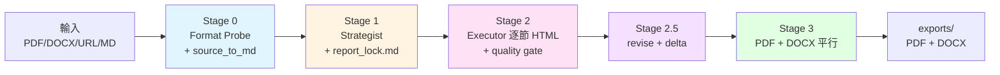

# Report-master

> **AI-driven 專業報告書生成系統 / AI-driven professional report generation pipeline**
> 從 Markdown / HTML / PDF / DOCX / URL 來源自動產出 **PDF + DOCX 雙交付物**,並透過 `report_lock.md` 防漂移機制保證長篇報告的排版與敘事一致性。
>
> **AI-driven professional report generation pipeline.** From Markdown / HTML / PDF / DOCX / URL sources, it auto-produces **dual deliverables (PDF + DOCX)** and uses a `report_lock.md` anti-drift contract to keep long-form reports visually and narratively consistent.

[](https://github.com/HTTP404Not-Found/Report-master)
[](https://www.python.org/)
[](#-三階段流程--pipeline-stages)
[-orange)](#-開發進度--progress)
[](#-測試--testing)
[](LICENSE)

---

## 目錄 / Table of Contents

- [這是什麼 / About](#這是什麼--about)
- [功能特色 / Features](#功能特色--features)
- [快速開始 / Quick Start](#快速開始--quick-start)
- [安裝 / Installation](#安裝--installation)
- [使用方式 / Usage](#使用方式--usage)
- [三階段流程 / Pipeline Stages](#三階段流程--pipeline-stages)
- [系統架構 / Architecture](#系統架構--architecture)
- [開發進度 / Progress](#開發進度--progress)
- [測試 / Testing](#測試--testing)
- [開發與貢獻 / Development](#開發與貢獻--development)
- [授權 / License](#授權--license)
- [參考資料 / References](#參考資料--references)

---

## 這是什麼 / About

**Report-master** 是一個以 AI 為核心的**專業報告書生成系統**。它以 **HTML 作為 AI 內容生成與工程轉換的中間格式**,透過 weasyprint (HTML → PDF) 與 pandoc (HTML → DOCX) 兩條獨立路徑,產出 **PDF + DOCX 雙交付物**,並用 `report_lock.md`(17 個 required 欄位的 YAML schema)作為機器可執行的排版合同,從根本上防止長篇報告的格式漂移與敘事漂移。

本系統的設計靈感來自同作者的 `ppt-master` 系列(投影片生成系統),把輸出從 PPTX 換成 PDF + DOCX,並補上**目次 / 章節編號 / 註腳 / 交叉引用 / 參考文獻**等正式文件必備元素。一句話總結:**給它 lock + glossary + 章節大綱,它會逐節產出 HTML,然後平行吐出 PDF 與 DOCX。**

**Report-master** is an **AI-driven professional report generation pipeline**. It treats **HTML as the intermediate format** between AI content generation and engineering rendering, then runs two independent paths — weasyprint (HTML → PDF) and pandoc (HTML → DOCX) — to produce **dual deliverables (PDF + DOCX)**. A machine-executable `report_lock.md` (a YAML schema with 17 required fields) acts as the formatting contract to prevent both visual drift and narrative drift in long-form reports.

The design is inspired by the same author's `ppt-master` family (slide-deck generators), but swaps PPTX for PDF + DOCX, and adds **table of contents, section numbering, footnotes, cross-references, and bibliography** — the must-have elements of any formal document. In one sentence: **give it a lock + glossary + section outline, and it will generate section-by-section HTML, then emit PDF and DOCX in parallel.**

### 與 ppt-master 的關鍵差異 / Key Differences vs. ppt-master

下表整理兩個系統在輸出格式、中介單位、AI 角色與防漂移機制上的差異。理解這些差異有助於判斷何時該用哪一個 skill — 投影片請交給 `ppt-master`,正式書面文件請交給 `report-master`。

The table below summarises how the two systems differ in output format, intermediate unit, AI roles, and anti-drift mechanisms. Understanding these differences helps you pick the right skill — slides go to `ppt-master`, formal written documents go to `report-master`.

| 維度 / Dimension | ppt-master | Report-master |
|------|-----------|---------------|
| 輸出格式 / Output | PPTX(單一) | **PDF + DOCX(雙交付物)** |
| 中間格式 / Intermediate | SVG | **HTML**(block flow 對 PDF/DOCX 更友善) |
| AI 生成單位 / AI unit | 每頁 SVG | **每節 HTML**(逐節 + per-section quality gate) |
| 結構 / Structure | 投影片 | **章節(封面 → 目次 → 正文 → 參考文獻)** |
| 編號 / Numbering | 投影片 # | **章節 / 圖表 / 公式編號** |
| 引用 / Citations | 無 | **APA / MLA / Chicago / GBC** |
| 引用支援 / Citation support | N/A | **pandoc `--citeproc` + CSL** |
| 公式 / Formulas | Chart.js | **KaTeX server-side PNG** |
| 防 drift 機制 / Anti-drift | `spec_lock.md` | **`report_lock.md`**(17 required 欄位) |
| 字體策略 / Fonts | 品牌字體 | **標楷體 + Times New Roman(鎖死)** |

---

## 功能特色 / Features

整個專案分成四個 phase,目前 **Phase 0 / 1 / 2 已實質完成,Phase 3 持續推進中**(最新進度 32/40 = 80%,詳見「開發進度」一節)。

The project is split into four phases. **Phases 0, 1, and 2 are effectively complete, while Phase 3 is in progress** (currently 32/40 = 80%; see the *Progress* section for details).

### Phase 0 ✅ 基礎建設 / Foundation (100%)

中文:

- **`report_lock.md` YAML schema** — 17 個 required 欄位的機器執行合同(字體、字級、行距、頁面尺寸、引用樣式),任何缺漏都會在 Stage 1 被 `Strategist` 拒絕。
- **`shared-standards.md`** — 明確禁止 CSS Grid / Flex / positioning / `::before` / `::after`,這是 HTML → DOCX fidelity 的根本保證(weasyprint 吃得下,但 pandoc 會壞掉)。
- **`glossary.md`** — 術語表範本,防止長篇報告在多節生成中出現「敘事漂移」(同一個概念用兩個名稱)。
- **字體策略** — `fonts/` 為 bundle 目錄,`config.py` 啟動時 fail-fast 檢查標楷體 + Times New Roman 是否可用,缺一不可。

English:

- **`report_lock.md` YAML schema** — a machine-executable contract with 17 required fields (fonts, sizes, line spacing, page size, citation style). Missing any one is rejected by `Strategist` at Stage 1.
- **`shared-standards.md`** — explicitly forbids CSS Grid / Flex / positioning / `::before` / `::after`. This is the foundation of HTML → DOCX fidelity (weasyprint is fine, but pandoc breaks).
- **`glossary.md`** — a terminology-table template that prevents *narrative drift* in long reports (the same concept being called by two names across sections).
- **Font strategy** — `fonts/` is a bundle directory, and `config.py` runs a fail-fast check at startup to confirm 標楷體 (DFKai-SB / KaiTi) and Times New Roman are both present.

### Phase 1 ✅ MVP — PDF 路徑 / PDF Path (100%)

中文:

- `config.py` — `.env` 加載鏈 + 字體 fail-fast 檢查。
- `project_manager.py` — 一鍵建立目錄結構 + 產出 `report_lock.md` 模板。
- `source_to_md/` — PDF / DOCX / URL → Markdown 統一管線(Stage 0 入口)。
- `html_to_pdf.py` — weasyprint 渲染,字體嵌入驗證,保證 PDF 可離線閱讀。
- `quality_checker.py` — 基礎版門禁(HTML 語法 + 字體 + 禁用 CSS 清單)。
- `report_gen.py` Phase 1 整合 — 一鍵 PDF 產出。

English:

- `config.py` — `.env` load chain plus a fail-fast font check.
- `project_manager.py` — one-shot directory scaffolding and `report_lock.md` template generation.
- `source_to_md/` — the unified PDF / DOCX / URL → Markdown pipeline (the Stage 0 entry).
- `html_to_pdf.py` — weasyprint rendering with font-embedding verification, ensuring offline-readable PDFs.
- `quality_checker.py` — basic gate (HTML syntax + fonts + forbidden CSS list).
- `report_gen.py` Phase 1 integration — one-shot PDF output.

### Phase 2 ✅ 雙格式 PDF + DOCX / Dual Format PDF + DOCX (89%)

中文:

- `html_to_docx.py` — pandoc + reference docx 路徑,把 HTML 轉成結構穩定的 Word。
- `templates/reference/report-master-template.docx` — 預載字體樣式(CJK=標楷體 / Latin=Times New Roman),Word 開檔零設定。
- `docx_validator.py` — python-docx 抽樣驗字體 + mammoth round-trip,確認 DOCX 沒掉字。
- `toc_generator.py` — 目次自動產生(`pandoc --toc`),省去手刻錨點的痛苦。
- `footnote_manager.py` — pandoc 原生 `^[note]` 語法 + CSL 引用管理。
- `mermaid_renderer.py` — mermaid-cli 預渲染 SVG(避免 weasyprint 沒有 JS 引擎而靜默失敗)。
- `katex_renderer.py` — katex-cli 預渲染數學公式 PNG(同樣原因)。
- `report_gen.py` Phase 2 整合 — **PDF + DOCX 平行產出**。
- 🚧 `html_to_docx_direct.py` — python-docx 平行路徑(預設關閉,適合政府公文 / 學術投稿等格式極敏感場景)。

English:

- `html_to_docx.py` — pandoc + reference docx path, turning HTML into structurally-stable Word documents.
- `templates/reference/report-master-template.docx` — pre-loaded font styles (CJK=標楷體 / Latin=Times New Roman), so Word opens with zero manual setup.
- `docx_validator.py` — python-docx spot-checks fonts plus a mammoth round-trip to confirm DOCX integrity.
- `toc_generator.py` — auto-generated table of contents via `pandoc --toc` — no manual anchors required.
- `footnote_manager.py` — pandoc-native `^[note]` syntax plus CSL citation management.
- `mermaid_renderer.py` — pre-renders Mermaid to SVG (avoids weasyprint's silent failure on missing JS engine).
- `katex_renderer.py` — pre-renders KaTeX math to PNG (same reason).
- `report_gen.py` Phase 2 integration — **parallel PDF + DOCX output**.
- 🚧 `html_to_docx_direct.py` — a python-docx parallel path (disabled by default; intended for format-strict scenarios like government documents or academic submission).

### Phase 3 🟡 完整 Workflow / Complete Workflow (59%)

中文:

- ✅ `Strategist` workflow(10 Confirmations + `report_lock.md` / `report_spec.md`)
- ✅ `Executor` workflow(逐節生成 + per-section quality gate)
- ✅ `topic-research` workflow(無源材料時啟動網絡搜集)
- ✅ `update_spec.py`(SPEC.md 變更 → 影響分析)
- ✅ `delta_checker.py`(版本 diff 工具,支援 Stage 2.5 迭代)
- ✅ `create-template` workflow(結構 / 格式 / 完整範本建立)
- ✅ `generate-citations` workflow(BibTeX + CSL 自動管理)
- ✅ `live-preview` workflow(HTML 即時瀏覽器預覽)
- ✅ `export_checker.py`(post-export 檢查:頁數、字體、圖片、連結)
- 🚧 `resume-execute` workflow(Stage 2/3 斷點續傳)
- 🚧 `visual-review` workflow(PDF 截圖自查)
- 🚧 `error_helper.py`(統一錯誤分類 + 重試策略)
- 🚧 3 個完整 example reports(作為 integration test,目前 1 個)
- 🚧 GitHub Actions CI

English:

- ✅ `Strategist` workflow (10 Confirmations + `report_lock.md` / `report_spec.md`).
- ✅ `Executor` workflow (section-by-section generation + per-section quality gate).
- ✅ `topic-research` workflow (kicks in when no source material is available).
- ✅ `update_spec.py` (SPEC.md change → impact analysis).
- ✅ `delta_checker.py` (version-diff tool, supports Stage 2.5 iteration).
- ✅ `create-template` workflow (structure / formatting / full-template generation).
- ✅ `generate-citations` workflow (BibTeX + CSL automation).
- ✅ `live-preview` workflow (in-browser HTML preview).
- ✅ `export_checker.py` (post-export checks: page count, fonts, images, links).
- 🚧 `resume-execute` workflow (Stage 2/3 checkpoint resume).
- 🚧 `visual-review` workflow (PDF screenshot self-check).
- 🚧 `error_helper.py` (unified error classification + retry strategy).
- 🚧 3 full example reports (serve as integration tests; 1 currently available).
- 🚧 GitHub Actions CI.

---

## 快速開始 / Quick Start

中文:5 分鐘跑通 smoke test — clone 專案、建 venv、裝相依、跑 example 即可在 `/tmp/rm-test` 拿到 `report_<timestamp>.pdf` 與 `report_<timestamp>.docx`。所有指令可直接複製貼上;若 exit code 為 0 即代表 PASS。

English: Five minutes to a passing smoke test — clone, create the venv, install dependencies, run the example, and you will get `report_<timestamp>.pdf` and `report_<timestamp>.docx` under `/tmp/rm-test`. All commands are copy-pasteable; an exit code of 0 means PASS.

```bash
# 1. clone + 進 venv / clone the repo and enter the venv
git clone https://github.com/HTTP404Not-Found/Report-master.git
cd Report-master
python3 -m venv .venv
source .venv/bin/activate

# 2. 安裝 Python 相依 / install Python dependencies
pip install -r scripts/requirements.txt

# 3. 安裝系統工具(pandoc + weasyprint 系統依賴 + 可選 mermaid/katex CLI)
# Install system tools (pandoc + weasyprint system deps + optional mermaid/katex CLI)
# Ubuntu/Debian
sudo apt install pandoc libpango-1.0-0 libpangoft2-1.0-0
# weasyprint 完整依賴見 https://doc.weasyprint.org/en/stable/install.html
# See https://doc.weasyprint.org/en/stable/install.html for full weasyprint dependencies

# 4. 跑 example(產出 PDF + DOCX 到 /tmp/rm-test)
# Run the example (produces PDF + DOCX under /tmp/rm-test)
python -m scripts.report_gen \
  --source examples \
  --output /tmp/rm-test \
  --lock examples/lock.md

# 預期產出 / Expected output:
#   /tmp/rm-test/_bundle.html           (HTML bundle)
#   /tmp/rm-test/report_<timestamp>.pdf
#   /tmp/rm-test/report_<timestamp>.docx
ls /tmp/rm-test
```

> 預期結果:exit code = 0,目錄下同時看到 `.pdf` 與 `.docx` 兩個檔案,且 `export_checker.py` 全綠(頁數 > 0、字體已嵌入、目次連結有效)。
>
> Expected outcome: exit code 0, both `.pdf` and `.docx` files present, and `export_checker.py` is fully green (page count > 0, fonts embedded, TOC links valid).

---

## 安裝 / Installation

中文:本節列出所有執行環境的硬需求,並提供一鍵安裝腳本。Report-master 對字體非常嚴格 — `config.py` 啟動時會 fail-fast 檢查標楷體與 Times New Roman,**缺一個就跑不起來**,這是設計上的取捨(為了 PDF / DOCX 雙格式的視覺一致性)。

English: This section lists all runtime prerequisites and provides a one-shot install script. Report-master is strict about fonts — `config.py` runs a fail-fast check for 標楷體 and Times New Roman at startup, and **will refuse to run if either is missing**. This is an intentional trade-off (to guarantee visual consistency across PDF and DOCX).

### 前置需求 / Prerequisites

| 類別 / Category | 需求 / Requirement |
|------|------|
| **Python** | >= 3.10 |
| **pandoc** | >= 2.11(含內建 `--citeproc`) / including built-in `--citeproc` |
| **weasyprint** | >= 60(需系統字體與 Pango / Cairo 等原生依賴) / requires system fonts and native deps like Pango / Cairo |
| **mermaid-cli (mmdc)** | 可選,用於預渲染圖表 / optional, used to pre-render diagrams |
| **katex-cli** | 可選,用於預渲染數學公式 / optional, used to pre-render math formulas |
| **CJK 字體 / CJK fonts** | **標楷體**(DFKai-SB / KaiTi)+ Times New Roman |

### 字體安裝(重要) / Font Installation (Important)

中文:Report-master **鎖死**中文字體為 `標楷體`、英文字體為 `Times New Roman`。`config.py` 在初始化時會 **fail-fast** 檢查這兩個字體是否存在於系統字體路徑上,缺一就 throw `FontNotFoundError`。授權細節請見 `fonts/LICENSES.md`(不附字體檔,只放 metadata + 安裝指引)。

English: Report-master **hardcodes** the CJK font to `標楷體` and the Latin font to `Times New Roman`. `config.py` performs a **fail-fast** check at init to confirm both fonts exist on the system font path; missing either raises `FontNotFoundError`. See `fonts/LICENSES.md` for licensing details (no font files are bundled, only metadata + install guide).

```bash
# Ubuntu/Debian
sudo apt install fonts-noto-cjk fonts-liberation
# 或手動下載標楷體放入 fonts/ 目錄(注意授權,見 fonts/LICENSES.md)
# or download 標楷體 manually into fonts/ (mind the license; see fonts/LICENSES.md)

# macOS
# 系統已內建標楷體,直接可用
# macOS ships 標楷體 by default, no extra step needed
```

### 一鍵安裝 / One-shot Install

中文:以下指令從 clone 到進入可運行的 venv 一氣呵成。注意所有 Python 套件都裝在專案 venv 內,不要動全域環境。

English: The following commands take you from clone to a runnable venv in one go. Note that all Python packages live inside the project venv — do not touch the global environment.

```bash
git clone https://github.com/HTTP404Not-Found/Report-master.git
cd Report-master
python3 -m venv .venv
source .venv/bin/activate

pip install -r scripts/requirements.txt
# 額外 Track B 依賴(weasyprint + python-docx + BeautifulSoup + lxml):
# Additional Track B dependencies (weasyprint + python-docx + BeautifulSoup + lxml):
pip install weasyprint python-docx beautifulsoup4 lxml
```

### 驗證安裝 / Verify Installation

中文:驗證分三層 — 系統工具版本、Python 套件匯入、以及字體 fail-fast。任何一層失敗都會在 `python -m scripts.config check` 一次回報,不需要逐項排查。

English: Verification is three-layered — system tool versions, Python package imports, and the font fail-fast. Any failure surfaces together in `python -m scripts.config check`; no need to debug each layer manually.

```bash
# 系統工具 / system tools
pandoc --version        # >= 2.11
python -c "import weasyprint; print(weasyprint.__version__)"  # >= 60

# Python 套件 / Python packages
python -c "import yaml, fitz, mammoth, requests, dotenv; print('Track A OK')"

# 字體 fail-fast / font fail-fast
python -m scripts.config check
```

---

## 使用方式 / Usage

中文:`scripts/report_gen.py` 是主 entry point,提供三種使用情境 — 全自動(Stage 2 + 3)、只跑 Stage 3(HTML 已生成)、只跑 Stage 2(只生成 HTML)。底下也列出其它 CLI 指令,涵蓋從專案初始化到單節生成的所有入口。

English: `scripts/report_gen.py` is the main entry point and supports three modes — fully automatic (Stage 2 + 3), Stage 3 only (HTML already generated), and Stage 2 only (HTML generation only). Additional CLI commands are listed below, covering everything from project scaffolding to per-section generation.

### 情境 1: 全自動 / Scenario 1: Full Auto (Stage 2 + 3)

中文:適合「我有素材 + lock,要直接拿 PDF + DOCX」的場景。所有 Stage 都會跑,任何 BLOCKING 條件都會在 export 前被攔下來。

English: Best for "I have sources + lock, just give me the PDF + DOCX." All stages run, and any BLOCKING condition is intercepted before export.

```bash
python -m scripts.report_gen \
  --source <input_dir|input.html> \
  --output <exports_dir> \
  --lock <report_lock.md>
```

行為 / Behaviour:

1. 讀 `report_lock.md` → 校驗 17 個 required 欄位(缺 → BLOCKING) / Read `report_lock.md` → validate the 17 required fields (missing → BLOCKING).
2. 對每節 HTML 跑 `quality_checker.py` / Run `quality_checker.py` against every section HTML.
3. **平行**跑 `html_to_pdf.py` 與 `html_to_docx.py` / Run `html_to_pdf.py` and `html_to_docx.py` in **parallel**.
4. 跑 `export_checker.py` 驗收 / Run `export_checker.py` for final acceptance.
5. PASS → 寫入 `exports/report_<ts>.{pdf,docx}`;FAIL → 非零退出 + reason / PASS → write `exports/report_<ts>.{pdf,docx}`; FAIL → non-zero exit + reason.

### 情境 2: 只跑 Stage 3 / Scenario 2: Stage 3 Only (HTML → PDF/DOCX)

中文:適合「HTML 已經生成好(可能來自 Stage 2 的一次性輸出,或是人類手刻),只想轉 PDF / DOCX」的場景。

English: Best for "HTML is already generated (either from a one-off Stage 2 run, or hand-written) and I only want the PDF / DOCX."

```bash
python -m scripts.report_gen render \
  --html <bundle.html> \
  --output <exports_dir> \
  --format pdf,docx
```

### 情境 3: 只跑 Stage 2 / Scenario 3: Stage 2 Only (HTML Generation)

中文:適合「我要先生成 HTML 看一下排版,再決定要不要送 Stage 3」的場景;也可以用 `--sections` 指定只跑特定幾節(用於 Stage 2.5 局部修訂)。

English: Best for "I want to see the HTML first before committing to Stage 3." You can also pass `--sections` to generate only specific sections (used by Stage 2.5 partial revisions).

```bash
python -m scripts.report_gen generate \
  --lock <report_lock.md> \
  --sections <id,id,...> \
  --output <report_output_dir>
```

### 其他 CLI 指令 / Other CLI Commands

| 指令 / Command | 用途 / Purpose |
|------|------|
| `python -m scripts.project_manager init <path>` | 初始化專案(建目錄、產 lock 模板) / Initialise a project (scaffold directories, generate lock template) |
| `python -m scripts.strategist --template <type> --output <path>` | 啟動 Strategist 10 Confirmations / Launch the Strategist 10-Confirmation dialogue |
| `python -m scripts.executor --lock <path> --output <dir> [--section N]` | 啟動 Executor 逐節生成 / Launch the Executor for per-section generation |
| `python -m scripts.config check` | 字體 + .env fail-fast 檢查 / Font + .env fail-fast check |
| `python -m scripts.quality_checker <file.html>` | 對單一 HTML 跑質量門禁 / Run the quality gate against a single HTML file |
| `python -m scripts.export_checker --pdf <path> --docx <path>` | post-export 驗收 / post-export acceptance check |

中文:完整 CLI 規格、參數清單、退出碼語義請見 [`architecture.md`](architecture.md#介面定義)。
English: For the full CLI spec, parameter list, and exit-code semantics, see [`architecture.md`](architecture.md#介面定義).

---

## 三階段流程 / Pipeline Stages

中文:整個 pipeline 分成五個階段,從「原料進來」到「交付物出去」,每一階段都有明確的入口、出口、與 BLOCKING 條件。Stage 2.5 是可選的迭代階段,用於人類對 v1 不滿意時做局部修訂。

English: The pipeline is split into five stages, from "raw input in" to "deliverable out", each with explicit entry / exit / BLOCKING conditions. Stage 2.5 is an optional iteration stage, used for partial revisions when the human is not satisfied with v1.

```
┌──────────────────────────────────────────────────────────────────────┐
│  Stage 0 — Format Probe + Source Ingestion                          │
│    source_to_md/* → normalized.md(統一 Markdown)                    │
│    Format Probe 推斷 report_type(academic/business/spec/gov)         │
├──────────────────────────────────────────────────────────────────────┤
│  Stage 1 — 規劃(Strategist + 10 Confirmations + report_lock.md)     │
│    Strategist 對話 → 寫入 report_lock.md(YAML)+ report_spec.md     │
├──────────────────────────────────────────────────────────────────────┤
│  Stage 2 — AI 內容生成(Executor 逐節 HTML + quality gate)           │
│    Executor = 逐節 + per-section quality gate                       │
│    每節:重讀 lock(防 drift)+ 重讀 glossary(防敘事漂移)+ 生成 HTML │
├──────────────────────────────────────────────────────────────────────┤
│  Stage 2.5 — 迭代(可選,v1 → v2)                                    │
│    delta_checker.py 對 version diff;選定 section IDs 重跑 Stage 2  │
├──────────────────────────────────────────────────────────────────────┤
│  Stage 3 — 工程轉換(PDF + DOCX 平行)                                │
│    平行:weasyprint → PDF · pandoc → DOCX                           │
│    export_checker.py post-export 檢查                               │
└──────────────────────────────────────────────────────────────────────┘
```

### 兩個 AI 角色 / Two AI Roles

| 角色 / Role | 何時啟動 / When | 職責 / Responsibility |
|------|----------|------|
| **Strategist** | Stage 1 | 與使用者 10 Confirmations 對話;寫入 `report_lock.md` 與 `report_spec.md`;**不做**:不寫 HTML、不調用 weasyprint / Hold 10-Confirmation dialogue with the user; write `report_lock.md` and `report_spec.md`; **does NOT**: write HTML, invoke weasyprint |
| **Executor** | Stage 2 | 每節:重讀 lock + glossary + 前節 HTML → 生成該節 HTML → 過 quality gate;**不做**:不跨節並行 sub-agent(敘事必漂移) / Per section: re-read lock + glossary + previous HTML → generate the section HTML → pass the quality gate; **does NOT**: run sub-agents in parallel across sections (narrative will drift) |

### 內建 workflows / Built-in Workflows

| Workflow | 用途 / Purpose | 狀態 / Status |
|----------|------|------|
| `topic-research` | 無源材料時啟動網絡搜集 / Triggered when no source material is available | ✅ |
| `create-template` | 結構 / 格式 / 完整範本建立 / Structure / formatting / full-template generation | ✅ |
| `resume-execute` | Stage 2/3 斷點續傳 / Stage 2/3 checkpoint resume | 🚧 |
| `generate-citations` | bib / CSL / `--citeproc` 管理 / bib / CSL / `--citeproc` management | ✅ |
| `live-preview` | HTML 即時瀏覽器預覽 / In-browser HTML preview | ✅ |
| `visual-review` | PDF 截圖自查 / PDF screenshot self-check | 🚧 |

中文:完整 workflow 索引與觸發條件見 [`workflows/`](workflows/)。
English: For the full workflow index and trigger conditions, see [`workflows/`](workflows/).

---

## 系統架構 / Architecture

中文:底下用一張 Mermaid 圖把整個 pipeline 串起來,然後列出字體與排版的硬性規則(這是 PDF / DOCX 雙格式一致性的根本)。完整的 graph TD、sequenceDiagram、stateDiagram-v2、元件清單、介面定義、與 26 條 ADR(Architecture Decision Record)請見 [`architecture.md`](architecture.md)。

English: The diagram below wires the entire pipeline together in Mermaid, followed by the hard rules for fonts and layout (the foundation of PDF / DOCX cross-format consistency). For the full graph TD, sequenceDiagram, stateDiagram-v2, component list, interface definitions, and 26 ADRs (Architecture Decision Records), see [`architecture.md`](architecture.md).

### 簡化架構圖 / Simplified Architecture



### 字體與排版硬性規則(MANDATORY) / Font & Layout Hard Rules (MANDATORY)

中文:為防止 PDF / DOCX 雙格式漂移,以下規則在 `report_lock.md` schema 中為 **required** — 任何缺漏都會被 `Strategist` 拒絕產出 lock、被 `Executor` 拒絕生成該節 HTML。這不是建議,是契約。

English: To prevent PDF / DOCX format drift, the rules below are **required** fields in the `report_lock.md` schema — any missing entry causes `Strategist` to refuse the lock and `Executor` to refuse to generate that section. This is not a recommendation; it is the contract.

| 元素 / Element | 中文字體 / CJK Font | 英文字體 / Latin Font | 字級 / Size |
|------|----------|----------|------|
| 封面 / Cover | 標楷體 | Times New Roman | 22pt 粗體置中 / 22pt bold, centered |
| 主標題 / Main title | 標楷體 | Times New Roman | 22pt 粗體置中 / 22pt bold, centered |
| H1 | 標楷體 | Times New Roman | 18pt 粗體 / 18pt bold |
| H2 | 標楷體 | Times New Roman | 16pt 粗體 / 16pt bold |
| H3 | 標楷體 | Times New Roman | 14pt 粗體 / 14pt bold |
| 內文 / Body | 標楷體 | Times New Roman | 12pt / 行距 1.5 / 12pt, line height 1.5 |
| 表格 / Table | 標楷體 | Times New Roman | 12pt |
| 圖說 / Caption | 標楷體 | Times New Roman | 10pt 置中 / 10pt centered |

中文:詳見 [`SPEC.md §3.4.1`](SPEC.md#341-字體與排版規定硬性規則--mandatory)。
English: See [`SPEC.md §3.4.1`](SPEC.md#341-字體與排版規定硬性規則--mandatory) for details.

---

## 開發進度 / Progress

中文:整體進度:**32 / 40 (80%)**(2026-06-13 更新)。下表依階段列出已完工 / 進行中 / 待辦的分佈,以及對應的工作量估計。完整任務清單、相依圖、優先級矩陣見 [`tasks.md`](tasks.md)。

English: Overall progress: **32 / 40 (80%)** (updated 2026-06-13). The table below shows the done / in-progress / todo split per phase, with the corresponding effort estimate. For the full task list, dependency graph, and priority matrix, see [`tasks.md`](tasks.md).

| 階段 / Phase | 進度 / Progress | 狀態 / Status |
|------|------|------|
| Phase 0 基礎建設 / Foundation | 5/5 (100%) | ✅ 完成 / Done |
| Phase 1 MVP(PDF) | 9/9 (100%) | ✅ 完成 / Done |
| Phase 2 雙格式(PDF + DOCX) / Dual format | 8/9 (89%) | 🟡 剩 python-docx 平行路徑 / Only python-docx parallel path remains |
| Phase 3 完整 Workflow / Complete workflow | 10/17 (59%) | 🟡 workflows + CI + 範例累積中 / workflows + CI + examples still accumulating |

### 已知限制 / Known Limitations

中文:把目前的「做不到」與「可以調整的參數」透明列出來,方便貢獻者挑任務或避坑。

English: Listing current "cannot do"s and tunable parameters transparently so contributors can pick tasks or avoid pitfalls.

- **DOCX 字體抽樣驗證**只覆蓋 3 段內文(可在 `docx_validator.py` 調高) / **DOCX font spot-check** only covers 3 body paragraphs (tunable in `docx_validator.py`).
- **python-docx 平行路徑**目前為 stub,預設關閉 / **python-docx parallel path** is currently a stub and disabled by default.
- **examples/** 目前只有 1 個 smoke test,完整 3 個 example reports 累積中 / **examples/** has only 1 smoke test so far; the full 3 example reports are accumulating.
- **mermaid-cli / katex-cli** 為 runtime wrapper,需預先安裝(`npm install -g ...`) / **mermaid-cli / katex-cli** are runtime wrappers and need to be pre-installed (`npm install -g ...`).

---

## 測試 / Testing

中文:測試套件用 pytest,目前 **189 / 189 tests pass**。每個 `test_*.py` 對應 `scripts/` 內的對應模組,從 config 到 quality_checker / html_to_pdf / html_to_docx / toc_generator / executor / strategist / topic_research / build_template 全部覆蓋。

English: The test suite uses pytest, with **189 / 189 tests passing** at the moment. Every `test_*.py` corresponds to a module in `scripts/`, covering everything from config to quality_checker / html_to_pdf / html_to_docx / toc_generator / executor / strategist / topic_research / build_template.

```bash
# 全部跑 / run the full suite
.venv/bin/pytest tests/ -q

# 單一測試 / run a single test file
.venv/bin/pytest tests/test_config.py -v
```

當前狀態 / Current state: **189 / 189 tests pass** ✅

| 測試模組 / Test Module | 涵蓋 / Coverage |
|----------|----------|
| `test_config.py` | .env 加載鏈 + 字體 fail-fast / .env load chain + font fail-fast |
| `test_project_manager.py` | 目錄建立 + lock 模板 / Directory scaffolding + lock template |
| `test_source_to_md.py` | PDF / DOCX / URL → Markdown |
| `test_quality_checker.py` | HTML 語法 + 字體 + 禁用 CSS / HTML syntax + fonts + forbidden CSS |
| `test_html_to_pdf.py` | weasyprint PDF 渲染 / weasyprint PDF rendering |
| `test_html_to_docx.py` | pandoc DOCX 轉換 / pandoc DOCX conversion |
| `test_toc_generator.py` | 目次自動產生 / Auto-generated table of contents |
| `test_executor.py` | 逐節生成 + per-section gate / Per-section generation + per-section gate |
| `test_strategist.py` | 10 Confirmations + BLOCKING |
| `test_topic_research.py` | 無源材料 workflow / Workflow when no source material |
| `test_build_template.py` | reference docx 生成 / reference docx generation |

---

## 開發與貢獻 / Development

中文:歡迎貢獻。底下整理新進貢獻者的閱讀順序、開發環境架設、貢獻守則、與提交流程;最後用 Roadmap 收尾,讓你知道下一個 milestone 在哪裡。

English: Contributions are welcome. The section below lays out the recommended reading order for newcomers, how to set up a dev environment, contribution rules, and the submission flow. It closes with a Roadmap so you can see where the next milestone lies.

### 給貢獻者的入口 / Entry Point for Contributors

1. 讀 [`SPEC.md`](SPEC.md)(概念 + pipeline + 字體與排版硬性規則) / Read [`SPEC.md`](SPEC.md) (concepts + pipeline + font/layout hard rules).
2. 讀 [`architecture.md`](architecture.md)(Mermaid 圖 + ADR) / Read [`architecture.md`](architecture.md) (Mermaid diagrams + ADRs).
3. 讀 [`AGENTS.md`](AGENTS.md)(讀寫規則 + CLI 速查) / Read [`AGENTS.md`](AGENTS.md) (read/write rules + CLI cheat sheet).
4. 跑一次 [Quick Start](#快速開始--quick-start) 確認環境 / Run [Quick Start](#快速開始--quick-start) once to confirm the environment.

### 開發環境 / Dev Environment

```bash
git clone https://github.com/HTTP404Not-Found/Report-master.git
cd Report-master
python3 -m venv .venv && source .venv/bin/activate
pip install -r scripts/requirements.txt
pip install weasyprint python-docx beautifulsoup4 lxml pytest

# 跑測試 / run tests
.venv/bin/pytest tests/ -q

# 跑 smoke test / run the smoke test
python -m scripts.report_gen \
  --source examples \
  --output /tmp/rm-test \
  --lock examples/lock.md
```

### 開發守則 / Development Rules

中文:這些是踩過雷才定下來的守則 — 違反其中任何一條,合併前都會被退件。

English: These rules exist because we have hit the issues before — violating any of them is grounds for rejection before merge.

- **不要平行跑 section sub-agent** — 敘事必漂移(main agent 逐節呼叫) / **Do NOT run section sub-agents in parallel** — narrative will drift (let the main agent iterate section by section).
- **不要在 `fonts/` 內含真字體** — 僅放 README + LICENSES,授權見 `fonts/LICENSES.md` / **Do NOT bundle real fonts under `fonts/`** — only README + LICENSES; see `fonts/LICENSES.md` for licensing.
- **不要裝全局 Python package** — 用 `projects/report-master/.venv` / **Do NOT install global Python packages** — use `projects/report-master/.venv`.
- **修改 `report_lock.md` schema** 必須同步 `docs/report_lock_schema.md` 與 `Strategist` workflow / **Modifying the `report_lock.md` schema** requires syncing `docs/report_lock_schema.md` and the `Strategist` workflow.

### 提交流程 / Submission Flow

1. Fork → feature branch (`feat/xxx` 或 `fix/xxx`) / Fork → feature branch (`feat/xxx` or `fix/xxx`).
2. 確保 `pytest tests/ -q` 全綠 + smoke test 通過 / Ensure `pytest tests/ -q` is fully green and the smoke test passes.
3. 提交訊息遵循 [Conventional Commits](https://www.conventionalcommits.org/)(`feat(report-master): ...` / `fix(report-master): ...` / `docs(report-master): ...`) / Commit messages follow [Conventional Commits](https://www.conventionalcommits.org/) (`feat(report-master): ...` / `fix(report-master): ...` / `docs(report-master): ...`).
4. 開 PR,描述動機 + 變更摘要 + 測試證據 / Open a PR with motivation + change summary + test evidence.

### Roadmap

| 版本 / Version | 預計內容 / Planned Content |
|------|------|
| **v1.0** | ✅ Track A + Track B 完工 / Track A + Track B complete |
| **v1.1** | ✅ T3-1 / T3-2 / T3-3 / T3-4 / T3-6 / T3-7 workflows(Strategist + Executor + topic-research + create-template + generate-citations + live-preview) |
| **v1.2** | 🚧 Stage 2.5 revise UI + mermaid/katex CLI 自動安裝 / Stage 2.5 revise UI + auto-install of mermaid/katex CLI |
| **v2.0** | Stage 4 pipeline-as-service + multi-locale |

---

## 授權 / License

中文:本專案以 **MIT License** 發佈。你可以自由使用、修改、散佈,只要保留版權聲明 — 詳見條款全文。

English: This project is released under the **MIT License**. You are free to use, modify, and redistribute it provided the copyright notice is preserved — see the full text below for details.

```
MIT License

Copyright (c) 2026 Zero (wai's AI agent)

Permission is hereby granted, free of charge, to any person obtaining a copy
of this software and associated documentation files (the "Software"), to deal
in the Software without restriction, including without limitation the rights
to use, copy, modify, merge, publish, distribute, sublicense, and/or sell
copies of the Software, and to permit persons to whom the Software is
furnished to do so, subject to the following conditions:

The above copyright notice and this permission notice shall be included in all
copies or substantial portions of the Software.

THE SOFTWARE IS PROVIDED "AS IS", WITHOUT WARRANTY OF ANY KIND, EXPRESS OR
IMPLIED, INCLUDING BUT NOT LIMITED TO THE WARRANTIES OF MERCHANTABILITY,
FITNESS FOR A PARTICULAR PURPOSE AND NONINFRINGEMENT. IN NO EVENT SHALL THE
AUTHORS OR COPYRIGHT HOLDERS BE LIABLE FOR ANY CLAIM, DAMAGES OR OTHER
LIABILITY, WHETHER IN AN ACTION OF CONTRACT, TORT OR OTHERWISE, ARISING FROM,
OUT OF OR IN CONNECTION WITH THE SOFTWARE OR THE USE OR OTHER DEALINGS IN THE
SOFTWARE.
```

> **字體授權 / Font licensing**:標楷體與 Times New Roman 的使用授權見 [`fonts/LICENSES.md`](fonts/LICENSES.md)。
> **Font licensing**: see [`fonts/LICENSES.md`](fonts/LICENSES.md) for the licensing of 標楷體 and Times New Roman.

---

## 參考資料 / References

中文:底下是專案內部文件(以閱讀順序排列)與外部參考。建議先讀 `SPEC.md` → `architecture.md` → `SKILL.md` → `AGENTS.md`,再依需要查 `REVIEW.md` / `tasks.md` / `docs/`。

English: Below are the in-project documents (in recommended reading order) and external references. We suggest reading `SPEC.md` → `architecture.md` → `SKILL.md` → `AGENTS.md` first, then drilling into `REVIEW.md` / `tasks.md` / `docs/` as needed.

### 專案內部文件 / In-project Documents

- [`SPEC.md`](SPEC.md) — 規格書(概念 + pipeline + 字體硬性規則 + 風險) / Spec (concepts + pipeline + font hard rules + risks)
- [`architecture.md`](architecture.md) — 系統架構(Mermaid 圖 + ADR + 介面定義) / System architecture (Mermaid diagrams + ADRs + interface definitions)
- [`SKILL.md`](SKILL.md) — 主 workflow authority(general agent 入口) / Main workflow authority (general agent entry)
- [`AGENTS.md`](AGENTS.md) — general AI agent 入口指南 / General AI agent entry guide
- [`REVIEW.md`](REVIEW.md) — Senior Architect 的 SPEC 審稿紀錄 / Senior Architect's SPEC review notes
- [`tasks.md`](tasks.md) — 開發任務清單(32/40 = 80%) / Development task list (32/40 = 80%)
- [`docs/shared-standards.md`](docs/shared-standards.md) — HTML/CSS 子集約束 / HTML/CSS subset constraints
- [`docs/report_lock_schema.md`](docs/report_lock_schema.md) — `report_lock.md` YAML schema

### 外部參考 / External References

- [`reverse-engineer-ppt-master`](../../skills/reverse-engineer-ppt-master/SKILL.md) — 設計哲學借鏡 / Design philosophy reference
- [weasyprint documentation](https://doc.weasyprint.org/en/stable/)
- [pandoc user's guide](https://pandoc.org/MANUAL.html)
- [Citation Style Language(CSL)](https://citationstyles.org/)

---

<p align="center">
  <sub>Report-master v1.1 · 32/40 (80%) · 2026-06-13</sub><br>
  <sub>Built with 🐍 Python · 🧱 HTML intermediate · 📄 weasyprint · 📝 pandoc</sub>
  <sub>本 README 為完整中英雙語版 · Each section provides both Chinese and English paragraphs</sub>
</p>
