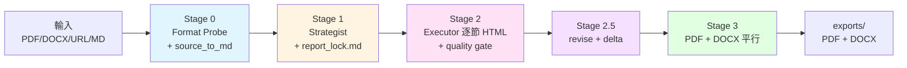

# Report-master

> **AI 驅動的專業報告書生成系統。** 從 Markdown / HTML / PDF / DOCX / URL 來源,自動產出 **PDF + DOCX 雙交付物**,並透過 `report_lock.md` 防漂移機制,保證長篇報告的排版與敘事一致性。

[](https://github.com/HTTP404Not-Found/Report-master)
[](https://www.python.org/)
[](#-三階段流程--pipeline-stages)
[-orange)](#-開發進度--progress)
[](#-測試--testing)
[](LICENSE)

> 英文版請見 [`README.md`](README.md)。

---

## 目錄

- [這是什麼](#這是什麼--about)
- [功能特色](#功能特色--features)
- [快速開始](#快速開始--quick-start)
- [安裝](#安裝--installation)
- [使用方式](#使用方式--usage)
- [三階段流程](#三階段流程--pipeline-stages)
- [系統架構](#系統架構--architecture)
- [開發進度](#開發進度--progress)
- [測試](#測試--testing)
- [開發與貢獻](#開發與貢獻--development)
- [授權](#授權--license)
- [參考資料](#參考資料--references)

---

## 這是什麼 / About

**Report-master** 是一個以 AI 為核心的**專業報告書生成系統**。它以 **HTML 作為 AI 內容生成與工程轉換的中間格式**,透過 weasyprint (HTML → PDF) 與 pandoc (HTML → DOCX) 兩條獨立路徑,產出 **PDF + DOCX 雙交付物**,並用 `report_lock.md`(17 個 required 欄位的 YAML schema)作為機器可執行的排版合同,從根本上防止長篇報告的格式漂移與敘事漂移。

本系統的設計靈感來自同作者的 `ppt-master` 系列(投影片生成系統),把輸出從 PPTX 換成 PDF + DOCX,並補上**目次 / 章節編號 / 註腳 / 交叉引用 / 參考文獻**等正式文件必備元素。一句話總結:**給它 lock + glossary + 章節大綱,它會逐節產出 HTML,然後平行吐出 PDF 與 DOCX。**

### 與 ppt-master 的關鍵差異 / Key Differences vs. ppt-master

下表整理兩個系統在輸出格式、中介單位、AI 角色與防漂移機制上的差異。理解這些差異有助於判斷何時該用哪一個 skill — 投影片請交給 `ppt-master`,正式書面文件請交給 `report-master`。

| 維度 | ppt-master | Report-master |
|------|-----------|---------------|
| 輸出格式 | PPTX(單一) | **PDF + DOCX(雙交付物)** |
| 中間格式 | SVG | **HTML**(block flow 對 PDF/DOCX 更友善) |
| AI 生成單位 | 每頁 SVG | **每節 HTML**(逐節 + per-section quality gate) |
| 結構 | 投影片 | **章節(封面 → 目次 → 正文 → 參考文獻)** |
| 編號 | 投影片 # | **章節 / 圖表 / 公式編號** |
| 引用 | 無 | **APA / MLA / Chicago / GBC** |
| 引用支援 | N/A | **pandoc `--citeproc` + CSL** |
| 公式 | Chart.js | **KaTeX server-side PNG** |
| 防 drift 機制 | `spec_lock.md` | **`report_lock.md`**(17 required 欄位) |
| 字體策略 | 品牌字體 | **標楷體 + Times New Roman(鎖死)** |

---

## 功能特色 / Features

整個專案分成四個 phase,目前 **Phase 0 / 1 / 2 已實質完成,Phase 3 持續推進中**(最新進度 32/40 = 80%,詳見「開發進度」一節)。

### Phase 0 ✅ 基礎建設 / Foundation (100%)

- **`report_lock.md` YAML schema** — 17 個 required 欄位的機器執行合同(字體、字級、行距、頁面尺寸、引用樣式),任何缺漏都會在 Stage 1 被 `Strategist` 拒絕。
- **`shared-standards.md`** — 明確禁止 CSS Grid / Flex / positioning / `::before` / `::after`,這是 HTML → DOCX fidelity 的根本保證(weasyprint 吃得下,但 pandoc 會壞掉)。
- **`glossary.md`** — 術語表範本,防止長篇報告在多節生成中出現「敘事漂移」(同一個概念用兩個名稱)。
- **字體策略** — `fonts/` 為 bundle 目錄,`config.py` 啟動時 fail-fast 檢查標楷體 + Times New Roman 是否可用,缺一不可。

### Phase 1 ✅ MVP — PDF 路徑 / PDF Path (100%)

- `config.py` — `.env` 加載鏈 + 字體 fail-fast 檢查。
- `project_manager.py` — 一鍵建立目錄結構 + 產出 `report_lock.md` 模板。
- `source_to_md/` — PDF / DOCX / URL → Markdown 統一管線(Stage 0 入口)。
- `html_to_pdf.py` — weasyprint 渲染,字體嵌入驗證,保證 PDF 可離線閱讀。
- `quality_checker.py` — 基礎版門禁(HTML 語法 + 字體 + 禁用 CSS 清單)。
- `report_gen.py` Phase 1 整合 — 一鍵 PDF 產出。

### Phase 2 ✅ 雙格式 PDF + DOCX / Dual Format PDF + DOCX (89%)

- `html_to_docx.py` — pandoc + reference docx 路徑,把 HTML 轉成結構穩定的 Word。
- `templates/reference/report-master-template.docx` — 預載字體樣式(CJK=標楷體 / Latin=Times New Roman),Word 開檔零設定。
- `docx_validator.py` — python-docx 抽樣驗字體 + mammoth round-trip,確認 DOCX 沒掉字。
- `toc_generator.py` — 目次自動產生(`pandoc --toc`),省去手刻錨點的痛苦。
- `footnote_manager.py` — pandoc 原生 `^[note]` 語法 + CSL 引用管理。
- `mermaid_renderer.py` — mermaid-cli 預渲染 SVG(避免 weasyprint 沒有 JS 引擎而靜默失敗)。
- `katex_renderer.py` — katex-cli 預渲染數學公式 PNG(同樣原因)。
- `report_gen.py` Phase 2 整合 — **PDF + DOCX 平行產出**。
- 🚧 `html_to_docx_direct.py` — python-docx 平行路徑(預設關閉,適合政府公文 / 學術投稿等格式極敏感場景)。

### Phase 3 🟡 完整 Workflow / Complete Workflow (59%)

- ✅ `Strategist` workflow(10 Confirmations + `report_lock.md` / `report_spec.md`)
- ✅ `Executor` workflow(逐節生成 + per-section quality gate)
- ✅ `topic-research` workflow(無源材料時啟動網絡搜集)
- ✅ `update_spec.py`(SPEC.md 變更 → 影響分析)
- ✅ `delta_checker.py`(版本 diff 工具,支援 Stage 2.5 迭代)
- ✅ `create-template` workflow(結構 / 格式 / 完整範本建立)
- ✅ `generate-citations` workflow(BibTeX + CSL 自動管理)
- ✅ `live-preview` workflow(HTML 即時瀏覽器預覽)
- ✅ `export_checker.py`(post-export 檢查:頁數、字體、圖片、連結)
- 🚧 `resume-execute` workflow(Stage 2/3 斷點續傳)
- 🚧 `visual-review` workflow(PDF 截圖自查)
- 🚧 `error_helper.py`(統一錯誤分類 + 重試策略)
- 🚧 3 個完整 example reports(作為 integration test,目前 1 個)
- 🚧 GitHub Actions CI

---

## 快速開始 / Quick Start

5 分鐘跑通 smoke test — clone 專案、建 venv、裝相依、跑 example 即可在 `/tmp/rm-test` 拿到 `report_<timestamp>.pdf` 與 `report_<timestamp>.docx`。所有指令可直接複製貼上;若 exit code 為 0 即代表 PASS。

```bash
# 1. clone + 進 venv
git clone https://github.com/HTTP404Not-Found/Report-master.git
cd Report-master
python3 -m venv .venv
source .venv/bin/activate

# 2. 安裝 Python 相依
pip install -r scripts/requirements.txt

# 3. 安裝系統工具(pandoc + weasyprint 系統依賴 + 可選 mermaid/katex CLI)
# Ubuntu/Debian
sudo apt install pandoc libpango-1.0-0 libpangoft2-1.0-0
# weasyprint 完整依賴見 https://doc.weasyprint.org/en/stable/install.html

# 4. 跑 example(產出 PDF + DOCX 到 /tmp/rm-test)
python -m scripts.report_gen \
  --source examples \
  --output /tmp/rm-test \
  --lock examples/lock.md

# 預期產出:
#   /tmp/rm-test/_bundle.html           (HTML bundle)
#   /tmp/rm-test/report_<timestamp>.pdf
#   /tmp/rm-test/report_<timestamp>.docx
ls /tmp/rm-test
```

> **預期結果**:exit code = 0,目錄下同時看到 `.pdf` 與 `.docx` 兩個檔案,且 `export_checker.py` 全綠(頁數 > 0、字體已嵌入、目次連結有效)。

---

## 安裝 / Installation

本節列出所有執行環境的硬需求,並提供一鍵安裝腳本。Report-master 對字體非常嚴格 — `config.py` 啟動時會 fail-fast 檢查標楷體與 Times New Roman,**缺一個就跑不起來**,這是設計上的取捨(為了 PDF / DOCX 雙格式的視覺一致性)。

### 前置需求 / Prerequisites

| 類別 | 需求 |
|------|------|
| **Python** | >= 3.10 |
| **pandoc** | >= 2.11(含內建 `--citeproc`) |
| **weasyprint** | >= 60(需系統字體與 Pango / Cairo 等原生依賴) |
| **mermaid-cli (mmdc)** | 可選,用於預渲染圖表 |
| **katex-cli** | 可選,用於預渲染數學公式 |
| **CJK 字體** | **標楷體**(DFKai-SB / KaiTi)+ Times New Roman |

### 字體安裝(重要) / Font Installation (Important)

Report-master **鎖死**中文字體為 `標楷體`、英文字體為 `Times New Roman`。`config.py` 在初始化時會 **fail-fast** 檢查這兩個字體是否存在於系統字體路徑上,缺一就 throw `FontNotFoundError`。授權細節請見 `fonts/LICENSES.md`(不附字體檔,只放 metadata + 安裝指引)。

```bash
# Ubuntu/Debian
sudo apt install fonts-noto-cjk fonts-liberation
# 或手動下載標楷體放入 fonts/ 目錄(注意授權,見 fonts/LICENSES.md)

# macOS
# 系統已內建標楷體,直接可用
```

### 一鍵安裝 / One-shot Install

以下指令從 clone 到進入可運行的 venv 一氣呵成。注意所有 Python 套件都裝在專案 venv 內,不要動全域環境。

```bash
git clone https://github.com/HTTP404Not-Found/Report-master.git
cd Report-master
python3 -m venv .venv
source .venv/bin/activate

pip install -r scripts/requirements.txt
# 額外 Track B 依賴(weasyprint + python-docx + BeautifulSoup + lxml):
pip install weasyprint python-docx beautifulsoup4 lxml
```

### 驗證安裝 / Verify Installation

驗證分三層 — 系統工具版本、Python 套件匯入、以及字體 fail-fast。任何一層失敗都會在 `python -m scripts.config check` 一次回報,不需要逐項排查。

```bash
# 系統工具
pandoc --version        # >= 2.11
python -c "import weasyprint; print(weasyprint.__version__)"  # >= 60

# Python 套件
python -c "import yaml, fitz, mammoth, requests, dotenv; print('Track A OK')"

# 字體 fail-fast
python -m scripts.config check
```

---

## 使用方式 / Usage

`scripts/report_gen.py` 是主 entry point,提供三種使用情境 — 全自動(Stage 2 + 3)、只跑 Stage 3(HTML 已生成)、只跑 Stage 2(只生成 HTML)。底下也列出其它 CLI 指令,涵蓋從專案初始化到單節生成的所有入口。

### 情境 1:全自動 / Scenario 1: Full Auto (Stage 2 + 3)

適合「我有素材 + lock,要直接拿 PDF + DOCX」的場景。所有 Stage 都會跑,任何 BLOCKING 條件都會在 export 前被攔下來。

```bash
python -m scripts.report_gen \
  --source <input_dir|input.html> \
  --output <exports_dir> \
  --lock <report_lock.md>
```

**行為**:

1. 讀 `report_lock.md` → 校驗 17 個 required 欄位(缺 → BLOCKING)。
2. 對每節 HTML 跑 `quality_checker.py`。
3. **平行**跑 `html_to_pdf.py` 與 `html_to_docx.py`。
4. 跑 `export_checker.py` 驗收。
5. PASS → 寫入 `exports/report_<ts>.{pdf,docx}`;FAIL → 非零退出 + reason。

### 情境 2:只跑 Stage 3 / Scenario 2: Stage 3 Only (HTML → PDF/DOCX)

適合「HTML 已經生成好(可能來自 Stage 2 的一次性輸出,或是人類手刻),只想轉 PDF / DOCX」的場景。

```bash
python -m scripts.report_gen render \
  --html <bundle.html> \
  --output <exports_dir> \
  --format pdf,docx
```

### 情境 3:只跑 Stage 2 / Scenario 3: Stage 2 Only (HTML Generation)

適合「我要先生成 HTML 看一下排版,再決定要不要送 Stage 3」的場景;也可以用 `--sections` 指定只跑特定幾節(用於 Stage 2.5 局部修訂)。

```bash
python -m scripts.report_gen generate \
  --lock <report_lock.md> \
  --sections <id,id,...> \
  --output <report_output_dir>
```

### 其他 CLI 指令 / Other CLI Commands

| 指令 | 用途 |
|------|------|
| `python -m scripts.project_manager init <path>` | 初始化專案(建目錄、產 lock 模板) |
| `python -m scripts.strategist --template <type> --output <path>` | 啟動 Strategist 10 Confirmations |
| `python -m scripts.executor --lock <path> --output <dir> [--section N]` | 啟動 Executor 逐節生成 |
| `python -m scripts.config check` | 字體 + .env fail-fast 檢查 |
| `python -m scripts.quality_checker <file.html>` | 對單一 HTML 跑質量門禁 |
| `python -m scripts.export_checker --pdf <path> --docx <path>` | post-export 驗收 |

完整 CLI 規格、參數清單、退出碼語義請見 [`architecture.md`](architecture.md#介面定義)。

---

## 三階段流程 / Pipeline Stages

整個 pipeline 分成五個階段,從「原料進來」到「交付物出去」,每一階段都有明確的入口、出口、與 BLOCKING 條件。Stage 2.5 是可選的迭代階段,用於人類對 v1 不滿意時做局部修訂。

```
┌──────────────────────────────────────────────────────────────────────┐
│  Stage 0 — Format Probe + Source Ingestion                          │
│    source_to_md/* → normalized.md(統一 Markdown)                    │
│    Format Probe 推斷 report_type(academic/business/spec/gov)         │
├──────────────────────────────────────────────────────────────────────┤
│  Stage 1 — 規劃(Strategist + 10 Confirmations + report_lock.md)     │
│    Strategist 對話 → 寫入 report_lock.md(YAML)+ report_spec.md     │
├──────────────────────────────────────────────────────────────────────┤
│  Stage 2 — AI 內容生成(Executor 逐節 HTML + quality gate)           │
│    Executor = 逐節 + per-section quality gate                       │
│    每節:重讀 lock(防 drift)+ 重讀 glossary(防敘事漂移)+ 生成 HTML │
├──────────────────────────────────────────────────────────────────────┤
│  Stage 2.5 — 迭代(可選,v1 → v2)                                    │
│    delta_checker.py 對 version diff;選定 section IDs 重跑 Stage 2  │
├──────────────────────────────────────────────────────────────────────┤
│  Stage 3 — 工程轉換(PDF + DOCX 平行)                                │
│    平行:weasyprint → PDF · pandoc → DOCX                           │
│    export_checker.py post-export 檢查                               │
└──────────────────────────────────────────────────────────────────────┘
```

### 兩個 AI 角色 / Two AI Roles

| 角色 | 何時啟動 | 職責 |
|------|----------|------|
| **Strategist** | Stage 1 | 與使用者 10 Confirmations 對話;寫入 `report_lock.md` 與 `report_spec.md`;**不做**:不寫 HTML、不調用 weasyprint |
| **Executor** | Stage 2 | 每節:重讀 lock + glossary + 前節 HTML → 生成該節 HTML → 過 quality gate;**不做**:不跨節並行 sub-agent(敘事必漂移) |

### 內建 workflows / Built-in Workflows

| Workflow | 用途 | 狀態 |
|----------|------|------|
| `topic-research` | 無源材料時啟動網絡搜集 | ✅ |
| `create-template` | 結構 / 格式 / 完整範本建立 | ✅ |
| `resume-execute` | Stage 2/3 斷點續傳 | 🚧 |
| `generate-citations` | bib / CSL / `--citeproc` 管理 | ✅ |
| `live-preview` | HTML 即時瀏覽器預覽 | ✅ |
| `visual-review` | PDF 截圖自查 | 🚧 |

完整 workflow 索引與觸發條件見 [`workflows/`](workflows/)。

---

## 系統架構 / Architecture

底下用一張 Mermaid 圖把整個 pipeline 串起來,然後列出字體與排版的硬性規則(這是 PDF / DOCX 雙格式一致性的根本)。完整的 graph TD、sequenceDiagram、stateDiagram-v2、元件清單、介面定義、與 26 條 ADR(Architecture Decision Record)請見 [`architecture.md`](architecture.md)。

### 簡化架構圖 / Simplified Architecture



### 字體與排版硬性規則(MANDATORY) / Font & Layout Hard Rules (MANDATORY)

為防止 PDF / DOCX 雙格式漂移,以下規則在 `report_lock.md` schema 中為 **required** — 任何缺漏都會被 `Strategist` 拒絕產出 lock、被 `Executor` 拒絕生成該節 HTML。這不是建議,是契約。

| 元素 | 中文字體 | 英文字體 | 字級 |
|------|----------|----------|------|
| 封面 | 標楷體 | Times New Roman | 22pt 粗體置中 |
| 主標題 | 標楷體 | Times New Roman | 22pt 粗體置中 |
| H1 | 標楷體 | Times New Roman | 18pt 粗體 |
| H2 | 標楷體 | Times New Roman | 16pt 粗體 |
| H3 | 標楷體 | Times New Roman | 14pt 粗體 |
| 內文 | 標楷體 | Times New Roman | 12pt / 行距 1.5 |
| 表格 | 標楷體 | Times New Roman | 12pt |
| 圖說 | 標楷體 | Times New Roman | 10pt 置中 |

詳見 [`SPEC.md §3.4.1`](SPEC.md#341-字體與排版規定硬性規則--mandatory)。

---

## 開發進度 / Progress

整體進度:**32 / 40 (80%)**(2026-06-13 更新)。下表依階段列出已完工 / 進行中 / 待辦的分佈,以及對應的工作量估計。完整任務清單、相依圖、優先級矩陣見 [`tasks.md`](tasks.md)。

| 階段 | 進度 | 狀態 |
|------|------|------|
| Phase 0 基礎建設 | 5/5 (100%) | ✅ 完成 |
| Phase 1 MVP(PDF) | 9/9 (100%) | ✅ 完成 |
| Phase 2 雙格式(PDF + DOCX) | 8/9 (89%) | 🟡 剩 python-docx 平行路徑 |
| Phase 3 完整 Workflow | 10/17 (59%) | 🟡 workflows + CI + 範例累積中 |

### 已知限制 / Known Limitations

把目前的「做不到」與「可以調整的參數」透明列出來,方便貢獻者挑任務或避坑。

- **DOCX 字體抽樣驗證**只覆蓋 3 段內文(可在 `docx_validator.py` 調高)。
- **python-docx 平行路徑**目前為 stub,預設關閉。
- **examples/** 目前只有 1 個 smoke test,完整 3 個 example reports 累積中。
- **mermaid-cli / katex-cli** 為 runtime wrapper,需預先安裝(`npm install -g ...`)。

---

## 測試 / Testing

測試套件用 pytest,目前 **189 / 189 tests pass**。每個 `test_*.py` 對應 `scripts/` 內的對應模組,從 config 到 quality_checker / html_to_pdf / html_to_docx / toc_generator / executor / strategist / topic_research / build_template 全部覆蓋。

```bash
# 全部跑
.venv/bin/pytest tests/ -q

# 單一測試
.venv/bin/pytest tests/test_config.py -v
```

**當前狀態:189 / 189 tests pass** ✅

| 測試模組 | 涵蓋 |
|----------|----------|
| `test_config.py` | .env 加載鏈 + 字體 fail-fast |
| `test_project_manager.py` | 目錄建立 + lock 模板 |
| `test_source_to_md.py` | PDF / DOCX / URL → Markdown |
| `test_quality_checker.py` | HTML 語法 + 字體 + 禁用 CSS |
| `test_html_to_pdf.py` | weasyprint PDF 渲染 |
| `test_html_to_docx.py` | pandoc DOCX 轉換 |
| `test_toc_generator.py` | 目次自動產生 |
| `test_executor.py` | 逐節生成 + per-section gate |
| `test_strategist.py` | 10 Confirmations + BLOCKING |
| `test_topic_research.py` | 無源材料 workflow |
| `test_build_template.py` | reference docx 生成 |

---

## 開發與貢獻 / Development

歡迎貢獻。底下整理新進貢獻者的閱讀順序、開發環境架設、貢獻守則、與提交流程;最後用 Roadmap 收尾,讓你知道下一個 milestone 在哪裡。

### 給貢獻者的入口 / Entry Point for Contributors

1. 讀 [`SPEC.md`](SPEC.md)(概念 + pipeline + 字體與排版硬性規則)。
2. 讀 [`architecture.md`](architecture.md)(Mermaid 圖 + ADR)。
3. 讀 [`AGENTS.md`](AGENTS.md)(讀寫規則 + CLI 速查)。
4. 跑一次 [快速開始](#快速開始--quick-start) 確認環境。

### 開發環境 / Dev Environment

```bash
git clone https://github.com/HTTP404Not-Found/Report-master.git
cd Report-master
python3 -m venv .venv && source .venv/bin/activate
pip install -r scripts/requirements.txt
pip install weasyprint python-docx beautifulsoup4 lxml pytest

# 跑測試
.venv/bin/pytest tests/ -q

# 跑 smoke test
python -m scripts.report_gen \
  --source examples \
  --output /tmp/rm-test \
  --lock examples/lock.md
```

### 開發守則 / Development Rules

這些是踩過雷才定下來的守則 — 違反其中任何一條,合併前都會被退件。

- **不要平行跑 section sub-agent** — 敘事必漂移(main agent 逐節呼叫)。
- **不要在 `fonts/` 內含真字體** — 僅放 README + LICENSES,授權見 `fonts/LICENSES.md`。
- **不要裝全局 Python package** — 用 `projects/report-master/.venv`。
- **修改 `report_lock.md` schema** 必須同步 `docs/report_lock_schema.md` 與 `Strategist` workflow。

### 提交流程 / Submission Flow

1. Fork → feature branch(`feat/xxx` 或 `fix/xxx`)。
2. 確保 `pytest tests/ -q` 全綠 + smoke test 通過。
3. 提交訊息遵循 [Conventional Commits](https://www.conventionalcommits.org/)(`feat(report-master): ...` / `fix(report-master): ...` / `docs(report-master): ...`)。
4. 開 PR,描述動機 + 變更摘要 + 測試證據。

### Roadmap

| 版本 | 預計內容 |
|------|------|
| **v1.0** | ✅ Track A + Track B 完工 |
| **v1.1** | ✅ T3-1 / T3-2 / T3-3 / T3-4 / T3-6 / T3-7 workflows(Strategist + Executor + topic-research + create-template + generate-citations + live-preview) |
| **v1.2** | 🚧 Stage 2.5 revise UI + mermaid/katex CLI 自動安裝 |
| **v2.0** | Stage 4 pipeline-as-service + multi-locale |

---

## 授權 / License

本專案以 **MIT License** 發佈。你可以自由使用、修改、散佈,只要保留版權聲明 — 詳見條款全文。

```
MIT License

Copyright (c) 2026 Zero (wai's AI agent)

Permission is hereby granted, free of charge, to any person obtaining a copy
of this software and associated documentation files (the "Software"), to deal
in the Software without restriction, including without limitation the rights
to use, copy, modify, merge, publish, distribute, sublicense, and/or sell
copies of the Software, and to permit persons to whom the Software is
furnished to do so, subject to the following conditions:

The above copyright notice and this permission notice shall be included in all
copies or substantial portions of the Software.

THE SOFTWARE IS PROVIDED "AS IS", WITHOUT WARRANTY OF ANY KIND, EXPRESS OR
IMPLIED, INCLUDING BUT NOT LIMITED TO THE WARRANTIES OF MERCHANTABILITY,
FITNESS FOR A PARTICULAR PURPOSE AND NONINFRINGEMENT. IN NO EVENT SHALL THE
AUTHORS OR COPYRIGHT HOLDERS BE LIABLE FOR ANY CLAIM, DAMAGES OR OTHER
LIABILITY, WHETHER IN AN ACTION OF CONTRACT, TORT OR OTHERWISE, ARISING FROM,
OUT OF OR IN CONNECTION WITH THE SOFTWARE OR THE USE OR OTHER DEALINGS IN THE
SOFTWARE.
```

> **字體授權**:標楷體與 Times New Roman 的使用授權見 [`fonts/LICENSES.md`](fonts/LICENSES.md)。

---

## 參考資料 / References

底下是專案內部文件(以閱讀順序排列)與外部參考。建議先讀 `SPEC.md` → `architecture.md` → `SKILL.md` → `AGENTS.md`,再依需要查 `REVIEW.md` / `tasks.md` / `docs/`。

### 專案內部文件 / In-project Documents

- [`SPEC.md`](SPEC.md) — 規格書(概念 + pipeline + 字體硬性規則 + 風險)
- [`architecture.md`](architecture.md) — 系統架構(Mermaid 圖 + ADR + 介面定義)
- [`SKILL.md`](SKILL.md) — 主 workflow authority(general agent 入口)
- [`AGENTS.md`](AGENTS.md) — general AI agent 入口指南
- [`REVIEW.md`](REVIEW.md) — Senior Architect 的 SPEC 審稿紀錄
- [`tasks.md`](tasks.md) — 開發任務清單(32/40 = 80%)
- [`docs/shared-standards.md`](docs/shared-standards.md) — HTML/CSS 子集約束
- [`docs/report_lock_schema.md`](docs/report_lock_schema.md) — `report_lock.md` YAML schema

### 外部參考 / External References

- [`reverse-engineer-ppt-master`](../../skills/reverse-engineer-ppt-master/SKILL.md) — 設計哲學借鏡
- [weasyprint documentation](https://doc.weasyprint.org/en/stable/)
- [pandoc user's guide](https://pandoc.org/MANUAL.html)
- [Citation Style Language(CSL)](https://citationstyles.org/)

---

<p align="center">
  <sub>Report-master v1.1 · 32/40 (80%) · 2026-06-13</sub><br>
  <sub>Built with 🐍 Python · 🧱 HTML intermediate · 📄 weasyprint · 📝 pandoc</sub>
  <sub>本 README 為中文版 · 英文版請見 <a href="README.md">README.md</a></sub>
</p>
