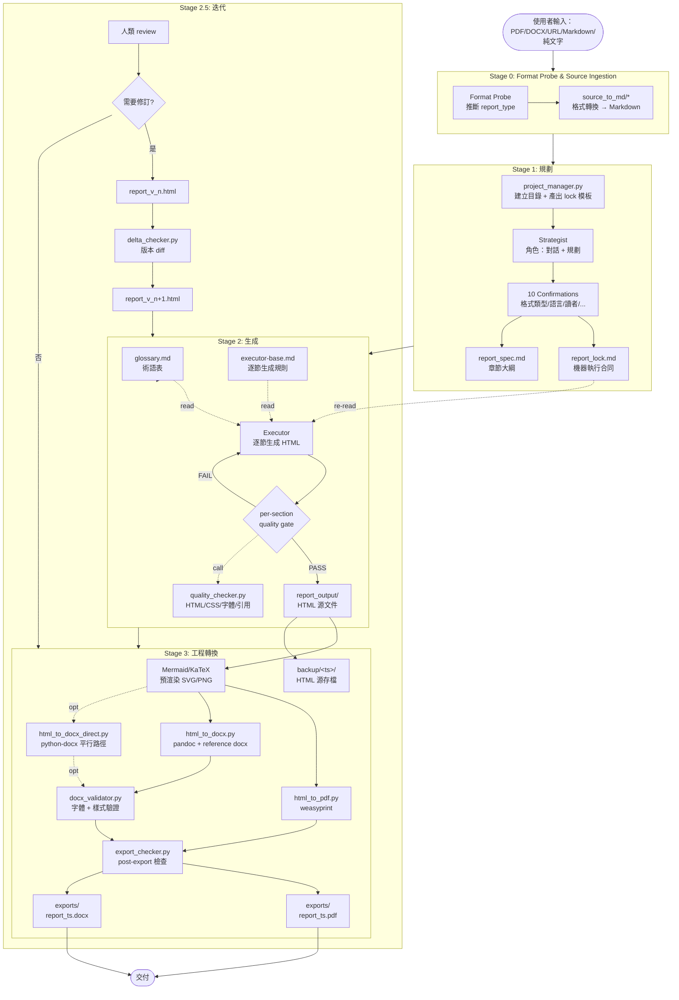
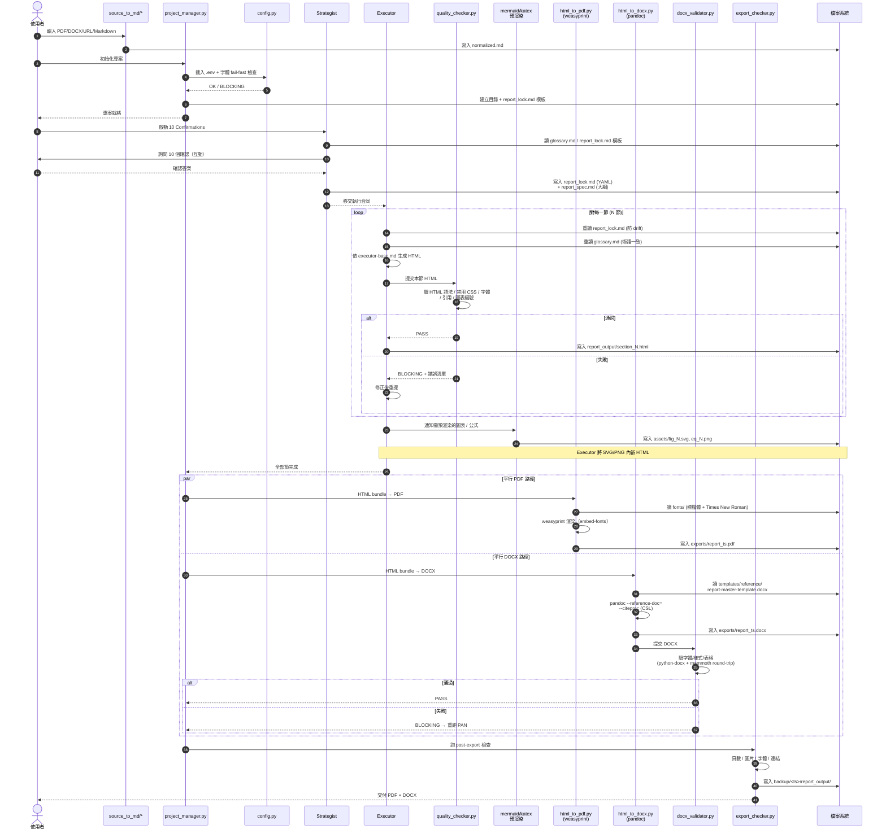
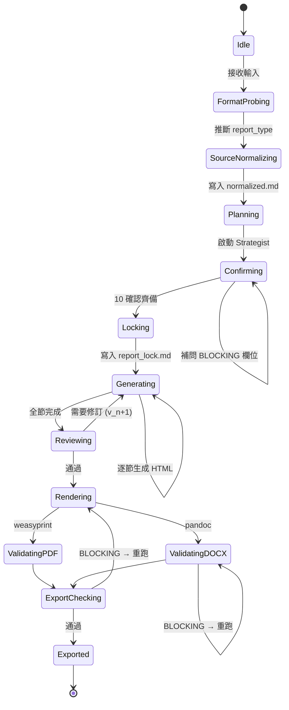

# 系統架構 — Report-master

> 文件版本：v1.0 | 對應 SPEC.md v0.3 | 產生日期：2026-06-13
> 適用對象：開發者、貢獻者、未來維護者

---

## 架構概覽

Report-master 採用 **serial pipeline + 雙格式輸出** 的設計：以 HTML 作為 AI 生成與工程轉換的中間格式，透過 weasyprint（HTML→PDF）與 pandoc（HTML→DOCX）兩條獨立路徑產出 PDF 與 DOCX 雙交付物。整個系統由 **Stage 0 Format Probe → Stage 1 規劃（Strategist + report_lock.md）→ Stage 2 生成（Executor 逐節 HTML + per-section quality gate）→ Stage 2.5 迭代（v1→v2）→ Stage 3 工程轉換（PDF + DOCX 平行 + export_checker）** 串接，所有階段遵守一份「機器可讀的執行合同」`report_lock.md`，作為字體、顏色、章節結構、引用格式的 single source of truth，防止長篇報告的敘事漂移（narrative drift）與排版漂移（formatting drift）。字體策略在 Day-1 即鎖死：中文字體固定為**標楷體**、英文字體固定為**Times New Roman**，並由 `config.py` 在初始化時 fail-fast 檢查，避免後續 weasyprint / pandoc 在無字體環境下靜默失敗。

---

## 元件清單

| 元件 | 職責 | 技術 / 依賴 |
|------|------|-------------|
| `AGENTS.md` | 入口文件，供 general AI agent 讀取專案導覽 | Markdown |
| `SPEC.md` | 規格書（Concept / Pipeline / 風險 / 階段計劃） | Markdown v0.3 |
| `SKILL.md` | 主 workflow authority；定義 Stage 1→2→3 觸發順序 | Markdown |
| **scripts/source_to_md/** | | |
| └─ `pdf_to_md.py` | PDF 源材料 → Markdown（pdftotext / PyMuPDF） | Python, PyMuPDF |
| └─ `docx_to_md.py` | DOCX 源材料 → Markdown（mammoth / pandoc） | Python, mammoth |
| └─ `url_to_md.py` | URL 源材料 → Markdown（web_fetch / readability） | Python, requests |
| └─ `md_normalizer.py` | 統一 Markdown 變體（frontmatter、空行、編碼） | Python |
| `scripts/project_manager.py` | 專案初始化（建立目錄、產出 report_lock.md 模板、字體檢查） | Python, pathlib |
| `scripts/config.py` | 配置管理（`.env` 加載鏈、字體 fail-fast 檢查、報告根路徑） | Python, python-dotenv |
| `scripts/report_gen.py` | 主生成器；呼叫 Strategist / Executor / 串接 Pipeline | Python |
| `scripts/quality_checker.py` | 質量門禁（HTML 語法、字體驗證、CSS 禁用規則、交叉引用） | Python, BeautifulSoup, lxml |
| `scripts/toc_generator.py` | 目次自動產生（pandoc `--toc`） | Python, subprocess(pandoc) |
| `scripts/footnote_manager.py` | 註腳 / 引用管理（pandoc 原生 `^[note]` 語法） | Python, pandoc-citeproc |
| `scripts/html_to_pdf.py` | HTML → PDF 轉換（weasyprint + 內嵌字體） | Python, weasyprint, fontconfig |
| `scripts/html_to_docx.py` | HTML → DOCX 主路徑（pandoc + reference docx） | Python, subprocess(pandoc) |
| `scripts/html_to_docx_direct.py` | HTML → DOCX 平行路徑（python-docx，控制力最高） | Python, python-docx |
| `scripts/docx_validator.py` | DOCX post-processing 驗證（字體、樣式、結構） | Python, python-docx, mammoth |
| `scripts/export_checker.py` | post-export 檢查（頁數、圖片、字體 subsetting、連結） | Python, PyMuPDF |
| `scripts/mermaid_renderer.py` | mermaid-cli (`mmdc`) 預渲染為 SVG；嵌入 HTML | Node.js, mermaid-cli |
| `scripts/katex_renderer.py` | katex-cli server-side 預渲染數學公式為 PNG | Node.js, katex-cli |
| `scripts/delta_checker.py` | 版本 diff（report_v{n} vs report_v{n+1}） | Python, difflib |
| `scripts/update_spec.py` | 變更傳播工具（SPEC.md 變更 → 影響分析） | Python |
| `scripts/error_helper.py` | 統一錯誤分類與重試策略 | Python |
| **workflows/** | | |
| └─ `topic-research.md` | 無源材料時的網絡搜集 workflow | Markdown |
| └─ `create-template.md` | 創建結構 / 格式範本的 workflow | Markdown |
| └─ `resume-execute.md` | Phase B 斷點續傳 workflow | Markdown |
| └─ `generate-citations.md` | 引用管理 workflow | Markdown |
| └─ `live-preview.md` | HTML 即時預覽 workflow | Markdown |
| └─ `visual-review.md` | 可選的視覺自查 workflow | Markdown |
| **references/** | | |
| └─ `strategist.md` | Strategist 角色定義（10 Confirmations 對話策略） | Markdown |
| └─ `executor-base.md` | Executor 通用指南（逐節生成流程） | Markdown |
| └─ `shared-standards.md` | **HTML/CSS 子集約束**（禁用 Grid/Flex/positioning） | Markdown |
| └─ `report-formats.md` | 格式類型定義（學術 / 商業 / 規格 / 公文） | Markdown |
| └─ `citation-formats.md` | 引用格式定義（APA / MLA / Chicago / GBC） | Markdown |
| └─ `toc-guide.md` | 目次生成規則 | Markdown |
| **templates/** | | |
| └─ `structures/` | 章節結構範本（目次層次） | YAML / Markdown |
| └─ `formats/` | 排版格式範本（APA / Chicago / IEEE） | YAML / CSS |
| └─ `full/` | 完整範本包（structure + format + 示例） | 混合 |
| └─ `reference/report-master-template.docx` | DOCX 模板（預載字體與樣式） | DOCX (binary) |
| └─ `reference/build_template.py` | 從 python-docx 生成 reference docx | Python |
| `docs/technical-design.md` | 技術設計文檔（深化） | Markdown |
| `docs/rules/` | 風格規則 | Markdown |
| `examples/` | 23+ 個完整 example reports（亦作 integration test） | 混合 |
| `fonts/` | 字體 bundle（標楷體 .ttf/.otf + Times New Roman） | Binary |
| `report_lock.md` | **機器可讀執行合同**（每節重新讀，防 drift） | YAML/Markdown |
| `report_spec.md` | 人類可讀章節大綱 | Markdown |
| `glossary.md` | 術語表（Executor 每節先讀，防敘事漂移） | Markdown |
| `report_output/` | 逐節 HTML 源文件 | HTML |
| `exports/` | 最終 PDF / DOCX 交付物 | PDF / DOCX |
| `backup/<ts>/report_output/` | HTML 源存檔 | HTML |

---

## 架構圖（Mermaid）

### 1. 整體 Pipeline（graph TD）

### 2. 文件生成 Sequence Diagram（source → PDF + DOCX）

### 3. 角色 / 狀態視角（stateDiagram-v2）

---

## 資料流說明

文件由使用者輸入到最終交付，經歷以下 12 步流動：

1. **輸入接收**：使用者提供 PDF / DOCX / URL / Markdown / 純文字。`source_to_md/*` 依類型分流至對應轉換腳本，產出統一的 `normalized.md`。
2. **Stage 0 Format Probe**：依 `normalized.md` 的特徵（章節、引用、圖表）推斷 `report_type`（學術 / 商業 / 規格 / 公文），後續 defaults 隨之調整。
3. **專案初始化**：`project_manager.py` 呼叫 `config.py` 做字體 fail-fast 檢查（標楷體 + Times New Roman 是否存在），建立目錄樹與 `report_lock.md` 模板。
4. **Strategist 對話**：10 Confirmations 互動式確認 → 寫入 `report_lock.md`（機器合同）與 `report_spec.md`（人類可讀大綱）。任何 required 欄位缺失 → BLOCKING。
5. **Executor 逐節生成**（N 節循環）：
   - 重讀 `report_lock.md`（防 formatting drift）
   - 重讀 `glossary.md`（防 narrative drift）
   - 依 `executor-base.md` 生成該節 HTML
   - 內聯樣式優先（避免外部 CSS 失效）
   - 圖表 / 公式以 placeholder 標記，稍後由預渲染器填入
6. **Per-section Quality Gate**：`quality_checker.py` 對該節 HTML 跑語法、禁用 CSS、字體、引用、圖表編號驗證。失敗 → BLOCKING → 該節重做。
7. **資產預渲染**：`mermaid_renderer.py` 將 Mermaid 原始碼預渲染為 SVG；`katex_renderer.py` 將公式預渲染為 PNG。Executor 將 SVG/PNG 內嵌 HTML。
8. **Stage 2.5 迭代（可選）**：人類 review，選定要修的 section IDs → `delta_checker.py` 生成 v_(n+1)，重跑 Stage 2 對應節。
9. **PDF 路徑**：`html_to_pdf.py` 呼叫 weasyprint，使用 `fonts/` 內的字體，啟用 `embed-fonts`，產出 PDF。
10. **DOCX 路徑**：`html_to_docx.py` 呼叫 pandoc，指定 `--reference-doc=templates/reference/report-master-template.docx`（預載字體樣式）與 `--citeproc`（CSL 引用）。產出 DOCX 後 `docx_validator.py` 用 python-docx 抽樣驗字體（必須 = 標楷體 CJK + Times New Roman Latin），並做 mammoth round-trip 結構比對。
11. **Post-export 檢查**：`export_checker.py` 確認頁數、圖片存在、字體 subsetting、目次連結可點、PDF/DOCX 可正常打開。
12. **存檔**：`report_output/` 整份 HTML 源存到 `backup/<ts>/report_output/`；最終 PDF + DOCX 寫入 `exports/`，檔名含 timestamp。

---

## 介面定義

### CLI 指令

| 指令 | 用途 | 主要參數 |
|------|------|----------|
| `report-master init` | 初始化專案（建立目錄、字體檢查、產出 lock 模板） | `--name <project>`、`--type academic/business/spec/gov` |
| `report-master probe <input>` | Stage 0 Format Probe（推斷 report_type） | `--input <path/url>` |
| `report-master plan` | 啟動 Strategist 10 Confirmations | `--spec <path>` |
| `report-master generate` | 執行 Stage 2 逐節生成 | `--lock <path>`、`--sections <id,id,...>` |
| `report-master revise` | Stage 2.5 迭代（選定 section 重生） | `--version v_n`、`--delta <path>` |
| `report-master render` | Stage 3 工程轉換（PDF + DOCX 平行） | `--html <bundle.html>`、`--format pdf,docx` |
| `report-master validate <file>` | DOCX post-processing 驗證 | `--strict` |
| `report-master check-export` | post-export 檢查 | `--pdf <path>` `--docx <path>` |
| `report-master resume` | 斷點續傳（從 `report_lock.md` 讀進度） | `--from-stage 0\|1\|2\|2.5\|3` |

### 檔案格式

| 檔案 | 格式 | Schema 摘要 |
|------|------|-------------|
| `report_lock.md` | YAML frontmatter + Markdown 註解 | `fonts.cjk` (固定 `標楷體`)、`fonts.latin` (固定 `Times New Roman`)、`formatting.{cover,toc,title,h1,h2,h3,body,table,caption}`、`page_size`、`margins`、`line_spacing`、`language_variant`、`citation_style`、`output.docx_engine (pandoc\|python-docx)` |
| `report_spec.md` | Markdown | 標題、子標題、章節大綱、預期圖表清單、附錄 |
| `glossary.md` | Markdown 條目列表 | 術語 → 定義 / 譯名 |
| `report_output/section_*.html` | HTML 子集 | 僅允許 `<table>  <h1-h6>  <aside> lists 
 
 `；禁用 Grid/Flex/positioning/::before/::after；字體樣式內聯 |
| `templates/reference/report-master-template.docx` | DOCX (binary) | `Normal.dotm` 預載 CJK=標楷體、Latin=Times New Roman；`Heading 1-3` 樣式對應字級 |
| `exports/report_<ts>.pdf` | PDF | 內嵌字體、可選 tagged PDF (WCAG) |
| `exports/report_<ts>.docx` | DOCX | 含 styles.xml、numbering.xml、字體隨文檔發佈 |
| `csl/*.csl` | CSL XML | 引用樣式（APA / MLA / Chicago / GBC） |
| `bib/*.bib` | BibTeX | 參考文獻資料庫 |

### 事件 / Hook（內部）

| 事件 | 觸發時機 | 訂閱者 |
|------|----------|--------|
| `on_section_generated` | Executor 寫入每節 HTML | `quality_checker`（per-section gate） |
| `on_section_blocked` | Quality gate 失敗 | `error_helper`（重試 / 升級） |
| `on_drift_detected` | 字體 / 顏色偏離 lock | `quality_checker`（BLOCKING） |
| `on_render_complete` | PDF 或 DOCX 寫出 | `export_checker`、`backup` |
| `on_docx_validation_fail` | docx_validator 報錯 | `html_to_docx`（自動重跑一次） |

---

## 設計決策記錄（ADR lite）

| 決策 | 選擇 | 原因 | 捨棄的替代方案 |
|------|------|------|----------------|
| 中間格式 | **HTML** | LLM 生成最可靠；HTML→PDF 與 HTML→DOCX 雙路徑成熟；瀏覽器可即時預覽 | SVG（無法表註腳/交叉引用）；DOCX XML（過於複雜）；Markdown（PDF 轉換依賴鏈長） |
| PDF 引擎 | **weasyprint** | CSS 支援最好（≥v60 對 Grid 部分支援）；純 Python 整合；可控制字體嵌入 | pdfkit（CSS 弱）；playwright（過重，需 headless browser） |
| DOCX 主引擎 | **pandoc + reference-docx** | HTML→DOCX 品質業界標竿；CSL 引用支援 | mammoth（無法保留樣式）；python-docx（需自寫 mapping，僅作平行路徑） |
| DOCX 平行路徑 | **python-docx（預設關閉）** | 政府公文 / 學術投稿對格式極敏感時，完全控制字體與段落屬性 | 僅依賴 pandoc（無法滿足最嚴格場景） |
| 中文字體 | **標楷體**（固定不可覆寫） | 報告首選字體，跨平台可獲取；可預打包 | 標楷體以外（會引入排版漂移） |
| 英文字體 | **Times New Roman**（固定不可覆寫） | 學術 / 商業 / 公文通用；與標楷體協調 | Calibri / Arial（sans-serif 與標楷體不協調） |
| 圖表渲染 | **mermaid-cli (mmdc) 預渲染 SVG** | weasyprint 無 JS 引擎，Chart.js / Mermaid live 會靜默失敗 | Chart.js（weasyprint 不支援 JS）；純 SVG 手寫（維護成本高） |
| 數學公式 | **katex-cli server-side 渲染 PNG** | 同上，weasyprint 無 JS；server-side 預渲染最穩 | MathJax client-side（weasyprint 不執行） |
| 引用管理 | **pandoc --citeproc + CSL** | 支援 APA / MLA / Chicago / GBC；bib 與 csl 皆為標準格式 | pandoc-citeproc（已廢棄）；手寫引用（不可維護） |
| 章節編號 | **手動寫入 + quality_checker 驗證** | HTML outline 在 PDF/DOCX 不可靠；手動 + 驗證最穩 | HTML5 outline（轉換丟失） |
| Pipeline 形態 | **serial（Stage 1→2→3）** | 與 ppt-master 一致；利於 debug 與報告 trace | parallel（風險高，不利於敘事一致性） |
| Anti-drift 機制 | **report_lock.md（每節重讀）** | 機器合同 + required 欄位 schema；與 ppt-master 的 `spec_lock.md` 對稱 | 無（長篇必漂移） |
| 質量門禁粒度 | **per-section** | 提早發現錯誤，縮小重做範圍 | 全文完成後（錯誤累積，重做成本高） |
| Stage 3 平行度 | **PDF + DOCX 平行** | 兩者獨立，無相依性；節省時間 | 序列執行（浪費時間） |
| 平行 sub-agents | **禁止（main agent only）** | 報告書需要敘事一致性、字體 / 術語統一；並行 agent 易漂移 | parallel sub-agents（敘事必漂） |
| 迭代迴圈 | **Stage 2.5 revise + delta_checker** | v1→review→v2 是真實使用流程；保留歷史版本 | 一次性產出（不貼近實況） |
| 字體策略 | **Day-1 內嵌 + fail-fast 檢查** | 避免 weasyprint / pandoc 在無字體環境下靜默失敗 | 依賴系統字體（跨平台不可靠） |
| HTML 子集 | **禁用 Grid/Flex/positioning/::before/::after** | pandoc HTML→DOCX 會丟失這些；保留 block flow 才能映射為 DOCX 段落 | 完整 CSS（轉換後崩壞） |
| 樣式承載 | **內聯 style 為主、外部 CSS 為輔** | pandoc 的 `--css=` 效果不穩；內聯最穩 | 純外部 CSS（依賴命中）；純 inline（可維護性下降） |
| DOCX 字體策略 | **reference docx 預載字體樣式** | 確保 DOCX 字體隨文檔發佈；不依賴接收端環境 | 僅在 HTML 設字體（DOCX 會丟） |
| 整合測試 | **examples/ 23+ 個範例 + 跑 quality_checker** | 與 ppt-master 一致；examples 兼作 demo 與回歸測試 | 獨立 test suite（成本高，與 example 脫節） |
| 版本管理 | **report_v{n}.html 不覆蓋** | 支援 diff 與回滾 | 覆蓋（無法比對） |
| 錯誤分類 | **error_helper.py 統一重試策略** | 區分 transient / permanent，避免無限重試 | 無分類（隨意重試） |
| 資產管理 | **assets/ 子目錄 + DPI 規則 + 授權 metadata** | 圖片散落各處會失控；授權需可追溯 | 隨 HTML 內嵌（無法管控授權） |
| Tagged PDF | **可選（`output.tagged_pdf: true`）** | 對齊 WCAG / Section 508；非所有場景必要 | 強制（影響相容性） |

---

## 附錄：風險對應

| 風險 ID | 描述 | 架構對應緩解 |
|---------|------|--------------|
| R1 | HTML→DOCX fidelity 是 lossy | shared-standards.md 禁用清單 + 內聯樣式 + reference docx + docx_validator 抽樣 + mammoth round-trip + python-docx 平行路徑 |
| R1.1 | DOCX 字體 / 樣式不穩 | 五項 hardening 全列為 Stage 3 必執行（a–e），(f) 為進階選項 |
| R2 | Eight Confirmations 缺硬性決策 | 升級為 10 Confirmations（page_size、margins、line_spacing、language_variant） |
| R3 | 敘事 drift | glossary.md + 每節重讀 + quality_checker cross-ref 驗證 |
| R4 | Pipeline 缺迭代 | Stage 2.5 revise + delta_checker + 版本不覆蓋 |
| R5 | Mermaid / Chart.js 在 weasyprint 靜默失敗 | mermaid-cli 預渲染 + matplotlib/pygal server-side SVG；Chart.js 全面移除 |
| R6 | 無 CJK / 字體策略 | fonts/ bundle + config.py fail-fast + reference docx 預載 |
| R7 | 無版本管理 / CI | update_spec.py + examples/ 23+ 整合測試 + quality_checker |
| R8 | 無轉換後檢查 | export_checker.py（頁數 / 圖片 / 字體 / 連結） |

---

*architecture.md v1.0 — 對應 SPEC.md v0.3，2026-06-13*
