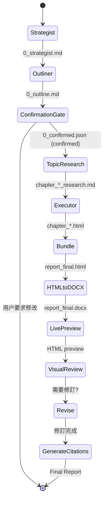
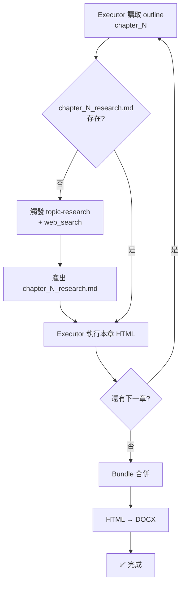

# Report-master 重新規劃架構 / Redesigned Architecture

## 架構概覽

Report-master 是一個「使用者驅動的研究報告生成 pipeline」。核心改變：

1. **新增 Outline 階段**（Strategist 下游、Executor 上游）
2. **新增 Confirmation Gate**（Outline ↔ Executor 之間的人工程動）
3. **新增 Content Research 橋接**（Topic-Research ↔ Executor 每章執行之間）
4. **修復 DOCX 格式化管線**（html_to_docx_direct 清理）

## 新完整 Pipeline（Phase 3+）

```
User Input（主題 / 目標讀者 / 格式需求）
    │
    ▼
┌─────────────────────────────────┐
│  STRATEGIST                      │
│  • 主題分析                      │
│  • 研究問題訂定（RQ1, RQ2…）      │
│  • output: report_output/        │
│    0_strategist.md               │
└───────────────┬─────────────────┘
                │
                ▼
┌─────────────────────────────────┐
│  PHASE-3-OUTLINER  ★ 新增       │
│  • 章節藍圖規劃                  │
│  • 各章標題 / 層級 / 核心問題     │
│  • 每章所需資料類型               │
│  • 章節邏輯順序                  │
│  • output: report_output/        │
│    0_outline.md                  │
└───────────────┬─────────────────┘
                │
                ▼  ← 【停等用户確認 GATE】
┌─────────────────────────────────┐
│  USER CONFIRMATION  ★ 新增       │
│  • 產出: 0_outline_for_review.md │
│  • User 回覆「OK」or「修改需求」  │
│  • 產出: 0_confirmed.json        │
│    （Executor 的觸發開關）        │
└───────────────┬─────────────────┘
                │ (confirmed == true)
                ▼
┌─────────────────────────────────┐
│  TOPIC-RESEARCH                 │
│  • 文獻調研（可 web_search）      │
│  • 數據 / 案例收集               │
│  • output: report_output/        │
│    * _research.md per chapter    │
└───────────────┬─────────────────┘
                │
                ▼
┌─────────────────────────────────┐
│  EXECUTOR（按章節順序執行）       │
│  • 讀取 outline + research       │
│  • 產出各章 HTML                 │
│  • output: report_output/        │
│    chapter_*.html                │
└───────────────┬─────────────────┘
                │
                ▼
┌─────────────────────────────────┐
│  BUNDLE                          │
│  • 合併所有 chapter_*.html        │
│  • 應用 lock 格式設定            │
│  • output: report_final.html      │
└───────────────┬─────────────────┘
                │
                ▼
┌─────────────────────────────────┐
│  HTML_TO_DOCX_DIRECT  ★ 修復     │
│  • HTML → python-docx            │
│  • <strong>/<b> → bold=True      │
│  • 清理游離 `**` 字元            │
│  • output: report_final.docx     │
└───────────────┬─────────────────┘
                │
                ▼
┌─────────────────────────────────┐
│  LIVE-PREVIEW                   │
│  • 產出 HTML 預覽               │
│  • 供視覺審查用                  │
└───────────────┬─────────────────┘
                │
                ▼
┌─────────────────────────────────┐
│  VISUAL-REVIEW                  │
│  • 格式 / 排版 / 圖表檢查        │
│  • → Revise（需要時）           │
└───────────────┬─────────────────┘
                │
                ▼
┌─────────────────────────────────┐
│  GENERATE-CITATIONS             │
│  • 產出 reference list           │
│  • 插入文中引用                  │
└───────────────┬─────────────────┘
                │
                ▼
Final Report (report_final.docx)
```

## 元件清單

| 元件 | 職責 | 技術 | 狀態 |
|---|---|---|---|
| `strategist` | 主題分析、RQ 訂定 | LLM | 現有（需小幅更新） |
| `phase-3-outliner` ★ | 章節藍圖規劃 | LLM + 結構化 prompt | **新增** |
| `user-confirmation` ★ | 確認 gate、JSON 觸發開關 | 檔案 + Telegram 回覆 | **新增** |
| `topic-research` | 文獻 + 網路調研 | LLM + web_search tool | 現有（需更新） |
| `executor` | 各章 HTML 生成 | LLM + report-lock | 現有（需讀 outline） |
| `bundle` | HTML 合併 + lock 應用 | Python + BeautifulSoup | 現有 |
| `html_to_docx_direct` ★ | HTML→DOCX + bold 修復 | python-docx + BeautifulSoup | **修復** |
| `live-preview` | HTML 預覽產出 | Python + weasyprint | 現有 |
| `visual-review` | 視覺審查觸發 | LLM | 現有 |
| `revise` | 錯誤修正 | LLM + delta-checker | 現有 |
| `generate-citations` | 引用產生 | LLM | 現有 |

★ = 這次重新規劃需要修改或新增的元件

## 資料流說明

### Outline 階段（新增）

1. Strategist 產出 `0_strategist.md`（含 RQ1…RQn）
2. Outliner 讀取 RQs，規劃 N 個章節：
   ```
   ## Chapter 1: [標題]
   - 核心問題: [對應 RQ]
   - 所需資料: [文獻 / 數據 / 案例]
   - 預估長度: [300-500字]
   ## Chapter 2: ...
   ```
3. 產出 `report_output/0_outline.md`
4. Outliner 自動產出 `report_output/0_outline_for_review.md`（人性化的摘要版本）
5. **Pipeline 暫停，等待用戶確認**

### Confirmation Gate

- 用戶在 Telegram 回覆「OK」or「修改：XXX」
- Main agent 寫入 `report_output/0_confirmed.json`：
  ```json
  {"confirmed": true, "notes": "", "timestamp": "..."}
  ```
- Executor 啟動前檢查 `0_confirmed.json`，若 `confirmed == false` 則拒绝執行

### Content Research 橋接

- 在 Executor 執行「第 N 章」之前，先查 `report_output/` 有無對應的 `chapter_N_research.md`
- 若無，自動觸發 `topic-research` + `web_search` 補足
- `web_search` query 來自 outline 中該章的「所需資料」欄位

### DOCX 格式化（修復）

**根本問題**：`bundle.py` 輸出的 HTML 內文包含游離 `**` 字元（而非 `<strong>` tag）

修復兩層：
1. **上游**：`bundle.py` 或 `source_to_md.py` 的 HTML 清理：所有 `**text**` → `<strong>text</strong>`
2. **下游**：`html_to_docx_direct.py` 的 `handle_strong()` 確認套用 `bold=True`

```
Before: <p>**這是粗體**</p>   ← bundle 輸出（錯誤）
After:  <p><strong>這是粗體</strong></p>  ← 清理後
        → <p><w:run><w:rPr><w:b/></w:rPr>這是粗體</w:run></p>  ← docx（正確）
```

## Mermaid 圖

### Pipeline 狀態圖



### 章節執行流程（Executor 內部）



## ADR Lite（設計決策記錄）

| 決策 | 選擇 | 原因 | 捨棄的替代方案 |
|---|---|---|---|
| 確認機制用 JSON 檔案開關 | `0_confirmed.json` | 簡單、可 audit、可版本化 | API 資料庫（過度複雜） |
| Outline 格式 | Markdown + frontmatter | 可讀、可 LLM parse、git 友好 | JSON schema（不直觀） |
| 網路搜尋觸發時機 | Executor 每章執行前檢查 | 及時、避免浪費 token | 全部章節先研究完（費時） |
| `**` 清理位置 | bundle.py（上游）+ html_to_docx（下游） | 標本兼治 | 只修 html_to_docx（治標不治本） |
