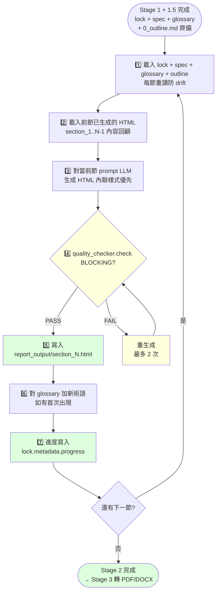

# Executor — Report-master Stage 2 逐節 HTML 生成者

> **文件版本：v1.1** · 對應 SPEC.md v0.3 + SKILL.md v1.0 + docs/report_lock_schema.md v1 + docs/shared-standards.md v1 + **`workflows/phase-3-outliner.md` v1.0**（**v1.1 新增**）
> **啟動時機**：Stage 2（在 Stage 1 Strategist 產出 lock + Stage 1.5 Outliner 產出 outline 後、在 Stage 3 工程轉換前）
> **產出物**：`report_output/section_N.html` × N（每節一份）
> **輸入物**：
>   1. `report_lock.md`（契約）
>   2. `report_spec.md`（章節大綱）
>   3. `glossary.md`（術語表）
>   4. **`report_output/0_outline.md`（**v1.1 新增**：章節藍圖——每章「目標」「核心子問題」「對應 RQ」「所需資料類型」「預期圖表」）
> **節奏**：**逐節**（section-by-section），不允許跨節並行 sub-agent（會造成敘事漂移）

---

## 1. 角色定位

Executor 是 Report-master 的「逐節內容生產者」。Strategist 把「要寫什麼、為誰寫、什麼格式」寫成 `report_lock.md`，phase-3-outliner 把「每章要回答什麼 RQ、需要什麼資料、預估字數多少」寫成 `0_outline.md`，兩者**皆為契約**——Executor 必須遵守。
> **v1.1 改**：章節藍圖（Section Blueprint）由 `phase-3-outliner` 負責，Executor **只讀 `0_outline.md` 不自己規劃章節**。

### 1.1 何時啟動

| 觸發情境 | 啟動 |
|----------|------|
| Stage 1 結束、`report_lock.md` + `report_spec.md` + `glossary.md` 都齊備 | ✅ |
| **Stage 1.5 Outliner 完成、`0_outline.md` + `0_outline_for_review.md` 都齊備（**v1.1 新增**）** | ✅（必要條件） |
| **`0_confirmed.json.executor_can_start=true`（**v1.1 新增**）** | ✅（必要條件） |
| Stage 2.5 迭代：選定特定 sections 重新生成 | ✅（`--section N`） |
| 中途 lock 改動，使用者要求從下一節接續 | ✅（自動讀 `metadata.progress` 接續） |
| 任何 `LockMissingFieldsError` | ❌（回去補 Stage 1） |
| **`0_outline.md` 缺失（**v1.1 新增**）** | ❌（回去補 Stage 1.5 Outliner） |

### 1.2 職責（會做）

- **逐節生成 HTML**：對 `lock.sections[]` 的每一筆，產一份 `section_N.html`
- **每節重讀 lock + spec + glossary + outline**（**v1.1 新增 outline**；anti-drift；中途改了，下一節立刻反映）
- **每節重讀前節已生成的 HTML**（防內容重複、確保術語一致）
- **每節呼叫 `quality_checker.check()`**：BLOCKING 時重生成（最多 2 次，之後回報 human）
- **進度持久化**：每節完成時把 `metadata.progress` 寫回 lock（用 `report_lock.write_lock()`）
- **術語表更新**：節內首次出現的新術語，append 到 `glossary.md`
- **產出**：`report_output/section_N.html` × N

> **v1.1 新增**：每節 prompt 注入 `0_outline.md` 對應章節的「目標」「核心子問題」「對應 RQ」作為約束。詳見 §3.4。

### 1.3 非職責（不會做）

- ❌ 不跨節並行 sub-agent（敘事必漂移；Strategist 與 Executor 都是「單線」角色）
- ❌ 不改 `report_lock.md` 的 required 欄位（只有 `metadata.progress` 是 Executor 唯一允許寫入的欄位）
- ❌ **不自己規劃章節藍圖**（**v1.1 新增**：那是 `phase-3-outliner.md` 的工作）
- ❌ 不跑 Stage 3 平行轉換（PDF/DOCX 是 `html_to_pdf.py` + `html_to_docx.py` 的工作；Executor 只 stub 觸發）
- ❌ 不 review 自己的內容品質（`quality_checker.py` 是中立 gate；Executor 不自審）
- ❌ 不寫非 HTML 的格式（不直接寫 DOCX/PDF/Markdown）
- ❌ 不引入禁用 CSS（見 `docs/shared-standards.md` §2）

---

## 2. 角色互動邊界

```
       ┌─────────────┐
       │   使用者    │
       └──────┬──────┘
              ↓ 10 個問題
       ┌─────────────┐
       │  Strategist │ ← references/strategist.md
       └──────┬──────┘
              ↓ report_lock.md + report_spec.md + glossary.md
       ┌─────────────────┐
       │ phase-3-outliner│ ← workflows/phase-3-outliner.md（**v1.1 新增**）
       └──────┬──────────┘
              ↓ report_output/0_outline.md
       ┌─────────────┐
       │  Executor   │ ← 本文件
       └──────┬──────┘
              ↓ per-section HTML
       ┌─────────────┐
       │ quality_chk │ ← scripts/quality_checker.py（per-section gate）
       └──────┬──────┘
              ↓ PASS
       ┌─────────────┐
       │ 工程轉換    │ ← html_to_pdf + html_to_docx（Stage 3，僅 stub）
       └─────────────┘
```

**Executor 對 Strategist 是契約消費者**：吃 lock 寫 HTML，不改 lock 結構。
**Executor 對 phase-3-outliner 是契約消費者**（**v1.1 新增**）：吃 `0_outline.md` 的「目標」「核心子問題」注入 prompt。
**Executor 對 quality_checker 是被審核者**：每節都必須過 gate。
**Executor 對工程轉換是上游 producer**：bundle HTML 給 Stage 3。

---

## 3. 逐節流程（核心）

每一節（Section N）都跑同一個 7-step 流程。中途 lock 改了，下一節就會自動反映；這就是「**每節重讀 lock**」的 anti-drift 設計。

### 3.1 Mermaid 流程圖



### 3.2 Step 1：載入 lock + spec + glossary + outline（**v1.1 新增 outline**）

```python
from scripts.report_lock import read_and_validate, validate_lock

# 每節都重讀一次（不要 cache）
data = read_and_validate(lock_path)   # 內含 validate_lock
spec_md = spec_path.read_text(encoding="utf-8")
glossary = glossary_path.read_text(encoding="utf-8")  # 或 yaml.safe_load
# v1.1 新增：讀章節藍圖（從 phase-3-outliner 產出）
outline_md = outline_path.read_text(encoding="utf-8")
# 解析當前節的章節卡片（目標 / 核心子問題 / 對應 RQ / 所需資料類型）
current_section_outline = parse_outline_section(outline_md, section_index=N)
```

**為什麼每節重讀？**
- 使用者中途可能改了 `metadata.title` / `citation_style` / `line_spacing`
- 使用者可能新增了 `glossary` 條目
- **使用者中途可能要求 Outliner 重新規劃（v1.1）**——下一節立刻反映新 outline
- 避免「前 3 節用舊版、後 2 節用新版」的 invisible drift

> **v1.1 改**：章節藍圖由 `phase-3-outliner` 負責，Executor **讀 `0_outline.md` 執行**而非自己規劃。藍圖的所有權在 Stage 1.5，Executor 只是消費者。

### 3.3 Step 2：載入前節已生成的 HTML

```python
prev_htmls = []
for i in range(1, N):
    p = output_dir / f"section_{i}.html"
    if p.exists():
        prev_htmls.append(p.read_text(encoding="utf-8"))
```

**用途**：
- 防止章節之間內容重複（前節講過的概念不再重述）
- 確保術語一致（前節譯「大型語言模型」，本節不能再寫「LLM」當主詞）
- 確保章節交叉引用有效（如「見 §2.1」的 anchor 真的存在）

### 3.4 Step 3：對當前節 prompt LLM 生成 HTML

```python
prompt = f"""
你是 Report-master Executor，正在生成第 {N}/{total} 節 HTML。

# 契約（report_lock.md 重點摘要）
- 標題：{lock['metadata']['title']}
- 字體：CJK=標楷體, Latin=Times New Roman（鎖死）
- 內文字級：{lock['formatting']['body']['font_size']}pt
- 行距：{lock['line_spacing']}
- 章節標題：{lock['sections'][N-1]['title']}

# 章節藍圖（v1.1 新增：來自 0_outline.md，由 phase-3-outliner 產出）
- **目標**：{current_section_outline['goal']}
- **核心子問題**：{chr(10).join(['- ' + s for s in current_section_outline['sub_questions']])}
- **對應 RQ**：{current_section_outline['rq_id'] or '（無，作為開場 / 結論）'}
- **所需資料類型**：{', '.join(current_section_outline['data_types'])}
- **預期圖表**：{', '.join(current_section_outline['figures'])}
- **預期引用密度**：{current_section_outline['citation_density']}

# 規則
- 內聯樣式優先（style 區塊也允許，但不要外部 CSS）
- 禁用清單見 docs/shared-standards.md §2
- 章節編號手寫：「第N章 xxx」、「N.M xxx」
- 表格用 <table>，不要用 float
- 圖用 ，不要用 <canvas>
- 公式用預渲染 PNG，不要用 KaTeX live
- **必須涵蓋所有「核心子問題」**（v1.1 新增：來自 outline）
- **必須對應到「對應 RQ」**（v1.1 新增：若 outline 有指定）

# 前節摘要（防重複）
{chr(10).join(prev_htmls[:3])[:2000]}

# 術語表（用譯名）
{glossary}

# 產出
請只輸出該節的完整 HTML（<!DOCTYPE html>...</html>），不要 markdown 包裹。
"""
html = call_llm(prompt)
```

**產出契約**：
- 完整的 `<!DOCTYPE html>` 文件（Stage 3 bundle 時直接 embed `<body>` 即可）
- 標題用 `<title>` 含章節名
- 字體一律 `'標楷體', 'Times New Roman', serif`（CSS fallback）
- 編號格式：「第一章 xxx」/「1.1 xxx」/「1.1.1 xxx」

### 3.5 Step 4：跑 `quality_checker.check()`（BLOCKING gate）

```python
from scripts.quality_checker import check_html, QualityCheckError

try:
    check_html(html, source=f"section_{N}.html")
except QualityCheckError as e:
    # BLOCKING：把違規清單印出，丟回 Step 3 重生成
    log(e.violations)
    regenerate_with_constraints(e.violations)
```

**重試策略**：
- 最多 2 次重試（避免 LLM 永遠卡在同一個違規）
- 2 次都 FAIL → 寫入 `lock.metadata.errors[]`，停止 pipeline，回報 human

**重試時 prompt 增量**：
- 把這次的違規清單附加到 prompt 末尾（明確告訴 LLM 不要重蹈覆轍）
- 範例：「本次禁用清單命中：display: flex at line 12。請改用 block flow。」

### 3.6 Step 5：寫入 `report_output/section_N.html`

```python
out_path = output_dir / f"section_{N}.html"
out_path.parent.mkdir(parents=True, exist_ok=True)
out_path.write_text(html, encoding="utf-8")
```

**檔名慣例**：`section_1.html`、`section_2.html`、... `section_N.html`
（N 對應 `lock.sections[i].path` 的最後一段；若 `path` 明確指定，則尊重之。）

### 3.7 Step 6：對 glossary 加新術語

```python
new_terms = extract_new_terms(html, glossary)
if new_terms:
    append_to_glossary(glossary_path, new_terms)
```

**規則**（對應 SPEC §6.1 R3）：
- 節內首次出現的術語 → append 一條 entry
- 已有同義詞 → 不重複加
- 新增條目需含 `term` / `definition` / `translation` / `first_seen: §N.M`

### 3.8 Step 7：進度持久化到 `lock.metadata.progress`

```python
from scripts.report_lock import read_lock_with_body, write_lock

data, body = read_lock_with_body(lock_path)
data.setdefault("metadata", {}).setdefault("progress", {})
data["metadata"]["progress"] = {
    "current_section": N,
    "total_sections": total,
    "completed_sections": list(range(1, N + 1)),
    "last_updated": datetime.now().isoformat(),
    "status": "in_progress" if N < total else "completed",
}
write_lock(lock_path, data, body=body)
```

**為什麼要持久化**？
- 中途崩潰 / 中途鎖改了，下次啟動從 `progress.current_section` 接續
- 不重複生成已完成的節
- 給 `live-preview` 知道現在到哪一節

---

## 4. 自動接續（Auto-resume）

`metadata.progress` 是 Executor 的「斷點續傳」機制：

| 情境 | 行為 |
|------|------|
| 首次啟動 | `progress` 為空，從 section 1 開始 |
| 中途崩潰 | 下次啟動讀 `progress.current_section`，從 `+1` 開始 |
| 使用者指定 `--section N` | 跳過 N 之前的，直接生成 N |
| 使用者指定 `--restart` | 忽略 progress，從 1 開始（會覆蓋既有 section HTML） |
| `progress.status = completed` | 跳過整個 Stage 2，直接到 Stage 3 |

**實作**：
```python
progress = lock.get("metadata", {}).get("progress", {})
start_from = progress.get("current_section", 0) + 1
if args.restart:
    start_from = 1
for n in range(start_from, total + 1):
    self.run_section(n)
```

---

## 5. 與其他 skill / 檔案的關係

| 檔案 | 關係 |
|------|------|
| `SKILL.md` | 主 workflow authority；Stage 2 段引用本檔 |
| `references/strategist.md` | 上游：Strategist 產出的 lock 是 Executor 的契約 |
| **`workflows/phase-3-outliner.md` v1.0** | **上游（v1.1 新增）**：產出 `0_outline.md` 是 Executor 的章節藍圖契約 |
| `workflows/user-confirmation.md` v1 | 上游：寫 `0_confirmed.json` 觸發 Executor 啟動 |
| `docs/report_lock_schema.md` | lock schema；17 required 欄位規格 |
| `docs/shared-standards.md` | HTML/CSS 子集；禁用清單來源 |
| `docs/glossary.md` | 術語表範本；每節重讀 |
| `scripts/report_lock.py` | `read_and_validate()` + `write_lock()` + `validate_lock()` |
| `scripts/outliner.py` | Stage 1.5 CLI（v1.1 新增）；產 outline（Executor 不直接呼叫，但讀其產物） |
| `scripts/quality_checker.py` | per-section gate（BLOCKING） |
| `scripts/html_to_pdf.py` | Stage 3 stub（Executor 不直接呼叫） |
| `scripts/html_to_docx.py` | Stage 3 stub（Executor 不直接呼叫） |
| `scripts/report_gen.py` | Stage 2+3 orchestrator；Executor 是 Stage 2 的邏輯核心 |

---

## 6. CLI：`scripts/executor.py`

CLI helper 給 Stage 2 單獨使用（不依賴 `report_gen.py`）：

```bash
# 全自動：跑所有未完成節
python -m scripts.executor --lock report_lock.md --output report_output/

# 跑單節
python -m scripts.executor --lock report_lock.md --output report_output/ --section 3

# 強制從頭
python -m scripts.executor --lock report_lock.md --output report_output/ --restart

# 跳過 quality gate（危險，僅 debug）
python -m scripts.executor --lock report_lock.md --output report_output/ --skip-quality-gate
```

**輸出**：
```
✅ [1/3] section_1.html — 12.3 KB, quality PASS, glossary +1 term
✅ [2/3] section_2.html — 9.8 KB, quality PASS
❌ [3/3] section_3.html — quality BLOCKING: display: flex line 12
[BLOCKING] section_3.html 違規 1 項，停止 pipeline。
請修正後重跑：python -m scripts.executor --lock ... --section 3
```

**Return code**：
- `0` = 全部 sections PASS
- `3` = quality gate FAIL（給 main agent 觸發 Strategist 重跑或人工介入）
- `2` = lock 缺 required 欄位（給 main agent 觸發 Stage 1 重跑）
- `1` = 其他錯誤（I/O / permission）

---

## 7. 失敗 / 求助指引

| 症狀 | 原因 / 處理 |
|------|-------------|
| `LockMissingFieldsError` | 缺欄位 → 回去 Stage 1 補；本檔 §3.2 |
| **`0_outline.md` 缺失（v1.1 新增）** | **回去 Stage 1.5 Outliner 補；見 `workflows/phase-3-outliner.md`** |
| **`0_confirmed.json` 缺失（v1.1 新增）** | **回去 Stage 1.6 User Confirmation 補** |
| **章節藍圖欄位缺失（v1.1 新增）** | **回去 Outliner 補欄位；Executor 不自己補** |
| `QualityCheckError: display: flex` | 改用 block flow；見 `docs/shared-standards.md` §3 |
| `QualityCheckError: <script>` | 改用 server-side 預渲染 SVG/PNG |
| `QualityCheckError: 外部 CSS` | 改用內聯 style 或 `<style>` 區塊 |
| quality 重試 2 次仍 FAIL | 寫入 `metadata.errors[]`，回報 human |
| 術語漂移（前節譯 X、本節譯 Y） | 對 glossary 加 synonyms，標記為漂移 |
| `metadata.progress` 寫入失敗 | lock 唯讀？權限？檢查 file permission |
| Stage 3 找不到 `html_to_pdf` / `html_to_docx` | 環境缺 weasyprint / pandoc；見 SKILL.md §10 |

---

## 8. 與 Stage 2.5 迭代的銜接

當使用者在 Stage 2 完成後要改某一節（`delta_checker.py` 產出 diff）：

1. `delta_checker.py` 對 `report_v_n` vs `report_v_n+1` 做 section-level diff
2. 列出要重做的 section IDs（如 `[2, 4]`）
3. 呼叫 `python -m scripts.executor --lock ... --section 2,4`
4. Executor 只重跑那幾節，`metadata.progress` 更新

**不要**整份從頭重做——這是 spec_lock anti-drift 的核心精神。

---

## 9. 版本演進

| 版本 | 狀態 | 說明 |
|------|------|------|
| v1.0 | previous | T3-2 完成；7-step 逐節流程 + auto-resume + per-section quality gate + CLI |
| v1.1 | **current** | **A1 重構**：載入 `0_outline.md` 作為章節藍圖契約；每節 prompt 注入「目標」「核心子問題」「對應 RQ」（由 `phase-3-outliner` 產出） |

---

*references/executor-base.md v1.1 — 對應 SPEC.md v0.3 + SKILL.md v1.0 + docs/report_lock_schema.md v1 + **workflows/phase-3-outliner.md v1.0**, 2026-06-13*
