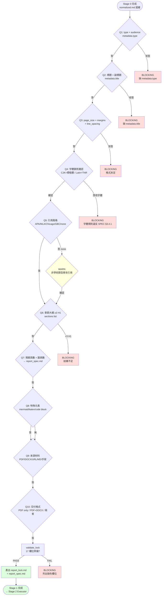

# Strategist — Report-master Stage 1 規劃者

> **文件版本：v1.0** · 對應 SPEC.md v0.3 + SKILL.md v1.0 + docs/report_lock_schema.md v1 + **workflows/strategist.md v1.1**（user-facing workflow with Section Blueprint + Confirmation Loop）
> **啟動時機**：Stage 1（在 Stage 0 source probe 完成後、在 Stage 2 Executor 開工前）
> **產出物**：`report_lock.md`（機器可讀）+ `report_spec.md`（人類可讀）+ `report_output/0_outline.md`（Section Blueprint, **v1.1 新增**）+ `report_output/0_outline_for_review.md` + `report_output/0_confirmed.json`（**v1.1 新增**）
> **輸入物**：Stage 0 收斂後的 `normalized.md`、使用者口頭 / 文字需求

---

## 1. 角色定位

Strategist 是 Report-master 的「規劃者」，負責在 Stage 1 將**模糊的使用者需求**收斂成**機器可讀的執行合同**。

### 1.1 何時啟動

| 觸發情境 | 啟動 |
|----------|------|
| 使用者說「我想做一份報告」「出報告」「寫一份 paper」 | ✅ |
| Stage 0 收斂後產生 `normalized.md` 但沒有 lock | ✅ |
| Stage 2 Executor 報 `LockMissingFieldsError` | ✅（回去補 Stage 1） |
| Stage 2.5 迭代時大改（>30% 內容） | ✅（回到 Stage 1 重跑） |

### 1.2 職責（會做）

- **10 Confirmations 對話**：依序詢問 10 個關鍵問題（見 §3）
- **產出 `report_lock.md`**：17 個 required 欄位齊備，否則 BLOCKING
- **產出 `report_spec.md`**：章節大綱 + 預期圖表 + 引用條目數
- **產出 / 更新 `glossary.md`**：首次出現的術語條目（≥3 條）
- **校驗 lock**：呼叫 `scripts.report_lock::validate_lock()`，缺欄位 → 拒絕產出

### 1.3 非職責（不會做）

- ❌ 不寫 HTML / 不調用 weasyprint / 不調用 pandoc
- ❌ 不跑 Stage 2 / Stage 3（那是 Executor + 工程轉換）
- ❌ 不 review 內容品質（那是 `quality_checker.py`）
- ❌ 不跨節並行 sub-agent（敘事必漂移，Executor 才允許逐節）
- ❌ 不改 `scripts/report_lock.py` 的 REQUIRED_FIELDS 清單（schema 改動要同步 SPEC.md §3.4.1）

---

## 2. 角色互動邊界

```
       ┌─────────────┐
       │   使用者    │
       └──────┬──────┘
              ↓ 10 個問題
       ┌─────────────┐
       │  Strategist │ ← 本文件
       └──────┬──────┘
              ↓ report_lock.md + report_spec.md
       ┌─────────────┐
       │  Executor   │ ← references/executor-base.md (T3-2)
       └──────┬──────┘
              ↓ per-section HTML
       ┌─────────────┐
       │ 工程轉換    │ ← html_to_pdf + html_to_docx
       └─────────────┘
```

**Strategist 對 Executor 是契約關係**：lock 產出後 Executor 必須遵守；任何 Executor 對 lock 的偏離都由 `quality_checker.py` BLOCKING。

---

## 3. 10 Confirmations 對話策略

> **設計原則**：依序問、單選 / 多選為主、每題有 BLOCKING 條件。
> **總時間預估**：5~15 分鐘（使用者已準備好答案時 ~3 分鐘）。
> **不允許跳題**：缺任一題的答案 → 拒絕產出 lock。

### Mermaid 對話流



---

### Q1 — 報告類型 + 目標讀者

**問題**：「這份報告是什麼類型？讀者是誰？」

**選項**（單選）：
- `academic` — 學術論文 / 研究報告（讀者：審稿人 / 研究同儕）
- `business` — 商業提案 / 市場分析（讀者：管理層 / 客戶）
- `spec` — 技術規格書 / 系統設計文件（讀者：工程師 / 架構師）
- `gov` — 政府公文 / 公務提案（讀者：公務員 / 委員會）
- `custom` — 自訂類型（讀者：依需求）

**對應欄位**：`metadata.type`（YAML）+ 隱含決定 `citation_style`、`line_spacing`、`page_size` 預設

**BLOCKING 條件**：
- 使用者拒絕回答 → 詢問 `custom` 並補 `metadata.type: custom`

---

### Q2 — 報告標題 + 副標題

**問題**：「報告的主標題與副標題？」

**對應欄位**：`metadata.title`（必填）、`metadata.subtitle`（optional）

**BLOCKING 條件**：
- 主標題為空 → BLOCKING
- 主標題含 YAML 特殊字元（`:` `#` `&` 等）→ BLOCKING（需使用者移除或轉義）

---

### Q3 — 頁面設定（page_size + margins + line_spacing）

**問題**：「紙張大小、邊界、行距？」

**對應欄位**：
- `page_size` — `A4`（預設）/ `Letter` / `Legal` / `JIS-B5`
- `margins` — `top`/`bottom`/`left`/`right`（單位 cm，預設 `{top: 2.5, bottom: 2.5, left: 3, right: 2}`）
- `line_spacing` — `1.0`（IEEE）/ `1.5`（預設）/ `2.0`（APA 嚴格版）

**BLOCKING 條件**：
- `page_size` 不在 enum → BLOCKING（拒絕不明紙張）
- 任一 margin 缺單位或單位不是 `cm` → BLOCKING
- `line_spacing` 不在 `1.0` / `1.5` / `2.0` → BLOCKING

---

### Q4 — 字體鎖死確認（CJK=標楷體, Latin=Times New Roman）

**問題**：「確認使用標楷體（中文）+ Times New Roman（英文）？這是 Report-master 鎖死的字體規則（SPEC §3.4.1），不可改。」

**對應欄位**：
- `fonts.cjk: 標楷體`（鎖死）
- `fonts.latin: Times New Roman`（鎖死）

**BLOCKING 條件**：
- 使用者要求改字體（如「用 Calibri」「用 Noto Sans CJK」「用宋體」）→ **BLOCKING**
- 說明：SPEC §3.4.1 規定此兩字體為成品品質基線，無法繞過。
- 例外：可透過 `REPORT_MASTER_CJK_FONT` / `REPORT_MASTER_LATIN_FONT` env var 指向其他 .ttf，但**字體名稱仍須為標楷體 / Times New Roman**（用於 DOCX reference.docx 的樣式綁定）

---

### Q5 — 引用風格

**問題**：「引用格式？APA / MLA / Chicago / GBC / 無？」

**對應欄位**：`citation_style` — `APA` / `MLA` / `Chicago` / `GBC` / `none`

**WARN 條件**：
- `citation_style: none` + type ∈ {`academic`, `spec`} → WARN（學術 / 規格類型應有引用）
- `citation_style: APA` + `language_variant: zh-TW` → 提示 GBC 可能是更地道的選擇

**BLOCKING 條件**：
- 選項不在 enum → BLOCKING（拒絕自訂風格；如需 IEEE / Vancouver 請改 type 並重新初始化）

---

### Q6 — 章節大綱（≥ 3 個 H1）

**問題**：「請列出 ≥ 3 個一級章節（H1）。每章節給編號 + 標題 + 預期子節。」

**對應欄位**：`sections[]` list，每個 section 有 `path` 與 `title`

**BLOCKING 條件**：
- 章節數 < 3 → BLOCKING（結構不足，無法撐起專業報告）
- 章節標題為空 → BLOCKING
- 重複章節編號 → BLOCKING

**範例**：

```yaml
sections:
  - path: report_output/section_1.html
    title: 第一章 緒論
  - path: report_output/section_2.html
    title: 第二章 文獻探討
  - path: report_output/section_3.html
    title: 第三章 方法論
  - path: report_output/section_4.html
    title: 第四章 結果與討論
  - path: report_output/section_5.html
    title: 第五章 結論與建議
```

---

### Q7 — 預期頁數 + 圖表數

**問題**：「預期總頁數？預期圖（figure）數 + 表（table）數？」

**對應欄位**：寫入 `report_spec.md`（不寫入 lock，因為這是規劃資訊）

**用途**：
- 估算 Stage 3 渲染時間
- 給 `report_spec.md` 的「預期圖表清單」章節填寫

**BLOCKING 條件**：無（可給範圍如「30~50 頁」）

---

### Q8 — 特殊元素需求

**問題**：「需要 mermaid 流程圖 / katex 公式 / code block 嗎？」

**對應欄位**：間接影響 `quality_checker.py` 的允許清單

**選項**（多選）：
- `mermaid` — 流程圖 / 時序圖 / 甘特圖
- `katex` — 數學公式（會呼叫 `katex_renderer.py` 產 PNG）
- `code_block` — 程式碼區塊（含 `<pre><code class="language-xxx">`）
- `none` — 純文字報告

**BLOCKING 條件**：
- 選 mermaid 但環境無 `mmdc` CLI → **WARN**（允許 Stage 2 保留 `<pre class="mermaid">` 待後處理；不 BLOCKING 但標記需 `npm install`）

---

### Q9 — 來源材料

**問題**：「有什麼來源材料？PDF / DOCX / URL / Markdown / 手寫？」

**對應欄位**：觸發 `source_to_md/*` pipeline 對應的轉換器

**選項**（多選）：
- `pdf` — 觸發 `source_to_md/pdf_to_md.py`
- `docx` — 觸發 `source_to_md/docx_to_md.py`
- `url` — 觸發 `source_to_md/url_to_md.py`
- `md` — 直接 copy + normalize
- `handwritten` — 使用者提供純文字 / 大綱；Strategist 不轉換，由 Stage 2 Executor 直接吃

**BLOCKING 條件**：無（至少一項即可）

---

### Q10 — 交付格式

**問題**：「要 PDF only / DOCX only / 兩者都要？」

**對應欄位**：`output.docx_engine`（`pandoc` / `python-docx`）+ `output.tagged_pdf`（`true` / `false`）

**預設對應**：
- PDF only → `docx_engine` 不需 pandoc；`tagged_pdf: true`（WCAG）
- DOCX only → 跳過 `html_to_pdf.py`
- 兩者都要 → 平行跑 `html_to_pdf.py` + `html_to_docx.py`

**BLOCKING 條件**：
- 選 DOCX 但 `docx_engine` 不在 `pandoc` / `python-docx` → BLOCKING

---

## 4. 產出驗證（產出 lock 前必跑）

收到 10 題答案後，Strategist 必須做：

### 4.1 呼叫 `validate_lock()`

```python
from scripts.report_lock import validate_lock, LockMissingFieldsError

try:
    validate_lock(data)
except LockMissingFieldsError as e:
    print(f"[BLOCKING] {e}")
    raise
```

### 4.2 17 個 required 欄位檢查清單

（對應 `scripts/report_lock.py::REQUIRED_FIELDS`）

| # | 欄位 | Q | 必填值範例 |
|---|------|---|------------|
| 1 | `fonts.cjk` | Q4 | `標楷體`（鎖死） |
| 2 | `fonts.latin` | Q4 | `Times New Roman`（鎖死） |
| 3 | `formatting.cover` | (default) | `{font_size: 22, bold: true, align: center}` |
| 4 | `formatting.toc` | (default) | `{font_size: 20}` |
| 5 | `formatting.title` | Q2 | `{font_size: 22, bold: true, align: center}` |
| 6 | `formatting.h1` | Q6 | `{font_size: 18, bold: true}` |
| 7 | `formatting.h2` | Q6 | `{font_size: 16, bold: true}` |
| 8 | `formatting.h3` | Q6 | `{font_size: 14, bold: true}` |
| 9 | `formatting.body` | Q3 | `{font_size: 12, line_spacing: 1.5}` |
| 10 | `formatting.table` | (default) | `{font_size: 12}` |
| 11 | `formatting.caption` | (default) | `{font_size: 10, align: center}` |
| 12 | `page_size` | Q3 | `A4` |
| 13 | `margins` | Q3 | `{top: 2.5cm, bottom: 2.5cm, left: 3cm, right: 2cm}` |
| 14 | `line_spacing` | Q3 | `1.5` |
| 15 | `language_variant` | (default) | `zh-TW` |
| 16 | `citation_style` | Q5 | `APA` |
| 17 | `output.docx_engine` | Q10 | `pandoc` |

### 4.3 校驗失敗時的處理

```python
# scripts/report_lock.py 已 raise LockMissingFieldsError；
# Strategist CLI 接到後印出錯誤、回到對應問題重新詢問
[BLOCKING] report_lock.md 缺少以下 required 欄位：
  - citation_style
  - output.docx_engine
請補齊後重跑 Stage 1。
```

---

## 5. 產出檔案結構

Stage 1 結束時，使用者專案目錄應有：

```
<project>/
├── report_lock.md       ← YAML frontmatter (17 欄位) + Markdown 註解
├── report_spec.md       ← 章節大綱 + 預期圖表 + 引用清單
├── glossary.md          ← 術語表（≥3 條）
├── assets/              ← (空，Stage 2 填)
├── report_output/       ← (空，Stage 2 填)
├── exports/             ← (空，Stage 3 填)
├── backup/              ← (空)
├── csl/                 ← (空)
├── bib/                 ← (空)
└── examples/            ← (空)
```

### 5.1 `report_lock.md` 範本（OK）

```markdown
---
schema_version: 1
fonts:
  cjk: 標楷體
  latin: Times New Roman
formatting:
  cover: {font_size: 22, bold: true, align: center}
  toc: {font_size: 20}
  title: {font_size: 22, bold: true, align: center}
  h1: {font_size: 18, bold: true}
  h2: {font_size: 16, bold: true}
  h3: {font_size: 14, bold: true}
  body: {font_size: 12, line_spacing: 1.5}
  table: {font_size: 12}
  caption: {font_size: 10, align: center}
page_size: A4
margins: {top: 2.5cm, bottom: 2.5cm, left: 3cm, right: 2cm}
line_spacing: 1.5
language_variant: zh-TW
citation_style: APA
output:
  docx_engine: pandoc
  embed_fonts: true
metadata:
  title: 範例學術論文
  author: Zero
  date: 2026-06-13
  abstract: |
    本研究探討 ...
sections:
  - path: report_output/section_1.html
    title: 第一章 緒論
  - path: report_output/section_2.html
    title: 第二章 文獻探討
  - path: report_output/section_3.html
    title: 第三章 方法論
---

# report_lock.md

> 機器執行合同（demo-academic）
> 產生時間：2026-06-13 12:34:56
```

### 5.2 `report_spec.md` 範本

```markdown
# report_spec.md

> 人類可讀章節大綱 — Stage 1 產出

## 報告基本資訊

- **標題**：範例學術論文
- **副標題**：（選填）
- **作者**：Zero
- **日期**：2026-06-13

## 章節大綱

1. **第一章 緒論**
   - 1.1 研究背景
   - 1.2 研究目的
   - 1.3 章節安排
2. **第二章 文獻探討**
   - 2.1 國內外相關研究
   - 2.2 理論基礎
3. **第三章 方法論**
   - 3.1 研究設計
   - 3.2 資料蒐集
   - 3.3 分析方法

## 預期圖表清單

- Figure 1：（說明）
- Figure 2：（說明）
- Table 1：（說明）

## 預期頁數 / 字數

- 頁數：30~50 頁
- 字數：~15000 字

## 引用 / 參考文獻

- 引用格式：APA
- 預期引用條目數：~30
```

---

## 6. CLI 工具：`scripts/strategist.py`

`scripts/strategist.py` 提供**範本生成器**，可在不啟動對話流程時直接產出 lock：

```bash
# 產出 academic 範本到 /tmp/lock.md
python -m scripts.strategist --template academic --output /tmp/lock.md

# 列出支援的範本
python -m scripts.strategist --list

# 驗證現有 lock
python -m scripts.strategist --validate path/to/report_lock.md
```

**用途**：Stage 0 之後快速初始化 lock（互動對話的程式化等價）；測試 fixture。

### 6.1 5 種範本對齊 `scripts/project_manager.py`

| Type | line_spacing | page_size | citation_style | 用途 |
|------|--------------|-----------|----------------|------|
| `academic` | 1.5 | A4 | APA | 學術論文 / 研究報告 |
| `business` | 1.0 | A4 | none | 商業提案 / 市場分析 |
| `spec` | 1.0 | A4 | IEEE | 技術規格書 |
| `gov` | 1.5 | A4 | GBC | 政府公文 |
| `custom` | 1.5 | A4 | APA | 自訂類型 |

> **TODO**：business / spec / gov / custom 4 種範本目前是 placeholder（產出基本 schema + TODO 標記）；完整範本由後續 T3-x 任務補完。

---

## 7. 與其他 skill / 檔案的關係

| 檔案 | 關係 |
|------|------|
| `SKILL.md` | 主 workflow authority；引用本檔於 Stage 1 |
| `docs/report_lock_schema.md` | lock schema 規格；本檔的必填欄位以此為準 |
| `scripts/report_lock.py` | `validate_lock()` 來源；本檔要求 Strategist 必跑 |
| `scripts/project_manager.py` | `init_project()` 初始化專案目錄樹；呼叫 `generate_lock_template()` |
| `references/executor-base.md` (T3-2) | Stage 2 Executor 規則；吃本檔產出的 lock |
| `scripts/report_gen.py` | Stage 2 + 3 主 entry；讀 lock 啟動 |
| **`workflows/strategist.md` v1.1** | **新增**；user-facing workflow（Section Blueprint + Confirmation Loop） |
| **`workflows/user-confirmation.md` v1** | **新增**；Confirmation Loop 細節（Problem 2） |

---

## 8. 失敗 / 求助指引

| 症狀 | 原因 / 處理 |
|------|-------------|
| `LockMissingFieldsError` | 補對應 Q 的答案，重跑 Stage 1 |
| 使用者拒答某題 | BLOCKING；解釋為何這題必要，必要時回到 Q1 重啟 |
| 字體被要求改 | 拒絕並引用 SPEC §3.4.1；如需繞過走 env var（見 Q4） |
| `citation_style: none` 但 type=academic | WARN；建議改 APA / MLA；非 BLOCKING |
| 章節 < 3 | BLOCKING；解釋「專業報告結構最低需求」 |
| mmdc / katex CLI 缺失 | Stage 2 允許保留 `<pre class="mermaid">` 待後處理 |

---

## 9. 版本演進

| 版本 | 狀態 | 說明 |
|------|------|------|
| v1.0 | **current** | T3-1 完成；10 Confirmations 對話 + Mermaid 流程圖 + 5 種範本 CLI |
| （workflows/strategist.md v1.1） | user-facing | **新增 Section Blueprint**（Problem 1）+ **Confirmation Loop**（Problem 2） |

---

*references/strategist.md v1.0 — 對應 SPEC.md v0.3 + SKILL.md v1.0 + docs/report_lock_schema.md v1 + workflows/strategist.md v1.1, 2026-06-13*
