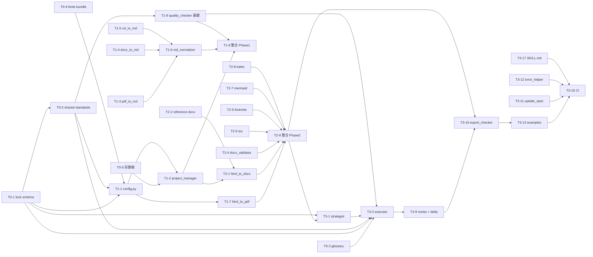

# 開發任務清單 — Report-master

> 文件版本：v1.0 | 對應 SPEC.md v0.3 + architecture.md v1.0 | 產生日期：2026-06-13
> 工作量標記：**S** = < 4h · **M** = 半天~1 天 · **L** = > 1 天
> DoD = Definition of Done（斜體）

---

## 階段劃分

### Phase 0：基礎建設與執行合同（先於一切）

> 目標：先把「機器可讀執行合同」與「HTML 子集約束」做對，後續所有生成器與轉換器都受其約束。

- [ ] **T0-1 定義 `report_lock.md` YAML schema**
  - 涵蓋 §3.4.1 全部 required 欄位：`fonts.cjk`（固定 `標楷體`）、`fonts.latin`（固定 `Times New Roman`）、`formatting.{cover,toc,title,h1,h2,h3,body,table,caption}`、`page_size`、`margins`、`line_spacing`、`language_variant`、`citation_style`、`output.docx_engine`
  - 預估：**M**
  - DoD：*JSON Schema 檔案存在；用 1 個 example 驗證通過；Strategist 在缺欄位時 BLOCKING 拒絕產出 lock。*

- [ ] **T0-2 撰寫 `shared-standards.md`（HTML/CSS 子集約束）**
  - 明確列出**禁止**：CSS Grid、`display: flex`、`position: absolute/fixed`、`float`（除 `` 標準用法）、`::before`、`::after`、外部 CSS 依賴
  - 明確列出**允許**：`font-family`、`font-size`、`font-weight`、`color`、`text-align`、`line-height`、`margin`、`padding`、`border`、`text-decoration`
  - 預估：**M**
  - DoD：*`shared-standards.md` 完成；quality_checker 對禁用清單做 regex 掃描，命中即 BLOCKING；附 1 個 OK 與 1 個 FAIL 的 HTML 對照範例。*

- [ ] **T0-3 設計 `glossary.md` 結構與範本條目**
  - 包含：術語、定義、譯名、首次出現章節、同義詞
  - 預估：**S**
  - DoD：*範本存在；提供 ≥3 條範例；Executor workflow 引用此檔。*

- [ ] **T0-4 建立 `fonts/` bundle 與字體清單**
  - 內含 `標楷體.ttf`（或 `.otf`）與 `Times New Roman`；附 `LICENSES.md` 與授權備註
  - 預估：**S**
  - DoD：*目錄存在；`config.py` 能在缺字體時 fail-fast；授權 metadata 完整。*

- [ ] **T0-5 規劃目錄樹與 `.env` 範本**
  - 對應 SPEC §4 文件結構；`.env.example` 含 API key、報告根路徑、字體路徑、預設 CSL
  - 預估：**S**
  - DoD：*目錄樹可由 `project_manager.py` 一次產出；`.env.example` 可直接 `cp` 使用。*

---

### Phase 1：MVP — 專案初始化 + HTML→PDF 核心路徑

> 目標：能從輸入源材料，產出至少一份可閱讀的 PDF 報告書（DOCX 留待 Phase 2）。

- [ ] **T1-1 實作 `config.py`（配置管理 + 字體 fail-fast）**
  - 載入 `.env`（鏈：system → user → project）；檢查 `fonts/` 內字體存在；暴露 `get(key)` API
  - 預估：**M**
  - DoD：*`config.py` 在缺字體時 raise 明確例外；`.env` 缺關鍵 key 時 raise；單元測試覆蓋 OK / 缺字體 / 缺 key 三情境。*

- [ ] **T1-2 實作 `project_manager.py`（專案初始化）**
  - 接收 `--name` / `--type`；建立目錄；呼叫 `config.py` 檢查；產出 `report_lock.md` 模板（空 schema）與 `glossary.md` 空檔
  - 預估：**M**
  - DoD：*`report-master init --name demo --type academic` 可建立完整目錄；lock 模板欄位齊全。*

- [ ] **T1-3 實作 `source_to_md/pdf_to_md.py`（PDF → Markdown）**
  - 使用 PyMuPDF；保留 heading 層級；圖片抽出到 `assets/`
  - 預估：**M**
  - DoD：*能轉換 1 個 5 頁以上 PDF；章節層級保留；圖片可被後續 HTML 引用。*

- [ ] **T1-4 實作 `source_to_md/docx_to_md.py`（DOCX → Markdown）**
  - 使用 mammoth 或 pandoc；保留 heading、列表、表格
  - 預估：**M**
  - DoD：*能轉換含表格的 DOCX；表格結構在 Markdown 中可辨識。*

- [ ] **T1-5 實作 `source_to_md/url_to_md.py`（URL → Markdown）**
  - 使用 `web_fetch` + readability；保留核心文字與標題
  - 預估：**M**
  - DoD：*能轉換 1 個中文網頁；標題層級保留；圖片 URL 保留。*

- [ ] **T1-6 實作 `source_to_md/md_normalizer.py`（Markdown 統一化）**
  - 統一 frontmatter、空行、編碼（UTF-8 BOM 移除）、CRLF→LF
  - 預估：**S**
  - DoD：*對 3 種來源（PDF/DOCX/URL）的輸出做 normalize 後，差異為零（除內容本身）。*

- [ ] **T1-7 實作 `html_to_pdf.py`（weasyprint HTML→PDF）**
  - 讀 `fonts/`；啟用 `embed-fonts`；處理中英文字體對應；保留章節編號與目次的 PDF bookmark
  - 預估：**L**
  - DoD：*1 份含 5 章節、1 個表格、1 張圖的 HTML → PDF；字體嵌入驗證（`pdffonts` 顯示標楷體 + Times New Roman）；頁碼正確。*

- [ ] **T1-8 實作 `quality_checker.py`（基礎版：HTML 語法 + 字體 + 禁用 CSS）**
  - BeautifulSoup 解析；掃描禁用 CSS（regex）；驗證字體欄位；統計圖表編號
  - 預估：**M**
  - DoD：*對 OK 範例回 PASS；對含 `display: flex` 的 HTML 回 BLOCKING；對字體未設的標題回 BLOCKING。*

- [ ] **T1-9 整合 `report_gen.py` Phase 1 流程**
  - 串接 `source_to_md` → `project_manager` → `html_to_pdf`；產出 PDF；落 `backup/`
  - 預估：**M**
  - DoD：*一鍵指令從 PDF 輸入產出 PDF 輸出；過程中所有 BLOCKING 訊息有意義。*

---

### Phase 2：DOCX 路徑 + 目次/註腳/引用 + 圖表預渲染

> 目標：補完 DOCX 路徑（主 + 平行），補上報告書特殊元素（目次、註腳、引用、圖表、公式）。

- [ ] **T2-1 實作 `html_to_docx.py`（pandoc + reference docx）**
  - 呼叫 `pandoc --reference-doc=templates/reference/report-master-template.docx --citeproc`；CSS 樣式不依賴（內聯為主）
  - 預估：**L**
  - DoD：*1 份 HTML 輸入 → DOCX；DOCX 在 Word / LibreOffice 可開啟；引用與目次存在。*

- [ ] **T2-2 建立 `templates/reference/report-master-template.docx`（DOCX 模板）**
  - 預載 `Normal.dotm` 樣式：CJK=標楷體、Latin=Times New Roman；`Heading 1-3` 對應字級；封面 / 圖說 / 表格樣式齊備
  - 預估：**M**
  - DoD：*由 `templates/reference/build_template.py`（基於 python-docx）生成；手改文件受版本控管；T2-1 測試通過。*

- [ ] **T2-3 實作 `html_to_docx_direct.py`（python-docx 平行路徑，預設關閉）**
  - 從結構化 HTML 段落直接生成；完全控制字體與段落屬性
  - 預估：**L**
  - DoD：*`report_lock.md` 設 `output.docx_engine: python-docx` 時啟用；產出 DOCX 字體 100% 為標楷體 CJK + Times New Roman Latin。*

- [ ] **T2-4 實作 `docx_validator.py`（post-DOCX 驗證）**
  - python-docx 抽樣 3 段內文驗字體；mammoth round-trip 比對標題/表格/圖片數
  - 預估：**M**
  - DoD：*對正確 DOCX 回 PASS；對字體錯的 DOCX 回 BLOCKING 並列出失敗段。*

- [ ] **T2-5 實作 `toc_generator.py`（目次自動產生）**
  - 呼叫 `pandoc --toc` 或自寫掃描 H1-H3；插入至第一章之前
  - 預估：**M**
  - DoD：*對 5 章節 HTML 產出含 5 條目次的 DOCX；DOCX 中目次可展開；PDF 中目次連結可點。*

- [ ] **T2-6 實作 `footnote_manager.py`（註腳 / 引用管理）**
  - 使用 pandoc 原生 `^[note]` 語法；維護 footnote id；CSL + bib 處理
  - 預估：**M**
  - DoD：*HTML 中 `^[note]` 在 PDF 與 DOCX 端均顯示為頁尾註腳；CSL APA 引用可正常展開。*

- [ ] **T2-7 實作 `mermaid_renderer.py`（mermaid-cli 預渲染 SVG）**
  - 掃描 HTML 中 ` ```mermaid ` 區塊；呼叫 `mmdc` 輸出 `assets/fig_N.svg`；替換為 ``
  - 預估：**M**
  - DoD：*含 Mermaid 的 HTML 在 PDF 端正確顯示為 SVG（非原始碼）；Chart.js 引用若存在則回 BLOCKING。*

- [ ] **T2-8 實作 `katex_renderer.py`（katex-cli 預渲染 PNG）**
  - 掃描 `$$...$$` 與 `$...$`；呼叫 `katex-cli` 輸出 `assets/eq_N.png`；替換為 ``
  - 預估：**M**
  - DoD：*含 3 個公式的 HTML 在 PDF 端正確顯示為 PNG；公式編號（Equation N）存在。*

- [ ] **T2-9 整合 `report_gen.py` Phase 2 流程（PDF + DOCX 平行）**
  - 串接所有 T2-*；平行呼叫 `html_to_pdf` 與 `html_to_docx`；落 `exports/`
  - 預估：**M**
  - DoD：*一鍵產出 PDF + DOCX 雙檔；兩者字體一致；總時間 < 序列執行 80%。*

---

### Phase 3：完整 Workflow + 迭代 + 範例 + 整合測試

> 目標：把 Strategist / Executor 流程自動化、加入迭代迴圈、累積 examples 作為整合測試。

- [ ] **T3-1 實作 `references/strategist.md` + Strategist workflow**
  - 10 Confirmations 對話策略；產出 `report_lock.md` + `report_spec.md`；缺欄位 BLOCKING
  - 預估：**L**
  - DoD：*互動 10 個問題後能產出完整 lock；故意缺欄位時 BLOCKING。*

- [ ] **T3-2 實作 `references/executor-base.md` + Executor workflow**
  - 逐節生成流程；每節重讀 lock + glossary；內聯樣式優先
  - 預估：**L**
  - DoD：*對 5 章節 spec 逐節生成；中途修改 lock 後，後續節反映新設定。*

- [ ] **T3-3 實作 `workflows/topic-research.md`（無源材料 workflow）**
  - 啟用網絡搜集；產出 Markdown 源材料；呼叫 `source_to_md/url_to_md` 收斂
  - 預估：**M**
  - DoD：*輸入「AI 對教育影響」可產出 ≥3 個 URL 的彙整 Markdown。*

- [ ] **T3-4 實作 `workflows/create-template.md`（範本建立 workflow）**
  - 結構 / 格式 / 完整範本的建立步驟
  - 預估：**M**
  - DoD：*依此 workflow 可建立 1 個新 kind 的範本（如「公務提案」）。*

- [ ] **T3-5 實作 `workflows/resume-execute.md`（斷點續傳 workflow）**
  - 從 `report_lock.md` 讀進度；跳過已完成節
  - 預估：**M**
  - DoD：*中途 kill 後重啟，能從第 3 章續做；不重做已完成節。*

- [ ] **T3-6 實作 `workflows/generate-citations.md`（引用管理 workflow）**
  - bib 維護、CSL 套用、`--citeproc` 呼叫
  - 預估：**M**
  - DoD：*對 5 條參考文獻的 bib 套用 APA CSL；PDF/DOCX 引用列表正確。*

- [ ] **T3-7 實作 `workflows/live-preview.md`（HTML 即時預覽）**
  - 啟動本地 http server + 瀏覽器；文件變更自動 reload
  - 預估：**S**
  - DoD：*改 HTML 檔後瀏覽器 1 秒內 reload；無需手動重啟。*

- [ ] **T3-8 實作 `workflows/visual-review.md`（視覺自查 workflow）**
  - 截圖比對、字體驗證、頁面佈局檢查
  - 預估：**M**
  - DoD：*PDF 截圖與 reference 範本比對差異 < 5% 像素。*

- [ ] **T3-9 實作 `Stage 2.5 revise` workflow + `delta_checker.py`**
  - 接收 section IDs；重生指定節；保留 `report_v{n}.html` 不覆蓋；產出 diff 報告
  - 預估：**L**
  - DoD：*v1 → 修第 2、4 節 → v2；v1/v2 兩檔並存；diff 報告列出章節級變更。*

- [ ] **T3-10 實作 `export_checker.py`（post-export 檢查）**
  - 頁數、圖片存在、字體 subsetting、目次連結可點、PDF/DOCX 可開啟
  - 預估：**M**
  - DoD：*對 OK 雙檔回 PASS；對缺字體 DOCX 回 BLOCKING；對斷掉圖片連結的 PDF 回 BLOCKING。*

- [ ] **T3-11 實作 `update_spec.py`（變更傳播工具）**
  - SPEC.md 變更 → 列出影響的腳本 / 範本 / workflow；提示同步
  - 預估：**M**
  - DoD：*改 §3.4.1 字體規則後，工具列出所有需同步的檔案。*

- [ ] **T3-12 實作 `error_helper.py`（錯誤分類 + 重試策略）**
  - 區分 transient / permanent；對 transient 自動重試 N 次；對 permanent 升級
  - 預估：**M**
  - DoD：*網路抖動自動重試成功；pandoc 缺欄位不重試直接 BLOCKING。*

- [ ] **T3-13 撰寫 3 個完整 example reports**
  - 例：學術論文（APA）、商業提案、政府公文規格書
  - 預估：**L**
  - DoD：*每個 example 跑完整 pipeline 成功；產出 PDF + DOCX；作為 integration test 進入 CI。*

- [ ] **T3-14 撰寫 `docs/technical-design.md`（深化）**
  - 對 architecture.md 的補充：失敗案例、效能數據、限制
  - 預估：**M**
  - DoD：*≥3 個失敗案例分析；≥1 份效能基準。*

- [ ] **T3-15 撰寫 `docs/rules/` 風格規則**
  - 章節命名、圖表命名、引用風格、術語一致性
  - 預估：**S**
  - DoD：*≥5 條規則；每條附違規範例與修正後範例。*

- [ ] **T3-16 建立 CI / 整合測試**
  - GitHub Actions 或本地 cron：對 3 個 examples 跑 `compileall` + quality_checker
  - 預估：**M**
  - DoD：*任一 example 失敗時 CI 紅燈；通過時綠燈。*

- [ ] **T3-17 撰寫 `SKILL.md`（主 workflow authority）**
  - 定義 Stage 1→2→3 觸發順序、入口、與其他 workflow 的關係
  - 預估：**M**
  - DoD：*依 SKILL.md 即可由 general agent 啟動完整 pipeline。*

---

## 相依關係



**關鍵路徑（critical path）**：
`T0-1 → T1-1 → T1-2 → T1-7 → T1-9 → T2-1 → T2-2 → T2-9 → T3-1 → T3-2 → T3-13 → T3-16`

**瓶頸點**：T1-7（weasyprint 整合）、T2-1（pandoc + reference docx 整合）、T3-13（examples 累積）—— 這三項是時程風險最高的，建議各預留 buffer 半天。

**可平行支線**：
- T0-3 glossary / T0-5 目錄樹 / T0-4 fonts 可與 T0-1、T0-2 平行
- T1-3 / T1-4 / T1-5 三個 source_to_md 互相獨立
- T2-3 / T2-5 / T2-6 / T2-7 / T2-8 可在 T2-1 完成後平行
- T3-3 / T3-4 / T3-5 / T3-6 / T3-7 / T3-8 workflows 可在 T3-1、T3-2 完成後平行

---

## 優先級矩陣

| 任務 | 影響範圍 | 難度 | 優先順序 | 理由 |
|------|----------|------|----------|------|
| T0-1 lock schema | 全部階段 | M | **P0 最高** | 後續所有生成器的 single source of truth |
| T0-2 shared-standards | 全部 HTML 輸出 | M | **P0 最高** | DOCX fidelity 的根本保證 |
| T0-4 fonts bundle | PDF + DOCX | S | **P0 最高** | Day-1 fail-fast 必備 |
| T1-1 config.py | 全部 | M | **P0 最高** | 字體與環境檢查的根 |
| T1-7 html_to_pdf.py | PDF 路徑 | L | **P0 最高** | MVP 核心交付物 |
| T1-8 quality_checker 基礎 | 全部 | M | **P0 高** | per-section gate 從 Day-1 起跑 |
| T2-1 html_to_docx.py | DOCX 路徑 | L | **P0 高** | 雙格式承諾的另一半 |
| T2-2 reference docx | DOCX 字體 | M | **P0 高** | R1.1 字體 / 樣式必備 |
| T2-4 docx_validator | DOCX fidelity | M | **P0 高** | DOCX 唯一驗證手段 |
| T1-2 project_manager | 入口 | M | **P1 高** | 入口必備，但依賴 T1-1 |
| T1-3 / T1-4 / T1-5 source_to_md | 輸入 | M | **P1 高** | 三者選一可先 MVP（PDF→MD） |
| T1-6 md_normalizer | 輸入 | S | **P1 高** | 整合必要 |
| T1-9 整合 Phase1 | E2E | M | **P1 高** | 串接驗證 |
| T2-5 toc | DOCX 體驗 | M | **P2 中** | 報告體驗加分項 |
| T2-6 footnote | 引用 | M | **P2 中** | 學術必備，商業可後延 |
| T2-7 mermaid | 圖表 | M | **P2 中** | R5 風險緩解 |
| T2-8 katex | 公式 | M | **P2 中** | 學術必備 |
| T2-9 整合 Phase2 | E2E | M | **P1 高** | 雙格式承諾完成 |
| T2-3 python-docx 平行 | 平行路徑 | L | **P3 中** | 進階選項，預設關閉 |
| T3-1 strategist | 自動化 | L | **P1 高** | Strategist 角色落地 |
| T3-2 executor | 自動化 | L | **P1 高** | Executor 角色落地 |
| T3-9 revise + delta | 迭代 | L | **P2 中** | R4 緩解，初期可手動 |
| T3-10 export_checker | 收尾 | M | **P2 中** | R8 緩解 |
| T3-13 examples | 測試 | L | **P2 中** | 整合測試基礎 |
| T3-16 CI | 測試 | M | **P3 中** | 自動化測試 |
| T3-11 update_spec | 維護 | M | **P3 中** | 維護工具 |
| T3-12 error_helper | 維護 | M | **P3 中** | 維護工具 |
| T3-3 ~ T3-8 workflows | workflows | M | **P3 中** | 個別 workflow，可分批 |
| T3-14 technical-design | 文件 | M | **P3 中** | 文件 |
| T3-15 rules | 文件 | S | **P3 中** | 文件 |
| T3-17 SKILL.md | 文件 | M | **P2 中** | 主 workflow authority |

**P0**：不做就無法開始 / 風險無法緩解（MVP-blocking）
**P1**：核心流程必備（path-to-deliverable）
**P2**：品質 / 體驗顯著加分（quality-of-life）
**P3**：維護 / 文件 / 進階選項（nice-to-have）

---

## 里程碑

| 里程碑 | 完成條件 | 預估時程 |
|--------|----------|----------|
| **M0 基礎就緒** | Phase 0 全部完成；字體 fail-fast 通過 | D+0.5 |
| **M1 MVP（PDF only）** | Phase 1 全部完成；1 個 example 跑通 PDF 路徑 | D+4 |
| **M2 雙格式（PDF + DOCX）** | Phase 2 全部完成；雙檔產出穩定 | D+9 |
| **M3 完整 Workflow** | Phase 3 全部完成；3 個 examples 通過 CI | D+15 |
| **M4 v0.4 發佈** | SPEC.md 更新為 v0.4；README / CHANGELOG 對齊 | D+16 |

---

*tasks.md v1.0 — 對應 SPEC.md v0.3 + architecture.md v1.0，2026-06-13*
