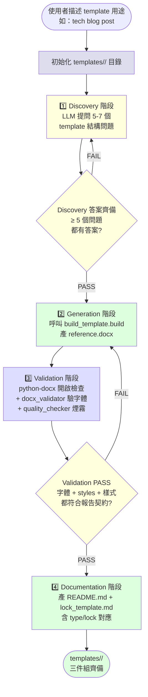

# create-template — Report-master 範本建立 workflow

> **文件版本：v1.0** · 對應 SPEC.md v0.3 + SKILL.md v1.0 + `references/strategist.md` v1 + `references/executor-base.md` v1 + `scripts/build_template.py` v1
> **啟動時機**：使用者需要**新增一個 document template variant** 時（如：公司內部 tech blog post、產品 brief、客戶 newsletter、客戶 whitepaper 範本等）
> **產出物**：
>   1. `templates/<template-name>/reference.docx`（pandoc `--reference-doc=` 用）
>   2. `templates/<template-name>/README.md`（使用說明 + 客製化指引）
>   3. `templates/<template-name>/lock_template.md`（給 Strategist 收斂時讀的契約）
> **輸入物**：使用者的 template 用途描述（如：「公司內部 tech blog post」）

---

## 1. 何時使用本 workflow

| 觸發情境 | 啟動 |
|----------|------|
| 使用者說「我需要一個新的 template 範本」「做一份 blog post 範本」「新增 product brief 範本」 | ✅ create-template |
| 使用者提供的 type 與既有 5 種（academic / business / spec / gov / custom）差異**只在封面文案** | ⚠️ 直接用 `scripts/build_template.py --cover-line` 客製化，**不需走本 workflow** |
| 使用者提供的是「報告內容」（不是範本規格） | ❌ 走一般 `report-master` 主流程或 `workflows/topic-research.md` |
| 使用者要**改 reference.docx 的字體/字級/樣式** | ❌ 改 `scripts/build_template.py` 常數（DEFAULT_CJK_FONT 等）後重跑；不走本 workflow |

**一句話判斷**：使用者要**新增一個 template 目錄**（`templates/<name>/`），且其差異**超出** `--cover-line` 等小參數 → 走本 workflow。

> **設計初衷**：讓 Report-master 的 template 生態可擴展（不限定 5 種 built-in），同時維持「結構契約」（reference.docx + README + lock_template 三件組）的一致性。

---

## 2. 與既有資產的關係

```
       ┌─────────────┐
       │   使用者    │  ← 描述 template 用途
       └──────┬──────┘
              ↓
       ┌─────────────────────────┐
       │  create-template        │ ← 本文件
       │  (本 workflow)          │
       │  Discovery → Gen → Val → Docs │
       └──────┬──────────────────┘
              │ templates/<name>/
              │   reference.docx + README.md + lock_template.md
              ↓
       ┌─────────────────┐         ┌─────────────────────┐
       │  Strategist     │  ←──讀── │  templates/<name>/  │
       │  (吃 lock_tpl)  │         │  lock_template.md   │
       └─────────────────┘         └─────────────────────┘
```

**create-template 對 Strategist 是上游 producer**：把「範本長什麼樣」收斂成 `lock_template.md`，Strategist 產 `report_lock.md` 時可參考（避免每次重談封面/字級/章節樣式）。
**create-template 對 build_template.py 是 consumer**：呼叫其 `build()` function 客製化生成 `reference.docx`。

> **⚠️ create-template 不寫任何報告內容、不產 HTML、不呼叫 executor。**
> 它只負責「範本基礎建設」（DOCX + 說明 + 契約）。

---

## 3. 流程總覽（Mermaid）



---

## 4. 階段細節

### 4.1 Stage — Discovery（結構問卷）

**目標**：把一句話的 template 用途展開成 5-7 個具體結構決策，給 Generation 階段當輸入。

**做法**：

1. 讀取使用者描述（單一字串，例如「公司內部 tech blog post」）
2. 呼叫 LLM（讀 `LLM_API_URL` / `LLM_API_KEY` 環境變數；無設定就走 stub LLM，預設 academic 樣板）
3. Prompt 設計：
   ```
   你是一個文件範本設計師。使用者要建立的新 template 用於：「{description}」

   請依序回答以下 7 個結構問題：

   Q1: 目標讀者是？（例：內部工程師 / 客戶 / 一般讀者）
   Q2: 文件用途與場景？（例：技術分享 / 產品發表 / 客戶溝通）
   Q3: 必要段落結構？（例：標題 / 作者 / 日期 / tags / 摘要 / 正文）
   Q4: 字體偏好？是否沿用 Report-master 鎖死的 CJK=標楷體 / Latin=Times New Roman？
       （沿用 = 不必客製；不沿用 = 列出理由）
   Q5: 是否要封面（cover）？封面元素為何？
   Q6: 是否要目錄（TOC）？是否需要章節編號？
   Q7: 引用風格？（none / APA / MLA / Chicago / IEEE / 自訂）
   Q8: 預期長度？頁數或字數區間？

   輸出格式（YAML）：
   ```yaml
   template_answers:
     q1_audience: ...
     q2_use_case: ...
     q3_sections: [...]
     q4_fonts: {cjk: 標楷體, latin: Times New Roman, override: false}
     q5_cover: {enabled: true, elements: [...]}
     q6_toc: {enabled: true, numbered: true}
     q7_citation_style: none
     q8_expected_length: {pages: "5-10", words: "2000-5000"}
   ```
   ```
4. 寫入 `templates/<name>/discovery_answers.yaml`（給 generation 階段讀）

**BLOCKING 條件**：
- 缺任一題答案（Q1~Q7）→ 重做（結構不明確）
- Q4 要求**改字體**且無充分理由 → WARN（可能違反 `docs/report_lock_schema.md` §2 字體鎖死規則）
- Q5 與 Q6 衝突（如：「要封面但不要任何章節」）→ 重做

---

### 4.2 Stage — Generation（呼叫 build_template.py）

**目標**：根據 Discovery 答案，呼叫 `scripts/build_template.build()` 客製化生成 `reference.docx`。

**做法**：

1. 從 `discovery_answers.yaml` 取出：
   - `q3_sections` → 映射到 `cover_lines`（若 Q5 啟用封面）
   - `q5_cover.elements` → 映射到 `--cover-line` 參數
   - `q4_fonts` → 若 `override: false`，用 `build_template.DEFAULT_CJK_FONT` 等預設
2. 呼叫：
   ```python
   from scripts.build_template import build
   out = build(
       output_path=f"templates/{name}/reference.docx",
       type="custom",                   # 一律用 custom（最通用 placeholder）
       cover_title=cover_title,
       cover_lines=cover_lines,         # 從 Q5.elements 來
       cjk_font=discovery.q4_fonts.cjk,
       latin_font=discovery.q4_fonts.latin,
   )
   ```
3. 若使用者**只想**改封面文案（不需新目錄），仍可用：
   ```bash
   python -m scripts.build_template \
     --output templates/<name>/reference.docx \
     --type custom \
     --cover-title "..." \
     --cover-line "..." \
     --cover-line "..."
   ```

**BLOCKING 條件**：
- python-docx 未安裝 → `BuildTemplateError`（見 `scripts/build_template.py`）
- 輸出目錄權限不足 → `PermissionError`
- `discovery_answers.yaml` 解析失敗 → raise `CreateTemplateError`

---

### 4.3 Stage — Validation（驗證產出）

**目標**：用 `python-docx` + `docx_validator` + `quality_checker` 三層把關。

**做法**：

1. **python-docx round-trip**：確認 `.docx` 可被重新開啟
   ```python
   from docx import Document
   doc = Document(f"templates/{name}/reference.docx")
   assert doc.styles["Normal"].font.name == "Times New Roman"
   ```
2. **docx_validator**：驗字體鎖死（cjk=標楷體, latin=Times New Roman）
   ```python
   from scripts.docx_validator import validate_docx
   rep = validate_docx(f"templates/{name}/reference.docx")
   assert rep.passed
   ```
3. **quality_checker 煙霧測試**：把 `reference.docx` 內含的占位文字（透過 mammoth 抽出）丟給 `check_html_report` 跑一次；僅檢查 forbidden 規則，未命中即 PASS
   ```python
   import mammoth
   with open(reference_path, "rb") as f:
       text = mammoth.extract_raw_text(f).value
   # 若含 inline style 違規 → BLOCKING
   ```
4. 任何檢查 fail → 回 Generation 階段（最多 2 次，之後回報 human）

**BLOCKING 條件**：
- 字體被覆寫為非標楷體 / Times New Roman → BLOCKING（除非 Q4 明確 override + 通過 schema 審查）
- 文件 < 1KB → BLOCKING（產物有問題）
- python-docx 開啟失敗 → BLOCKING

---

### 4.4 Stage — Documentation（產 README + lock_template）

**目標**：產出兩個 markdown 文件，讓 Strategist / Executor / 未來使用者能讀懂這個 template。

**產物 A：`templates/<name>/README.md`**

```markdown
# templates/<name>/ — <Template Label>

> 對應 `workflows/create-template.md` v1.0
> 產生時間：{timestamp}
> 來源描述：{user_description}

## 用途

<一段話描述這個 template 給誰用、什麼場景>

## 字體鎖死規則

- CJK：{cjk_font}
- Latin：{latin_font}
- 章節樣式：H1={h1_pt}pt / H2={h2_pt}pt / H3={h3_pt}pt（皆粗體）
- Normal：{body_pt}pt / 行距 {line_spacing}
- Caption：{caption_pt}pt / 置中
- Title：{title_pt}pt / 粗體 / 置中（封面用）

## 如何產生 reference.docx

```bash
python -m scripts.build_template \
  --output templates/<name>/reference.docx \
  --type custom \
  --cover-title "..." \
  --cover-line "..." \
  --cover-line "..."
```

或用本 workflow 的 CLI helper：

```bash
python -m scripts.create_template --name "<name>"
```

## 客製化

要改字體/字級/封面，改 `templates/<name>/lock_template.md` 後重跑
`scripts.create_template` 即可。

## 與 Report-master 主流程的整合

此 template 對應 Strategist 的 `metadata.type: <type>`：
- 用 `python -m scripts.html_to_docx input.html -o output.docx --reference-doc=templates/<name>/reference.docx` 套用樣式
- 或設環境變數 `REPORT_MASTER_REFERENCE_DOCX=templates/<name>/reference.docx`
```

**產物 B：`templates/<name>/lock_template.md`**

```markdown
---
# 給 Strategist 讀的「範本契約」
# 對應 docs/report_lock_schema.md，但專注於「這個 template 變體的 default 設定」
schema_version: 1
template: <type>
fonts:
  cjk: 標楷體
  latin: Times New Roman
formatting:
  cover: {font_size: 22, bold: true, align: center}
  toc: {font_size: 20}
  title: {font_size: 22, bold: true, align: center}
  h1: {font_size: 18, bold: true}
  h2: {font_size: 16, bold: true}
  h3: {font_size: 14, bold: true}
  body: {font_size: 12, line_spacing: 1.5}
  table: {font_size: 12}
  caption: {font_size: 10, align: center}
page_size: A4
margins: {top: 2.5cm, bottom: 2.5cm, left: 3cm, right: 2cm}
line_spacing: 1.5
language_variant: zh-TW
citation_style: <none|APA|MLA|...>
output:
  docx_engine: pandoc
  embed_fonts: true
template_metadata:
  audience: <Q1 答案>
  use_case: <Q2 答案>
  expected_pages: <Q8 答案>
  toc_enabled: <Q6 答案>
  cover_enabled: <Q5 答案>
---

# lock_template.md — <Template Label>

> 機器可讀範本契約；Strategist 在產 report_lock.md 時可參考本檔。
```

**BLOCKING 條件**：
- 任一文件未產出 → 整體視為失敗
- `lock_template.md` 缺任一 required 欄位（17 個，對齊 `docs/report_lock_schema.md` §2）→ BLOCKING

---

## 5. CLI 工具：`scripts/create_template.py`

> **S-M 等級**：S（小工具）~ M（產物有結構）；只跑 Discovery → Generation → Validation → Documentation，**不**自動接 Strategist。

```bash
# 基本用法：給 template name + description
python -m scripts.create_template --name "tech-blog-post" \
  --description "公司內部 tech blog post"

# 自訂封面元素
python -m scripts.create_template --name "product-brief" \
  --description "產品 brief" \
  --cover-title "Q3 Product Brief" \
  --cover-line "Product: Apollo" \
  --cover-line "Author: Zero" \
  --cover-line "Date: 2026-06-13"

# 走 stub LLM（無 API 時的預設；Discovery 答案用 canned response）
python -m scripts.create_template --name "internal-newsletter" \
  --description "公司電子報" --quiet

# 跳過 Discovery（直接給 discovery_answers.yaml）
python -m scripts.create_template --name "..." \
  --discovery-file templates/<name>/discovery_answers.yaml
```

**產出**：
```
templates/<name>/
├── reference.docx          (~5 KB)
├── README.md               (~80 lines)
├── lock_template.md        (~60 lines)
└── discovery_answers.yaml  (optional; 若有走 LLM Discovery)
```

**Return code**：
- `0` = 成功（三件組齊備 + validation PASS）
- `1` = python-docx 未安裝 / build_template 失敗
- `2` = Validation 失敗（字體不符 / docx 損壞）
- `3` = Documentation 失敗（lock_template.md 缺欄位）

**Stub LLM 介面**：
- 讀 env：`LLM_API_URL` / `LLM_API_KEY` / `LLM_MODEL`（optional）
- 未設定 → 走 `StubLLM`，回傳 canned response（固定 academic-like answers）
- 設定 → 用 `requests` 呼叫 OpenAI-compatible chat completions API

---

## 6. 端到端範例（fictional）

> 跑完一次 `create-template` workflow 的虛構對話。

**Step 0 — 使用者**：
> 「我想幫公司內部建立一個 tech blog post 的範本，給工程師寫技術分享用的。」

**Step 1 — create-template 啟動**：
```bash
python -m scripts.create_template \
  --name "tech-blog-post" \
  --description "公司內部工程師的 tech blog post 範本"
```

**Step 2 — Discovery 階段**（LLM 提問）：

```
Q1: 目標讀者是？
→ 公司內部工程師（全端/後端/前端/ML/Infra 各團隊）

Q2: 文件用途與場景？
→ 月度技術分享、讀書會、重大事件紀錄、跨團隊 sync 用

Q3: 必要段落結構？
→ 標題、作者、發布日期、Tags、摘要（TL;DR）、正文、參考連結

Q4: 字體偏好？
→ 沿用 Report-master 鎖死（CJK=標楷體 / Latin=Times New Roman）

Q5: 是否要封面？
→ 是。封面元素：[Title, Author, Date, Tags]

Q6: 是否要目錄 / 章節編號？
→ 否（短文，不需要 TOC；H2 可當章節）

Q7: 引用風格？
→ 自訂（無固定格式，文末列「參考連結」即可）

Q8: 預期長度？
→ 3-8 頁 / 1500-3000 字
```

**Step 3 — 寫入 `templates/tech-blog-post/discovery_answers.yaml`**：

```yaml
template_answers:
  q1_audience: 公司內部工程師
  q2_use_case: 月度技術分享、讀書會、事件紀錄
  q3_sections: [Title, Author, Date, Tags, TL;DR, Body, References]
  q4_fonts:
    cjk: 標楷體
    latin: Times New Roman
    override: false
  q5_cover:
    enabled: true
    elements: [Title, Author, Date, Tags]
  q6_toc:
    enabled: false
    numbered: false
  q7_citation_style: none
  q8_expected_length:
    pages: 3-8
    words: 1500-3000
```

**Step 4 — Generation 階段**（呼叫 `build_template.build()`）：

```python
from scripts.build_template import build

out = build(
    output_path="templates/tech-blog-post/reference.docx",
    type="custom",
    cover_title="Tech Blog Post",
    cover_lines=[
        "Title: <請填寫文章標題>",
        "Author: <請填寫作者>",
        "Date: YYYY-MM-DD",
        "Tags: <請填寫 tags（逗號分隔）>",
        "",
        "（請將此段刪除後插入正式內容）",
    ],
    cjk_font="標楷體",
    latin_font="Times New Roman",
)
```

**Step 5 — Validation 階段**：

```python
from docx import Document
from scripts.docx_validator import validate_docx

doc = Document("templates/tech-blog-post/reference.docx")
assert doc.styles["Normal"].font.name == "Times New Roman"  # ✅

rep = validate_docx("templates/tech-blog-post/reference.docx")
assert rep.passed  # ✅
print(f"  cjk_font: {'PASS' if rep.checks[0].passed else 'FAIL'}")
print(f"  latin_font: {'PASS' if rep.checks[1].passed else 'FAIL'}")
```

**Step 6 — Documentation 階段**：

```bash
$ ls templates/tech-blog-post/
README.md              # 80 lines
discovery_answers.yaml # 18 lines
lock_template.md       # 60 lines
reference.docx         # 5 KB
```

**Step 7 — 後續整合（給 Strategist）**：

```bash
# Strategist 產 report_lock.md 時可參考 lock_template.md
python -m scripts.strategist \
  --template tech-blog-post \
  --output report_lock.md

# Executor / html_to_docx 套用 reference.docx
export REPORT_MASTER_REFERENCE_DOCX=templates/tech-blog-post/reference.docx
python -m scripts.html_to_docx report_output/_bundle.html -o exports/report.docx
```

---

## 7. 與其他 workflow / skill 的關係

| 檔案 | 關係 |
|------|------|
| `SKILL.md` | 主 workflow authority；本檔於「新增 template 變體」情境下被引用 |
| `references/strategist.md` (T3-1) | 下游：讀 `lock_template.md` 收斂出 report_lock.md |
| `references/executor-base.md` (T3-2) | 下游：透過 `REPORT_MASTER_REFERENCE_DOCX` 套用 reference.docx |
| `scripts/build_template.py` (T2-2) | **核心依賴**：本 workflow 直接呼叫其 `build()` function |
| `scripts/strategist.py` (T3-1) | CLI 對應 `references/strategist.md`；吃 lock_template 產 lock |
| `scripts/create_template.py` | CLI 對應本 workflow；跑完整 4 階段 |
| `docs/report_lock_schema.md` | lock schema；`lock_template.md` 必須遵守 17 個 required 欄位 |
| `templates/reference/README.md` | 既有 reference template 範本；本 workflow 擴充同樣結構 |

---

## 8. 失敗 / 求助指引

| 症狀 | 原因 / 處理 |
|------|-------------|
| `--name "..."` 沒產三件組 | 檢查 `--name` 是否含非法字元（不允許 `/` `\` `..`）；或 LLM API 失敗 |
| `reference.docx` 字體驗不過 | 檢查 Discovery Q4 是否要求 override；如未要求，確認 `build_template.py` defaults 未被改 |
| `lock_template.md` 缺欄位 | Strategist 17 required 欄位規則；補齊後重跑 Documentation 階段 |
| python-docx `ImportError` | `.venv/bin/pip install python-docx` |
| mammoth `ImportError` | `.venv/bin/pip install mammoth`（validation 階段用） |
| Discovery 答案太模糊 | 重跑，給更明確的 `--description`（如加上「公司內部」「客戶」「長度 5 頁」） |
| Template name 重複 | 確認 `templates/<name>/` 是否已存在；若要覆蓋，加 `--force` |

---

## 9. 版本演進

| 版本 | 狀態 | 說明 |
|------|------|------|
| v1.0 | **current** | T3-4 完成；4 階段流程（Discovery → Generation → Validation → Documentation）+ Mermaid 圖 + CLI helper + 端到端範例；產三件組（reference.docx + README + lock_template） |

---

*workflows/create-template.md v1.0 — 對應 SPEC.md v0.3 + SKILL.md v1.0 + references/strategist.md v1 + references/executor-base.md v1 + scripts/build_template.py v1, 2026-06-13*
