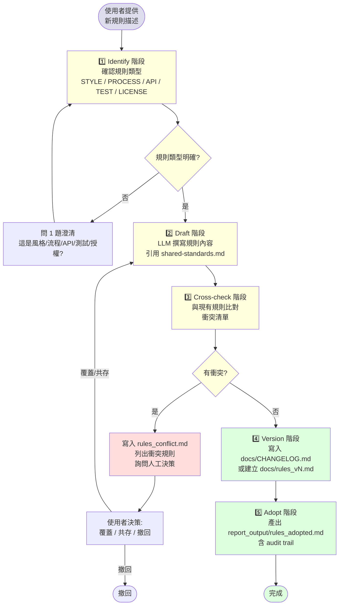

# docs-and-rules — Report-master 文件管理 + 規則制定 workflow

> **文件版本：v1.0** · 對應 SPEC.md v0.3 + SKILL.md v1.0 + `docs/shared-standards.md` v1 + `workflows/error-handling.md` v1 + `workflows/technical-design.md` v1
> **啟動時機**：當使用者想新增 / 修改 Report-master 的規範文件（風格、流程、API、測試、授權）。
> **產出物**：
>   1. `report_output/rules_adopted.md`（採納紀錄 + 衝突清單 + 版本號）
>   2. `docs/CHANGELOG.md`（新增 / 更新條目）
>   3. `docs/rules_vN.md`（新規則文件，N = version 號）
> **輸入物**：新規則描述（title + body + 適用範圍）。
> **不變物**：`docs/shared-standards.md` 的禁用清單（§2）/ 允許清單（§3）— 新規則**不得覆蓋**這些既有強制項。

---

## 1. 為什麼需要這個 workflow

Report-master 經過 6 個 Phase 的迭代，已累積不少「**事實上**的規範」散落於：

- `docs/shared-standards.md`（HTML/CSS 子集約束）
- `workflows/error-handling.md` §3（error 分類規則）
- `workflows/technical-design.md` §10（audience 範本規則）
- `docs/report_lock_schema.md`（lock 17 欄位）
- `references/strategist.md`（10 Confirmations 對話規則）

當使用者想新增 / 修改規則時，會面臨：

1. **不知道規則該放哪個檔案** — 風格規則放 `docs/` 還是 `workflows/`？授權條款放哪？
2. **不知道會不會和現有規則衝突** — 新增「允許 CSS Grid」會打臉 `shared-standards.md` §2
3. **沒有版本控管** — 改了規則後，舊文件怎麼對應？CHANGELOG 寫哪？
4. **沒有採納紀錄** — 誰在什麼時候為什麼決定採用這條規則？audit trail 散落

`docs-and-rules` workflow 把規則制定流程標準化：**Identify → Draft → Cross-check → Version → Adopt**。
每個新規則都會留下「**採納紀錄**」（audit trail）與「**衝突清單**」（避免覆蓋既有強制項）。

---

## 2. 何時啟動

| 觸發情境 | 症狀 | 啟動 |
|----------|------|------|
| 使用者說「我想新增一條規則」「幫我寫一個規範」 | 模糊需求 | ✅ docs-and-rules |
| 使用者說「禁止 X」「規定 Y 必須怎樣」 | 規則制定意圖 | ✅ docs-and-rules |
| 使用者想修改 `shared-standards.md` 既有規則 | 衝突風險高 | ✅ docs-and-rules（含 cross-check） |
| 使用者說「幫我做風格指南」「我想統一術語」 | 文件層級 | ✅ docs-and-rules |
| 使用者說「CHANGELOG 加一條」「規則版本號要更新」 | 版本管理 | ✅ docs-and-rules |
| 使用者要寫技術規格文件 | design doc | ❌ 用 `technical-design` workflow |
| 使用者想修訂單節 HTML | revise | ❌ 用 `revise` workflow |
| 使用者要建立 CI | 整合測試 | ❌ 用 T3-16 / 自行處理 |

**判斷規則**：當使用者的意圖是「**建立新規範**」或「**改既有規範**」（而非「**寫報告**」「**改程式碼**」「**寫規格文件**」），就走本 workflow。

---

## 3. 5 階段流程（核心）

### 3.1 Mermaid 流程圖



### 3.2 階段 1 — Identify（識別規則類型）

**目標**：把模糊的規則需求分類到 5 種 enum 之一。

**規則類型 enum**（固定 5 種；不可擴充）：

| Type | 說明 | 適用場景 | 典型存放 |
|------|------|----------|----------|
| `STYLE` | 字體 / 排版 / 配色 / 命名 | CSS 規範、章節命名、圖表命名、術語表 | `docs/style_vN.md` 或 `docs/shared-standards.md` |
| `PROCESS` | workflow 流程新規範 | pipeline 順序、review gate、release flow | `workflows/<name>.md` 附錄 |
| `API` | 對外 / 內部介面規範 | CLI flag、Python module API、HTTP endpoint | `docs/api_vN.md` 或 `references/api.md` |
| `TEST` | 測試覆蓋率 / 命名 / 結構要求 | pytest 命名、coverage threshold、fixture 規範 | `docs/test_vN.md` 或 `tests/conftest.py` 註解 |
| `LICENSE` | 授權條款 / 使用限制 / 法遵 | MIT / Apache / 自訂條款、商業使用限制 | `LICENSE` 或 `docs/license_vN.md` |

**Identify 演算法**（規則優先 + LLM fallback）：

```python
KEYWORD_MAP = {
    "STYLE":   ["字體", "font", "顏色", "color", "排版", "格式", "命名", "章節命名",
                "圖表", "術語", "css", "style", "naming"],
    "PROCESS": ["流程", "pipeline", "stage", "順序", "review", "gate",
                "workflow", "process", "順序"],
    "API":     ["api", "endpoint", "cli", "flag", "argument", "介面",
                "module", "function signature"],
    "TEST":    ["測試", "test", "coverage", "pytest", "fixture",
                "unit test", "integration test", "覆蓋率"],
    "LICENSE": ["授權", "license", "mit", "apache", "版權", "copyright",
                "商業使用", "commercial use", "法遵", "compliance"],
}

def identify_type(title: str, body: str) -> str:
    text = f"{title} {body}".lower()
    scores = {}
    for rule_type, keywords in KEYWORD_MAP.items():
        scores[rule_type] = sum(1 for kw in keywords if kw.lower() in text)
    best = max(scores, key=scores.get)
    if scores[best] == 0:
        return "UNKNOWN"  # 走人工
    return best
```

**BLOCKING 條件**：
- 使用者拒絕指定類型且 keyword 都不命中 → 走 `UNKNOWN`，回到 AskUser
- 命中兩個以上類型且平手 → AskUser 二選一（或合併）

### 3.3 階段 2 — Draft（草擬規則內容）

**目標**：把使用者的需求展開為**結構化規則條目**。

**做法**：

1. 讀取使用者輸入（`--title`, `--type`, `--body`, `--scope`）
2. 讀取 `docs/shared-standards.md` 取得共用標準（避免重複）
3. 讀取 `docs/CHANGELOG.md`（如有）取得既有規則摘要
4. LLM Prompt（stub 或 HTTP）：
   ```
   你是一個文件治理架構師。請將以下規則需求展開為結構化條目：

   規則類型：{type}
   規則標題：{title}
   規則內容：{body}
   適用範圍：{scope}

   請依以下 Markdown 結構產出：

   ## {rule_id}: {title}

   **類型**: {type}
   **版本**: v{n}
   **生效日期**: {date}
   **適用範圍**: {scope}

   ### 規則內容
   {body 展開為 actionable 條目；最少 3 條；最多 10 條}

   ### 反例（FAIL）
   - {違反範例 1}
   - {違反範例 2}

   ### 正例（PASS）
   - {符合範例 1}
   - {符合範例 2}

   ### 與既有規則的關係
   - 引用 shared-standards.md §{X}
   - 與 rules_v{N-1}.md §{Y} 的差異

   ### 違反時的處置
   - 預期阻擋點（CI / quality_checker / 人工 review）
   - 例外條件（如有）
   ```
5. 對每條 actionable 規則給「**違反時的處置**」（這是強制欄位）
6. 寫入記憶體 `RuleDraft` 物件，**不**直接寫檔案（等 Cross-check 通過再寫）

**Draft 結構**：

```python
@dataclass
class RuleDraft:
    rule_id: str             # e.g. "R-S-007"
    type: str                # STYLE / PROCESS / API / TEST / LICENSE
    title: str
    version: str             # "v1.0"
    body: str                # 展開後的可執行條目
    fail_examples: List[str] # 反例
    pass_examples: List[str] # 正例
    related_rules: List[str] # 引用既有規則
    enforcement: str         # 違反時處置
    scope: str               # 適用範圍
    timestamp: str
```

**BLOCKING 條件**：
- 反例 / 正例 < 1 → 補完（品質不足）
- 違反處置為空 → BLOCKING（沒人知道怎麼 enforce）

### 3.4 階段 3 — Cross-check（衝突校驗）

**目標**：確認新規則**不和現有規則衝突**。

**做法**：

1. 讀取所有既有規則文件：
   - `docs/shared-standards.md`（必讀；§2 禁用清單是 BLOCKING）
   - `docs/CHANGELOG.md`（既有規則摘要）
   - `docs/rules_v1.md`、`rules_v2.md` ...（如有）
   - `workflows/*.md` 內的「規則」段落
2. 執行以下校驗：
   - **禁用衝突**：新規則是否允許 `shared-standards.md` §2 禁用的 CSS / 元素？
     - 是 → **BLOCKING CONFLICT**（除非明確標 `OVERRIDE:`）
   - **術語衝突**：新規則引入的術語是否與既有 glossary 衝突？
     - 是 → WARN（建議使用者對齊）
   - **範圍衝突**：新規則的 `scope` 與既有規則的 `scope` 重疊且結論相反？
     - 是 → BLOCKING CONFLICT
   - **強制衝突**：新規則的 `enforcement` 與既有規則的 `enforcement` 不一致？
     - 是 → WARN
3. 產出 `ConflictReport`：
   ```python
   @dataclass
   class ConflictReport:
       new_rule_id: str
       conflicts: List[Conflict]
       warnings: List[Warning]
       safe_to_adopt: bool  # True if no BLOCKING conflicts

   @dataclass
   class Conflict:
       existing_rule_path: str  # e.g. "docs/shared-standards.md §2"
       existing_rule_text: str
       conflict_type: str       # "DISABLED_USED" / "SCOPE_OVERLAP" / "ENFORCEMENT_CONFLICT"
       severity: str            # BLOCKING / WARN
       suggested_resolution: str
   ```

**Conflict 類型**：

| Type | 觸發條件 | Severity |
|------|----------|----------|
| `DISABLED_USED` | 新規則允許 `shared-standards.md` §2 禁用項 | **BLOCKING** |
| `SCOPE_OVERLAP_CONTRADICT` | 新規則與既有規則的 scope 重疊但結論相反 | **BLOCKING** |
| `TERM_CONFLICT` | 新規則引入的術語與 glossary 衝突 | WARN |
| `ENFORCEMENT_MISMATCH` | 新規則的處置與既有規則不一致 | WARN |

**BLOCKING 衝突時的處置**：

| 情境 | 處理 |
|------|------|
| 使用者加 `--override` flag | 允許覆蓋；寫入 `rules_adopted.md` 時明確標 `OVERRIDE:` |
| 使用者沒加 `--override` | 寫入 `report_output/rules_conflict.md`；請使用者決策（覆蓋 / 共存 / 撤回） |
| `--check-only` 模式 | 只回報衝突，不寫檔；exit code = 1（has BLOCKING conflict） |

### 3.5 階段 4 — Version（版本管理）

**目標**：把通過 cross-check 的新規則寫入文件，留下版本痕跡。

**做法**：

1. **決定 version 號**：
   - 讀取 `docs/CHANGELOG.md` 最新 version
   - 新規則 version = `latest + 0.1`（semver-like）
   - 例：latest = `v1.2` → 新規則 = `v1.3`
2. **決定存放路徑**：
   - `STYLE` → 視情況 append 到 `docs/shared-standards.md` 或建立 `docs/rules_style_vN.md`
   - `PROCESS` → append 到 `workflows/<name>.md` 附錄或建立 `docs/rules_process_vN.md`
   - `API` → append 到 `docs/api_vN.md`（如不存在則新建）
   - `TEST` → append 到 `docs/test_vN.md` 或 `tests/conftest.py` docstring
   - `LICENSE` → 寫入 `LICENSE` 或 `docs/license_vN.md`
3. **更新 CHANGELOG.md**：
   ```markdown
   ## [v1.3] - 2026-06-13

   ### Added
   - R-S-007: 嚴格限制 HTML 表格巢狀層數 ≤ 3（STYLE）
     - 違反時：quality_checker 報 BLOCKING
     - 例外：無
   ```
4. **建立/更新 rules_vN.md**：
   ```markdown
   # rules_vN.md — Report-master 風格規則彙整

   > 對應 workflows/docs-and-rules.md v1.0
   > 累積 7 條規則

   ## R-S-001: ...（既有）
   ## R-S-002: ...（既有）
   ...
   ## R-S-007: 嚴格限制 HTML 表格巢狀層數 ≤ 3（NEW）
   ...
   ```

**Version 命名規範**：
- `MAJOR.MINOR`（不引入 PATCH）
- `MAJOR`：breaking change（覆蓋既有規則）
- `MINOR`：additive（新規則 / 補充）

### 3.6 階段 5 — Adopt（採納與 audit trail）

**目標**：寫出 `report_output/rules_adopted.md`，留下完整採納紀錄。

**產出物**：`report_output/rules_adopted.md`

**格式**：

```markdown
# Rules Adopted Report

_產生：Report-master docs-and-rules workflow v1.0_
_時間：2026-06-13T15:45:00_

## 摘要

| 欄位 | 值 |
|------|----|
| Rule ID | R-S-007 |
| Title | 嚴格限制 HTML 表格巢狀層數 ≤ 3 |
| Type | STYLE |
| Version | v1.3 |
| Status | ✅ ADOPTED |
| Cross-check | ✅ PASS（0 BLOCKING / 0 WARN） |
| Override | false |

## 規則全文

{RuleDraft.body 完整內容}

## 採納決策

- **決策者**：{使用者 / 自動}
- **決策時間**：{ISO timestamp}
- **決策依據**：
  - shared-standards.md §2 禁用清單未觸發
  - 與既有 R-S-001 / R-S-005 不衝突
  - quality_checker 可實作（regex 簡單）

## Audit Trail

| 階段 | 時間 | 動作 |
|------|------|------|
| Identify | 2026-06-13T15:40:00 | 識別為 STYLE（命中 keyword: 表格） |
| Draft | 2026-06-13T15:41:00 | 草擬 5 條 actionable 規則 + 2 反例 + 2 正例 |
| Cross-check | 2026-06-13T15:42:00 | 0 BLOCKING / 0 WARN |
| Version | 2026-06-13T15:43:00 | 寫入 CHANGELOG.md v1.3 + rules_style_v1.md |
| Adopt | 2026-06-13T15:45:00 | 產出 rules_adopted.md |

## 違反處置

{enforcement 完整內容}

## 引用

- docs/shared-standards.md v1（HTML/CSS 強制標準）
- workflows/error-handling.md v1（錯誤處理流程）
- workflows/technical-design.md v1（技術規格文件流程）
- workflows/docs-and-rules.md v1（本檔）
```

**附加動作**：
- 把採納紀錄 append 到 `docs/CHANGELOG.md` 的 `## Audit Trail` 段落（可選）
- 若 `--check-only` 模式：只回報衝突清單，不寫檔；產出 `report_output/rules_conflict.md`

---

## 4. CLI：`scripts/docs_and_rules.py`

> **M 等級**：M（含分類、校驗、版本管理、產出 audit trail）。給終端機使用者 + main agent 觸發。

### 4.1 基本語法

```bash
# 基本：制定新規則
python -m scripts.docs_and_rules \
    --type STYLE \
    --title "Table Nesting Limit" \
    --body "HTML 表格巢狀層數不得超過 3 層。違反時 quality_checker 報 BLOCKING。"

# 強制覆蓋既有規則
python -m scripts.docs_and_rules \
    --type STYLE \
    --title "CSS Grid Allow" \
    --body "允許 display: grid ..." \
    --override

# 只做 cross-check，不新增規則
python -m scripts.docs_and_rules \
    --type STYLE \
    --title "Proposed Rule" \
    --body "..." \
    --check-only

# 指定 scope
python -m scripts.docs_and_rules \
    --type PROCESS \
    --title "Pre-commit hook" \
    --body "..." \
    --scope "所有 Python 檔案"

# 自訂輸出路徑
python -m scripts.docs_and_rules \
    --type STYLE \
    --title "..." \
    --body "..." \
    --output report_output/rules_adopted.md
```

### 4.2 Return code

| Code | 意義 |
|------|------|
| `0` | ADOPTED（cross-check 通過、寫入成功） |
| `1` | NEEDS MANUAL（有 BLOCKING conflict，需使用者決策） |
| `2` | Argument error（缺 flag / 型別不合法） |
| `3` | CHECK-ONLY 模式發現 BLOCKING conflict |

### 4.3 典型輸出範例

```
📜 docs-and-rules — 開始
   type: STYLE
   title: Table Nesting Limit
   body: HTML 表格巢狀層數不得超過 3 層...
   check-only: false
   override: false

🔍 Stage 1: Identify
   ✅ 識別為 STYLE（命中 keyword: 表格, 巢狀）

✏️  Stage 2: Draft
   ✅ 草擬 5 條 actionable 規則
   ✅ 2 個反例 + 2 個正例

🛡️  Stage 3: Cross-check
   ✅ 檢查 4 個既有規則文件
   ✅ 0 BLOCKING conflict
   ✅ 0 WARN

📦 Stage 4: Version
   ✅ CHANGELOG.md v1.3 更新
   ✅ rules_style_v1.md 寫入

📋 Stage 5: Adopt
   ✅ rules_adopted.md 產出
   ✅ Rule ID: R-S-007

✅ 規則採納完成
📄 紀錄: report_output/rules_adopted.md
📝 版本: docs/CHANGELOG.md v1.3
```

---

## 5. 與其他 workflow 的關係

| Workflow / Script | 關係 | 何時用 |
|-------------------|------|--------|
| `docs/shared-standards.md` (T0-2) | **強制引用** | Draft 階段必讀；Cross-check 必校驗禁用清單 |
| `workflows/error-handling.md` (T3-12) | 引用 | 規則違反時的處置可參考 error 分類 |
| `workflows/technical-design.md` (T3-14) | 引用 | 制定 audience 範本規則時對齊 §10 |
| `scripts/quality_checker.py` | 工具 | 規則 enforcement 可委派 quality_checker 實作 |
| `scripts/docs_and_rules.py` (本檔 T3-15) | CLI 對應 | 本 workflow 的對應 CLI |
| `docs/CHANGELOG.md` | 工具 | 既有規則版本摘要 |
| `docs/glossary.md` | 工具 | term 衝突校驗 |

---

## 6. 失敗 / 求助指引

| 症狀 | 原因 / 處理 |
|------|-------------|
| `identify_type()` 回 UNKNOWN | 沒有 keyword 命中；手動指定 `--type` 或加 keyword |
| BLOCKING conflict | 新規則觸發 `shared-standards.md` §2；加 `--override` 或撤回 |
| `--check-only` exit 3 | 有 BLOCKING；請看 `report_output/rules_conflict.md` |
| CHANGELOG.md 不存在 | 自動建立空 CHANGELOG.md |
| `rules_style_vN.md` 已存在 N 撞號 | 自動升級為 N+1 |
| version 號亂掉 | 手動修 `docs/CHANGELOG.md`；CLI 不會自動讀現有版本以外的歷史 |

---

## 7. 端到端範例：制定「嚴格限制 HTML 表格巢狀層數 ≤ 3」

> 情境：使用者覺得現有 HTML 表格太複雜，想加上「**巢狀 ≤ 3 層**」的硬限制。

### Step 1 — 使用者

```bash
$ python -m scripts.docs_and_rules \
    --type STYLE \
    --title "Table Nesting Limit" \
    --body "HTML 表格巢狀層數不得超過 3 層。違反時 quality_checker 報 BLOCKING。" \
    --scope "report_output/*.html"
```

### Step 2 — Identify 階段

```
🔍 Stage 1: Identify
   text: "Table Nesting Limit HTML 表格巢狀層數..."
   keyword 命中: 表格, 巢狀
   ✅ 識別為 STYLE
```

### Step 3 — Draft 階段

```
✏️  Stage 2: Draft
   rule_id: R-S-007
   type: STYLE
   body:
     1. HTML 表格巢狀層數 ≤ 3
     2. 第 4 層起禁止使用（即便語法合法）
     3. 例外：資料表頭部不算
     4. 違反時 quality_checker 報 BLOCKING
     5. 修正建議：拆成多個獨立表格
   fail_examples:
     - <table><tr><td><table><tr><td><table>...</table></td></tr></table></td></tr></table>
   pass_examples:
     - <table><tr><td><table><tr><td>data</td></tr></table></td></tr></table>
   enforcement: "quality_checker 掃描 HTML tree，巢狀深度 > 3 報 BLOCKING"
```

### Step 4 — Cross-check 階段

```
🛡️  Stage 3: Cross-check
   檢查文件:
     - docs/shared-standards.md §2 (BLOCKING 禁用清單)
     - docs/shared-standards.md §3 (允許清單 — 表格相關)
     - docs/CHANGELOG.md (既有規則 v1.2)
     - docs/rules_style_v1.md (既有 6 條 STYLE 規則)
   ✅ 沒有觸發 DISABLED_USED（不允許 Grid / Flex 等）
   ✅ 沒有觸發 SCOPE_OVERLAP_CONTRADICT
   ✅ 沒有觸發 TERM_CONFLICT
   ✅ 沒有觸發 ENFORCEMENT_MISMATCH
   → 0 BLOCKING / 0 WARN
   → safe_to_adopt = True
```

### Step 5 — Version 階段

```
📦 Stage 4: Version
   latest version: v1.2
   new version: v1.3
   寫入 docs/CHANGELOG.md:
     ## [v1.3] - 2026-06-13
     ### Added
     - R-S-007: 嚴格限制 HTML 表格巢狀層數 ≤ 3（STYLE）
   寫入 docs/rules_style_v1.md:
     ## R-S-007: 嚴格限制 HTML 表格巢狀層數 ≤ 3
     ...
```

### Step 6 — Adopt 階段

```
📋 Stage 5: Adopt
   寫入 report_output/rules_adopted.md:
     # Rules Adopted Report
     ...
     ## 摘要
     Rule ID: R-S-007
     Status: ✅ ADOPTED
     ...
```

### Step 7 — 終端機輸出

```
✅ 規則採納完成
📄 紀錄: report_output/rules_adopted.md
📝 版本: docs/CHANGELOG.md v1.3
```

---

## 8. 引用

- `docs/shared-standards.md` v1 — 強制 HTML/CSS 標準（不可覆蓋，除非 `--override`）
- `workflows/error-handling.md` v1 (T3-12) — 錯誤分類與處置
- `workflows/technical-design.md` v1 (T3-14) — 技術規格文件流程
- `docs/CHANGELOG.md` — 既有規則版本摘要
- `docs/glossary.md` — 術語表（term 衝突校驗用）
- `scripts/quality_checker.py` — BLOCKING enforcement 實作
- `tasks.md` T3-15 — 本 workflow 對應的 task

---

## 9. 版本演進

| 版本 | 狀態 | 說明 |
|------|------|------|
| v1.0 | **current** | T3-15 完成；5 階段流程（Identify → Draft → Cross-check → Version → Adopt）+ 5 種規則類型 enum + 4 種 conflict 類型 + CLI helper + 端到端範例 |

**未來可能擴充**（不在本任務範圍）：
- 互動式 Identify（CLI 一題一題問類型；目前 keyword + 自動 fallback）
- 規則之間的依賴圖（rule A → rule B）
- 規則 deprecation 流程（廢除舊規則）
- 自動從 git log 推導規則演進史
- 規則 marketplace（跨專案共享）

---

*workflows/docs-and-rules.md v1.0 — 對應 SPEC.md v0.3 + SKILL.md v1.0 + docs/shared-standards.md v1 + workflows/error-handling.md v1 + workflows/technical-design.md v1, 2026-06-13*