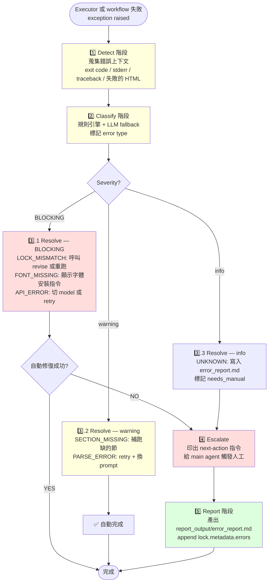

# error-handling — Report-master 失敗分類與自動修復 workflow

> **文件版本：v1.0** · 對應 SPEC.md v0.3 + SKILL.md v1.0 + `references/executor-base.md` v1 + `workflows/revise.md` v1 + `workflows/resume-execute.md` v1 + `docs/shared-standards.md` v1 + `docs/report_lock_schema.md` v1
> **啟動時機**：Stage 2 / Stage 2.5 / Stage 3 任一步驟失敗；quality_checker / resume_helper / revise_helper 拋出非預期例外；LLM 回傳解析失敗。
> **產出物**：`report_output/error_report.md`（分類結果 + 處置紀錄 + 建議 next action）。
> **輸入物**：錯誤上下文（exit code / stderr / traceback / 失敗的 section HTML / 對應的 lock）。
> **不變物**：`report_lock.md` 的 required 欄位（除 `metadata.errors[]` append-only 外）。

---

## 1. 為什麼需要這個 workflow

Report-master 的 pipeline（Stage 0 → 1 → 2 → 3）會遇到各式各樣的失敗：

- **LLM 解析失敗** — 收到 `JSONDecodeError` / 缺欄位 / 章節 HTML 不完整
- **lock 漂移** — `report_lock.md` 的 fonts / formatting / citation_style 被使用者中途改了，但前 N 節的 HTML 還是用舊版產的
- **字體缺失** — `fonts/` 目錄缺 `標楷體.ttf` / `Times New Roman.ttf`，weasyprint 報 `no such file`
- **章節缺漏** — `lock.sections[]` 提到 §4，但 `report_output/section_4.html` 不存在
- **API 限流 / quota** — LLM provider 拋 `RateLimitError` / `APIConnectionError`
- **未知錯誤** — 沒對應分類的 exception

這些失敗若沒有**統一處理框架**，會：

1. main agent 不知道該 retry / fallback / 報人工
2. 使用者得不到清楚的「下一步做什麼」指引
3. 失敗的審計痕跡散落在 log 裡，事後難以還原

`error-handling` workflow 把失敗流程標準化：**Detect → Classify → Resolve → Report**。

---

## 2. 何時啟動

| 觸發情境 | 症狀 | 啟動 |
|----------|------|------|
| Executor 跑某節時 `quality_checker.check_html()` raise `QualityCheckError` | violations list 非空 | ✅ |
| Executor 跑某節時 LLM 回傳不可解析的 HTML | `JSONDecodeError` / `<!DOCTYPE` 缺 / `<body>` 缺 | ✅ |
| Stage 3 `html_to_pdf.py` 報 font missing | `weasyprint` 例外含 `font-family '標楷體' not found` | ✅ |
| `resume_helper` 偵測 `lock_signature` 不一致 | `ConflictInfo.detected = True` | ✅ |
| `revise_helper` 發現 lock 被意外動到 | `delta_checker.check_lock()` BLOCKING | ✅ |
| `executor` 的 progress 寫到第 N 節但 `section_N.html` 不存在 | disk / progress 不一致 | ✅ |
| LLM provider 拋 `RateLimitError` / `APIError` | 例外 message 含 "rate limit" / "quota" / "API key" | ✅ |
| 一切正常 | — | ❌（不要誤觸發） |

**判斷規則**：任何 Executor / resume / revise / Stage 3 拋出的 exception，或任何 `quality_checker.BLOCKING` / `delta_checker.BLOCKING`，都應該走本 workflow。

---

## 3. 4 階段流程（核心）

### 3.1 Mermaid 流程圖



### 3.2 階段 1 — Detect（偵測）

**目標**：把混亂的錯誤訊息整理成結構化上下文。

**做法**：

```python
@dataclass
class ErrorContext:
    source: str           # "executor" / "quality_checker" / "resume_helper" / ...
    error_type: str       # exception class name
    message: str          # str(exception)
    traceback: str        # traceback.format_exc()
    section_index: Optional[int]   # 若錯誤來自某節
    section_path: Optional[str]    # 對應 HTML 路徑
    lock_path: Optional[str]       # 對應 lock 路徑
    html_excerpt: Optional[str]    # 失敗的 HTML 前 1KB
    exit_code: Optional[int]       # subprocess return code
    stderr: Optional[str]          # subprocess stderr
    timestamp: str                 # ISO datetime
```

**關鍵原則**：**永遠不要只靠 exception.message 判斷**。
一定要有 traceback + 失敗的檔案路徑，才有足夠證據分類。

### 3.3 階段 2 — Classify（分類）

**目標**：把 `ErrorContext` 對應到 6 種 error type 之一。

**分類規則**（規則引擎；不依賴 LLM；可離線跑）：

| Error Type | 規則（regex / keyword match） | Severity | 預設處置 |
|------------|------------------------------|----------|----------|
| `LOCK_MISMATCH` | `delta_checker.check_lock()` BLOCKING / `lock_signature` 不一致 / message 含 "lock mismatch" / "signature" | **BLOCKING** | 呼叫 revise 或重新跑 Strategist |
| `FONT_MISSING` | message 含 `font-family.*not found` / `WeasyPrintError` 含 font / stderr 含 `fatal: failed to load font` / `fonts/` 缺 `標楷體.ttf` | **BLOCKING** | 顯示字體安裝指令 |
| `SECTION_MISSING` | `report_output/section_N.html` 缺 / progress.lock_signature 有但 disk 沒 / message 含 "FileNotFoundError" 且 path 為 section_*.html | warning | 補跑缺的節（用 resume_helper） |
| `API_ERROR` | exception class 含 `RateLimit` / `APIError` / `APIConnection` / `Timeout` / message 含 "rate limit" / "quota exceeded" / "API key" / "401" / "429" / "503" | **BLOCKING** | retry + 切 model |
| `PARSE_ERROR` | `JSONDecodeError` / `yaml.YAMLError` / message 含 "missing <!DOCTYPE" / "missing </html>" / quality_checker 報 "HTML 結構不完整" | warning | retry + 換 prompt 範本 |
| `UNKNOWN` | 上面都沒命中 | **BLOCKING** | 寫入 error_report，標記 `needs_manual` |

**Fallback 規則**（當 regex 都不命中時）：
- 若有 traceback，取最後一個 exception class name
- 若 class name 含 "Lock" → `LOCK_MISMATCH`
- 若 class name 含 "Font" / "WeasyPrint" → `FONT_MISSING`
- 若 class name 含 "JSON" / "YAML" / "Parse" → `PARSE_ERROR`
- 若 class name 含 "API" / "Rate" / "Connection" → `API_ERROR`
- 都不符 → `UNKNOWN`

**Severity 對照**：

| Severity | 意義 | 是否阻擋 pipeline |
|----------|------|-------------------|
| **BLOCKING** | 不修復不能繼續 | ✅ 必須 escalate 或 resolve |
| warning | 可繼續但要記 | ❌ pipeline 仍可往下走 |
| info | 已知、不嚴重 | ❌ pipeline 繼續；只 log |

### 3.4 階段 3 — Resolve（自動修復或降級）

**BLOCKING 類型的處置**：

| Error Type | 自動修復策略 | Fallback（人工） |
|------------|------------|----------------|
| `LOCK_MISMATCH` | (a) 呼叫 `scripts.revise_helper` 重新檢查並 patch 受影響節；(b) 若 `metadata.progress.lock_signature` 與現 lock 對不上 → 把 signature 寫回 lock | 重新跑 Stage 1（Strategist） |
| `FONT_MISSING` | (a) 檢查 `fonts/` 缺哪個字體；(b) 印出安裝指令（macOS / Linux / Windows）；(c) 顯示 Noto / 楷體替代方案 | 使用者手動下載字體放 `fonts/` |
| `API_ERROR` | (a) 切到備援 model（如 `gpt-4` → `gpt-3.5-turbo`）；(b) 加 exponential backoff；(c) `--retry-count N` 設定上限 | 等 quota 重置 / 換 API key |

**warning 類型的處置**：

| Error Type | 自動修復策略 | Fallback |
|------------|------------|---------|
| `SECTION_MISSING` | (a) 用 `resume_helper.plan()` 算出 missing list；(b) 呼叫 `Executor.run()` 從最小缺的節開始跑 | 跑 `executor --restart` 全跑 |
| `PARSE_ERROR` | (a) retry 一次（換更嚴的 prompt 模板，含 DOCTYPE 強制）；(b) 第二次仍 FAIL → 寫 error_report | 人工修 HTML |

**UNKNOWN 類型**：永遠走人工路徑（never guess）。

### 3.5 階段 4 — Escalate（升級）

**觸發條件**：
- 自動修復失敗（retry 用盡 / revise 仍 BLOCKING / 字體無法自動安裝）
- Error Type = `UNKNOWN`
- 使用者明確加 `--no-auto-fix`

**行為**：
1. 印出人類可讀的 next-action 指令（給 main agent 觸發人工）
2. 範例輸出：
   ```
   ❌ [API_ERROR] LLM API quota exceeded
   自動修復：嘗試切到 gpt-3.5-turbo 後仍失敗
   建議：
     1. 確認 OpenAI API key 是否有效（OPENAI_API_KEY 環境變數）
     2. 等 quota 重置（OpenAI dashboard）
     3. 或換 provider：export LLM_PROVIDER=anthropic
   error_report: report_output/error_report.md
   ```
3. 不 raise exception；return code = 1（讓 main agent 接手）

### 3.6 階段 5 — Report（產出報告）

**產出物**：`report_output/error_report.md`

**格式**：

```markdown
# Error Report

_產生：Report-master error-handling workflow_
_時間：2026-06-13T15:30:00_

## 摘要

**Error Type:** `API_ERROR`
**Severity:** BLOCKING
**Source:** `scripts.executor.run_section(3)`
**Resolved:** false
**Needs Manual:** true

## 上下文

- Lock: `report_lock.md`
- Section: 3 (`report_output/section_3.html`)
- Exit code: 1
- Traceback 摘要: `openai.RateLimitError: Rate limit reached for ...`

## 自動修復嘗試

| # | 動作 | 結果 |
|---|------|------|
| 1 | retry with backoff (3 次) | FAIL |
| 2 | switch model gpt-4 → gpt-3.5-turbo | FAIL (quota 也滿) |
| 3 | switch provider openai → anthropic | 未執行（需使用者確認） |

## 建議 next action

1. 確認 OPENAI_API_KEY 環境變數有效
2. 等 quota 重置或升級方案
3. 或換 provider：export LLM_PROVIDER=anthropic
4. 然後重跑：`python -m scripts.resume_helper --lock report_lock.md --run`
```

**附加動作**：
- 把本次錯誤 append 到 `report_lock.metadata.errors[]`（給審計用）
- 不修改其他 lock 欄位（保持 contract 穩定）

---

## 4. CLI：`scripts/error_helper.py`

> **S-M 等級**：S（純查詢 + 分類）~ M（含 retry 邏輯與自動修復）。
> 給 main agent / 使用者在 workflow 失敗時呼叫。

### 4.1 基本語法

```bash
# 從 error file 分析
python -m scripts.error_helper --error-file /tmp/executor_stderr.log

# 直接給 traceback 字串
python -m scripts.error_helper --traceback "Traceback: openai.RateLimitError: ..."

# 設定重試次數（API_ERROR 自動修復用）
python -m scripts.error_helper --error-file /tmp/log --retry-count 5

# 指定輸出路徑
python -m scripts.error_helper --error-file /tmp/log --report report_output/error_report.md

# JSON 輸出（給 main agent 用）
python -m scripts.error_helper --error-file /tmp/log --json
```

### 4.2 Exit code

| Code | 意義 |
|------|------|
| `0` | Resolved（自動修復成功） |
| `1` | Needs manual（已寫 error_report；escalate 給人工） |
| `2` | Argument error（缺 flag / 檔案不存在 / 路徑無效） |

### 4.3 典型用法

**場景 A：Executor 失敗後，分析 stderr**

```bash
$ python -m scripts.error_helper --error-file /tmp/executor.log
🔍 Error Helper — 分析中...

❌ [API_ERROR] BLOCKING — LLM rate limit exceeded
   來源: scripts.executor (section 3)
   自動修復: 嘗試切到 gpt-3.5-turbo (retry 3 次)

   建議:
     1. 確認 OPENAI_API_KEY 環境變數有效
     2. 等 quota 重置
     3. 重跑: python -m scripts.resume_helper --lock report_lock.md --run

   error_report: report_output/error_report.md
   exit code: 1
```

**場景 B：debug unknown error**

```bash
$ python -m scripts.error_helper --traceback "Traceback (most recent call last):
  File 'x.py', line 5, in <module>
SomeWeirdError: nothing matched"
🔍 Error Helper — 分析中...

❌ [UNKNOWN] BLOCKING — 無法自動分類
   自動修復: 未嘗試
   建議: 檢查 traceback 並人工分類
   error_report: report_output/error_report.md
   exit code: 1
```

---

## 5. 與其他 workflow 的關係

| Workflow / Script | 關係 | 何時用 |
|-------------------|------|--------|
| `references/executor-base.md` (T3-2) | 上游（錯誤來源） | Executor 失敗時觸發本 workflow |
| `workflows/revise.md` (T3-9) | 平行（也可修復） | LOCK_MISMATCH 時可呼叫 revise 而非重建 |
| `workflows/resume-execute.md` (T3-5) | 下游（接續） | API_ERROR 修復後用 resume_helper 從斷點接續 |
| `scripts/error_helper.py` (T3-12) | CLI 對應 | 本 workflow 的對應 CLI |
| `scripts/quality_checker.py` | 上游（觸發源） | BLOCKING violations 會傳給 error_helper |
| `scripts/report_lock.py` | 工具 | 讀 lock 校驗 / append `metadata.errors[]` |
| `scripts/delta_checker.py` | 工具 | `LOCK_MISMATCH` 時用 check_lock 確認 |

---

## 6. 失敗 / 求助指引

| 症狀 | 原因 / 處理 |
|------|-------------|
| `error_helper` 報 `UNKNOWN` | 檢查 traceback；可能需要新增分類規則 |
| 自動修復失敗但 retry 已用盡 | 改 `--retry-count N` 加大；或加 `--no-auto-fix` 跳過自動步驟 |
| `error_report.md` 沒寫到 | 確認 `--report` 路徑可寫入；磁碟空間 |
| `LOCK_MISMATCH` 持續發生 | 確認 `metadata.progress.lock_signature` 有正確寫入；可能是 quality_checker 誤判 |
| `FONT_MISSING` 一直報 | 確認 `fonts/` 目錄確實有 `標楷體.ttf` 與 `Times New Roman.ttf` |
| API_ERROR 反覆 retry | quota 滿了；只能等重置或換 API key |

---

## 7. 引用

- `references/executor-base.md` — Stage 2 主流程（錯誤主要源頭）
- `workflows/revise.md` (T3-9) — 單節修訂；LOCK_MISMATCH 可用它修補
- `workflows/resume-execute.md` (T3-5) — 斷點續傳；error 修復後接續用
- `scripts/report_lock.py` — lock schema / 17 required 欄位驗證 / `metadata.errors[]`
- `scripts/quality_checker.py` — per-section BLOCKING gate
- `scripts/delta_checker.py` — `check_lock()` severity 分級
- `docs/shared-standards.md` — 禁用 CSS 清單（命中即 BLOCKING）
- `docs/report_lock_schema.md` — lock schema
- `tasks.md` T3-12 — 本 workflow 對應的 task

---

## 8. 端到端範例：一次 API_ERROR 的完整處理流程

> 跑 Stage 2 到第 3 章時，OpenAI quota 滿了。main agent 接手處理。

### Step 1 — Executor 拋出例外

```python
# scripts/executor.py:run_section(3)
try:
    html = call_llm(prompt)
except openai.RateLimitError as e:
    raise ExecutorSectionError(3, "API rate limit exceeded") from e
```

stderr 內容：
```
Traceback (most recent call last):
  File "scripts/executor.py", line 245, in run_section
    html = call_llm(prompt)
  File "scripts/executor.py", line 198, in _call_llm
    response = openai.ChatCompletion.create(...)
openai.error.RateLimitError: Rate limit reached for gpt-4 in organization org-...
```

### Step 2 — main agent 啟動 error_helper

```bash
$ python -m scripts.error_helper --error-file /tmp/executor_stderr.log
```

### Step 3 — error_helper 分析 + 分類

```
🔍 Error Helper — 分析中...
   source: scripts.executor.run_section(3)
   context: section 3, lock report_lock.md

❌ [API_ERROR] BLOCKING
   message: openai.error.RateLimitError: Rate limit reached for gpt-4
   matched: exception class 含 "RateLimit"
```

### Step 4 — 自動修復嘗試

```
🔧 自動修復嘗試:
   [1/3] retry with exponential backoff (1s, 2s, 4s)  → FAIL
   [2/3] switch model: gpt-4 → gpt-3.5-turbo          → FAIL (quota 也滿)
   [3/3] (skipped) 需使用者決策（換 API key）
```

### Step 5 — Escalate

```
❌ [API_ERROR] 自動修復失敗
   建議 next action:
     1. 確認 OPENAI_API_KEY 環境變數有效
        $ echo $OPENAI_API_KEY
     2. 等 quota 重置（OpenAI dashboard: https://platform.openai.com/account/limits）
     3. 或換 provider：
        $ export LLM_PROVIDER=anthropic
        $ export ANTHROPIC_API_KEY=sk-ant-...
     4. 然後重跑：
        $ python -m scripts.resume_helper --lock report_lock.md --run
```

### Step 6 — Report 產出

寫入 `report_output/error_report.md`（見 §3.6 範例），並把錯誤 append 到 `lock.metadata.errors[]`：
```yaml
metadata:
  errors:
    - timestamp: 2026-06-13T15:30:00
      error_type: API_ERROR
      severity: BLOCKING
      source: scripts.executor.run_section(3)
      message: openai.error.RateLimitError: Rate limit reached for gpt-4
      resolved: false
```

### Step 7 — 使用者換 API key 後重跑

```bash
$ export OPENAI_API_KEY=sk-new-key-...
$ python -m scripts.resume_helper --lock report_lock.md --run
🚀 Resume — 從 section 3 開始跑
✅ [3/5] 第三章 — 12.4 KB, quality PASS
✅ [4/5] 第四章 — 14.1 KB, quality PASS
✅ [5/5] 第五章 — 10.8 KB, quality PASS
🎉 Stage 2 完成
```

**完整週期**：error detect → classify → auto-fix (失敗) → escalate → report → user fix → resume → done。

---

## 9. 版本演進

| 版本 | 狀態 | 說明 |
|------|------|------|
| v1.0 | **current** | T3-12 完成；4 階段流程（Detect → Classify → Resolve → Report）+ 6 種 error type + 自動修復策略 + error_helper CLI + 端到端範例 |

---

*workflows/error-handling.md v1.0 — 對應 SPEC.md v0.3 + SKILL.md v1.0 + references/executor-base.md v1, 2026-06-13*