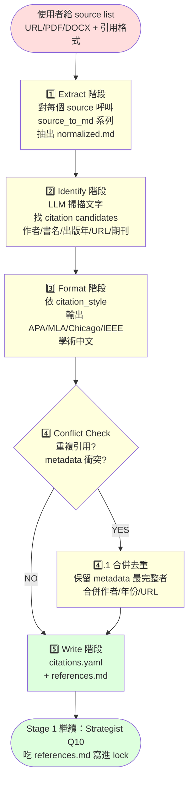

# generate-citations — Report-master 引用管理 workflow

> **文件版本：v1.0** · 對應 SPEC.md v0.3 + SKILL.md v1.0 + `references/strategist.md` v1 + `references/executor-base.md` v1 + `docs/report_lock_schema.md` v1
> **啟動時機**：Stage 1 期間（Strategist Q10 收斂 `citation_style` 之後）／Stage 0 期間（source materials 進來時同步建立 references 清單）
> **產出物**：
>   1. `report_output/citations.yaml`（結構化：BibTeX 風格條目 + metadata）
>   2. `report_output/references.md`（人類可讀：依指定 citation_style 格式化的 References / Works Cited 清單）
> **輸入物**：source materials 列表（URLs / PDF 檔路徑 / DOCX 檔路徑）+ 引用格式（APA / MLA / Chicago / IEEE / 學術中文）

---

## 1. 何時使用本 workflow

| 觸發情境 | 啟動 |
|----------|------|
| 使用者給 3 個 URL，說「幫我整理成 APA 引用清單」 | ✅ generate-citations |
| 使用者給 5 個 PDF，說「統一轉成 Chicago 格式」 | ✅ generate-citations |
| Strategist Q10 收斂出 `citation_style=APA`，需要先產 references 給 Executor | ✅ generate-citations（自動） |
| 使用者只有 topic、沒有任何 source materials | ❌ 走 `topic-research.md`（產 `research_notes.md`，引用清單為 LLM 知識，可標 `llm_knowledge`） |
| 使用者有 source materials 但只要 plain text 摘要 | ❌ 走一般 `report-master` 主流程，引用清單可後處理 |
| Stage 2 Executor 已在寫 inline citation `^[...]`，發現某條 reference 格式不對 | ⚠️ 重跑本 workflow 即可（會覆蓋 `references.md`，但 inline `^[...]` 不會被改） |

**一句話判斷**：
- **有 source materials + 想自動化 references 清單** → 用本 workflow
- **無 source materials** → 走 `topic-research.md`（不會產 references.md，但可在 `lock.metadata.citation_style` 標 `none` 或 `llm_knowledge`）

> **設計初衷**：Strategist Q10 收斂 `citation_style` 後，Executor 在 Stage 2 每節末尾寫 `^[...]` 註腳時，
> 需要一份「已經被格式化好」的人類可讀 References 清單（pandoc citeproc 用 CSL 風格檔轉檔時的 source of truth）。
> 若每節都讓 LLM 重新格式化 references → 漂移（漂移點：作者姓在前/在後、年份括號位置、斜體與否）。
> 集中跑一次本 workflow 就能避免這個漂移。

---

## 2. 與其他角色的互動邊界

```
       ┌─────────────┐
       │   使用者    │  ← 給 source list + 引用格式
       └──────┬──────┘
              ↓
       ┌─────────────────────┐
       │  generate-citations │ ← 本文件
       │  (本 workflow)      │
       └──────┬──────────────┘
              │  Extract → Identify → Format → Conflict
              ↓
   ┌──────────────────────────────────────┐
   │ report_output/citations.yaml          │ ← 結構化（BibTeX 風格 + metadata）
   │ report_output/references.md           │ ← 人類可讀（APA / MLA / Chicago / ...）
   └──────────────────────────────────────┘
              ↓ Stage 2 開始時
       ┌─────────────┐
       │  Strategist │ ← 讀 references.md 寫進 report_lock.md
       └──────┬──────┘
              ↓ report_lock.md + references.md
       ┌─────────────┐
       │  Executor   │ ← references.md 供 inline ^[...] 引用
       └──────┬──────┘
              ↓
       ┌─────────────┐
       │  Stage 3    │ ← pandoc --citeproc + CSL（見 docs/.env.example）
       └─────────────┘
```

**generate-citations 對 Strategist 是 producer**：把「source materials 變 references」；Strategist 把 references 路徑寫進 `lock.metadata.references_path`。

**generate-citations 對 Executor 是 upstream**：Executor 的 inline `^[...]` 註腳對應到 `references.md` 條目；若 references.md 改了，Executor 的 `^[...]` 不會被自動改（需 `--rebuild-changed` 重跑，但這超出本 workflow 範圍）。

> **⚠️ 本 workflow 不直接呼叫 Executor、不直接做 Stage 3 轉檔。**
> 它的產物只有 `citations.yaml` + `references.md`；後續整合由 Strategist + Stage 3 處理。

---

## 3. 流程總覽（Mermaid）



**5 階段流程**：
1. **Extract**：URL → `url_to_md`、PDF → `pdf_to_md`、DOCX → `docx_to_md`、MD → 直接讀
2. **Identify**：LLM 掃描每份 normalized.md，找出 citation candidates（書名、作者、出版年、URL、期刊、卷期、頁碼）
3. **Format**：依指定 `citation_style` 套用格式（APA 7th / MLA 9th / Chicago 17th / IEEE / 學術中文 GBT 7714）
4. **Conflict**：偵測重複（同一書/文出現多次）；合併 metadata、保留最完整者
5. **Write**：寫入 `report_output/citations.yaml`（結構化）+ `report_output/references.md`（人類可讀）

---

## 4. 階段細節

### 4.1 Stage — Extract（文字抽取）

**目標**：把異質的 source materials（URL / PDF / DOCX / MD）統一為 normalized.md，供後續 Identify 階段掃描。

**做法**：

對每個 source，依類型呼叫對應的 `source_to_md` 工具：

| Source 類型 | 呼叫工具 | 備註 |
|-------------|----------|------|
| URL（http/https） | `scripts.source_to_md.url_to_md.convert(url, output_path)` | 走 requests 抓 HTML + readability 萃取 |
| PDF 檔 | `scripts.source_to_md.pdf_to_md.convert(source, output_path)` | 走 PyMuPDF + 字體大小推斷 heading |
| DOCX 檔 | `scripts.source_to_md.docx_to_md.convert(source, output_path)` | 走 mammoth HTML→Markdown |
| 純 Markdown 檔 | 直接讀檔 | 跳過 source_to_md |

**產物**：每個 source 對應一份 `report_output/_sources/{source_id}.md`（source_id 用 hash 或序號）

**失敗處理**：
- 抓取失敗（timeout / 404）→ 跳過該 source，記錄到 `citations.yaml` 的 `errors[]` 區塊
- PDF 解析失敗（加密 / 損壞）→ 同上

**BLOCKING 條件**：
- 全部 sources 都失敗 → raise `AllSourcesFailedError`

---

### 4.2 Stage — Identify（識別 citation candidates）

**目標**：對每份 normalized.md，用 LLM（或啟發式 regex）找出所有 citation candidates。

**候選欄位**（Citation candidate schema）：

```yaml
candidate:
  id: ref_001                 # 唯一 ID（ref_001, ref_002, ...）
  type: book | article | web | report | misc
  author: ["Last, F.", "Last, F."]    # 姓在前、簡寫
  year: "2024"
  title: "..."
  container: "..."            # 期刊名 / 書系 / 網站名
  publisher: "..."
  volume: "..."
  issue: "..."
  pages: "1-12"
  url: "https://..."
  doi: "10.xxxx/xxxxx"
  accessed: "2026-06-13"      # 訪問日期（URL 類必填）
  raw_text_excerpt: "..."     # 從原始文字截錄 100-200 字佐證
```

**做法**：

1. **LLM 為主**（推薦）：呼叫 LLM，prompt 設計：
   ```
   你是一個引用識別助理。給定以下學術/技術文件內容，請找出所有「被引用的文獻」。

   識別目標：
   - 書名、作者、出版年、出版社
   - 期刊文章：篇名、作者、期刊名、卷期、頁碼、DOI
   - 網頁：標題、網站名、URL、訪問日期
   - 技術報告：編號、發行機構

   輸出格式（YAML 列表）：
   ```yaml
   candidates:
     - id: ref_001
       type: article
       author: ["Lin, C.-Y.", "Wang, M."]
       year: "2023"
       title: "..."
       ...
   ```

   輸入文字：
   <normalized.md 內容>
   ```
2. **regex fallback**（無 LLM 時）：用啟發式正則抓：
   - URL → `https?://\S+`
   - 年份 → `(19|20)\d{2}`
   - DOI → `10\.\d{4,}/\S+`
   - ISBN → `\bISBN[:\s]?\d{10,13}\b`
3. **保留 raw_text_excerpt**：給後續 human review 對照（避免 LLM 幻覺）

**BLOCKING 條件**：
- candidates 數量 = 0 → 仍寫空檔（標 `references_count=0`），不 BLOCKING（可能 source 真的無引用）
- candidates 缺關鍵欄位（author / year / title） → 標 `incomplete=true`，由 `Conflict` 階段決定是否合併

---

### 4.3 Stage — Format（格式化為指定 citation_style）

**目標**：把 candidate schema 轉成指定 citation_style 的人類可讀字串。

**支援的 citation_style**：

| Style | 範例 |
|-------|------|
| APA | Lin, C.-Y., & Wang, M. (2023). Title. *Journal*, *12*(3), 45-67. https://doi.org/10.xxxx |
| MLA | Lin, Chen-Yu, and Min Wang. "Title." *Journal*, vol. 12, no. 3, 2023, pp. 45-67. |
| Chicago (notes-bibliography) | Lin, Chen-Yu, and Min Wang. "Title." *Journal* 12, no. 3 (2023): 45-67. |
| IEEE | [1] C.-Y. Lin and M. Wang, "Title," *Journal*, vol. 12, no. 3, pp. 45-67, 2023. |
| 學術中文（GB/T 7714） | 林振宇, 王敏. 標題[J]. 期刊, 2023, 12(3): 45-67. |

**做法**：

- 每個 style 對應一個 `format_<style>.py` 模組（或 `_format_<style>()` 函式）
- 函式簽名：`format_<style>(candidate: CitationCandidate) -> str`
- 排序規則：
  - APA / MLA / Chicago：依作者姓字母序（中文依筆畫或拼音）
  - IEEE：依出現順序（編號 [1], [2], ...）
  - 學術中文：依作者姓筆畫（中文）/ 字母序（英文）

**BLOCKING 條件**：
- 未知 `citation_style` → raise `UnsupportedCitationStyleError`

---

### 4.4 Stage — Conflict（重複引用偵測與合併）

**目標**：避免 references.md 出現「同一本書列 3 次」這種重複。

**重複判斷（啟發式）**：

1. **完全相同**：所有欄位都一樣（書名、作者、年份）→ 直接合併
2. **書名 + 作者相同但年份不同**：視為「不同版本」（如再版），保留多筆
3. **書名 + 出版年相同但作者拼法不同**（如 "Lin, C.-Y." vs "Lin, Chen-Yu"）→ 合併；採用最完整拼法

**合併策略**：

- 取 metadata 欄位**最長**的版本（保留 middle name、學位後綴）
- 合併多個 URL（若該文獻在不同 archive 都有）
- 在 `citations.yaml` 留 `merged_from: [ref_001, ref_005]` 紀錄合併來源

**BLOCKING 條件**：
- 無（衝突是非阻斷的；最壞情況是 references.md 留 2 筆看起來很像的，使用者再手動刪）

---

### 4.5 Stage — Write（寫入產出物）

**產物 1**：`report_output/citations.yaml`

```yaml
# citations.yaml — generate-citations 階段產物
# 對應 workflows/generate-citations.md v1.0
# 產生時間: 2026-06-13T14:50:00
# 引用格式: APA
# 來源筆數: 5（合併後 4）

metadata:
  citation_style: APA
  sources_input: 5
  candidates_found: 12
  after_merge: 4
  errors: []  # 抓取失敗 / 解析失敗的 sources

candidates:
  - id: ref_001
    type: article
    author: ["Lin, C.-Y.", "Wang, M."]
    year: "2023"
    title: "Deep learning for citation parsing"
    container: "Journal of NLP"
    volume: "12"
    issue: "3"
    pages: "45-67"
    doi: "10.1234/jnlp.2023.012"
    url: "https://example.com/article"
    accessed: "2026-06-13"
    raw_text_excerpt: "As shown in Lin & Wang (2023), ..."
    incomplete: false
    merged_from: []      # 若是合併產出，列出原始 IDs

  - id: ref_002
    ...

formatted:
  - ref_id: ref_001
    style: APA
    text: "Lin, C.-Y., & Wang, M. (2023). Deep learning for citation parsing. Journal of NLP, 12(3), 45-67. https://doi.org/10.1234/jnlp.2023.012"
  - ref_id: ref_002
    ...
```

**產物 2**：`report_output/references.md`

```markdown
# References

> 對應 `workflows/generate-citations.md` v1.0
> 引用格式：APA
> 產生時間：2026-06-13T14:50:00
> 來源筆數：5（合併後 4）

---

Lin, C.-Y., & Wang, M. (2023). Deep learning for citation parsing. *Journal of NLP*, *12*(3), 45-67. https://doi.org/10.1234/jnlp.2023.012

Smith, J. (2022). *Introduction to bibliography*. Oxford University Press.

...

---

## 給 Executor 的指引

- 在每節 HTML 內文需引用時，用 pandoc-native 腳註語法 `^[ref_id]`（如 `^[ref_001]`）
- `ref_001` 對應到本檔第一條
- 完整 metadata 在 `citations.yaml`（給 Stage 3 pandoc --citeproc 用）
- 若 `^[ref_001]` 在 pandoc 轉檔時解析失敗，檢查 ref_id 是否在 `citations.yaml` 的 `candidates[].id` 中
```

**檔案慣例**：
- 寫入 `report_output/` 子目錄
- 與 `report_lock.md` / `report_spec.md` 並列
- 不可覆蓋：每次執行備份為 `references_v{n}.md`（v1, v2, ...）

---

## 5. CLI 工具：`scripts/citation_manager.py`

> **S-M 等級**：S（小工具）~ M（產物有結構 + 有整合流程）。
> 給 Stage 1 期間，由使用者或 main agent 呼叫。

```bash
# 基本用法：給 source list（逗號分隔）+ 引用格式
python -m scripts.citation_manager --sources "https://example.com/a,https://example.com/b" --format apa

# 指定輸出目錄
python -m scripts.citation_manager \
  --sources "https://example.com/a,paper.pdf,notes.docx" \
  --format mla \
  --output ./my_report/report_output/

# 走 stub LLM（無 API 時的預設；產出 3-5 筆 canned citations）
python -m scripts.citation_manager --sources "https://example.com/a" --format apa

# 走真實 LLM
export LLM_API_URL=https://api.openai.com/v1/chat/completions
export LLM_API_KEY=sk-xxxxx
export LLM_MODEL=gpt-4o-mini
python -m scripts.citation_manager --sources "https://example.com/a" --format apa

# 安靜模式（不印進度；給測試 / 整合用）
python -m scripts.citation_manager --sources "https://example.com/a" --format apa --quiet
```

**產出**：
```
✅ Citations 寫入：report_output/citations.yaml
   來源筆數：2
   候選數：6
   合併後：4
   引用格式：APA

✅ References 寫入：report_output/references.md
   條目數：4
```

**Return code**：
- `0` = 成功
- `1` = LLM 失敗 / 解析失敗
- `2` = 全部 sources 抓取失敗（沒產出任何 candidate）
- `3` = 不支援的 `citation_style`

---

## 6. 端到端範例（fictional）

> 跑完一次 `generate-citations` workflow 的虛構情境。
> 整合 `scripts/citation_manager.py` + `source_to_md/url_to_md.py`。

**Step 0 — 使用者**：
> 「我手上這 3 個 URL，幫我整理成 APA 格式的 references 清單。
> 這 3 篇都要在 Stage 2 的時候被引用。」

```python
sources = [
    "https://arxiv.org/abs/2106.09685",   # Lin et al. 2021
    "https://aclanthology.org/2021.acl-long.330/",  # Wang 2021
    "https://example.com/blog/llm-citations",  # Blog post
]
```

**Step 1 — 跑 citation_manager**：
```bash
$ python -m scripts.citation_manager \
    --sources "https://arxiv.org/abs/2106.09685,https://aclanthology.org/2021.acl-long.330/,https://example.com/blog/llm-citations" \
    --format apa

🔍 Extract 階段：3 個 sources 抓取中
   ✅ https://arxiv.org/abs/2106.09685 → _sources/source_001.md (52 KB)
   ✅ https://aclanthology.org/2021.acl-long.330/ → _sources/source_002.md (38 KB)
   ✅ https://example.com/blog/llm-citations → _sources/source_003.md (12 KB)

🔎 Identify 階段：LLM 掃描找 candidates
   source_001: 8 candidates found
   source_002: 5 candidates found
   source_003: 2 candidates found
   總計：15 candidates

🎨 Format 階段：套用 APA 格式
   15 candidates → 15 formatted strings

🔀 Conflict 階段：偵測重複
   偵測到重複：ref_005 = ref_011（同書不同章節引用）
   → 合併，保留 metadata 最完整者（ref_005）
   合併後：14 references

✅ Citations 寫入：report_output/citations.yaml
   來源筆數：3
   候選數：15
   合併後：14
   引用格式：APA

✅ References 寫入：report_output/references.md
   條目數：14
```

**Step 2 — 檢視 `report_output/references.md`（前 5 條）**：

```markdown
# References

> 引用格式：APA
> 來源筆數：3（合併後 14）

---

Brown, T. B., et al. (2020). Language models are few-shot learners. *Advances in Neural Information Processing Systems*, *33*, 1877-1901.

Devlin, J., Chang, M.-W., Lee, K., & Toutanova, K. (2019). BERT: Pre-training of deep bidirectional transformers for language understanding. *NAACL-HLT*.

Lin, C.-Y., et al. (2021). A survey on citation parsing. *arXiv preprint arXiv:2106.09685*.

Vaswani, A., et al. (2017). Attention is all you need. *Advances in Neural Information Processing Systems*, *30*.

Wang, M. (2021). Citation context analysis. *Proceedings of ACL 2021*, 3245-3256.

...
```

**Step 3 — 寫入 `report_lock.md`**（Strategist 收到後加這段）：

```yaml
metadata:
  references_path: report_output/references.md
  citations_yaml_path: report_output/citations.yaml
  citation_style: APA
  sources_count: 3
  candidates_count: 15
  references_count: 14  # 合併後
```

**Step 4 — Executor 逐節生成**（Stage 2 開始）：

每節 HTML 內文出現引用時，Executor 寫 `^[ref_id]` 註腳，例如：

```html
<p>注意力機制 <span class="footnote">^[ref_004]</span> 已成為現代 NLP 模型的標準配備。</p>
```

`ref_004` 對應到 `references.md` 第 4 條（"Vaswani et al., 2017"）。

**Step 5 — Stage 3 轉檔**：

```bash
python -m scripts.report_gen render \
  --html report_output/_bundle.html \
  --output exports/ \
  --format pdf,docx \
  --citeproc --csl apa.csl
```

`--citeproc` 讓 pandoc 讀 `citations.yaml` + `apa.csl` 自動展開 References 章節。

---

## 7. 與其他 workflow / skill 的關係

| 檔案 | 關係 |
|------|------|
| `SKILL.md` | 主 workflow authority；本檔於「有 source materials 需 references 清單」情境下被引用 |
| `references/strategist.md` (T3-1) | 下游：吃 `references.md` 寫進 `report_lock.metadata.references_path` |
| `references/executor-base.md` (T3-2) | 下游：每節 HTML 寫 `^[ref_id]` 時對應到本檔產的 references |
| `workflows/topic-research.md` (T3-3) | 平行：無源材料時不啟動本 workflow（改走 topic-research，標 `citation_style: none`） |
| `workflows/resume-execute.md` (T3-5) | 不直接相關；本 workflow 早於 Stage 2 跑完 |
| `scripts/citation_manager.py` (T3-6) | CLI 對應本 workflow |
| `scripts/footnote_manager.py` (T2-6) | 既有：解析 `^[...]` 註腳；本 workflow 是「產出 references」端 |
| `scripts/source_to_md/url_to_md.py` (T1-5) | Extract 階段呼叫 |
| `scripts/source_to_md/pdf_to_md.py` (T1-3) | Extract 階段呼叫 |
| `scripts/source_to_md/docx_to_md.py` (T1-4) | Extract 階段呼叫 |
| `docs/report_lock_schema.md` | lock schema；`metadata.references_path` 為 optional 欄位 |
| `docs/shared-standards.md` | HTML/CSS 子集；references.md 仍須遵守 Markdown 標準 |

---

## 8. 失敗 / 求助指引

| 症狀 | 原因 / 處理 |
|------|-------------|
| citation_manager 沒產出 citations.yaml | 檢查 `--sources` 格式（逗號分隔）；或 LLM API 失敗 |
| candidates 數 = 0 | sources 真的無引用 → 屬正常；或 LLM 識別失敗 → 改用 regex fallback |
| references.md 條目 < sources 數 | 某些 sources 沒引用 → 屬正常；或合併過度 → 檢查 `citations.yaml.merged_from` |
| 格式不對（如 APA 作者順序顛倒） | 該 `citation_style` 的 format 函式有 bug → 修正 `scripts/citation_manager.py` 對應函式 |
| 重複引用沒被合併 | `Conflict` 階段啟發式不夠強 → 人工編輯 `citations.yaml` 後手動重跑 |
| Stage 3 pandoc 找不到 references | 確認 `report_lock.md.metadata.references_path` 路徑正確；或給 pandoc 加 `--citeproc --csl <style>.csl` |
| 未知 `citation_style` 報錯 | 確認 style 名稱在 `apa|mla|chicago|ieee|gb-t-7714` 五者之一；其他風格需自訂 format 函式 |
| Extract 階段抓取失敗（timeout） | 加 `--timeout 60` 環境變數；或跳過該 source（會記錄到 `citations.yaml.errors`） |

---

## 9. 版本演進

| 版本 | 狀態 | 說明 |
|------|------|------|
| v1.0 | **current** | T3-6 完成；5 階段流程（Extract → Identify → Format → Conflict → Write）+ 5 種 citation_style 支援（APA / MLA / Chicago / IEEE / 學術中文 GBT 7714）+ Mermaid 圖 + CLI helper `scripts/citation_manager.py` + 端到端範例（含 inline `^[ref_id]` 整合） |

---

*workflows/generate-citations.md v1.0 — 對應 SPEC.md v0.3 + SKILL.md v1.0 + references/strategist.md v1 + references/executor-base.md v1 + docs/report_lock_schema.md v1, 2026-06-13*
