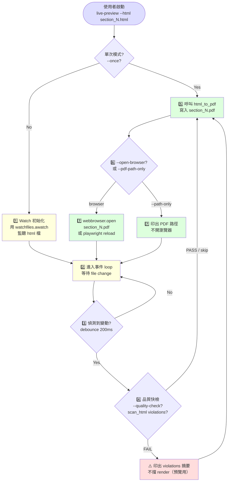

# live-preview — Report-master HTML 即時預覽 workflow

> **文件版本：v1.0** · 對應 SPEC.md v0.3 + SKILL.md v1.0 + `references/executor-base.md` v1 + `docs/shared-standards.md` v1
> **啟動時機**：Stage 2 完成後、Stage 3 之前；或 Stage 2 中「單節已寫入 HTML」後，使用者想看 PDF 效果
> **產出物**：`report_output/section_N.pdf`（每次 HTML 變動自動重新渲染）+ 瀏覽器/PDF viewer 開啟
> **輸入物**：`report_output/section_N.html`（Executor 輸出）

---

## 1. 角色定位

`live-preview` 是 Report-master 的「**單節 HTML 即時預覽**」workflow。Executor 寫出 `section_N.html` 後，使用者會想：

- **看排版效果**（字體、行距、章節編號、表格、圖）
- **微調內文後立刻看新效果**（改字、改行距、加段落）
- **避免反覆手動跑 `html_to_pdf.py`**（每次都重新指定命令很煩）

`live-preview` 把這個流程自動化：**偵測 HTML 變動 → 自動重新渲染 PDF → 通知瀏覽器或顯示路徑**。

### 1.1 何時啟動

| 觸發情境 | 啟動 |
|----------|------|
| Stage 2 跑完某一節，想看 PDF | ✅ `python -m scripts.live_preview --html report_output/section_1.html` |
| 微調 HTML 內容後想立刻刷新 | ✅（watch 模式自動偵測） |
| 只想產一次 PDF，不要 watch | ✅ `python -m scripts.live_preview --html ... --once` |
| Stage 3 batch 跑全部 PDF | ❌ 用 `html_to_pdf.py` 或 `report_gen.py`（`live-preview` 是單檔互動工具） |
| 想整合進 IDE 的 "preview on save" | ✅（`live-preview` CLI 可被外部工具呼叫） |

### 1.2 職責（會做）

- **Watch HTML 變動**（`watchfiles` library；fallback 到 `polling` 若無 watchfiles）
- **自動呼叫 `html_to_pdf.html_to_pdf()`** 重新渲染 PDF（同目錄；`<input>.pdf`）
- **單次渲染模式**（`--once`：不做 watch）
- **瀏覽器自動開啟 / 刷新**（`--open-browser` 用 `webbrowser.open`）
- **debounce**（避免快速連續存檔觸發多次 render；預設 200ms）
- **品質快檢**（`--quality-check`：呼叫 `quality_checker.scan_html` 預警，命中禁用清單就 warn）

### 1.3 非職責（不會做）

- ❌ 不跑 Stage 3 batch（那是 `report_gen.py` / `html_to_docx.py` 的工作）
- ❌ 不改 HTML 內容（純 read；改 HTML 是使用者的編輯器工作）
- ❌ 不跨節 watch（單節單檔；如需 watch 多檔，用 `*.html` glob 或多開 terminal）
- ❌ 不整合 PDF viewer 進程（用作業系統預設程式；用 `webbrowser.open()` 開）
- ❌ 不存 watch 狀態（重啟 = 從頭 watch；不持久化任何 state）

---

## 2. 角色互動邊界

```
       ┌─────────────┐
       │ 使用者編輯器 │ ← VSCode / Vim / 任何 text editor
       └──────┬──────┘
              ↓ write
       ┌──────────────────────────┐
       │ report_output/           │
       │   section_N.html         │ ← Executor 寫入
       └──────┬───────────────────┘
              ↓ file change event
       ┌─────────────────────┐
       │   live-preview      │ ← 本文件 (workflow)
       │   + live_preview.py │ ← CLI helper
       └──────┬──────────────┘
              ↓ render
       ┌─────────────────────┐
       │   html_to_pdf.py    │ ← Stage 3 渲染引擎（共用）
       └──────┬──────────────┘
              ↓ write PDF
       ┌─────────────────────┐
       │ report_output/      │
       │   section_N.pdf     │
       └──────┬──────────────┘
              ↓ open / reload
       ┌─────────────────────┐
       │  PDF viewer / Browser│
       └─────────────────────┘
```

**live-preview 對 Executor**：是下游 consumer；吃 Executor 寫的 HTML，產 PDF。
**live-preview 對 html_to_pdf**：是 thin wrapper；不重新發明渲染邏輯，直接呼叫 `html_to_pdf.html_to_pdf()`。
**live-preview 對使用者**：是「**省時間的便利工具**」；不走 quality gate（已在 Stage 2 過 gate 的 HTML 才有資格被 preview）。

---

## 3. 流程總覽（Mermaid）



**重點**：
- Watch loop 是無限迴圈，直到使用者 `Ctrl+C` 中斷
- Debounce 200ms 確保使用者連續存檔只觸發一次 render
- Quality check 是 **advisory**（不擋 render；只是提醒）

---

## 4. 階段細節

### 4.1 Stage — Watch 初始化

**目標**：用 `watchfiles` 監聽指定 HTML 檔（單檔 watch）。

**做法**：

```python
from watchfiles import awatch

async def _watch_loop(html_path: Path, on_change: Callable[[], None]):
    async for changes in awatch(html_path):
        for _change_type, changed_path in changes:
            if Path(changed_path).resolve() == html_path.resolve():
                on_change()
                break
```

**為什麼用 watchfiles？**
- 跨平台（Linux inotify / macOS FSEvents / Windows ReadDirectoryChangesW）
- 純 Rust 實作，低 CPU
- 已是 Report-master 既有 dependency（已加進 venv）

**Fallback**：若 `watchfiles` 未安裝，退回 `time.sleep` + `os.stat().st_mtime` polling（每 500ms 檢查一次）。

### 4.2 Stage — Debounce（去抖動）

**目標**：避免快速連續存檔觸發多次 render。

**做法**：

```python
import asyncio
from contextlib import asynccontextmanager

@asynccontextmanager
async def _debounced(delay_s: float = 0.2):
    """Async debounce context（多個變動事件合併為一個）。"""
    # ... 實作見 scripts/live_preview.py
    yield
```

**為什麼要 debounce？**
- VSCode 預設 "format on save" 會觸發 2-3 次 file change event
- 多 tab 同步存檔會有多次事件
- 200ms 是經驗值（既能合併，又讓使用者感覺「即時」）

### 4.3 Stage — Render（呼叫 html_to_pdf）

**目標**：呼叫 `html_to_pdf.html_to_pdf()` 把 HTML 渲染成 PDF。

**做法**：

```python
from scripts.html_to_pdf import html_to_pdf

def render_pdf(html_path: Path, output_pdf: Path, *, fonts_dir: Path = None) -> Path:
    return html_to_pdf(
        html_source=html_path,
        output_pdf=output_pdf,
        fonts_dir=fonts_dir,
    )
```

**PDF 輸出位置**：
- 預設：與 HTML 同目錄，檔名為 `<name>.pdf`（如 `report_output/section_1.html` → `report_output/section_1.pdf`）
- 可用 `--output` 覆蓋

### 4.4 Stage — Notify（通知）

**目標**：讓使用者知道 PDF 已重新生成。

**兩種模式**：

| 模式 | flag | 行為 |
|------|------|------|
| 印路徑 | `--path-only`（預設） | stdout 印 `✅ section_1.pdf written: /abs/path/...` |
| 開瀏覽器 | `--open-browser` | `webbrowser.open(file://...)`；若是 watch 模式，瀏覽器 tab 會 reload |
| Playwright 自動 reload | `--auto-reload`（TODO） | 用 playwright headless 開瀏覽器，PDF 重生時自動 `page.reload()` |

**為什麼預設不開瀏覽器？**
- 使用者可能想用不同的 PDF viewer（Adobe Acrobat / Preview / Okular）
- 開太多 browser tab 會干擾
- CI / 自動化情境不需要瀏覽器

### 4.5 Stage — Quality Check（可選）

**目標**：在 render 前對 HTML 做輕量品質掃描，命中禁用清單時 warn（不擋 render）。

**做法**：

```python
from scripts.quality_checker import scan_html

report = scan_html(html_text, source=str(html_path))
if not report.passed:
    print(f"⚠️  {len(report.violations)} violations（preview 仍會 render）")
    for v in report.violations:
        print(f"   - {v}")
```

**為什麼是 advisory 而非 blocking？**
- live-preview 是「**互動工具**」，目的是讓使用者快速看效果
- 若 quality FAIL 就擋，使用者無法在 watch 模式下「先壞再修」
- 預期 Stage 2 quality gate 已過，這裡只是「二次保險」

---

## 5. CLI：`scripts/live_preview.py`

> **S-M 等級**：S（單次渲染）~ M（watch loop + debounce + 多種通知模式）。
> 給終端機使用者 + IDE 整合 + main agent 觸發。

```bash
# Watch 模式（預設）：啟動監聽，HTML 變動就自動重 render
python -m scripts.live_preview --html report_output/section_1.html

# 單次渲染（不做 watch）
python -m scripts.live_preview --html report_output/section_1.html --once

# 指定 PDF 輸出路徑
python -m scripts.live_preview --html report_output/section_1.html --output /tmp/preview.pdf

# 自動開瀏覽器（每次 render 後 reload）
python -m scripts.live_preview --html report_output/section_1.html --open-browser

# 啟用品質快檢（命中禁用清單就 warn）
python -m scripts.live_preview --html report_output/section_1.html --quality-check

# 自訂 debounce 時間（預設 200ms）
python -m scripts.live_preview --html report_output/section_1.html --debounce-ms 500

# 用 polling 模式（fallback；若 watchfiles 未裝）
python -m scripts.live_preview --html report_output/section_1.html --polling
```

**輸出範例（watch 模式）**：

```
🔍 live-preview — Watch mode
   watching: /abs/path/report_output/section_1.html
   output:   /abs/path/report_output/section_1.pdf
   debounce: 200ms
   quality-check: off
   open-browser: off

⏳ 等待 HTML 變動...（Ctrl+C 結束）

[2026-06-13 14:30:01] change detected → rendering...
✅ PDF written: /abs/path/report_output/section_1.pdf (24.3 KB)
[2026-06-13 14:30:45] change detected → rendering...
✅ PDF written: /abs/path/report_output/section_1.pdf (24.5 KB)
^C

🛑 Watch 結束
```

**輸出範例（--once）**：

```
🔍 live-preview — Single render mode
   input:  /abs/path/report_output/section_1.html
   output: /abs/path/report_output/section_1.pdf

✅ PDF written: /abs/path/report_output/section_1.pdf (24.3 KB)
```

**Return code**：
- `0` = 成功（無論單次還是 watch；watch 模式下 Ctrl+C 也回 0）
- `1` = HTML 檔不存在 / 渲染失敗
- `2` = argument 解析失敗

---

## 6. 端到端範例

### 6.1 情境 A：微調章節字體後即時預覽

```bash
# Terminal 1: 啟動 live-preview
$ python -m scripts.live_preview --html report_output/section_1.html --open-browser
🔍 live-preview — Watch mode
   watching: report_output/section_1.html
   output:   report_output/section_1.pdf
   open-browser: on

⏳ 等待 HTML 變動...（Ctrl+C 結束）
✅ PDF written: report_output/section_1.pdf (24.3 KB)  ← 初始 render
```

```bash
# Terminal 2: 使用者用 VSCode 改字體 12pt → 14pt
# VSCode auto-save → 觸發 file change

# live-preview Terminal 1 自動反應：
[14:30:01] change detected → rendering...
✅ PDF written: report_output/section_1.pdf (24.5 KB)
[14:30:45] change detected → rendering...
✅ PDF written: report_output/section_1.pdf (24.6 KB)
```

瀏覽器 tab 自動 reload（若用 `--open-browser` + OS default PDF viewer）。

### 6.2 情境 B：CI 一次性預覽（驗證 PDF 產出）

```bash
# CI script: 跑完 Executor 後，做一次 PDF 預覽檢查
python -m scripts.live_preview --html report_output/section_1.html --once --quiet
# exit code 0 表示 PDF 產出成功
```

### 6.3 情境 C：IDE 整合（VSCode task）

```json
// .vscode/tasks.json
{
  "version": "2.0.0",
  "tasks": [
    {
      "label": "Preview PDF",
      "type": "shell",
      "command": ".venv/bin/python -m scripts.live_preview --html ${file} --open-browser",
      "problemMatcher": [],
      "presentation": { "reveal": "always" }
    }
  ]
}
```

### 6.4 情境 D：watchfiles 未安裝時的 polling fallback

```bash
$ python -m scripts.live_preview --html report_output/section_1.html --polling
🔍 live-preview — Polling mode (watchfiles 未安裝或要求 polling)
   watching: report_output/section_1.html
   output:   report_output/section_1.pdf
   poll interval: 500ms

⏳ 等待 HTML 變動...（Ctrl+C 結束）
```

---

## 7. 失敗 / 求助指引

| 症狀 | 原因 / 處理 |
|------|-------------|
| `FileNotFoundError: section_1.html` | HTML 不存在 → 先跑 `executor.py` 產出 HTML |
| `weasyprint not installed` | venv 缺 weasyprint → `.venv/bin/pip install weasyprint` |
| watchfiles ImportError | venv 缺 watchfiles → `.venv/bin/pip install watchfiles`（已加；fallback 到 polling） |
| 瀏覽器沒自動開啟 | `--open-browser` flag 沒加；或 OS 預設 PDF handler 未設 |
| 每次存檔都 render 兩次 | debounce 太短 → 加 `--debounce-ms 500` |
| quality check warn 太多 | HTML 命中禁用清單（flex / script / etc.）；建議回 Stage 2 修 |
| watch 模式 Ctrl+C 後沒乾淨退出 | asyncio loop 還在背景；用 `python -m scripts.live_preview` 啟動，主 process 會等 KeyboardInterrupt |
| PDF 大小變 0 KB | html_to_pdf 失敗；查 stderr 的 `PDFRenderError` |

---

## 8. 與其他 workflow / skill 的關係

| 檔案 | 關係 |
|------|------|
| `SKILL.md` | 主 workflow authority；Stage 2 結束後的 preview 引用本檔 |
| `references/executor-base.md` (T3-2) | 上游：Executor 寫 `section_N.html` 給 live-preview watch |
| `workflows/resume-execute.md` (T3-5) | 平行 workflow：resume 是「接續生成」，live-preview 是「已生成的即時看」 |
| `scripts/html_to_pdf.py` (T1-7) | 核心依賴：render 引擎（live-preview 不重新發明） |
| `scripts/quality_checker.py` (T1-8) | 可選依賴：`--quality-check` flag 呼叫 scan_html |
| `scripts/live_preview.py` (本檔 T3-7) | CLI 對應本 workflow |
| `docs/shared-standards.md` | HTML/CSS 子集；live-preview 不擋 quality，但建議遵守 |
| `scripts/executor.py` (T3-2) | 寫 HTML 的上游；live-preview 吃其輸出 |

---

## 9. 版本演進

| 版本 | 狀態 | 說明 |
|------|------|------|
| v1.0 | **current** | T3-7 完成；Watch + Debounce + Render + Notify + Quality advisory + polling fallback + browser 整合 |

**未來可能擴充**（不在本任務範圍）：
- `playwright` 自動 reload（取代 webbrowser）
- Watch 多檔 / glob 模式
- 整合 Live Server 風格的 HTTP endpoint
- PDF diff（before/after）顯示

---

*workflows/live-preview.md v1.0 — 對應 SPEC.md v0.3 + SKILL.md v1.0 + references/executor-base.md v1 + docs/shared-standards.md v1, 2026-06-13*