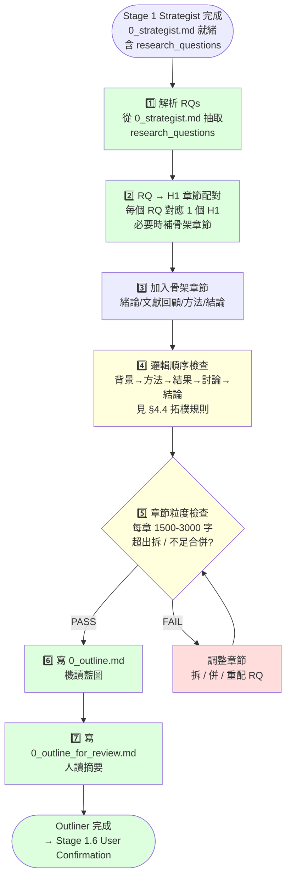

# phase-3-outliner — Report-master Stage 1.5 章節藍圖規劃者

> **文件版本：v1.0** · 對應 SPEC.md v0.3 + SKILL.md v1.0 + `workflows/strategist.md` v1.1 + `workflows/user-confirmation.md` v1 + `references/executor-base.md` v1.0
> **啟動時機**：Stage 1.5（Stage 1 Strategist 完成 10 Confirmations 收斂後、User Confirmation 之前）
> **產出物**：
>   1. `report_output/0_outline.md`（**機讀**，Section Blueprint——給 Executor / quality_checker / 統計章節數）
>   2. `report_output/0_outline_for_review.md`（**人讀**摘要，給使用者看——Problem 2 解）
> **輸入物**：`report_output/0_strategist.md`（含 RQ1…RQn 收斂結果）

> **本檔是 user-facing workflow；schema 細節見 §4。**

---

## 1. 角色定位

phase-3-outliner 是 Report-master 流程中的**獨立階段**，專門負責把 Strategist 收斂出的 **research questions (RQs)** 翻譯成一份**章節藍圖 (Section Blueprint)**：每章要有標題、層級、核心問題、所需資料類型、預估字數、以及與 RQ 的對應關係。

> **為什麼 Outliner 從 Strategist 拆出來？**
> 舊版 v1.0 把「藍圖規劃」塞在 Strategist 流程內，導致 Strategist 流程臃腫（450+ 行），且藍圖的責任邊界模糊（Strategist 該回答 10 個 confirmation，但章節順序檢查、章節數量控制、章節粒度統一等是另一種專業）。A1 重構把 Outliner 拆成獨立 workflow，各司其職：Strategist 收斂意圖 → Outliner 規劃章節 → User 確認 → Executor 執行。

### 1.1 何時啟動

| 觸發情境 | 啟動 |
|----------|------|
| Strategist 完成 10 Confirmations 並寫出 `report_output/0_strategist.md` | ✅ |
| 從 Stage 1.5 進入 User Confirmation 之前 | ✅ |
| 使用者在 User Confirmation 回「修改」 | ✅（Outliner 根據 notes 重新規劃） |
| `0_strategist.md` 缺失或 `research_questions[]` 為空 | ❌（BLOCKING，請回 Stage 1） |
| `0_confirmed.json` 已存在 | ❌（已確認，跳過 Outliner 直接進 Executor） |

### 1.2 職責（會做）

1. **解析 RQs**：從 `0_strategist.md` 抽取 `research_questions[]`（含 RQ id、question 文字、angle、priority）
2. **章節規劃**：對每個 RQ 配對 1 個 H1 章節；必要時新增「緒論 / 結論 / 文獻回顧」等骨架章節
3. **邏輯順序檢查**：用 §4.4 的拓樸規則驗證章節順序（背景→方法→結果→討論→結論）
4. **章節粒度統一**：每章預估字數在 1500–3000 字範圍內；超出自動拆 / 合併
5. **產出 0_outline.md**：機讀藍圖（給 Executor、quality_checker、citation_manager 解析）
6. **產出 0_outline_for_review.md**：人讀摘要（給 User 看，要 emoji 標記 ✅/❌）
7. **可選：CLI 觸發**：`scripts/outliner.py` 自動從 0_strategist.md 產出 outline（不需 LLM 互動）

### 1.3 非職責（不會做）

- ❌ 不回答 10 Confirmations（那是 Strategist 的工作）
- ❌ 不寫 HTML（Stage 2 Executor 才寫）
- ❌ 不跑 `web_search` 抓資料（那是 C1 topic-research 的工作）
- ❌ 不做 User Confirmation（那是 `workflows/user-confirmation.md` 的工作）
- ❌ 不修改 `report_lock.md`（鎖的產出仍是 Strategist 的責任）

---

## 2. 角色互動邊界（Outliner 在流程中的位置）

```
       ┌─────────────┐
       │   使用者    │
       └──────┬──────┘
              ↓ 10 個問題
       ┌─────────────────┐
       │   Strategist    │ ← workflows/strategist.md v1.1
       └──────┬──────────┘
              ↓ report_output/0_strategist.md
              ↓ (含 research_questions[] = RQ1…RQn)
       ┌─────────────────┐
       │ phase-3-outliner│ ← 本文件（Stage 1.5）
       └──────┬──────────┘
              ↓ report_output/0_outline.md
              ↓ report_output/0_outline_for_review.md
       ┌─────────────────┐
       │ 🔔 User Confirm │ ← workflows/user-confirmation.md v1
       └──────┬──────────┘
              ↓ report_output/0_confirmed.json
       ┌─────────────────┐
       │  Strategist     │ ← 補產 report_lock.md / spec / glossary
       └──────┬──────────┘
              ↓ report_lock.md
       ┌─────────────────┐
       │   Executor      │ ← references/executor-base.md
       └─────────────────┘
```

**Outliner 對 Strategist 是下游消費者**：吃 RQs 產章節藍圖。
**Outliner 對 User 是資訊提供者**：for_review 版本是給人看的「待確認項目」。
**Outliner 對 Executor 是上游契約**：Executor 讀 `0_outline.md` 知道每章要寫什麼。

---

## 3. 完整流程（Mermaid）



**關鍵節點**：
- **Order**（順序檢查）：BLOCKING 條件，違反拓樸規則需自動重排
- **Granularity**（粒度檢查）：WARN 級，預設 1500–3000 字，例外需記 `deviation_reason`

---

## 4. 產物 schema

### 4.1 輸入：`report_output/0_strategist.md` 結構

**Outliner 只關心以下欄位**（其他欄位如 `metadata` / `formatting` 由 Strategist 自己收斂）：

```yaml
# report_output/0_strategist.md（YAML frontmatter 或內嵌 ## 區塊）
metadata:
  title: "報告標題"
  type: "academic" | "business" | "spec" | "gov" | "custom"
  author: "..."
  date: "2026-06-13"
research_questions:
  - id: RQ1
    question: "生成式 AI 在 K-12 教育的採用率現況為何？"
    angle: "現況盤點"
    priority: high
    estimated_pages: 8
  - id: RQ2
    question: "對學習成效的實證影響為何？"
    angle: "實證研究"
    priority: high
    estimated_pages: 10
  - id: RQ3
    question: "主要風險與倫理爭議為何？"
    angle: "風險分析"
    priority: medium
    estimated_pages: 6
constraints:
  total_pages: "30-50"
  citation_style: "APA"
  language: "zh-TW"
```

**Outliner 必須處理的情境**：
- `research_questions[]` 為空 → BLOCKING（請回 Stage 1）
- `priority` 缺值 → 預設 `medium`
- `estimated_pages` 缺值 → 預設 5 頁
- 同一 RQ 出現兩次 → 自動 dedup，保留先出現的
- 角度（angle）重複（如 3 個 RQ 都是「現況盤點」）→ WARN，Outliner 會在配對階段自動錯開

### 4.2 輸出 A：`report_output/0_outline.md`（機讀）

```markdown
# Section Blueprint — {title}

> 對應 `workflows/phase-3-outliner.md` v1.0（Stage 1.5）
> 報告：{title}
> 作者：{author}
> 日期：{date}
> 總章節數：{N}
> 預估總頁數：{page_range}
> 來源：report_output/0_strategist.md

## 章節藍圖

### 第 1 章：{chapter_1_title}（H1）
- **目標**：本章要回答的核心問題（1-2 句）
- **預估字數**：~{N_words} 字
- **預估頁數**：~{N_pages} 頁
- **對應 RQ**：（無，作為開場）或 {rq_id}
- **核心子問題**：
  - {sub_q_1}
  - {sub_q_2}
  - {sub_q_3}
- **所需資料類型**：
  - {literature_review | empirical_data | case_study | expert_opinion | statistics | definition}
- **預期圖表**：Figure {X}, Table {Y}（可選）
- **預期引用密度**：{high | medium | low}
- **特殊元素**：{mermaid | katex | code_block}（可選）
- **備註**：{optional free text}

### 第 2 章：{chapter_2_title}（H1）
- **目標**：...
...

## 全域規劃

- **圖總數**：{fig_count}（Figure 1 ~ {fig_count}）
- **表總數**：{tbl_count}（Table 1 ~ {tbl_count}）
- **引用總數**：~{cite_count} 條
- **特殊元素**：{mermaid / katex / code_block}
- **預估總字數**：~{total_words} 字
- **預估完成時間**：~{hours} 小時
- **骨架章節**：{intorduction / literature_review / methodology / conclusion}
- **邏輯順序檢查**：✅ PASS（或 ❌ FAIL + 原因）

## 給 Executor 的提示

- 每節 prompt 會附本章「目標」與「核心子問題」作為約束
- mid-run 改 blueprint → 走 Stage 2.5（delta_checker → 單節重跑）
- 若 `0_outline_for_review.md` 使用者回覆修改，Outliner 重新產出（覆蓋）
```

**欄位對齊**（給下游工具用）：

| 欄位 | 給誰用 | 用途 |
|------|--------|------|
| `目標` / `核心子問題` | Executor prompt | 防止每節寫偏題 |
| `預估字數` / `預估頁數` | live-preview | 渲染時提醒長度 |
| `所需資料類型` | topic-research (C1) | 觸發 `web_search` 補資料 |
| `預期圖表` | Executor | 預先規劃 `assets/` 目錄 |
| `預期引用密度` | citation_manager | 決定 References 章節厚度 |
| `對應 RQ` | 主題檢查 | 防止「每章回答一樣的 RQ」 |

### 4.3 輸出 B：`report_output/0_outline_for_review.md`（人讀）

```markdown
# 🔔 Stage 1.5 章節藍圖確認請求 — 請檢視後回覆 OK / 修改

> 對應 `workflows/phase-3-outliner.md` v1.0 + `workflows/user-confirmation.md` v1
> 來源：0_strategist.md（共 {N} 個 RQs）
> 規劃時間：{timestamp}
> 確認前不會啟動 User Confirmation 與 Executor。

## 章節規劃總覽（{M} 章）

1. ✅ / ❌ 第 1 章：{title}（{words} 字，對應 RQ: {rq_id}）
2. ✅ / ❌ 第 2 章：{title}（{words} 字，對應 RQ: {rq_id}）
...
M. ✅ / ❌ 第 M 章：{title}（{words} 字，對應 RQ: {rq_id or 無}）

## 章節順序

1 → 2 → 3 → ... → M

## 邏輯順序檢查

✅ PASS（背景→方法→結果→討論→結論；骨架章節齊備）
或
❌ FAIL（具體原因 + 建議修正）

## 章節粒度檢查

✅ 全部在 1500-3000 字範圍內
或
⚠️ 例外章節：{chapter_N}（{words} 字，原因：{deviation_reason}）

## 全域統計

- 總章節數：{M}
- 總字數：~{total} 字
- 預估頁數：{pages} 頁
- 圖表數：{figs} 圖 + {tbls} 表
- 引用條目：~{cites} 條
- 特殊元素：{elements}

## RQ 對應檢查

| RQ | 對應章節 | 狀態 |
|----|---------|------|
| RQ1 | 第 2 章 | ✅ |
| RQ2 | 第 3 章 | ✅ |
| RQ3 | 第 4 章 | ✅ |
| （無）| 第 1 章 緒論 / 第 M 章 結論 | ✅（骨架） |

## 回覆方式

- **全部 OK**：回覆「OK」或「✅」
- **部分要修改**：列出要改的章節 + 改什麼
  - 例：「第 2 章併入第 3 章」「第 4 章改成兩章」
- **整體重來**：回覆「REDO」回到 Stage 1 Strategist

## 確認後

- Main agent 會把您的回覆寫入 `report_output/0_confirmed.json`
- 然後 Strategist 補產 `report_lock.md` / `report_spec.md` / `glossary.md`
- 最後 Stage 2 Executor 啟動
```

### 4.4 邏輯順序檢查（拓樸規則）

**章節順序必須符合以下優先級**（從前到後）：

| 優先級 | 類型 | 說明 |
|--------|------|------|
| 1 | `introduction` | 緒論 / 背景 / 動機 |
| 2 | `literature_review` | 文獻回顧 / 理論基礎 |
| 3 | `methodology` | 方法 / 研究設計（如適用） |
| 4 | `analysis` | 現況分析 / 案例探討 |
| 5 | `discussion` | 討論 / 風險 / 倫理 |
| 6 | `conclusion` | 結論 / 展望 |

**自動判定規則**（給 LLM / script 判斷章節類型）：

- 含「緒論 / 背景 / 動機 / introduction / overview」→ `introduction`
- 含「文獻 / theory / 理論 / review」→ `literature_review`
- 含「方法 / methodology / 研究設計 / 實驗設計」→ `methodology`
- 含「現況 / 案例 / 影響 / 實證 / empirical」→ `analysis`
- 含「討論 / 風險 / 倫理 / 反思 / 爭議 / 限制」→ `discussion`
- 含「結論 / 展望 / 結論與建議 / 結論與未來」→ `conclusion`

**檢查失敗的處理**：
- 連續兩個 `introduction` → 自動合併
- `conclusion` 排在 `introduction` 之前 → 自動重排
- 沒有任何 `introduction` 或 `conclusion` → WARN（提示需補骨架）
- 兩個 `methodology` → 合併或標記「研究方法 N」

### 4.5 章節粒度規則

| 規則 | 值 | 處理 |
|------|---|------|
| 每章預估字數下限 | 1500 字 | 不足 → 與相鄰章節合併 |
| 每章預估字數上限 | 3000 字 | 超出 → 拆分為 2 章 |
| 預設字數（無 RQ 給值） | 2000 字 | — |
| 例外允許最大 | 5000 字 | 需在 `deviation_reason` 解釋 |

**字數估算依據**（給 Outliner LLM 參考）：
- RQ 文字長度（每 50 字 RQ → 約 2000 字章節）
- `estimated_pages`（1 頁 ≈ 500 字）
- 角度（angle）複雜度（theory > case_study > statistics > overview）

---

## 5. CLI：`scripts/outliner.py`

```bash
# 自動從 0_strategist.md 產出 0_outline.md
python -m scripts.outliner \
  --strategist report_output/0_strategist.md \
  --output report_output/0_outline.md

# 同時產出 for_review 版本
python -m scripts.outliner \
  --strategist report_output/0_strategist.md \
  --output report_output/0_outline.md \
  --review report_output/0_outline_for_review.md

# 乾跑（只印規劃結果，不寫檔）
python -m scripts.outliner \
  --strategist report_output/0_strategist.md \
  --dry-run

# 驗證既有 outline（讀 0_outline.md 做 schema 檢查）
python -m scripts.outliner \
  --validate report_output/0_outline.md
```

**Return code**：
- `0` = 成功產出
- `2` = 輸入缺欄位（`research_questions` 為空）
- `3` = 章節數 > 10（先問用戶再繼續，見 planning/tasks.md 突發狀況）
- `4` = 章節順序檢查失敗（BLOCKING）

---

## 6. 範例 1：自然科學研究報告（學術論文 / academic）

### 6.1 輸入：0_strategist.md（RQs 摘要）

```yaml
metadata:
  title: "都市熱島效應對臺北市公共衛生之影響：以 2020-2025 為例"
  type: "academic"
  author: "研究團隊"
research_questions:
  - {id: RQ1, question: "臺北市近五年熱島強度變化趨勢為何？", angle: "現況量化", priority: high, estimated_pages: 8}
  - {id: RQ2, question: "熱暴露對老年族群的健康風險為何？", angle: "實證分析", priority: high, estimated_pages: 10}
  - {id: RQ3, question: "現行調適政策成效為何？", angle: "政策評估", priority: medium, estimated_pages: 6}
  - {id: RQ4, question: "未來氣候情境下的長期影響為何？", angle: "情境推估", priority: medium, estimated_pages: 6}
constraints:
  total_pages: "30-50"
  citation_style: "APA"
  language: "zh-TW"
```

### 6.2 輸出：0_outline.md（節錄）

```markdown
# Section Blueprint — 都市熱島效應對臺北市公共衛生之影響

> 總章節數：6
> 預估總頁數：35-45 頁
> 來源：report_output/0_strategist.md
> 規劃時間：2026-06-13 17:10

## 章節藍圖

### 第 1 章：緒論與研究背景（H1）
- **目標**：交代都市熱島效應的研究背景、動機、研究目的與章節安排
- **預估字數**：~1800 字
- **預估頁數**：~3 頁
- **對應 RQ**：（無，作為開場）
- **核心子問題**：
  - 都市熱島效應的全球趨勢
  - 臺北市的特殊地理與氣候條件
  - 研究問題與目的
- **所需資料類型**：literature_review, statistics
- **預期圖表**：Figure 1（全球都市熱島研究時序圖）
- **預期引用密度**：high
- **特殊元素**：mermaid（畫研究架構圖）
- **備註**：必含研究問題與假設

### 第 2 章：文獻回顧與理論基礎（H1）
- **目標**：回顧都市熱島與公共衛生相關文獻，建立理論框架
- **預估字數**：~2500 字
- **預估頁數**：~5 頁
- **對應 RQ**：（無，支撐後續章節）
- **核心子問題**：
  - 都市熱島形成機制
  - 熱暴露與健康風險的理論連結
  - 國內外相關研究比較
- **所需資料類型**：literature_review, expert_opinion
- **預期圖表**：Table 1（文獻彙整表）
- **預期引用密度**：high
- **特殊元素**：無

### 第 3 章：臺北市熱島強度時序分析（H1）
- **目標**：量化分析 2020-2025 臺北市熱島強度變化趨勢
- **預估字數**：~2800 字
- **預估頁數**：~6 頁
- **對應 RQ**：RQ1
- **核心子問題**：
  - 測站資料蒐集與清理
  - 都市與郊區溫差計算
  - 五年趨勢迴歸分析
  - 空間分布熱點圖
- **所需資料類型**：empirical_data, statistics
- **預期圖表**：Figure 2（時序圖）、Figure 3（空間熱點圖）、Table 2（測站基本資料）
- **預期引用密度**：medium
- **特殊元素**：mermaid（資料流圖）
- **備註**：需從中央氣象署下載原始測站資料

### 第 4 章：熱暴露對老年族群健康風險之實證分析（H1）
- **目標**：分析熱指數與老年族群急診就診、死亡率的相關性
- **預估字數**：~3000 字
- **預估頁數**：~7 頁
- **對應 RQ**：RQ2
- **核心子問題**：
  - 健康資料來源（健保資料庫、死亡登記）
  - 熱指數定義與暴露測量
  - 病例交叉研究設計
  - 風險比與劑量反應
- **所需資料類型**：empirical_data, statistics, case_study
- **預期圖表**：Figure 4（劑量反應曲線）、Table 3（風險比彙整）
- **預期引用密度**：high
- **特殊元素**：katex（統計模型公式）

### 第 5 章：調適政策評估與風險討論（H1）
- **目標**：評估現行熱危害調適政策成效，並討論研究限制與倫理議題
- **預估字數**：~2400 字
- **預估頁數**：~5 頁
- **對應 RQ**：RQ3
- **核心子問題**：
  - 臺北市現行熱危害政策盤點
  - 政策實施成效評估
  - 研究限制（資料侷限、推論範圍）
  - 公共衛生倫理議題
- **所需資料類型**：literature_review, expert_opinion, case_study
- **預期圖表**：Table 4（政策時序表）
- **預期引用密度**：medium
- **特殊元素**：無

### 第 6 章：結論與未來情境推估（H1）
- **目標**：總結研究發現，並推估未來氣候情境下的長期影響
- **預估字數**：~2200 字
- **預估頁數**：~4 頁
- **對應 RQ**：RQ4（情境推估）；並整合 RQ1-RQ3
- **核心子問題**：
  - 研究結論與政策建議
  - RCP 4.5 / RCP 8.5 情境推估
  - 研究限制與未來研究方向
- **所需資料類型**：statistics, expert_opinion
- **預期圖表**：Figure 5（情境推估圖）
- **預期引用密度**：medium
- **特殊元素**：mermaid（情境路徑圖）

## 全域規劃

- **圖總數**：5（Figure 1-5）
- **表總數**：4（Table 1-4）
- **引用總數**：~45 條
- **特殊元素**：mermaid（3 張）+ katex（1 處）
- **預估總字數**：~14700 字
- **預估完成時間**：~6 小時
- **骨架章節**：introduction（第 1 章）+ literature_review（第 2 章）+ conclusion（第 6 章）
- **邏輯順序檢查**：✅ PASS（背景→理論→分析 A→分析 B→政策→結論）

## 給 Executor 的提示

- 每節 prompt 注入「目標」+「核心子問題」+「對應 RQ」
- 第 3、4 章需要外部資料（測站、健保資料庫），先執行 C1 web_research
- mid-run 改 blueprint → Stage 2.5（delta_checker）
```

### 6.3 輸出：0_outline_for_review.md（節錄）

```markdown
# 🔔 Stage 1.5 章節藍圖確認請求 — 請檢視後回覆 OK / 修改

> 來源：0_strategist.md（共 4 個 RQs）
> 規劃時間：2026-06-13 17:10

## 章節規劃總覽（6 章）

1. ✅ 第 1 章：緒論與研究背景（1800 字）
2. ✅ 第 2 章：文獻回顧與理論基礎（2500 字）
3. ✅ 第 3 章：臺北市熱島強度時序分析（2800 字，RQ1）
4. ✅ 第 4 章：熱暴露對老年族群健康風險之實證分析（3000 字，RQ2）
5. ✅ 第 5 章：調適政策評估與風險討論（2400 字，RQ3）
6. ✅ 第 6 章：結論與未來情境推估（2200 字，RQ4）

## 章節順序

1 → 2 → 3 → 4 → 5 → 6

## 邏輯順序檢查

✅ PASS（背景→理論→分析 A→分析 B→政策→結論）

## 章節粒度檢查

✅ 全部在 1500-3000 字範圍內

## 全域統計

- 總章節數：6
- 總字數：~14700 字
- 預估頁數：35-45 頁
- 圖表數：5 圖 + 4 表
- 引用條目：~45 條
- 特殊元素：mermaid + katex

## RQ 對應檢查

| RQ | 對應章節 | 狀態 |
|----|---------|------|
| RQ1 | 第 3 章 | ✅ |
| RQ2 | 第 4 章 | ✅ |
| RQ3 | 第 5 章 | ✅ |
| RQ4 | 第 6 章 | ✅（情境推估）|
| （骨架）| 第 1、2、6 章 | ✅ |

## 回覆方式

- 全部 OK：回覆「OK」或「✅」
- 部分修改：例「第 4 章拆成兩章」「第 5 章與第 6 章合併」
- 整體重來：回覆「REDO」
```

---

## 7. 範例 2：技術報告（技術規格 / spec）

### 7.1 輸入：0_strategist.md（RQs 摘要）

```yaml
metadata:
  title: "微服務 API 閘道升級至 Kubernetes 之技術評估報告"
  type: "spec"
  author: "基礎架構組"
research_questions:
  - {id: RQ1, question: "現行 API 閘道的痛點與瓶頸為何？", angle: "現況診斷", priority: high, estimated_pages: 4}
  - {id: RQ2, question: "Kubernetes 部署方案的可行選項有哪些？", angle: "方案比較", priority: high, estimated_pages: 8}
  - {id: RQ3, question: "遷移過程的風險與緩解措施為何？", angle: "風險管理", priority: high, estimated_pages: 6}
  - {id: RQ4, question: "預期效益與成本評估為何？", angle: "成本效益", priority: medium, estimated_pages: 5}
constraints:
  total_pages: "25-35"
  citation_style: "IEEE"
  language: "zh-TW"
```

### 7.2 輸出：0_outline.md（節錄）

```markdown
# Section Blueprint — 微服務 API 閘道升級至 Kubernetes 之技術評估報告

> 總章節數：6
> 預估總頁數：28-35 頁
> 來源：report_output/0_strategist.md
> 規劃時間：2026-06-13 17:20

## 章節藍圖

### 第 1 章：執行摘要（H1）
- **目標**：一頁總結現況、方案、建議，給決策者快速閱讀
- **預估字數**：~1500 字
- **預估頁數**：~2 頁
- **對應 RQ**：（無，整合所有 RQ）
- **核心子問題**：
  - 現況痛點一句話
  - 推薦方案一句話
  - 預期效益一句話
- **所需資料類型**：overview
- **預期圖表**：無
- **預期引用密度**：low
- **特殊元素**：無

### 第 2 章：現況系統診斷（H1）
- **目標**：量化現行 API 閘道的瓶頸（throughput、latency、error rate、維運負擔）
- **預估字數**：~2200 字
- **預估頁數**：~4 頁
- **對應 RQ**：RQ1
- **核心子問題**：
  - 現行架構圖
  - 關鍵指標 baseline
  - 已知 incident
- **所需資料類型**：empirical_data, statistics
- **預期圖表**：Figure 1（架構圖）、Table 1（指標彙整）
- **預期引用密度**：low
- **特殊元素**：mermaid（架構圖）

### 第 3 章：候選方案比較（H1）
- **目標**：比較三種 Kubernetes 部署方案（in-house / managed / hybrid）
- **預估字數**：~2800 字
- **預估頁數**：~6 頁
- **對應 RQ**：RQ2
- **核心子問題**：
  - 方案 A 概述
  - 方案 B 概述
  - 方案 C 概述
  - 多維度評分表
- **所需資料類型**：case_study, expert_opinion
- **預期圖表**：Table 2（多維度評分表）、Figure 2（部署拓樸圖）
- **預期引用密度**：medium
- **特殊元素**：mermaid（部署拓樸）
- **備註**：每方案需含 1 個業界案例

### 第 4 章：遷移風險與緩解措施（H1）
- **目標**：識別遷移過程的技術與組織風險，並給出具體緩解措施
- **預估字數**：~2400 字
- **預估頁數**：~5 頁
- **對應 RQ**：RQ3
- **核心子問題**：
  - 技術風險（rollback、data migration、zero-downtime）
  - 組織風險（人員 skill、on-call 輪值）
  - 緩解措施矩陣
- **所需資料類型**：case_study, expert_opinion
- **預期圖表**：Table 3（風險矩陣）
- **預期引用密度**：medium
- **特殊元素**：無

### 第 5 章：成本效益評估（H1）
- **目標**：量化 TCO 與預期效益（throughput、latency、維運人力）
- **預估字數**：~2000 字
- **預估頁數**：~4 頁
- **對應 RQ**：RQ4
- **核心子問題**：
  - 3 年 TCO 拆解（infra + 人力 + 訓練）
  - 預期 throughput / latency 改善
  - ROI 計算
- **所需資料類型**：statistics, empirical_data
- **預期圖表**：Table 4（TCO 拆解）、Figure 3（成本趨勢圖）
- **預期引用密度**：low
- **特殊元素**：無

### 第 6 章：結論與行動建議（H1）
- **目標**：總結方案選擇並列出 90 天行動計畫
- **預估字數**：~1800 字
- **預估頁數**：~3 頁
- **對應 RQ**：（無，整合）
- **核心子問題**：
  - 推薦方案（含理由）
  - 90 天行動計畫
  - 後續追蹤指標
- **所需資料類型**：overview
- **預期圖表**：Figure 4（行動計畫甘特圖）
- **預期引用密度**：low
- **特殊元素**：mermaid（甘特圖）

## 全域規劃

- **圖總數**：4（Figure 1-4）
- **表總數**：4（Table 1-4）
- **引用總數**：~15 條
- **特殊元素**：mermaid（3 張）
- **預估總字數**：~12700 字
- **預估完成時間**：~4 小時
- **骨架章節**：overview（第 1 章）+ conclusion（第 6 章）
- **邏輯順序檢查**：✅ PASS（摘要→現況→方案→風險→成本→結論）

## 給 Executor 的提示

- 技術報告，重視圖表與矩陣
- 每節 prompt 注入「目標」+「核心子問題」+「對應 RQ」
- mid-run 改 blueprint → Stage 2.5（delta_checker）
```

### 7.3 輸出：0_outline_for_review.md（節錄）

```markdown
# 🔔 Stage 1.5 章節藍圖確認請求 — 請檢視後回覆 OK / 修改

> 來源：0_strategist.md（共 4 個 RQs）
> 規劃時間：2026-06-13 17:20

## 章節規劃總覽（6 章）

1. ✅ 第 1 章：執行摘要（1500 字）
2. ✅ 第 2 章：現況系統診斷（2200 字，RQ1）
3. ✅ 第 3 章：候選方案比較（2800 字，RQ2）
4. ✅ 第 4 章：遷移風險與緩解措施（2400 字，RQ3）
5. ✅ 第 5 章：成本效益評估（2000 字，RQ4）
6. ✅ 第 6 章：結論與行動建議（1800 字）

## 章節順序

1 → 2 → 3 → 4 → 5 → 6

## 邏輯順序檢查

✅ PASS（摘要→現況→方案→風險→成本→結論）

## 章節粒度檢查

⚠️ 例外章節：第 1 章 執行摘要（1500 字，原因：技術報告首章習慣簡潔）
其餘 5 章在 1800-2800 字範圍內

## 全域統計

- 總章節數：6
- 總字數：~12700 字
- 預估頁數：28-35 頁
- 圖表數：4 圖 + 4 表
- 引用條目：~15 條
- 特殊元素：mermaid

## RQ 對應檢查

| RQ | 對應章節 | 狀態 |
|----|---------|------|
| RQ1 | 第 2 章 | ✅ |
| RQ2 | 第 3 章 | ✅ |
| RQ3 | 第 4 章 | ✅ |
| RQ4 | 第 5 章 | ✅ |
| （骨架）| 第 1、6 章 | ✅ |

## 回覆方式

- 全部 OK：回覆「OK」或「✅」
- 部分修改：例「第 3 章多列一個方案 D」「第 1 章擴充到 2000 字」
- 整體重來：回覆「REDO」
```

---

## 8. 失敗 / 求助指引

| 症狀 | 原因 / 處理 |
|------|-------------|
| `0_strategist.md` 缺 `research_questions` | BLOCKING；請回 Stage 1 Strategist 補欄位 |
| RQs 數量 < 3 | BLOCKING；深度不足，請回 Stage 1 重做 |
| 章節數 > 10 | 見 `planning/tasks.md` 突發狀況；先問用戶「章節數是否太多？」再繼續 |
| 順序檢查 FAIL | 自動重排一次；仍 FAIL 寫 `errors[]` 給 Strategist |
| 粒度超出 5000 字 | 自動拆 2 章；拆完仍超 → BLOCKING |
| `0_outline.md` 寫入失敗 | 檢查 `report_output/` 目錄權限 |
| LLM 配對出 2 個 RQ 給同一章 | 自動合併 RQ 文字、標記 `merged_from: [RQ1, RQ2]` |
| 使用者在 User Confirmation 回「修改」 | 重新啟動 Outliner（用 notes 重新配對） |
| 與 `report_lock.md` 衝突 | BLOCKING；Strategist 必須以 outline 為 source of truth 重產 lock |

---

## 9. 與其他 workflow / 檔案的關係

| 檔案 | 關係 |
|------|------|
| `workflows/strategist.md` v1.1 | **上游**：產出 `0_strategist.md`（含 RQs）給 Outliner |
| `workflows/user-confirmation.md` v1 | **下游**：讀 `0_outline_for_review.md` 跟使用者確認 |
| `references/executor-base.md` v1.0 | **遠端下游**：讀 `0_outline.md` 取得每章「目標」「核心子問題」 |
| `workflows/topic-research.md` v1.1 | **平行支線**：吃 `0_outline.md` 的「所需資料類型」決定要不要 `web_search` |
| `scripts/outliner.py` v1.0 | CLI 對應；可獨立執行產 outline |
| `scripts/strategist.py` | 從範本產生 lock；不直接呼叫 outliner |
| `scripts/quality_checker.py` | 驗證 `0_outline.md` 結構（章節欄位齊備） |

---

## 10. 版本演進

| 版本 | 狀態 | 說明 |
|------|------|------|
| v1.0 | **current** | A1 完成；獨立 workflow + Mermaid + 自然科學 + 技術報告 2 個範例 + CLI |

---

*workflows/phase-3-outliner.md v1.0 — 對應 SPEC.md v0.3 + SKILL.md v1.0 + workflows/strategist.md v1.1 + workflows/user-confirmation.md v1, 2026-06-13*
