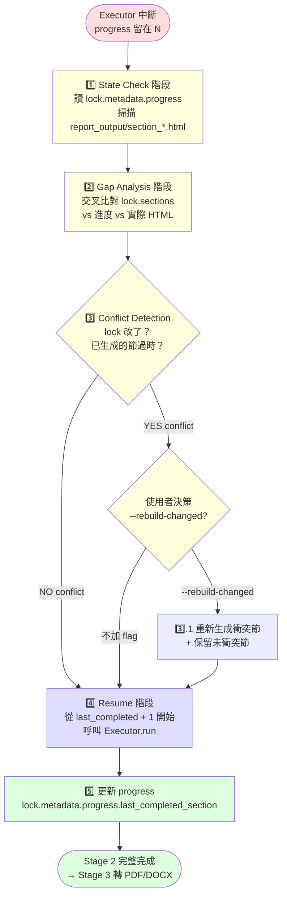

# resume-execute — Report-master 斷點續傳 workflow

> **文件版本：v1.0** · 對應 SPEC.md v0.3 + SKILL.md v1.0 + `references/executor-base.md` v1 + `docs/report_lock_schema.md` v1
> **啟動時機**：Stage 2 進行中、Executor 任意一節尚未完成就中斷（OOM / network drop / user `Ctrl+C` / crash / lock 改動 / 系統 reboot）
> **產出物**：`report_output/section_N.html` × 補完剩餘節；`lock.metadata.progress` 自動更新
> **輸入物**：`report_lock.md`（含 `metadata.progress` 殘留）+ `report_output/section_*.html`（已完成的 HTML 檔）

---

## 1. 何時使用本 workflow

| 中斷情境 | 症狀 | 啟動 resume-execute？ |
|----------|------|----------------------|
| Executor 跑到第 3 節時 OOM kill | `lock.metadata.progress.current_section=2`、`section_1.html` 與 `section_2.html` 存在、`section_3.html` 缺 | ✅ |
| 網路瞬斷，LLM 呼叫 timeout 拋出例外 | progress 還沒寫回 → 下次啟動從頭跑 | ✅（會自動從頭，因為 progress 沒寫） |
| 使用者按 `Ctrl+C` 中斷 | progress 寫到目前完成節 | ✅（從 N+1 接續） |
| 跑完一輪，發現 lock 內容需要修改（如改了標題、字體、加章節） | 前 N 節的 HTML 跟新 lock 不合 | ⚠️ 視情況，搭配 `--rebuild-changed` |
| 整份 `report_output/` 被刪了 | 沒有任何 HTML 殘留 | ❌ 直接 `executor --restart` |
| Stage 1 還沒產出 lock | `report_lock.md` 不存在 | ❌ 回去 Stage 1 |

**一句話判斷**：
- **有 lock + 有 progress + 有部分 section HTML** → 用 resume-execute
- **有 lock + 沒 progress** → 第一次跑（直接用 `executor`）
- **沒 lock** → 回去 Stage 1

> **設計初衷**：LLM 呼叫慢、單節可能 30-90 秒，整份 10 節報告可能跑 10-20 分鐘。
> 中途任何中斷（OOM / Ctrl+C / API quota）都會浪費 5-15 分鐘的 LLM 進度。
> 自動接續（斷點續傳）讓中斷變成「**暫停**」而不是「**重來**」。

---

## 2. 與其他角色的互動邊界

```
       ┌─────────────┐
       │   使用者    │  ← 「幫我從斷點接著跑」
       └──────┬──────┘
              ↓
       ┌─────────────────────┐
       │  resume-execute     │ ← 本文件（workflow）
       │  + resume_helper.py │ ← CLI helper
       └──────┬──────────────┘
              ↓ 偵測 / 分析 / 決策
       ┌─────────────┐
       │   Executor  │ ← references/executor-base.md + scripts/executor.py
       └──────┬──────┘
              ↓ per-section HTML
       ┌─────────────┐
       │ quality_chk │ ← scripts/quality_checker.py
       └──────┬──────┘
              ↓ PASS
       ┌─────────────┐
       │   Stage 3   │ ← html_to_pdf + html_to_docx
       └─────────────┘
```

**resume-execute 對 Executor 是 wrapper**：
- 讀 `lock.metadata.progress` + 對 `report_output/` 做 gap analysis
- 決定「從第幾節開始」、「哪些節要重建」、「哪些節已完整」
- 把決策交給 Executor 執行（不重複 Executor 邏輯）

**resume-execute 對使用者是「保險」**：
- 預設是「safe mode」：只補缺、只重建確認過時的、不動已完成且 lock 沒改的節
- `--dry-run` 是「先看會做什麼、再決定要不要跑」

---

## 3. 流程總覽（Mermaid）



---

## 4. 階段細節

### 4.1 Stage — State Check（狀態檢查）

**目標**：找出「真正完成到第幾節」——以 `lock.metadata.progress` + `report_output/section_*.html` 為雙重證據。

**做法**：

1. **讀 lock**：`python -m scripts.report_lock validate <lock>` 確認 lock 還合法
2. **讀 progress**：`data["metadata"]["progress"]`（可能不存在 / 可能部分存在 / 可能 `status="completed"`）
3. **掃描 output dir**：`output_dir.glob("section_*.html")` 列出實際存在的 HTML

**3 種狀態**：

| 情境 | progress | 實際 HTML | 行為 |
|------|----------|-----------|------|
| 從未跑過 | 缺 / 空 | 全部缺 | 從 section 1 開始（不視為 resume） |
| 跑到第 2 節 | `current_section=2`, `completed=[1,2]` | section_1 / section_2 存在 | 從 section 3 開始 |
| 跑到第 2 節、但 section_2 缺 | `current_section=2`, `completed=[1,2]` | 只有 section_1 | 從 section 2 開始（**progress 與 disk 不一致**） |
| 已完成 | `status="completed"` | 全部存在 | 跳過 Stage 2，直接到 Stage 3 |
| 跑到第 2 節、但 section_3 跑壞 | `current_section=2` | section_1/2 存在、section_3 存在但壞 | 從 section 3 重新跑 |

**BLOCKING 條件**：
- progress 寫到第 N 節，但 disk 沒有 `section_N.html` → progress 與 disk 不一致，預設從 progress + 1 開始
- lock 改了（hash 變了）→ 觸發 conflict detection（見 §4.3）

---

### 4.2 Stage — Gap Analysis（缺口分析）

**目標**：把 `lock.sections[]` 跟「實際可用的 HTML」比對，產出 3 個 list：

- `missing` = `lock.sections` 有，但 `report_output/` 沒 HTML
- `present` = 兩邊都有
- `stale` = HTML 存在，但比對過後發現**可能過時**（lock hash 變了 / 該節 lock 內容被改）

**最小可用的判斷式**：

```python
from pathlib import Path

def gap_analysis(lock: dict, output_dir: Path) -> dict:
    missing = []
    present = []
    for i, sec in enumerate(lock.get("sections", []), 1):
        sec_path = output_dir / Path(sec.get("path") or f"section_{i}.html").name
        if sec_path.exists() and sec_path.stat().st_size > 0:
            present.append(i)
        else:
            missing.append(i)
    return {"missing": missing, "present": present}
```

**設計決策**：
- 預設不做「內容 hash 比對」（太貴，且 quality_checker 會再 catch）
- 只用「檔案存在 + 大小 > 0」當作「存在」證據
- 使用者若要嚴格比對，加 `--strict` flag

**BLOCKING 條件**：
- `missing = []` 且 `present = 全 sections` → 沒事可做；直接印「已完整」
- `missing = 全 sections` → 視為「首次跑」，從第 1 節開始
- `missing = [3, 5]` → 從第 3 節開始連續跑到 5（不跳著跑——保證敘事連貫）

---

### 4.3 Stage — Conflict Resolution（衝突解決）

**目標**：當 lock 在中途被改過，前 N 節的 HTML 可能跟新 lock 不合。提供安全選項。

**lock hash 比對**：

```python
import hashlib

def lock_signature(lock: dict) -> str:
    """用「會影響內容呈現」的欄位算 fingerprint。"""
    keys = ("citation_style", "language_variant", "line_spacing",
            "fonts", "formatting")
    blob = yaml.safe_dump({k: lock.get(k) for k in keys},
                          allow_unicode=True, sort_keys=True)
    return hashlib.sha256(blob.encode("utf-8")).hexdigest()[:12]
```

**lock signature 應存在 `metadata.lock_signature` 欄位**（Executor 完成最後一節時寫入）。
resume 時若 progress 沒有 signature，或 signature 跟現在 lock 算出來的不同 → **視為 lock 改過**。

**衝突解決策略**：

| 情境 | 預設行為 | 加 `--rebuild-changed` |
|------|----------|-----------------------|
| lock 改了、已生成的節已存在 | 保留（信任舊 HTML 仍可讀） | 重新生成「會被 lock 改動影響」的節（formatting / citation） |
| lock 改了、新加章節 | 從新章節開始（保留舊 HTML） | 同左 |
| lock 改了、刪章節 | 跳過被刪的節 | 同左 |

**實作策略**：
- 「會被 lock 改動影響」的節 = 全部已存在的節（保守策略：lock 改了就全重建）
- 「只想 rebuild 跟 lock diff 有關的節」= 比對 section-level diff（保留 unchanged 的；TODO T3-6 delta_checker）

> **MVP 策略**：resume_helper.py 預設 `rebuild_changed=False`（只補缺）；加 flag 才重建。

---

### 4.4 Stage — Resume（接續執行）

**目標**：呼叫 `Executor` 從 `last_completed + 1` 開始逐節生成。

**做法**：

```python
from scripts.executor import Executor
from scripts.report_lock import read_lock_with_body, write_lock

# 1. 讀 lock
data, body = read_lock_with_body(lock_path)

# 2. 決定起點
progress = data.get("metadata", {}).get("progress", {})
start = max(progress.get("completed_sections") or [0]) + 1

# 3. 呼叫 Executor
exe = Executor(lock_path, output_dir=output_dir)
result = exe.run()  # 會自動讀 progress，從 start 開始
```

**Executor.run() 的 auto-resume 邏輯**（見 `references/executor-base.md` §4）：

```python
def _start_section(self, restart: bool) -> int:
    if restart:
        return 1
    progress = self.lock_data.get("metadata", {}).get("progress", {})
    completed = progress.get("completed_sections", [])
    if completed:
        return max(completed) + 1
    return progress.get("current_section", 0) + 1
```

**所以 resume_helper.py 只需決定 progress 該怎麼補 / 該怎麼改，呼叫 Executor 即可**。

---

### 4.5 Stage — Progress 持久化

**做法**：

每跑完一節，Executor 自己會把 `metadata.progress` 寫回 lock（見 `references/executor-base.md` §3.8）。
resume_helper.py 不需要再寫一次——只需在 resume 開始前，**先把 progress 校正到一致**：

```python
# 校正：若 progress 寫 2 但 section_2.html 不存在，把 progress 倒回 1
disk_completed = []
for i, sec in enumerate(lock["sections"], 1):
    sec_path = output_dir / f"section_{i}.html"
    if sec_path.exists() and sec_path.stat().st_size > 0:
        disk_completed.append(i)
# disk_completed 才是真的；progress 只是 hint
```

> **校正規則**：disk 為準、progress 為 hint。
> 若 disk 顯示只完成到 2，progress 寫 3 → 把 progress 倒回 2，告訴 Executor 從 3 開始。
> 若 disk 顯示完成 3 個，但 progress 說 2 → 把 progress 補到 3（disk 比 progress 領先，這是「使用者手動生成了 section 3」情境）。

---

## 5. CLI：`scripts/resume_helper.py`

> **S-M 等級**：S（純查詢 CLI）~ M（有 resume 邏輯 + 整合 Executor）。
> 給 Stage 2 在中斷後，由使用者或 main agent 呼叫。

```bash
# 查詢 resume 狀態（無副作用；純讀）
python -m scripts.resume_helper --lock report_lock.md

# 顯示接下來會做什麼（不實際執行）
python -m scripts.resume_helper --lock report_lock.md --dry-run

# 實際執行 resume（從 last_completed + 1 開始）
python -m scripts.resume_helper --lock report_lock.md --run

# 衝突時重建（lock 改了就重跑已存在的節）
python -m scripts.resume_helper --lock report_lock.md --run --rebuild-changed

# 指定輸出目錄
python -m scripts.resume_helper --lock report_lock.md --output report_output/ --dry-run
```

**輸出範例（dry-run）**：

```
🔍 Resume Helper — 狀態檢查
   lock: report_lock.md
   output_dir: report_output/

📊 進度摘要：
   lock.metadata.progress: current_section=2, completed_sections=[1, 2]
   disk state: section_1.html ✓, section_2.html ✓, section_3.html ✗, ...

🔎 Gap Analysis：
   ✓ present:  [1, 2]
   ✗ missing:  [3, 4, 5]
   ⚠ stale:    []

🚦 Conflict Detection：
   lock signature:  a1b2c3d4e5f6
   progress signature: （不存在）
   → lock 改過？ 否（progress 沒簽名，視為首次跑 resume）

📋 計畫：
   next start:  section 3
   will run:    [3, 4, 5]  (3 節)
   will skip:   [1, 2]     (2 節已存在)
   rebuild_changed: False

💡 跑 resume（取消 --dry-run 即可）：
   python -m scripts.resume_helper --lock report_lock.md --run
```

**Return code**：
- `0` = 成功（無論 dry-run 還是實際 run）
- `1` = lock 缺欄位 / 檔案不存在
- `2` = 衝突需要使用者決策（且沒加 `--rebuild-changed` 也沒加 `--force`）
- `3` = quality gate FAIL（給 main agent 觸發 Executor 重新跑）

---

## 6. 端到端範例（fictional）

> 跑完一次 resume-execute 的虛構情境。lock 為示意，actual 狀態由 Executor 與 resume_helper 算出。

**情境**：跑 5 章的報告，到第 2 章完成時機器 OOM。lock 的 progress 還在 section 2，使用者重啟後想接續。

**Step 1 — 觀察中斷現場**：
```bash
$ ls report_output/
section_1.html  section_2.html

$ grep -A5 "progress:" report_lock.md
metadata:
  progress:
    current_section: 2
    total_sections: 5
    completed_sections: [1, 2]
    last_updated: 2026-06-13T13:30:00
    status: in_progress
```

**Step 2 — 跑 resume_helper 看狀態**：
```bash
$ python -m scripts.resume_helper --lock report_lock.md
🔍 Resume Helper — 狀態檢查
   lock: report_lock.md
   output_dir: report_output/

📊 進度摘要：
   lock.metadata.progress: current_section=2, completed_sections=[1, 2]
   disk state: section_1.html ✓, section_2.html ✓, section_3.html ✗, section_4.html ✗, section_5.html ✗

🔎 Gap Analysis：
   ✓ present:  [1, 2]
   ✗ missing:  [3, 4, 5]
   ⚠ stale:    []

🚦 Conflict Detection：
   lock signature:  （progress 沒簽名）
   → 不視為衝突

📋 計畫：
   next start:  section 3
   will run:    [3, 4, 5]  (3 節)
   will skip:   [1, 2]
   rebuild_changed: False
```

**Step 3 — dry-run 確認計畫**：
```bash
$ python -m scripts.resume_helper --lock report_lock.md --dry-run
...（同上輸出，但標題改 "DRY RUN — 不會實際執行"）...
next start:  section 3
will run:    [3, 4, 5]  (3 節)
will skip:   [1, 2]     (2 節已存在)
```

**Step 4 — 實際跑 resume**：
```bash
$ python -m scripts.resume_helper --lock report_lock.md --run

🚀 Resume — 開始接續
   從 section 3 開始，跑 3 節

✅ [3/5] 第三章 方法論 — 12.4 KB, quality PASS
✅ [4/5] 第四章 結果 — 14.1 KB, quality PASS
✅ [5/5] 第五章 結論與建議 — 10.8 KB, quality PASS

🎉 Stage 2 完成
   completed: [1, 2, 3, 4, 5]
   progress 寫入 lock ✅
   → 可跑 Stage 3: python -m scripts.report_gen render
```

**Step 5 — 衝突情境（lock 改動過）**：
```bash
# 假設中途使用者改了 lock（把 line_spacing 從 1.5 改 2.0）
$ python -m scripts.resume_helper --lock report_lock.md --run
🚦 Conflict Detection：
   lock signature:  ff9988aac1d2
   progress signature: 2b4e6a8c1234  ← 不符！
   → lock 在 resume 之間被改過

⚠️ 衝突策略：
   預設：保留已存在的 section_1.html / section_2.html（信任舊 HTML）
   加 --rebuild-changed：會重跑已存在的節（套用新 lock 設定）

請明確決策：加 --rebuild-changed 重跑，或保留舊 HTML 直接補缺的節
```

**Step 6 — 加 flag 重建**：
```bash
$ python -m scripts.resume_helper --lock report_lock.md --run --rebuild-changed

🚀 Resume — 從頭重建 + 接續
   衝突偵測：lock signature 不一致
   rebuild_changed=True → 重跑所有節

   跑: [1, 2, 3, 4, 5]  (5 節全跑)

✅ [1/5] 第一章 緒論 — 11.2 KB, quality PASS
✅ [2/5] 第二章 文獻探討 — 13.7 KB, quality PASS
✅ [3/5] 第三章 方法論 — 12.4 KB, quality PASS
✅ [4/5] 第四章 結果 — 14.1 KB, quality PASS
✅ [5/5] 第五章 結論與建議 — 10.8 KB, quality PASS

🎉 Stage 2 完成（lock 改動已套用）
```

---

## 7. 失敗 / 求助指引

| 症狀 | 原因 / 處理 |
|------|-------------|
| `LockMissingFieldsError` | lock 缺 required 欄位 → 回去 Stage 1 補 |
| `LockFormatError: 找不到 frontmatter` | lock 損壞 → 用 git 回滾或從 backup 還原 |
| resume 後 section_N 沒生成 | quality gate FAIL 整節被擋；查 `lock.metadata.errors[]` |
| disk 與 progress 不一致 | 預設信任 disk；用 `--restart` 強制從頭，或用 git 還原 HTML |
| lock signature 衝突但不想重建 | 確認 lock 改的只是「不影響 HTML」欄位（如 `metadata.abstract`）→ 保留舊 HTML 是 OK 的 |
| Executor 整支跑完但 progress 沒寫 | disk 中斷在寫 lock 的瞬間 → 重新跑 resume，disk 為準會校正回來 |
| `--rebuild-changed` 跑太久 | 加 `--section 1,3` 只重建指定節 |
| resume_helper 找不到 report_output/ | 用 `--output <path>` 指定 |

---

## 8. 與其他 workflow / skill 的關係

| 檔案 | 關係 |
|------|------|
| `SKILL.md` | 主 workflow authority；Stage 2 中斷情境引用本檔 |
| `references/executor-base.md` (T3-2) | 下游 / 基礎：Executor 內建 `auto-resume` 從 progress 接續；本 workflow 是它的 wrapper + gap analysis |
| `workflows/topic-research.md` (T3-3) | 上游：產出 lock 給 Stage 2 |
| `scripts/resume_helper.py` (T3-5) | CLI 對應本 workflow |
| `scripts/executor.py` (T3-2) | 內部 import；執行實際逐節生成 |
| `scripts/report_lock.py` | 讀寫 lock + progress |
| `scripts/quality_checker.py` | per-section gate（BLOCKING） |
| `scripts/delta_checker.py` (TODO T3-6) | 未來可加 section-level diff，給 `--rebuild-changed` 更精準的判斷 |
| `docs/report_lock_schema.md` | lock schema；17 required 欄位 + `metadata.progress` |
| `docs/shared-standards.md` | HTML/CSS 子集；resume 跑出來的 HTML 仍須遵守 |

---

## 9. 版本演進

| 版本 | 狀態 | 說明 |
|------|------|------|
| v1.0 | **current** | T3-5 完成；3 階段（State Check → Gap Analysis → Resume）+ Conflict Resolution + CLI helper `scripts/resume_helper.py` + 端到端範例（含 lock 衝突情境） |

---

*workflows/resume-execute.md v1.0 — 對應 SPEC.md v0.3 + SKILL.md v1.0 + references/executor-base.md v1, 2026-06-13*
