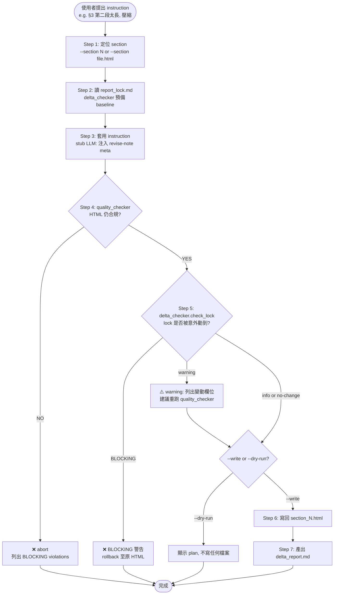

# revise — Report-master Stage 2.5 局部修訂 workflow

> **文件版本：v1.0** · 對應 SPEC.md v0.3 + SKILL.md v1.0 + `references/executor-base.md` v1 + `docs/shared-standards.md` v1 + `docs/report_lock_schema.md` v1
> **啟動時機**：Stage 2 已完成，使用者想對特定節做內容修改
> **產出物**：(可選) 更新後的 `report_output/section_N.html` + `report_output/delta_report.md`
> **輸入物**：`report_output/section_N.html`（Stage 2 輸出）+ `report_output/lock.md` + 使用者修改指令
> **不變物**：`report_lock.md`（執行合同）—— 本 workflow 故意不修改 lock

---

## 1. 角色定位

`revise` 是 Report-master 的「**單節 HTML 局部修訂**」workflow。Executor 寫出 `section_N.html` 後，使用者常會想做細部修改：

- **壓縮某段**（「§3 的第二段太冗，壓一下」）
- **改寫風格**（「§2 結論改寫成 bullet 形式」）
- **補強內容**（「§1 加一張示意圖說明」）
- **修正事實**（「§4 引用的數字是 2024 不是 2023」）

`revise` 把這個流程自動化，且**明確不碰執行合同**：

```
Stage 1 (Strategist) → Stage 2 (Executor) → Stage 2.5 (revise) → Stage 3 (html_to_pdf/docx)
                                  ↑              ↑
                                  |              └── 內容微調、不改 lock
                                  └── 初次生成 section_N.html
```

### 1.1 何時啟動

| 觸發情境 | 啟動 |
|----------|------|
| Stage 2 已完成，想修改特定節內容 | ✅ `python -m scripts.revise_helper --section 3 --instruction "..."` |
| Stage 2 中途某節失敗，想針對性修補 | ✅（用 `--section file.html` 直接指定） |
| 想批量重生成整份報告 | ❌ 回去重跑 Stage 2（executor-base.md §3） |
| 想改字體 / 改紙張 / 改輸出格式 | ❌ 用 `create-template` workflow 重做 lock（這是 Stage 1 工作） |
| 想視覺自查（PDF 截圖比對） | ❌ 用 `visual-review` workflow（T3-8） |

### 1.2 職責（會做）

- **定位 section HTML**（依 `--section N` 或 `--section file.html`）
- **套用 instruction**（stub LLM 階段；目前實作為 `<meta name="revise-note">` 注入；擴充時接 LLM）
- **跑 `quality_checker.check_html()`** 確認 HTML 仍合規（BLOCKING gate）
- **跑 `delta_checker.check_lock()`** 確認 lock 沒被意外動到（passed 必須 True）
- **寫回 section HTML**（僅 `--write` 模式）
- **產出 `delta_report.md`** 留下審計痕跡

### 1.3 非職責（不會做）

- ❌ 不修改 `report_lock.md`（執行合同是 immutable）
- ❌ 不重新跑 Stage 2（不是全報告重生）
- ❌ 不跑 Stage 3 平行轉換（PDF/DOCX 是 Stage 3 工作；修完 HTML 後可手動跑）
- ❌ 不接觸 `glossary.md`（Stage 2 的責任）
- ❌ 不做批次多節修訂（一次只修一個 section；批次請回到 Stage 2）

---

## 2. 角色互動邊界

```
       ┌──────────────────────────────────────────┐
       │  Stage 2.5 revise（本期 workflow）        │
       │                                          │
       │  ┌─────────────┐      ┌──────────────┐   │
       │  │ revise_     │      │ delta_       │   │
       │  │ helper.py   │─────▶│ checker.py   │   │
       │  └─────────────┘      └──────────────┘   │
       │         │                     │          │
       │         ▼                     ▼          │
       │  section_N.html        delta_report.md   │
       │  (in-place)            (audit trail)     │
       └──────────────────────────────────────────┘
                  ↑                          ↓
       (使用者 instruction)         (quality_checker 阻擋不合規輸出)
```

**revise 對 lock 是唯讀的**：永遠不寫 `report_lock.md`。如果使用者想改 lock，這是 Stage 1 (Strategist) 的工作，請用 `create-template` workflow。

---

## 3. 修訂流程（核心）

### 3.1 Mermaid 流程圖



### 3.2 Step 1：定位 section HTML

依 CLI 參數決定目標檔：

| 輸入 | 解析為 | 範例 |
|------|--------|------|
| `--section 3` | `report_output/section_3.html` | 數字 ID |
| `--section file.html` | `report_output/file.html` | 相對路徑 |
| `--section examples/section_1.html` | `examples/section_1.html` | 自訂路徑 |
| `--section /abs/path/foo.html` | 直接使用 | 絕對路徑 |

> ⚠️ 找不到檔 → raise `FileNotFoundError` 並提示「請先跑 Stage 2 (executor) 產出」。

### 3.3 Step 2：讀 `report_lock.md`

讀取執行合同，作為後續 `delta_checker.check_lock()` 的 baseline。

> 來源：`scripts/report_lock.read_lock()`（17 個 required 欄位驗證）
> 對應 docs：`docs/report_lock_schema.md` §2

### 3.4 Step 3：套用 instruction

**目前實作（stub LLM）**：

- 把 instruction 注入 `<head>` 的 `<meta name="revise-note">` tag
- 不真的改寫段落（避免 LLM 依賴 / API key / 變動行為）

```html
<head>
<meta name="revise-note" content="壓縮第二段">
<meta charset="UTF-8">
...
</head>
```

**未來擴充（接 LLM）**：

- 呼叫 LLM 重寫受影響段落
- **嚴格保留 HTML 結構**（只改 `<p>` / `<li>` 內容，不動 `<table>` / `<style>` / font-family）
- 保留 `<h1>` / `<h2>` 標題層級
- 保留 Mermaid / KaTeX 區塊
- 保留腳註 / 引用編號

> **設計取捨**：本 workflow 故意不做真實 LLM 重寫，因為：
> 1. 避免依賴外部 API / API key
> 2. 讓測試可離線跑
> 3. 真正的 LLM 重寫責任在 Stage 2 (executor-base.md §3.4)；revise 只負責「結構性微調」

### 3.5 Step 4：跑 `quality_checker.check_html()`（BLOCKING gate）

```python
from scripts.quality_checker import check_html
check_html(revised_html, source=section_path)  # 對 BLOCKING 直接 raise
```

對應：
- 字體欄位必須仍是 `標楷體` + `Times New Roman`
- 禁用 CSS：`display: flex` / `position: absolute` / `float`（除 ``）/ `::before` / `::after`
- 結構完整：`<!DOCTYPE html>` / `<head>` / `<body>` / heading 層級

> ❌ BLOCKING → abort，不寫回。

### 3.6 Step 5：跑 `delta_checker.check_lock()`

```python
from scripts.delta_checker import check_lock, BLOCKING
lock = read_lock(lock_path)
report = check_lock(lock, lock)  # 自我比對：因為 revise 不該動 lock
assert report.passed, "lock 竟然被改了！"
```

**為什麼 lock 自我比對？**

revise 流程**永遠不修改 lock**，所以 `old == new` 應為無差異。
此步是防呆檢查：如果未來有人擴充 revise 時不小心碰到 lock，這裡會抓到。

**嚴重性等級**（由 `scripts/delta_checker` 提供）：

| Severity | 觸發條件 | 處理 |
|----------|----------|------|
| **BLOCKING** | 字體（fonts.cjk / fonts.latin）/ 關鍵 formatting / page_size / language_variant / output.docx_engine | ❌ abort + rollback |
| **warning** | formatting.h1~h3 / formatting.body / formatting.table / formatting.caption / margins / line_spacing | ⚠️ 提示重跑 quality_checker + 重看 PDF 預覽 |
| **info** | metadata.*（title / author / date）/ 其他非排版欄位 | ℹ️ 僅記錄 |

> 完整列表見 `scripts/delta_checker.BLOCKING_KEYS` / `WARNING_KEYS` / `WARNING_PREFIXES`。

### 3.7 Step 6：寫回 section HTML（僅 `--write`）

預設為 **dry-run 模式**（只檢查不寫）；明確加 `--write` 才實際寫入。

> 為什麼預設 dry-run？
> 防止 LLM 修訂意外破壞原本已通過 quality_checker 的 HTML。
> 使用者必須明確確認才覆寫。

### 3.8 Step 7：產出 `delta_report.md`

寫入 `report_output/delta_report.md`，包含：

- Lock diff 結果（passed / summary）
- 觸發變動的欄位（如有）
- 變動原因說明（reason 欄位）

格式範例：

```markdown
# Delta Report

_產生：Report-master Stage 2.5 (revise workflow)_

## Lock diff

**Passed:** ✅
**Summary:** `{'BLOCKING': 0, 'warning': 0, 'info': 0}`

無差異。
```

---

## 4. CLI 使用

### 4.1 基本語法

```bash
python -m scripts.revise_helper \
    --section 3 \
    --instruction "壓縮第二段" \
    --lock report_output/lock.md
```

### 4.2 常用 flag

| Flag | 預設 | 說明 |
|------|------|------|
| `--section N` 或 `--section file.html` | 必填 | 目標 section |
| `--instruction "..."` | 必填 | 修改說明（會寫入 revise-note） |
| `--lock PATH` | `report_output/lock.md` | lock 檔路徑 |
| `--write` | off | 實際寫回 section HTML（不加 = dry-run） |
| `--dry-run` | on (when not --write) | dry run，顯示會做什麼 |
| `--report PATH` | `report_output/delta_report.md` | delta 報告輸出路徑 |
| `--json` | off | 以 JSON 格式輸出結果 |

### 4.3 典型用法

**場景 A：先看會做什麼，再決定**

```bash
python -m scripts.revise_helper --section 3 --instruction "壓縮第二段" --dry-run
```

**場景 B：直接執行**

```bash
python -m scripts.revise_helper --section 3 --instruction "壓縮第二段" --write
```

**場景 C：用 examples 練習**

```bash
python -m scripts.revise_helper \
    --section examples/section_1.html \
    --instruction "把 §1.1 改成 bullet 形式" \
    --lock examples/lock.md \
    --dry-run
```

**場景 D：JSON 輸出（給自動化 / CI 用）**

```bash
python -m scripts.revise_helper --section 3 --instruction "..." --json
```

---

## 5. 與其他 workflow 的關係

| Workflow | 關係 | 何時用 |
|----------|------|--------|
| `create-template` (T0/T1) | 上游 | 想改 lock 時用（Stage 1） |
| `resume-execute` (T3-2) | 平級 | 想從中斷處接續 Stage 2 時用 |
| `live-preview` (T3-6) | 下游輔助 | 修完想立刻看 PDF 效果 |
| `topic-research` (T3-3) | 旁系 | 換主題時重做 Stage 0 |
| `visual-review` (T3-8) | 旁系 | 想視覺自查 |
| `generate-citations` (T3-4) | 下游 | 想加 / 改引用 |

---

## 6. 錯誤處理

| 錯誤 | 處理 |
|------|------|
| 找不到 section 檔 | `FileNotFoundError` → 提示「請先跑 Stage 2 (executor)」 |
| quality_checker BLOCKING | abort，不寫回；列出 violation |
| lock 被意外修改（BLOCKING） | abort + 建議：檢查是否有其他 process 寫 lock |
| instruction 含 `<` `"` | 自動跳脫為 `&lt;` `&quot;` 防 meta tag 解析錯誤 |
| instruction 超過 200 字 | 截斷（保留前 200 字） |

---

## 7. 引用

- `references/executor-base.md` — Stage 2 主流程
- `scripts/delta_checker.py` — lock / HTML diff + severity 分級
- `scripts/quality_checker.py` — HTML 合規檢查
- `scripts/report_lock.py` — lock YAML 解析 + 17 required 欄位驗證
- `docs/report_lock_schema.md` — lock schema 規格
- `docs/shared-standards.md` — HTML/CSS 子集約束
- `tasks.md` T3-9 — 本 workflow 對應的 task

---

## 8. 版本

- **v1.0** (2026-06-13) — 初版（T3-9 完成）
  - Stage 2.5 revise workflow 框架
  - 串接 revise_helper + delta_checker + quality_checker
  - severity 分級：BLOCKING / warning / info
  - dry-run 預設、--write 顯式確認
