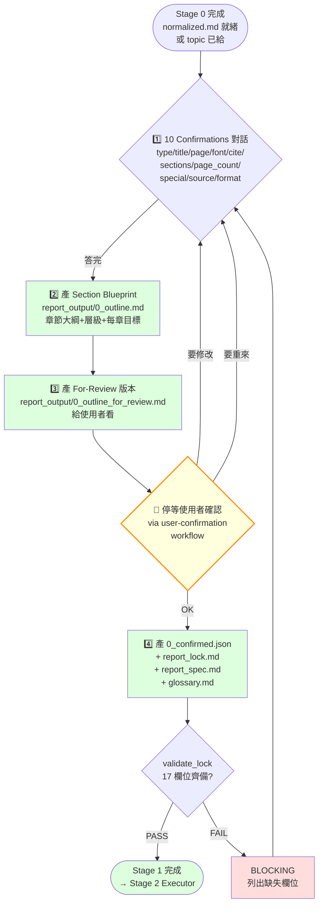
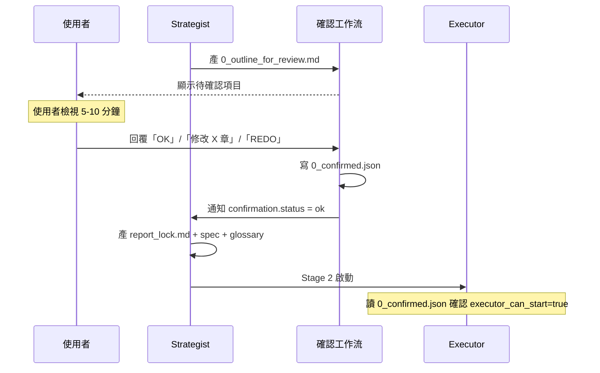

# strategist — Report-master Stage 1 規劃者 workflow（使用者面向）

> **文件版本：v1.1** · 對應 SPEC.md v0.3 + SKILL.md v1.0 + `references/strategist.md` v1 + `references/executor-base.md` v1 + `workflows/user-confirmation.md` v1 + `workflows/topic-research.md` v1
> **啟動時機**：Stage 1（在 Stage 0 source probe 完成後、在 Stage 2 Executor 開工前）
> **產出物**：
>   1. `report_output/0_outline.md`（**Section Blueprint**，章節藍圖 — 新增，Problem 1）
>   2. `report_output/0_outline_for_review.md`（給使用者看 — Problem 2）
>   3. `report_output/0_confirmed.json`（確認旗標 — Problem 2）
>   4. `report_lock.md`（17 個 required 欄位齊備）
>   5. `report_spec.md`（章節大綱 + 預期圖表 + 引用清單）
> **輸入物**：Stage 0 收斂後的 `normalized.md`、使用者口頭 / 文字需求、或 topic-research 的 `research_notes.md`

> **本檔是 user-facing workflow；Stage 1 的 schema 細節見 `references/strategist.md` v1。**

---

## 1. 角色定位

Strategist 是 Report-master 的「**規劃者**」，負責在 Stage 1 將**模糊的使用者需求**收斂成**機器可讀的執行合同**——但在交給 Executor 之前，**必須先讓使用者確認章節藍圖**，避免 Executor 寫出來才發現「順序不對」「少了一章」。

### 1.1 何時啟動

| 觸發情境 | 啟動 |
|----------|------|
| 使用者說「我想做一份報告」「出報告」「寫一份 paper」 | ✅ |
| Stage 0 收斂後產生 `normalized.md` 但沒有 lock | ✅ |
| Stage 2 Executor 報 `LockMissingFieldsError` | ✅（回去補 Stage 1） |
| Stage 2.5 迭代時大改（>30% 內容） | ✅（回到 Stage 1 重跑） |
| topic-research 跑完，有 `research_notes.md` | ✅（吃 research_notes 收斂） |

### 1.2 職責（會做）

1. **10 Confirmations 對話**（schema 細節見 `references/strategist.md` §3）
2. **Section Blueprint 產出**（**Problem 1** 修）：把章節結構、層級、每章目標、預期頁數寫成 `report_output/0_outline.md`
3. **User Confirmation Loop**（**Problem 2** 修）：停下來等使用者看過 blueprint 再說 OK
4. 確認後產出 `report_lock.md`（17 欄位齊備）
5. 確認後產出 `report_spec.md`（章節大綱 + 預期圖表）
6. 確認後產出 / 更新 `glossary.md`

### 1.3 非職責（不會做）

- ❌ 不寫 HTML（Stage 2 才寫）
- ❌ 不跑 Stage 2 / Stage 3
- ❌ 不 review 內容品質
- ❌ 不跨節並行 sub-agent
- ❌ **不會自動跳過使用者確認**（這是 Problem 2 的根因）

---

## 2. 角色互動邊界（含 Confirmation Loop）

```
       ┌─────────────┐
       │   使用者    │
       └──────┬──────┘
              ↓ 10 個問題
       ┌─────────────────┐
       │   Strategist    │ ← 本文件
       └──────┬──────────┘
              ↓ report_output/0_outline.md
              ↓ (Section Blueprint)
              ↓ report_output/0_outline_for_review.md
       ┌─────────────────┐
       │  🔔 停等確認      │ ← workflows/user-confirmation.md
       └──────┬──────────┘
              ↓ 使用者說「OK」/「修改」
              ↓ report_output/0_confirmed.json
       ┌─────────────────┐
       │   Strategist    │ ← 產 lock + spec + glossary
       └──────┬──────────┘
              ↓ report_lock.md + report_spec.md
       ┌─────────────────┐
       │   Executor      │ ← references/executor-base.md
       └──────┬──────────┘
              ↓ report_output/section_N.html × N
       ┌─────────────────┐
       │   Stage 3       │ ← html_to_pdf + html_to_docx
       └─────────────────┘
```

**Strategist 對 Executor 是契約關係**：lock 產出後 Executor 必須遵守。
**Strategist 對使用者是合約協商關係**：blueprint 必須經使用者確認（**新增**，舊版漏了這一步）。

---

## 3. 完整 4 階段流程（Mermaid）



> **關鍵節點**：`Pause` 是 **Problem 2 修**的核心——沒有 `0_confirmed.json`，Executor 拒絕啟動。

---

## 4. 階段 1 — 10 Confirmations 對話

**詳見 `references/strategist.md` §3**（v1 完整定義）。本檔只列摘要：

| # | 主題 | 對應欄位 | BLOCKING? |
|---|------|---------|-----------|
| Q1 | type + audience | `metadata.type` | ✅ |
| Q2 | title + subtitle | `metadata.title` | ✅ |
| Q3 | page_size / margins / line_spacing | `page_size` / `margins` / `line_spacing` | ✅ |
| Q4 | 字體鎖死確認（CJK=標楷體, Latin=TNR） | `fonts.cjk` / `fonts.latin` | ✅ |
| Q5 | 引用風格 | `citation_style` | ✅ |
| Q6 | 章節大綱（≥ 3 個 H1） | `sections[]` | ✅ |
| Q7 | 預期頁數 + 圖表數 | 寫入 `report_spec.md` | ❌（可給範圍） |
| Q8 | 特殊元素（mermaid / katex / code） | 影響 quality_checker 允許清單 | ❌ |
| Q9 | 來源材料 | 觸發對應 `source_to_md/*` | ❌ |
| Q10 | 交付格式 | `output.docx_engine` | ✅ |

**不會做的事**：跳過任一題就產 lock——這會讓 Executor 缺欄位而 BLOCKING。

---

## 5. 階段 2 — Section Blueprint 產出（**Problem 1 修**）

### 5.1 設計動機

舊版 Strategist 直接把 Q6 的章節大綱（5-7 個章節標題）寫進 `report_lock.md` 就算完工。問題是：

- ❌ Q6 只給「標題」+「path」，沒有「章節層級」「每章目標」「預估頁數」
- ❌ Executor 拿到 lock 後只能憑標題猜每一章要寫什麼
- ❌ 結果：常見 drift 模式 = 「章節順序亂」「少關鍵主題」「結論比緒論長」

### 5.2 產物：`report_output/0_outline.md`（Section Blueprint）

**Blueprint 包含的內容**：

```markdown
# Section Blueprint — {title}

> 對應 `workflows/strategist.md` v1.1（Stage 1 階段 2）
> 報告：{title}
> 作者：{author}
> 日期：{date}
> 總章節數：{N}
> 預估總頁數：{page_range}

## 章節藍圖

### 第 1 章：{chapter_1_title}（H1）
- **目標**：本章要回答的核心問題（1-2 句）
- **預估頁數**：~{N1} 頁
- **重點子節**：
  - {sub_topic_1}
  - {sub_topic_2}
  - {sub_topic_3}
- **對應 sub-question**（若有）：{sq_id}
- **預期圖表**：Figure {X}, Table {Y}
- **預期引用密度**：{high | medium | low}
- **備註**：{optional free text}

### 第 2 章：{chapter_2_title}（H1）
- **目標**：...
...

## 全域規劃

- **圖總數**：{fig_count}（Figure 1 ~ {fig_count}）
- **表總數**：{tbl_count}（Table 1 ~ {tbl_count}）
- **引用總數**：~{cite_count} 條
- **特殊元素**：{mermaid / katex / code_block}
- **預估完成時間**：{hours}

## 給 Executor 的提示

- 每節 prompt 會附本章「目標」與「重點子節」作為約束
- mid-run 改 blueprint → 走 Stage 2.5（delta_checker → 單節重跑）
```

### 5.3 設計細節

**為什麼分「目標」「重點子節」「預估頁數」「預期圖表」？**

| 欄位 | 給誰用 | 用來做什麼 |
|------|--------|-----------|
| 目標 | LLM prompt 注入 | 防止每節寫偏題 |
| 重點子節 | LLM prompt 注入 | 防止遺漏關鍵主題 |
| 預估頁數 | live-preview | 渲染時提醒長度 |
| 預期圖表 | Executor | 預先規劃 assets/ 目錄 |
| 預期引用密度 | Executor + citation_manager | 決定 References 章節厚度 |

### 5.4 範例

```markdown
# Section Blueprint — 生成式 AI 對教育的影響

> 總章節數：5
> 預估總頁數：30-50 頁

## 章節藍圖

### 第 1 章：緒論（H1）
- **目標**：交代研究背景、目的、章節安排
- **預估頁數**：~3 頁
- **重點子節**：
  - 研究背景與動機
  - 研究問題與目的
  - 章節安排
- **對應 sub-question**：（無，作為開場）
- **預期圖表**：無
- **預期引用密度**：low

### 第 2 章：生成式 AI 在 K-12 的應用現況（H1）
- **目標**：盤點各國生成式 AI 進入教室的場景
- **預估頁數**：~10 頁
- **重點子節**：
  - 美國 / 歐盟 / 亞洲政策比較
  - 教師採用率調查
  - 典型工具與案例（ChatGPT / Gemini / Claude）
- **對應 sub-question**：Q1
- **預期圖表**：Figure 1（採用率長條圖）、Table 1（政策時序表）
- **預期引用密度**：high
- **備註**：需上網搜尋最新政策動態（觸發 research_content）

### 第 3 章：對學習成效的影響（H1）
...

## 全域規劃

- **圖總數**：3（Figure 1-3）
- **表總數**：2（Table 1-2）
- **引用總數**：~30 條
- **特殊元素**：mermaid（畫一張政策時序圖）
- **預估完成時間**：~4 小時
```

---

## 6. 階段 3 — User Confirmation Loop（**Problem 2 修**）

> **完整協議見 `workflows/user-confirmation.md` v1**。本檔只列 Strategist 端的合約。

### 6.1 為什麼需要確認 loop？

**舊版問題**：Strategist 跑完 10 Confirmations 後直接寫 `report_lock.md`，Executor 接力開始寫 HTML。問題是：

- 使用者可能誤解了 Q6 的章節標題（Executor 不會再問）
- 使用者可能忘了某個關鍵主題（等到 Stage 2.5 發現要整段重寫）
- Executor 一旦開工就不容易回頭（spec_lock anti-drift 設計）

**解法**：在 Strategist 與 Executor 之間插入一個 **顯式的確認 gate**。

### 6.2 確認格式

**產物 1**：`report_output/0_outline_for_review.md`（人讀）

```markdown
# 🔔 Stage 1 確認請求 — 請檢視後回覆 OK / 修改

> 對應 `workflows/strategist.md` v1.1 + `workflows/user-confirmation.md` v1
> 等待時間：Stage 1 → Stage 2 之間的必要 gate
> 確認前不會啟動 Executor。

## 待確認項目

1. **章節架構**（5 章）：
   - 第 1 章：緒論 ✅ / ❌
   - 第 2 章：生成式 AI 在 K-12 的應用現況 ✅ / ❌
   - 第 3 章：對學習成效的影響 ✅ / ❌
   - 第 4 章：風險與倫理反思 ✅ / ❌
   - 第 5 章：結論與未來展望 ✅ / ❌

2. **章節順序**：1→2→3→4→5 ✅ / ❌

3. **每章預估頁數**：
   - 第 1 章：~3 頁 ✅ / ❌
   - 第 2 章：~10 頁 ✅ / ❌
   ...

4. **每章目標**（重點子節是否正確）：
   - 第 2 章：包含「美歐亞政策比較」 ✅ / ❌
   ...

5. **預期圖表總數**：3 圖 + 2 表 ✅ / ❌

6. **特殊元素**：mermaid ✅ / ❌

7. **引用條目數**：~30 條 ✅ / ❌

## 回覆方式

- **全部 OK**：回覆「OK」或「✅」即可
- **部分要修改**：列出要改的章節與內容
- **整體重來**：回覆「REDO」回到 Q1

## 確認後

確認後會自動產出：
- `report_output/0_confirmed.json`（給 Executor 的觸發開關）
- `report_lock.md`（17 欄位齊備）
- `report_spec.md`（章節大綱）
- `glossary.md`（≥ 3 條術語）

然後 Stage 2 Executor 啟動。
```

**產物 2**：`report_output/0_confirmed.json`（機讀，Executor 觸發開關）

```json
{
  "confirmed": true,
  "timestamp": "2026-06-13T14:30:00",
  "total_sections": 5,
  "section_titles": [
    "第一章 緒論",
    "第二章 生成式 AI 在 K-12 的應用現況",
    "第三章 對學習成效的影響",
    "第四章 風險與倫理反思",
    "第五章 結論與未來展望"
  ],
  "total_pages_est": "30-50",
  "approved_by": "user",
  "approved_at": "2026-06-13T14:35:00",
  "executor_can_start": true
}
```

### 6.3 確認流程（Mermaid）



### 6.4 拒絕啟動的保護

Executor 在啟動前必須檢查：

```python
import json
from pathlib import Path

confirmed_path = Path("report_output/0_confirmed.json")
if not confirmed_path.exists():
    raise FileNotFoundError(
        "[BLOCKING] 找不到 0_confirmed.json。"
        "請先跑 Stage 1 Strategist 並完成 user confirmation。"
    )

data = json.loads(confirmed_path.read_text(encoding="utf-8"))
if not data.get("executor_can_start"):
    raise RuntimeError(
        "[BLOCKING] 0_confirmed.json 標記 executor_can_start=false。"
        "請回 Stage 1 重新確認。"
    )
```

---

## 7. 階段 4 — Lock + Spec + Glossary 產出

**確認後**（`0_confirmed.json.executor_can_start = true`），產：

### 7.1 `report_lock.md`

17 個 required 欄位齊備（詳見 `references/strategist.md` §4.2）：
- `fonts.cjk` / `fonts.latin`
- `formatting.{cover,toc,title,h1,h2,h3,body,table,caption}`
- `page_size` / `margins` / `line_spacing`
- `language_variant` / `citation_style`
- `output.docx_engine`
- `sections[]`（從 blueprint 帶入）

### 7.2 `report_spec.md`

- 章節大綱（從 blueprint 帶入）
- 預期圖表清單
- 引用條目數
- 每章預估頁數（**新增**，來自 blueprint）

### 7.3 `glossary.md`

- 首次出現的術語條目（≥ 3 條）

---

## 8. 失敗 / 求助指引（新增 confirmation 相關）

| 症狀 | 原因 / 處理 |
|------|-------------|
| `0_outline_for_review.md` 產出後沒人回覆 | 等待中；提醒使用者或預設 24h 逾時 |
| 使用者回覆「修改第 3 章」但沒給改什麼 | 回到 Q1（具體修改需明確說明） |
| `0_confirmed.json` 不存在 / `executor_can_start=false` | Executor 拒絕啟動；回去 Strategist |
| 使用者要求新增章節 | 回到 Q1 重做 blueprint；不走 incremental |
| blueprint 與 lock 不一致 | BLOCKING；Strategist 必須保證 blueprint → lock 是 deterministic |

---

## 9. 與其他 workflow / 檔案的關係

| 檔案 | 關係 |
|------|------|
| `references/strategist.md` v1 | Stage 1 schema 細節（10 Confirmations、17 欄位清單） |
| `references/executor-base.md` v1 | Stage 2 Executor；吃本檔的 lock + spec |
| `workflows/user-confirmation.md` v1 | **新增**；定義 confirmation loop 細節 |
| `workflows/topic-research.md` v1.1 | 上游；提供 sub-questions 給 Strategist 收斂 |
| `scripts/strategist.py` | CLI 對應；產 blueprint + lock + spec |
| `scripts/report_lock.py` | `validate_lock()`；Strategist 必跑 |

---

## 10. 版本演進

| 版本 | 狀態 | 說明 |
|------|------|------|
| v1.0 | previous | 初版；10 Confirmations + Mermaid + 5 種範本 |
| v1.1 | **current** | **新增 Section Blueprint**（Problem 1）+ **Confirmation Loop**（Problem 2） |

---

*workflows/strategist.md v1.1 — 對應 SPEC.md v0.3 + SKILL.md v1.0 + references/strategist.md v1 + workflows/user-confirmation.md v1, 2026-06-13*
