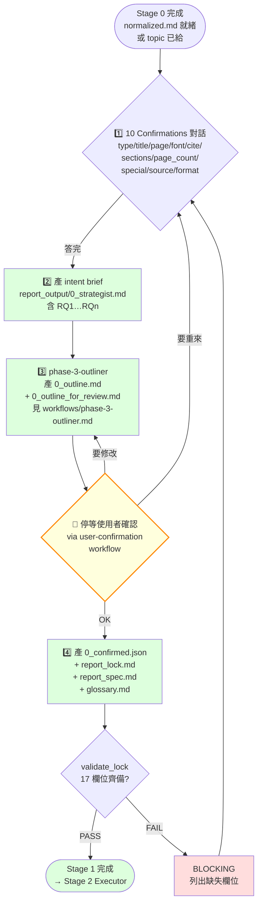

# strategist — Report-master Stage 1 規劃者 workflow（使用者面向）

> **文件版本：v1.2** · 對應 SPEC.md v0.3 + SKILL.md v1.0 + `references/strategist.md` v1 + `references/executor-base.md` v1 + `workflows/user-confirmation.md` v1 + `workflows/topic-research.md` v1 + **`workflows/phase-3-outliner.md` v1.0**（**v1.2 新拆分**）
> **啟動時機**：Stage 1（在 Stage 0 source probe 完成後、在 Stage 2 Executor 開工前）
> **產出物**：
>   1. `report_output/0_strategist.md`（intent brief；含 RQ1…RQn — **v1.2 新增**）
>   2. `report_lock.md`（17 個 required 欄位齊備）
>   3. `report_spec.md`（章節大綱 + 預期圖表 + 引用清單）
>   4. `glossary.md`（≥ 3 條術語）
> **輸入物**：Stage 0 收斂後的 `normalized.md`、使用者口頭 / 文字需求、或 topic-research 的 `research_notes.md`

> **本檔是 user-facing workflow；Stage 1 的 schema 細節見 `references/strategist.md` v1。**
>
> **v1.2 重構說明**：章節藍圖（Section Blueprint）從 Strategist 拆出為獨立 Stage 1.5 workflow，見 `workflows/phase-3-outliner.md` v1.0。Strategist 收斂意圖 → Outliner 規劃章節 → User 確認 → Executor 執行。

---

## 1. 角色定位

Strategist 是 Report-master 的「**規劃者**」，負責在 Stage 1 將**模糊的使用者需求**收斂成**機器可讀的執行合同**——但在交給 Executor 之前，**必須先讓使用者確認章節藍圖**，避免 Executor 寫出來才發現「順序不對」「少了一章」。

**v1.2 拆分後**：Strategist 收斂意圖並產出 `0_strategist.md`（含 RQ1…RQn），接著交棒給 `phase-3-outliner.md`（Stage 1.5）做章節藍圖規劃，**再**進入 User Confirmation。

### 1.1 何時啟動

| 觸發情境 | 啟動 |
|----------|------|
| 使用者說「我想做一份報告」「出報告」「寫一份 paper」 | ✅ |
| Stage 0 收斂後產生 `normalized.md` 但沒有 lock | ✅ |
| Stage 2 Executor 報 `LockMissingFieldsError` | ✅（回去補 Stage 1） |
| Stage 2.5 迭代時大改（>30% 內容） | ✅（回到 Stage 1 重跑） |
| topic-research 跑完，有 `research_notes.md` | ✅（吃 research_notes 收斂） |
| Outliner（Stage 1.5）已產出 outline 但 `0_confirmed.json` 缺失 | ✅（補產 lock + spec + glossary） |

### 1.2 職責（會做）

1. **10 Confirmations 對話**（schema 細節見 `references/strategist.md` §3）
2. **產出 intent brief `0_strategist.md`**（**v1.2 新增**）：收斂 RQ1…RQn（含 angle、priority、estimated_pages），交給 Outliner
3. **User Confirmation Loop**（**Problem 2** 修）：讀 Outliner 產出的 `0_outline_for_review.md`，等使用者說 OK 再繼續
4. 確認後產出 `report_lock.md`（17 欄位齊備）
5. 確認後產出 `report_spec.md`（章節大綱 + 預期圖表）
6. 確認後產出 / 更新 `glossary.md`

> **See also**: 章節藍圖（Section Blueprint）的完整產出流程見 **`workflows/phase-3-outliner.md` v1.0**。本檔只負責 intent brief 收斂 + confirmation + lock/spec/glossary，不直接產 outline。

### 1.3 非職責（不會做）

- ❌ 不寫 HTML（Stage 2 才寫）
- ❌ 不跑 Stage 2 / Stage 3
- ❌ 不 review 內容品質
- ❌ 不跨節並行 sub-agent
- ❌ **不直接產章節藍圖**（**v1.2 改**：那是 `phase-3-outliner.md` 的工作）
- ❌ **不會自動跳過使用者確認**（這是 Problem 2 的根因）

---

## 2. 角色互動邊界（含 Confirmation Loop）

```
       ┌─────────────┐
       │   使用者    │
       └──────┬──────┘
              ↓ 10 個問題
       ┌─────────────────┐
       │   Strategist    │ ← 本文件（Stage 1）
       └──────┬──────────┘
              ↓ report_output/0_strategist.md
              ↓ (intent brief + RQ1…RQn)
       ┌─────────────────┐
       │ phase-3-outliner│ ← workflows/phase-3-outliner.md（Stage 1.5）
       └──────┬──────────┘
              ↓ report_output/0_outline.md
              ↓ report_output/0_outline_for_review.md
       ┌─────────────────┐
       │  🔔 停等確認      │ ← workflows/user-confirmation.md
       └──────┬──────────┘
              ↓ 使用者說「OK」/「修改」
              ↓ report_output/0_confirmed.json
       ┌─────────────────┐
       │   Strategist    │ ← 補產 lock + spec + glossary
       └──────┬──────────┘
              ↓ report_lock.md + report_spec.md
       ┌─────────────────┐
       │   Executor      │ ← references/executor-base.md
       └──────┬──────────┘
              ↓ report_output/section_N.html × N
       ┌─────────────────┐
       │   Stage 3       │ ← html_to_pdf + html_to_docx
       └─────────────────┘
```

**Strategist 對 Outliner 是上游提供者**：給 RQs 讓 Outliner 規劃章節。
**Strategist 對 Executor 是契約消費者**：吃 `0_outline.md` 帶入 lock 的 `sections[]`，Executor 必須遵守。
**Strategist 對使用者是合約協商關係**：outline 必須經使用者確認（**新增**，舊版漏了這一步）。

---

## 3. 完整 4 階段流程（Mermaid）

> **v1.2 更新**：原本的「Section Blueprint 產出」階段從本檔拆出，獨立成 `phase-3-outliner.md` 的 Stage 1.5。



> **關鍵節點**：`Pause` 是 **Problem 2 修**的核心——沒有 `0_confirmed.json`，Executor 拒絕啟動。
> **v1.2 改**：`Out`（Outliner）是獨立 Stage 1.5，詳見 `workflows/phase-3-outliner.md` v1.0。

---

## 4. 階段 1 — 10 Confirmations 對話

**詳見 `references/strategist.md` §3**（v1 完整定義）。本檔只列摘要：

| # | 主題 | 對應欄位 | BLOCKING? |
|---|------|---------|-----------|
| Q1 | type + audience | `metadata.type` | ✅ |
| Q2 | title + subtitle | `metadata.title` | ✅ |
| Q3 | page_size / margins / line_spacing | `page_size` / `margins` / `line_spacing` | ✅ |
| Q4 | 字體鎖死確認（CJK=標楷體, Latin=TNR） | `fonts.cjk` / `fonts.latin` | ✅ |
| Q5 | 引用風格 | `citation_style` | ✅ |
| Q6 | 章節大綱（≥ 3 個 H1） | `sections[]` | ✅ |
| Q7 | 預期頁數 + 圖表數 | 寫入 `report_spec.md` | ❌（可給範圍） |
| Q8 | 特殊元素（mermaid / katex / code） | 影響 quality_checker 允許清單 | ❌ |
| Q9 | 來源材料 | 觸發對應 `source_to_md/*` | ❌ |
| Q10 | 交付格式 | `output.docx_engine` | ✅ |

**不會做的事**：跳過任一題就產 lock——這會讓 Executor 缺欄位而 BLOCKING。

---

## 5. 階段 2 — 產出 Intent Brief `0_strategist.md`（**v1.2 新增**）

### 5.1 設計動機

v1.1 把章節藍圖（Section Blueprint）塞在 Strategist 流程內，導致：

- ❌ Strategist 流程臃腫（> 450 行）
- ❌ 「藍圖規劃」與「意圖收斂」責任邊界模糊
- ❌ 順序檢查、粒度統一、章節類型判定等邏輯沒有獨立的 ownership

**v1.2 解法**：把藍圖拆成獨立 Stage 1.5 workflow（`phase-3-outliner.md`）。Strategist 只負責收斂意圖並產 `0_strategist.md`（含 RQ1…RQn），把章節規劃交給 Outliner。

### 5.2 產物：`report_output/0_strategist.md`（Intent Brief）

**Intent brief 包含的內容**：

```markdown
---
metadata:
  title: "報告標題"
  type: "academic" | "business" | "spec" | "gov" | "custom"
  author: "..."
  date: "2026-06-13"
research_questions:
  - id: RQ1
    question: "本章要回答的核心問題"
    angle: "現況 / 實證 / 風險 / 比較 / 政策 / 成本 / 情境"
    priority: high | medium | low
    estimated_pages: 8
  - id: RQ2
    ...
constraints:
  total_pages: "30-50"
  citation_style: "APA"
  language: "zh-TW"
---
```

### 5.3 設計細節

| 欄位 | 給誰用 | 用來做什麼 |
|------|--------|-----------|
| `research_questions[].question` | Outliner | 配對成 H1 章節核心問題 |
| `research_questions[].angle` | Outliner | 推斷章節類型與所需資料 |
| `research_questions[].priority` | Outliner + Executor | 決定引用密度與章節深度 |
| `research_questions[].estimated_pages` | Outliner | 估算章節字數（頁數 × 500） |
| `constraints` | Strategist | 帶入 `report_lock.md` 的契約欄位 |

> **詳見 `workflows/phase-3-outliner.md` v1.0** 取得章節藍圖的完整產出流程（schema、順序檢查、粒度規則、2 個範例）。

---

## 6. 階段 3 — User Confirmation Loop（**Problem 2 修**）

> **完整協議見 `workflows/user-confirmation.md` v1**。本檔只列 Strategist 端的合約。

### 6.1 為什麼需要確認 loop？

v1.0 的問題：Strategist 跑完 10 Confirmations 後直接寫 `report_lock.md`，Executor 接力開始寫 HTML。問題是：

- 使用者可能誤解了 Q6 的章節標題（Executor 不會再問）
- 使用者可能忘了某個關鍵主題（等到 Stage 2.5 發現要整段重寫）
- Executor 一旦開工就不容易回頭（spec_lock anti-drift 設計）

**v1.2 解法**：Strategist 收斂意圖 → Outliner 產 `0_outline.md` + `0_outline_for_review.md` → Main agent 把 `0_outline_for_review.md` 給使用者看 → 寫 `0_confirmed.json` → Strategist 補產 lock + spec + glossary → Executor 啟動。

### 6.2 確認格式

**產物 1**：`report_output/0_outline_for_review.md`（人讀；由 Outliner 產出）

> Schema 與範例見 `workflows/phase-3-outliner.md` §4.3 與 §6 / §7。

**產物 2**：`report_output/0_confirmed.json`（機讀，Executor 觸發開關）

```json
{
  "confirmed": true,
  "timestamp": "2026-06-13T14:30:00",
  "total_sections": 5,
  "section_titles": [
    "第一章 緒論",
    "第二章 生成式 AI 在 K-12 的應用現況",
    "第三章 對學習成效的影響",
    "第四章 風險與倫理反思",
    "第五章 結論與未來展望"
  ],
  "total_pages_est": "30-50",
  "approved_by": "user",
  "approved_at": "2026-06-13T14:35:00",
  "executor_can_start": true
}
```

### 6.3 拒絕啟動的保護

Executor 在啟動前必須檢查：

```python
import json
from pathlib import Path

confirmed_path = Path("report_output/0_confirmed.json")
if not confirmed_path.exists():
    raise FileNotFoundError(
        "[BLOCKING] 找不到 0_confirmed.json。"
        "請先跑 Stage 1 Strategist + phase-3-outliner 並完成 user confirmation。"
    )

data = json.loads(confirmed_path.read_text(encoding="utf-8"))
if not data.get("executor_can_start"):
    raise RuntimeError(
        "[BLOCKING] 0_confirmed.json 標記 executor_can_start=false。"
        "請回 Stage 1 重新確認。"
    )
```

---

## 7. 階段 4 — Lock + Spec + Glossary 產出

**確認後**（`0_confirmed.json.executor_can_start = true`），產：

### 7.1 `report_lock.md`

17 個 required 欄位齊備（詳見 `references/strategist.md` §4.2）：
- `fonts.cjk` / `fonts.latin`
- `formatting.{cover,toc,title,h1,h2,h3,body,table,caption}`
- `page_size` / `margins` / `line_spacing`
- `language_variant` / `citation_style`
- `output.docx_engine`
- `sections[]`（從 `0_outline.md` 帶入；**v1.2 改**：不再是從 Q6 帶入）

### 7.2 `report_spec.md`

- 章節大綱（從 `0_outline.md` 帶入；**v1.2 改**）
- 預期圖表清單
- 引用條目數
- 每章預估頁數（從 Outliner 帶入）

### 7.3 `glossary.md`

- 首次出現的術語條目（≥ 3 條）

---

## 8. 失敗 / 求助指引（confirmation 相關）

| 症狀 | 原因 / 處理 |
|------|-------------|
| `0_strategist.md` 缺 `research_questions` | BLOCKING；Strategist 必須完成 10 Confirmations 才能往下 |
| `0_outline_for_review.md` 產出後沒人回覆 | 等待中；提醒使用者或預設 24h 逾時 |
| 使用者回覆「修改第 3 章」但沒給改什麼 | 回到 Outliner（具體修改需明確說明） |
| `0_confirmed.json` 不存在 / `executor_can_start=false` | Executor 拒絕啟動；回去 Strategist |
| 使用者要求新增章節 | 回到 Outliner 重做；不走 incremental |
| `0_outline.md` 與 lock 不一致 | BLOCKING；Strategist 必須以 outline 為 source of truth 重產 lock |

---

## 9. 與其他 workflow / 檔案的關係

| 檔案 | 關係 |
|------|------|
| `references/strategist.md` v1 | Stage 1 schema 細節（10 Confirmations、17 欄位清單） |
| **`workflows/phase-3-outliner.md` v1.0** | **Stage 1.5（v1.2 新拆分）**；吃本檔的 `0_strategist.md` 產 outline |
| `workflows/user-confirmation.md` v1 | Stage 1.6 confirmation loop 細節 |
| `references/executor-base.md` v1 | Stage 2 Executor；吃本檔的 lock + spec + Outliner 的 `0_outline.md` |
| `workflows/topic-research.md` v1.1 | 上游；提供 sub-questions 給 Strategist 收斂 |
| `scripts/strategist.py` | CLI 對應；產 intent brief + lock + spec |
| `scripts/outliner.py` | CLI 對應；產 `0_outline.md` + `0_outline_for_review.md` |
| `scripts/report_lock.py` | `validate_lock()`；Strategist 必跑 |

---

## 10. 版本演進

| 版本 | 狀態 | 說明 |
|------|------|------|
| v1.0 | previous | 初版；10 Confirmations + Mermaid + 5 種範本 |
| v1.1 | previous | **新增 Section Blueprint**（Problem 1）+ **Confirmation Loop**（Problem 2） |
| v1.2 | **current** | **A1 重構**：拆出 `workflows/phase-3-outliner.md`（Stage 1.5）獨立負責章節藍圖；Strategist 收斂 intent brief（RQ1…RQn）後交棒 |

---

*workflows/strategist.md v1.2 — 對應 SPEC.md v0.3 + SKILL.md v1.0 + references/strategist.md v1 + workflows/user-confirmation.md v1 + **workflows/phase-3-outliner.md v1.0**, 2026-06-13*
