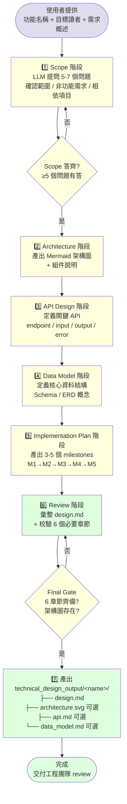
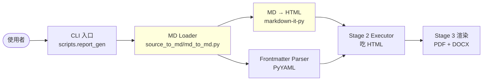

# technical-design — Report-master 技術規格文件生成 workflow

> **文件版本：v1.0** · 對應 SPEC.md v0.3 + SKILL.md v1.0 + `references/strategist.md` v1 + `workflows/topic-research.md` v1
> **啟動時機**：當使用者想為一個新功能 / 系統寫正式技術規格文件
> **產出物**：
>   1. `technical_design_output/<name>/design.md`（主文件，含 Mermaid 架構圖）
>   2. `technical_design_output/<name>/architecture.svg`（可選；Mermaid 預渲染）
>   3. `technical_design_output/<name>/api.md`（可選；獨立 API 章節）
>   4. `technical_design_output/<name>/data_model.md`（可選；獨立 Data Model 章節）
> **輸入物**：功能名稱（machine-readable slug）、目標讀者（engineers / PMs / executives）、需求概述

---

## 1. 何時使用本 workflow

| 觸發情境 | 啟動 |
|----------|------|
| 使用者說「我想寫一份技術規格」「做技術設計文件」「系統設計」 | ✅ technical-design |
| 使用者說「給 X 功能寫 RFC」「出一份 design doc」 | ✅ technical-design |
| 使用者想記錄某個新功能/系統的架構決策 | ✅ technical-design |
| 使用者想寫學術論文 / 商業提案 | ❌ 用 `report-master` 主流程 |
| 使用者沒有任何 source 與 topic | ❌ 用 `topic-research` workflow |
| 使用者只想整理既有程式碼 | ❌ 走 `live-preview` / 直接編輯 |

**一句話判斷**：使用者要交付的是「**設計意圖 + 架構決策**」，目標是給**其他工程師 / PM / 主管**讀的文件 → 走本 workflow。

> **設計初衷**：讓「**寫技術規格**」本身也是 Report-master 的一部分，而不是要求使用者先去套範本。
> 整個流程仍然遵守「**Spec-Lock anti-drift**」：先做 Scope 收斂，再產 architecture / API / data model / implementation，最後產出 design.md。
> 本 workflow **不**依賴 report-master 的 Stage 0~3 渲染（不產 PDF / DOCX）；產物是給工程團隊閱讀的 Markdown。

---

## 2. 角色互動邊界

```
       ┌──────────────┐
       │   使用者     │  ← 給功能名稱 + 目標讀者 + 需求概述
       └──────┬───────┘
              ↓
       ┌─────────────────────┐
       │  technical-design   │ ← 本文件
       │  (本 workflow)      │
       └──────┬──────────────┘
              │  scope Q&A
              │  (5-7 個問題)
              ↓
       ┌─────────────────────┐
       │  Strategist-like    │ ← 借用 references/strategist.md
       │  收斂產出 lock      │   (Q1-Q7 對齊 10 Confirmations 風格)
       └──────┬──────────────┘
              │  architecture → API → data model → milestones
              ↓
       ┌─────────────────────┐
       │  design.md 生成器   │ ← scripts/technical_design.py
       │  (LLM-assisted)     │
       └──────┬──────────────┘
              │  technical_design_output/<name>/
              │  ├── design.md (主文件)
              │  ├── architecture.svg (可選)
              │  ├── api.md (可選)
              │  └── data_model.md (可選)
              ↓
       ┌─────────────────────┐
       │  使用者 / 團隊 review│
       └─────────────────────┘
```

**technical-design 對 Strategist（references/strategist.md）**：借用其「**分階段確認 + BLOCKING 校驗**」的紀律，但收斂目標不同——Strategist 收斂出 `report_lock.md` 給 Stage 2 Executor；technical-design 收斂出 `design.md` 給工程團隊。
**technical-design 對 topic-research**：兩者都是「**從零開始**」的 workflow（無 source materials），但 topic-research 收斂出「**研究筆記**」給 Strategist 收斂；technical-design 收斂出「**設計意圖**」直接交付。
**technical-design 對 Stage 2/3 Executor**：**無依賴**。本 workflow 不寫 HTML、不呼叫 weasyprint/pandoc；產物純 Markdown。

---

## 3. 流程總覽（Mermaid）



**重點**：
- Scope 階段失敗（< 5 題有答）→ 回到 Scope 補問
- Final Gate 失敗（缺章節或架構圖）→ 回到 Review 補完
- 全部 PASS → 寫出 `design.md` 主文件
- `architecture.svg` / `api.md` / `data_model.md` 為可選副產物（旗標控制）

---

## 4. 階段細節

### 4.1 Stage 1 — Scope（範圍確認）

**目標**：把使用者的「**模糊需求概述**」展開成 **5-7 個明確範圍問題**，給後續 architecture / API / data model 提供骨架。

**做法**：

1. 讀取使用者輸入：
   - `name`（machine-readable slug）：例如 `markdown-input-support`
   - `audience`（目標讀者）：`engineers` / `pm` / `executives` / 混合
   - `brief`（需求概述）：1-3 段 Markdown 文字
2. 呼叫 LLM（讀 `LLM_API_URL` / `LLM_API_KEY` / `LLM_MODEL` 環境變數；無設定走 stub）
3. Prompt 設計：
   ```
   你是一個資深技術架構師。使用者要為以下功能寫技術規格：

   功能名稱：{name}
   目標讀者：{audience}
   需求概述：
   {brief}

   請依序問 5-7 個問題，涵蓋：
   1. 功能邊界（in-scope / out-of-scope）
   2. 非功能需求（效能、可用性、安全、維運）
   3. 相依項目（內部服務 / 外部 API / 第三方套件）
   4. 資料規模（QPS、儲存量、growth）
   5. 失敗模式（timeout、retry、degradation）
   6. 與既有系統的關係（取代 / 並存 / 整合）
   7. 風險與 trade-off（如有想到）

   輸出格式（YAML）：
   ```yaml
   questions:
     - id: q1
       topic: 功能邊界
       question: ...
     - id: q2
       topic: 非功能需求
       question: ...
   ```
   ```
4. 對每個問題，**等待使用者回答**（互動模式）；CLI 一鍵模式 → 走 stub LLM 的 canned 答案
5. 寫入 `technical_design_output/<name>/scope.md` 的 `## Scope Q&A` 區塊

**BLOCKING 條件**：
- 問題數 < 5 → 重做（深度不足）
- 使用者拒答某題 → 記錄為「未答」並繼續（**不** BLOCKING；本 workflow 鼓勵漸進式揭露）
- 全部問題都「未答」 → **WARN**（可能 design.md 品質不佳，但不擋）

**Scope 問題清單（建議起手）**：

| ID | Topic | 範例問題 |
|----|-------|----------|
| Q1 | 功能邊界 | 這個功能包含哪些子功能？不包含哪些？ |
| Q2 | 非功能需求 | 預期 QPS / 延遲 SLA / 可用性目標？ |
| Q3 | 資料規模 | 預期資料量（rows / GB）、growth rate？ |
| Q4 | 相依項目 | 必須整合的內部服務 / 外部 API？ |
| Q5 | 失敗模式 | timeout / retry / degradation 策略？ |
| Q6 | 取代 / 並存 | 是新增功能、還是取代既有功能？ |
| Q7 | 風險 | 已知的技術風險或 trade-off？ |

### 4.2 Stage 2 — Architecture（系統架構）

**目標**：產出**一張 Mermaid 架構圖**（sequence / flowchart / C4 任選）+ 每個組件的**一句話說明**。

**做法**：

1. 依 Scope 答案 + 需求概述，決定架構圖類型：
   - **flowchart TD**（最常用；展示組件 + 資料流）
   - **sequenceDiagram**（強調時序互動）
   - **C4-style**（強調系統層級：使用者 → API → DB）
2. LLM Prompt：
   ```
   根據以下 Scope 答案，產出 Mermaid 架構圖：

   功能：{name}
   Scope：{scope_answers}
   需求：{brief}

   請產出：
   1. Mermaid flowchart 原始碼（5-10 個節點；標示資料流方向）
   2. 組件清單（每個節點的名稱 + 一句話職責）
   3. 資料流描述（從 A → B → C，每一步做什麼）
   ```
3. 寫入 `design.md` 的 `## 2. Architecture` 區塊
4. **可選**：呼叫 `scripts/mermaid_renderer.py::render_mermaid_block` 預渲染為 SVG

**架構圖節點數建議**：
- 5-7 個節點：精簡（單一服務 / 工具）
- 8-10 個節點：標準（多組件 + 資料流）
- 11+ 個節點：複雜（microservice / 多系統整合）→ 考慮拆多張圖

**BLOCKING 條件**：
- 架構圖 Mermaid 語法錯誤 → 重生成
- 節點 < 3 → 重做（過於抽象）

### 4.3 Stage 3 — API Design（API 設計）

**目標**：定義**關鍵 API**——endpoint / 輸入 / 輸出 / 錯誤處理。

**做法**：

1. 識別 3-8 個關鍵 API（**不**列所有內部 API；只列對外的或 critical path 的）
2. 對每個 API 給：
   - **Endpoint**（HTTP method + path，或 function signature）
   - **Input**（參數 + 型別 + 必填/選填）
   - **Output**（成功回應結構）
   - **Error handling**（錯誤碼、error message、retry strategy）
3. 寫入 `design.md` 的 `## 3. API Design` 區塊
4. **可選**：拆出獨立 `api.md` 給前端 / 第三方團隊

**API 描述格式**：

```markdown
### API 1: 建立訂單

- **Endpoint**: `POST /api/v1/orders`
- **Input**:
  ```json
  {
    "customer_id": "string (required)",
    "items": [
      {"product_id": "string", "quantity": "integer"}
    ]
  }
  ```
- **Output (200 OK)**:
  ```json
  {
    "order_id": "ord_abc123",
    "total": 1500,
    "status": "pending"
  }
  ```
- **Error handling**:
  - `400`: 參數驗證失敗（missing field、invalid format）
  - `409`: 庫存不足（retry-after header 給建議等待秒數）
  - `500`: 內部錯誤（不 retry；回報 trace_id）
```

**BLOCKING 條件**：
- API 數 < 3 → 重做（過於籠統）
- 任何 API 缺 Endpoint / Input / Output / Error 任一欄位 → 補完

### 4.4 Stage 4 — Data Model（資料模型）

**目標**：定義**核心資料結構**——Schema / ERD 概念。

**做法**：

1. 列出 2-6 個核心 entity（如 `User`, `Order`, `OrderItem`）
2. 對每個 entity：
   - **欄位**（name + type + nullable + 索引）
   - **關聯**（一對多 / 多對多）
   - **範例資料**（1 筆 row）
3. 產出 Mermaid **erDiagram** 圖（ERD 概念圖）
4. 寫入 `design.md` 的 `## 4. Data Model` 區塊
5. **可選**：拆出獨立 `data_model.md` 給 DBA / data team

**Entity 描述格式**：

```markdown
### Entity: Order

| 欄位 | 型別 | Nullable | 說明 |
|------|------|----------|------|
| `order_id` | string (PK) | NO | 訂單唯一 ID（prefix: `ord_`） |
| `customer_id` | string (FK) | NO | 客戶 ID（關聯 User） |
| `status` | enum | NO | pending / paid / shipped / cancelled |
| `total` | decimal(10,2) | NO | 訂單總額（精準到分） |
| `created_at` | timestamp | NO | 建立時間（UTC） |

**關聯**：
- `Order.customer_id` → `User.user_id`（多對一）
- `Order` has many `OrderItem`（一對多）

**範例**：
```json
{
  "order_id": "ord_abc123",
  "customer_id": "usr_xyz789",
  "status": "pending",
  "total": 1500.00,
  "created_at": "2026-06-13T12:00:00Z"
}
```
```

**BLOCKING 條件**：
- entity 數 < 2 → 重做
- 任何 entity 缺欄位表 → 補完
- ERD Mermaid 語法錯誤 → 重生成

### 4.5 Stage 5 — Implementation Plan（實作計畫）

**目標**：產出 **3-5 個 milestones**，每個 milestone 給**可驗收的 deliverable**。

**做法**：

1. 對 3-5 個 milestones，依序給：
   - **M{N} 名稱**（動詞開頭）
   - **預估天數 / 人天**
   - **Deliverables**（3-5 個可驗收項目）
   - **驗收標準**（如何測試通過）
2. Milestone 排序邏輯：
   - **M1**: 基礎建設（DB schema、API skeleton、deploy pipeline）
   - **M2**: 核心功能（happy path 跑通）
   - **M3**: 邊界情況（error handling、retry、edge case）
   - **M4**: 觀測性（logging、monitoring、alerting）
   - **M5**: 優化與 polish（效能調校、文件、demo）
3. 寫入 `design.md` 的 `## 5. Implementation Plan` 區塊

**Milestone 描述格式**：

```markdown
### M1: 基礎建設（預估 3 天）

**Deliverables**：
- [ ] DB schema 落地（migration script + ERD in 1.）
- [ ] API skeleton 建立（FastAPI / Express scaffold）
- [ ] CI/CD pipeline（GitHub Actions：test → build → deploy staging）

**驗收標準**：
- `pytest tests/test_data_model.py` 通過
- `curl POST /api/v1/health` 回 200
- staging 環境自動 deploy 成功
```

**BLOCKING 條件**：
- Milestone 數 < 3 → 重做
- 任一 milestone 缺 deliverable 或驗收標準 → 補完

### 4.6 Stage 6 — Review（彙整校驗）

**目標**：把 5 個階段的產出彙整成 `design.md` 主文件，跑 Final Gate 校驗。

**做法**：

1. 彙整 5 個章節為 `design.md`：
   ```
   # Technical Design: {功能名稱}
   > 作者 / 日期 / 讀者 / 狀態
   ## 1. Overview
   ## 2. Architecture
   ## 3. API Design
   ## 4. Data Model
   ## 5. Implementation Plan
   ## 6. Risks & Open Questions
   ```
2. **校驗清單（Final Gate）**：
   - [ ] §1 Overview 含目標、讀者、in/out of scope
   - [ ] §2 Architecture 含 Mermaid 圖 + 組件說明
   - [ ] §3 API Design 含 ≥ 3 個 API（每個有 endpoint / input / output / error）
   - [ ] §4 Data Model 含 ≥ 2 個 entity（每個有欄位表 + 範例）
   - [ ] §5 Implementation Plan 含 ≥ 3 個 milestones
   - [ ] §6 Risks & Open Questions（非空）
3. **PASS** → 寫入 `technical_design_output/<name>/design.md`
4. **FAIL** → 列出缺失章節，回到對應階段補完
5. 終端機印 verdict + 報告路徑

**Return code**：
- `0` = PASS（所有章節齊備）
- `1` = FAIL（缺章節）
- `2` = argument 解析失敗

### 4.7 Stage 7 — 產出

**目標**：寫出主文件 + 可選副產物。

**產出結構**：

```
technical_design_output/
└── <name>/
    ├── design.md          ← 主文件（必出）
    ├── scope.md           ← Scope Q&A（必出；Stage 1 留底）
    ├── architecture.svg   ← 預渲染 Mermaid（可選；--with-svg）
    ├── api.md             ← 獨立 API 章節（可選；--with-api）
    └── data_model.md      ← 獨立 Data Model 章節（可選；--with-data-model）
```

**為什麼 `scope.md` 必出？**
- 留底：未來 reviewer 質疑「為什麼這麼設計」時，回頭查 Q&A
- 版本控制：每次 `--name` 重跑時，scope.md 不可覆蓋；備份為 `scope_v{n}.md`

---

## 5. 階段輸出產物一覽

| 階段 | 產出檔案 | 內容 |
|------|----------|------|
| Stage 1 Scope | `scope.md` | 5-7 個 Q&A 完整記錄 |
| Stage 2 Architecture | `design.md` §2 | Mermaid 圖 + 組件說明 |
| Stage 3 API Design | `design.md` §3 + 可選 `api.md` | API endpoint / input / output / error |
| Stage 4 Data Model | `design.md` §4 + 可選 `data_model.md` | Entity 欄位表 + ERD |
| Stage 5 Impl Plan | `design.md` §5 | Milestones + deliverables + 驗收 |
| Stage 6 Review | `design.md` 完整 | 6 章節彙整 + Final Gate 校驗 |
| Stage 7 Output | 整個 `technical_design_output/<name>/` | 全部產物 |

---

## 6. CLI：`scripts/technical_design.py`

> **M 等級**：M（產物有結構：6 章節 + 多檔案）。給終端機使用者 + main agent 觸發。

```bash
# 互動模式：給 name + scope，產 design.md
python -m scripts.technical_design --name "markdown-input-support" --scope "用戶可以餵 .md 檔"

# 指定 audience
python -m scripts.technical_design --name "..." --audience engineers --scope "..."

# 指定輸出目錄
python -m scripts.technical_design --name "..." --scope "..." --output-dir ./my_designs/

# 產 SVG 架構圖（呼叫 mermaid_renderer）
python -m scripts.technical_design --name "..." --scope "..." --with-svg

# 拆出獨立 api.md + data_model.md
python -m scripts.technical_design --name "..." --scope "..." --with-api --with-data-model

# 一鍵模式（不走互動，直接用 stub 答案跑完）
python -m scripts.technical_design --name "..." --scope "..." --auto

# 靜音模式（CI 用）
python -m scripts.technical_design --name "..." --scope "..." --quiet
```

**輸出範例**：

```
🔧 technical-design — 開始
   name: markdown-input-support
   audience: engineers
   scope: 用戶可以餵 .md 檔
   output: technical_design_output/markdown-input-support/

📋 Stage 1: Scope
   ✅ 5 個問題已建立
   ✅ scope.md 寫入

🏗️ Stage 2: Architecture
   ✅ Mermaid 圖建立（6 個節點）
   ✅ 架構圖寫入 design.md

🔌 Stage 3: API Design
   ✅ 4 個 API 建立
   ✅ API 設計寫入 design.md

🗄️ Stage 4: Data Model
   ✅ 3 個 entity 建立
   ✅ ERD 寫入 design.md

📅 Stage 5: Implementation Plan
   ✅ 4 個 milestones 建立

✅ Stage 6: Review
   ✅ 6 個章節齊備
   ✅ Final Gate PASS

📦 Stage 7: Output
   ✅ design.md
   ✅ scope.md

✅ 技術規格文件完成
📄 主文件: technical_design_output/markdown-input-support/design.md
```

**Return code**：
- `0` = PASS（所有章節齊備）
- `1` = Final Gate FAIL（缺章節）
- `2` = argument 解析失敗

---

## 7. 端到端範例

### 7.1 情境 A：為「Report-master 支援 Markdown 輸入」寫技術規格

**Step 0 — 使用者**：
> 「我想讓 Report-master 支援直接吃 .md 檔，不要走 HTML。幫我寫技術規格。」

**Step 1 — 啟動**：

```bash
$ python -m scripts.technical_design \
    --name "markdown-input-support" \
    --audience engineers \
    --scope "用戶可餵 .md 檔；系統自動轉為 HTML；保留所有 frontmatter"

🔧 technical-design — 開始
   name: markdown-input-support
```

**Step 2 — Scope 階段**：

LLM 產出 5 個問題（互動模式會一題一題問使用者；CLI 一鍵模式用 stub 答案）：

1. **Q1（功能邊界）**：支援哪些 Markdown 擴充（mermaid / katex / footnote）？
2. **Q2（非功能需求）**：單檔最大 size？10MB 是否合理？
3. **Q3（資料規模）**：預期 QPS？單檔轉檔時間目標？
4. **Q4（相依項目）**：是否引入 `markdown-it-py` 或 `mistune`？
5. **Q5（失敗模式）**：bad markdown 怎麼辦？fallback 還是 BLOCKING？

**Step 3 — Architecture 階段**：



**Step 4 — API Design 階段**（4 個 API）：

1. `python -m scripts.source_to_md.md_to_md --input <path> --output <path>`
2. `python -m scripts.markdown_to_html <input> <output>`
3. （內部）`markdown_it.Markdown().render(text)` 給 Executor 用
4. （內部）`parse_frontmatter(text) -> dict`

**Step 5 — Data Model 階段**（2 個 entity）：

1. **MDDocument**（欄位：`raw_text`, `frontmatter`, `html_rendered`）
2. **RenderJob**（欄位：`source_path`, `target_format`, `status`, `created_at`）

**Step 6 — Implementation Plan 階段**（4 個 milestones）：

- **M1 基礎建設**（3 天）：`md_to_md.py` + `markdown_to_html.py` skeleton + 單元測試
- **M2 核心功能**（4 天）：CLI 整合；frontmatter 解析；Stage 2 入口
- **M3 邊界情況**（2 天）：bad markdown error handling；10MB+ 大檔
- **M4 觀測性 + 文件**（2 天）：logging + README 更新 + example

**Step 7 — Review**：

✅ §1 Overview / §2 Architecture / §3 API Design / §4 Data Model / §5 Implementation Plan / §6 Risks
✅ Final Gate PASS

**Step 8 — 產出**：

```
technical_design_output/markdown-input-support/
├── design.md         ← 主文件
└── scope.md          ← Scope Q&A
```

### 7.2 情境 B：給 PM 寫「客戶分群功能」設計（audience=pm）

```bash
$ python -m scripts.technical_design \
    --name "customer-segmentation" \
    --audience pm \
    --scope "依消費行為自動分群；輸出 segment id + 標籤"

   audience: pm → 自動調用 PM-friendly 範本（少技術細節；多 business value）
```

PM-friendly 範本差異：
- §2 Architecture 簡化為 1 張 high-level flowchart（5 個節點以下）
- §3 API Design 簡化為 1-2 個對外 endpoint
- §4 Data Model 簡化為 customer attributes 表
- §5 Implementation Plan 著重 deliverable 與時程（少技術細節）
- §6 Risks 著重商業風險（法規、隱私）非技術風險

### 7.3 情境 C：給主管寫「高層次設計提案」（audience=executives）

```bash
$ python -m scripts.technical_design \
    --name "ai-report-summarizer" \
    --audience executives \
    --scope "用 LLM 自動摘要 50 頁報告為 5 頁"
```

Executive-friendly 範本差異：
- §1 Overview 著重 ROI / 預估節省時間
- §2 Architecture 1 張 high-level diagram + 1 段商業邏輯說明
- §3-5 章節精簡為 1-2 段
- §6 Risks 著重成本、合規、品牌風險

---

## 8. 失敗 / 求助指引

| 症狀 | 原因 / 處理 |
|------|-------------|
| `--name` 撞到既有目錄 | workflow 自動備份為 `name_v{n}/`；確認是否覆蓋 |
| Scope 問題 < 5 | 重跑 Scope 階段；或明確指定 `--auto` 走 stub 答案 |
| Mermaid 圖 render 失敗 | `mermaid_renderer.MMDCNotFoundError` → `npm install -g @mermaid-js/mermaid-cli` |
| API 描述不齊 | Final Gate 會報缺漏；回到 Stage 3 補 |
| Entity 描述不齊 | Final Gate 會報缺漏；回到 Stage 4 補 |
| Milestone < 3 | 拆解需求 → 重跑 Stage 5 |
| Final Gate FAIL | 看 `design.md` 開頭的 checklist；補對應章節 |
| LLM API 逾時 | 設 `LLM_TIMEOUT` 環境變數（預設 30s）；或走 stub LLM |
| audience 不在 enum | BLOCKING；只支援 engineers / pm / executives / mixed |

---

## 9. 與其他 workflow / skill 的關係

| 檔案 | 關係 |
|------|------|
| `SKILL.md` | 主 workflow authority；本檔於「技術規格文件」情境下被引用 |
| `references/strategist.md` (T3-1) | 借用「分階段確認 + BLOCKING 校驗」紀律；非下游關係 |
| `workflows/topic-research.md` (T3-3) | 同類型「從零開始」workflow；topic-research 收斂研究筆記，technical-design 收斂設計意圖 |
| `scripts/strategist.py` (T3-1) | 借用 `validate_lock()` 風格的校驗機制 |
| `scripts/mermaid_renderer.py` (T1-8) | **可選整合**：`--with-svg` 時呼叫此模組預渲染 Mermaid |
| `docs/shared-standards.md` | 不直接相關（本 workflow 不寫 HTML） |
| `scripts/technical_design.py` (本檔 T3-14) | CLI 對應本 workflow；跑完 7 個階段產 design.md |

---

## 10. 範本庫（audience 對應）

| Audience | 範本 | 適用情境 |
|----------|------|----------|
| `engineers` | `eng-v1`（default） | 給工程師讀；技術細節齊；API + Data Model 完整 |
| `pm` | `pm-v1` | 給 PM 讀；business value 著重；技術細節簡化 |
| `executives` | `exec-v1` | 給主管讀；ROI + 風險著重；章節精簡 |
| `mixed` | `mixed-v1` | 混合；§2-5 各有 detail + summary 兩層 |

**範本選擇機制**：
- 預設：`audience=engineers` → `eng-v1`
- CLI：`--audience pm` → `pm-v1`
- 自動偵測：未指定時，看 scope 關鍵字（"成本" "時程" "ROI" → executives；"API" "schema" "DB" → engineers）

---

## 11. 版本演進

| 版本 | 狀態 | 說明 |
|------|------|------|
| v1.0 | **current** | T3-14 完成；7 階段流程（Scope → Architecture → API → Data Model → Implementation Plan → Review → Output）+ Mermaid 圖 + 3 種 audience 範本 + CLI helper + 端到端範例 |

**未來可能擴充**（不在本任務範圍）：
- 互動式 Scope Q&A（CLI 一題一題問；目前 stub LLM 給 canned）
- ADR (Architecture Decision Record) 子範本
- 與 Notion / Confluence 整合（直接 publish）
- 自動從現有 code base 推導 architecture 圖
- 範本自訂（`templates/design/` 支援使用者新增 audience）

---

*workflows/technical-design.md v1.0 — 對應 SPEC.md v0.3 + SKILL.md v1.0 + references/strategist.md v1 + workflows/topic-research.md v1, 2026-06-13*
