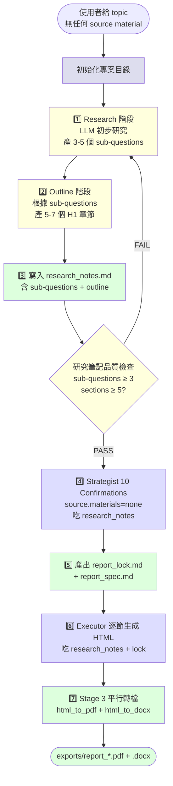

# topic-research — Report-master 無源材料 workflow

> **文件版本：v1.0** · 對應 SPEC.md v0.3 + SKILL.md v1.0 + `references/strategist.md` v1 + `references/executor-base.md` v1
> **啟動時機**：Stage 0 之前／Stage 0 期間，當使用者**沒有**任何來源材料（PDF / DOCX / URL / Markdown / 手寫筆記）
> **產出物**：
>   1. `report_output/research_notes.md`（sub-questions + outline）
>   2. 對應的 `report_lock.md`（由 Strategist 10 Confirmations 收斂產生）
>   3. 對應的 `report_spec.md`（章節大綱）
> **輸入物**：使用者的一句話 topic（如：「生成式 AI 對教育的影響」）

---

## 1. 何時使用本 workflow

| 觸發情境 | 啟動 |
|----------|------|
| 使用者說「我想研究 X」「寫一份關於 X 的報告」「生成式 AI 對教育的影響」 | ✅ topic-research |
| 使用者提供了 PDF / DOCX / URL / MD 等 source materials | ❌ 走一般 `report-master` 主流程（Stage 0 → Stage 1 → ...） |
| 使用者有半成品（如一份大綱 / 思緒筆記） | ⚠️ 走 `handwritten` 路徑，先把半成品丟給 Stage 0 normalize |

**一句話判斷**：使用者手上**沒有任何要交付的「原料」**，但想要一份**有研究深度的報告** → 走本 workflow。

> **設計初衷**：讓「研究」本身也是 Report-master 的一部分，而不是要求使用者先去找資料。
> 整個流程仍然遵守「Spec-Lock anti-drift」：先做研究產 outline，再交給 Strategist 收斂出 lock，最後由 Executor 逐節生成 HTML。

---

## 2. 角色互動邊界

```
       ┌─────────────┐
       │   使用者    │  ← 只給一句 topic
       └──────┬──────┘
              ↓
       ┌─────────────────────┐
       │  topic-research     │ ← 本文件
       │  (本 workflow)      │
       └──────┬──────────────┘
              │  report_output/research_notes.md
              │  (sub-questions + outline)
              ↓
       ┌─────────────┐
       │  Strategist │ ← references/strategist.md (T3-1)
       └──────┬──────┘
              │  report_lock.md + report_spec.md
              │  (10 Confirmations 收斂)
              ↓
       ┌─────────────┐
       │  Executor   │ ← references/executor-base.md (T3-2)
       └──────┬──────┘
              │  report_output/section_N.html × N
              ↓
       ┌─────────────┐
       │  Stage 3    │ ← html_to_pdf + html_to_docx
       └─────────────┘
```

**topic-research 對 Strategist 是上游 producer**：把「要研究什麼」收斂成「報告要寫什麼章節」。
**topic-research 對 Executor 是上游 producer**：透過 Strategist 把章節大綱寫進 lock，Executor 只認 lock。

> **⚠️ topic-research 本身不寫 HTML、不直接呼叫 quality_checker。**
> 它的產物只是「研究筆記 + 章節大綱」，**所有 HTML 生成責任都在 Executor**。

---

## 3. 流程總覽（Mermaid）



---

## 4. 階段細節

### 4.1 Stage — Research（初步研究）

**目標**：把一句話的 topic 展開成 3-5 個具體 sub-questions，給後續 outline 提供骨架。

**做法**：

1. 讀取使用者 topic（單一字串，例如「生成式 AI 對教育的影響」）
2. 呼叫 LLM（讀 `LLM_API_URL` / `LLM_API_KEY` 環境變數；無設定就走 stub LLM）
3. Prompt 設計：
   ```
   你是一個專業研究助理。使用者要研究的主題是：「{topic}」

   請產出 3-5 個 sub-questions，每個 sub-question 應：
   - 具體、可回答（不是 "為什麼 AI 重要" 這種空泛問題）
   - 涵蓋不同面向（理論 / 實務 / 影響 / 案例 / 未來）
   - 適合 1-2 段 Markdown 文字回答

   輸出格式（YAML）：
   ```yaml
   sub_questions:
     - id: q1
       question: ...
       angle: 理論 / 實務 / 影響 / 案例 / 未來
     - id: q2
       ...
   ```
   ```
4. 若環境有 `web_search` tool 權限，可加入 1-2 次搜尋補強事實（**非必要**，純 LLM 知識也可運作）
5. 寫入 `report_output/research_notes.md` 的 `## Sub-questions` 區塊

**BLOCKING 條件**：
- sub-questions 數量 < 3 → 重做（深度不足）
- sub-questions 內容完全重複 → 重做（角度不夠多元）

---

### 4.2 Stage — Outline（章節大綱）

**目標**：根據 sub-questions 衍生 5-7 個 H1 章節，給 Strategist 提供章節清單。

**做法**：

1. 對每個 sub-question 決定 1 個對應的 H1 章節
2. 必要時新增「緒論」「結論」等骨架章節（academic 範本可參考 `scripts/strategist.py` 的 default_sections）
3. 每個 H1 章節給：
   - `path`：`report_output/section_N.html`（N 從 1 開始）
   - `title`：繁體中文章節名
4. 寫入 `report_output/research_notes.md` 的 `## Outline` 區塊

**章節數建議**：
- 5 章：精簡（短報告 / 商業提案）
- 6 章：標準（多數學術 / 商業）
- 7 章：完整（深度研究 / 政府公文）

**BLOCKING 條件**：
- H1 章節 < 3 → 重做（Q6 BLOCKING 條件）
- 章節順序混亂（如結論出現在第一章）→ 重做

---

### 4.3 Stage — Research Notes 寫入

**產物**：`report_output/research_notes.md`

```markdown
# research_notes.md — Topic Research 階段產物

> 對應 `workflows/topic-research.md` v1.0
> 主題：{topic}
> 產生時間：{timestamp}
> 產出者：scripts/topic_research.py

## Sub-questions

針對「{topic}」展開的 3-5 個 sub-questions：

### Q1: {question_1}
- **面向**：{angle_1}
- **簡述**：（待 Stage 2 Executor 補）

### Q2: {question_2}
...

## Outline

對應的章節大綱（H1）：

1. **第一章 緒論**
   - 對應 sub-question：（無，作為開場）
2. **第二章 {title_for_q1}**
   - 對應 sub-question：Q1
3. **第三章 {title_for_q2}**
   - 對應 sub-question：Q2
...

## 預期頁數 / 字數

- 頁數：30-50 頁（粗估）
- 字數：~15000 字

## 給 Strategist 的提示

- 報告類型：建議 `academic`（若使用者是研究取向）或 `custom`（若偏向實務）
- 字體鎖死：CJK=標楷體 / Latin=Times New Roman
- 引用風格：建議 `APA`（若 type=academic）或 `none`（若 type=business）
- 來源材料：`source.materials: none`（本次 workflow 不帶原料）
- 註：Strategist 10 Confirmations 仍需依序回答，topic-research 只給方向不定細節
```

**檔案慣例**：
- 寫入 `report_output/` 子目錄
- 與 `report_lock.md` / `report_spec.md` 並列
- 不可覆蓋：每次執行備份為 `research_notes_v{n}.md`（v1, v2, ...）

---

### 4.4 Stage — Strategist 收斂（10 Confirmations）

**角色**：`references/strategist.md`（T3-1 完工）

**特殊設定**（與一般流程不同）：

- **`source.materials: none`** 或 **`source.materials: llm_research`**（兩者皆可；語意差異見下表）
  | 值 | 語意 |
  |----|------|
  | `none` | 明確標示「本次報告完全無外部材料」；Stage 2 Executor 不引用任何文獻 |
  | `llm_research` | 「LLM 做了初步研究」；Stage 2 可引用 LLM 知識（但仍非外部文獻） |
- Q9（來源材料）的答案即為 `none` / `llm_research`，**不接受 PDF / DOCX / URL / MD / handwritten**

**吃 `research_notes.md` 作為輸入**：
- Sub-questions 對應到 Q7（預期圖表數 + 頁數）
- Outline 對應到 Q6（章節大綱 ≥ 3 個 H1）
- 「給 Strategist 的提示」對應到 Q1（type）、Q5（citation_style）

**產出**：
- `report_lock.md`（17 個 required 欄位齊備）
- `report_spec.md`（章節大綱 + 預期圖表 + 引用清單）

---

### 4.5 Stage — Executor 逐節生成

**角色**：`references/executor-base.md`（T3-2 進行中）

**吃 lock + spec + research_notes**：
- `report_lock.md` — 格式契約
- `report_spec.md` — 章節大綱
- `research_notes.md` — **額外吃**：每節的 sub-question 與「對應 sub-question」映射
  - 這給 Executor 一個明確的 prompt 方向：「本節要回答 Q3 提到的 XX 問題」

**流程不變**：7-step 逐節流程（load → prompt → quality → write → next）

**與一般流程差異**：
- 每節 prompt 末尾追加「本節對應的 sub-question」（從 research_notes 帶入）
- 若是 `citation_style: none`，Executor 不需要附 References 章節
- 若是 `citation_style: llm_research` + `APA`，Executor 可在每節末加 LLM-knowledge 標註（TODO：T3-2 細節）

---

### 4.6 Stage — 工程轉換（Stage 3）

不變。`html_to_pdf.py` + `html_to_docx.py` 平行跑。

---

## 5. CLI 工具：`scripts/topic_research.py`

> **S-M 等級**：S（小工具）~ M（產物有結構）；只跑 Research + Outline 兩階段，**不**自動接 Strategist / Executor。

```bash
# 基本用法：給 topic，產 research_notes.md
python -m scripts.topic_research --topic "生成式 AI 對教育的影響"

# 指定輸出目錄
python -m scripts.topic_research --topic "..." --output ./my_report/report_output/

# 用真實 LLM（讀 LLM_API_URL / LLM_API_KEY 環境變數）
export LLM_API_URL=https://api.openai.com/v1/chat/completions
export LLM_API_KEY=sk-xxxxx
export LLM_MODEL=gpt-4o-mini
python -m scripts.topic_research --topic "..."

# 走 stub LLM（無 API 時的預設；回傳 canned response）
python -m scripts.topic_research --topic "機器學習在醫療的應用"
```

**產出**：
```
✅ Research notes 寫入：report_output/research_notes.md
   topic: 生成式 AI 對教育的影響
   sub-questions: 3
   outline sections: 5
```

**Return code**：
- `0` = 成功
- `1` = LLM 失敗（網路 / API error）
- `2` = 產出驗證失敗（sub-questions < 3、outline < 5 章）

**Stub LLM 介面**：
- 讀 env：`LLM_API_URL` / `LLM_API_KEY` / `LLM_MODEL`（optional）
- 未設定 → 走 `StubLLM`，回傳 canned response（與 topic 字串無關，固定產出 3 sub-questions + 5 章 outline）
- 設定 → 用 `requests` 呼叫 OpenAI-compatible chat completions API

---

## 6. 端到端範例（fictional）

> 跑完一次 `topic-research` workflow 的虛構對話。lock 為示意，實際產物由 Strategist 從 research_notes 收斂。

**Step 0 — 使用者**：
> 「我想寫一份關於『生成式 AI 對教育的影響』的報告，但我手上沒有任何 PDF 或論文。」

**Step 1 — topic-research 啟動**：
```bash
python -m scripts.topic_research --topic "生成式 AI 對教育的影響"
```

**Step 2 — 產出 `report_output/research_notes.md`**：

```markdown
# research_notes.md

> 主題：生成式 AI 對教育的影響
> 產生時間：2026-06-13T13:30:00

## Sub-questions

### Q1: 生成式 AI 在中小學教育的實際應用場景有哪些？
- **面向**：實務
- **簡述**：（待 Stage 2 Executor 補）

### Q2: 生成式 AI 對學習成效（learning outcomes）的影響為何？
- **面向**：影響
- **簡述**：（待 Stage 2 Executor 補）

### Q3: 教育界對生成式 AI 的疑慮與風險（抄襲、隱私、依賴性）？
- **面向**：影響
- **簡述**：（待 Stage 2 Executor 補）

## Outline

1. **第一章 緒論**（對應：無，作為開場）
2. **第二章 生成式 AI 教育的全球趨勢**（對應：Q1）
3. **第三章 對學習成效的影響**（對應：Q2）
4. **第四章 風險與倫理反思**（對應：Q3）
5. **第五章 結論與未來展望**（對應：無，作為收束）

## 給 Strategist 的提示

- 報告類型：建議 `academic`
- 引用風格：建議 `APA`
- 來源材料：`source.materials: llm_research`
```

**Step 3 — Strategist 10 Confirmations**：
```
Q1: type? → academic
Q2: title? → 生成式 AI 對教育的影響：機會、風險與未來
Q3: page_size / margins / line_spacing? → A4 / 預設 / 1.5
Q4: 字體鎖死? → 確認（標楷體 / Times New Roman）
Q5: 引用風格? → APA
Q6: 章節大綱? → 從 research_notes 帶入 5 章
Q7: 預期頁數 / 圖表? → 30-50 頁 / 圖 2 張表 1 個
Q8: 特殊元素? → mermaid（畫一張 trend timeline）
Q9: 來源材料? → llm_research（從 topic-research 帶來）
Q10: 交付格式? → PDF + DOCX
```

**Step 4 — 產出 `report_lock.md`**（示意，前 30 行）：
```markdown
---
schema_version: 1
template: academic
fonts:
  cjk: 標楷體
  latin: Times New Roman
formatting:
  cover: {font_size: 22, bold: true, align: center}
  ...
page_size: A4
margins: {top: 2.5cm, bottom: 2.5cm, left: 3cm, right: 2cm}
line_spacing: 1.5
language_variant: zh-TW
citation_style: APA
output:
  docx_engine: pandoc
  embed_fonts: true
metadata:
  title: 生成式 AI 對教育的影響：機會、風險與未來
  author: Zero
  date: 2026-06-13
  abstract: |
    本研究探討生成式 AI 對 K-12 教育的影響 ...
sections:
  - path: report_output/section_1.html
    title: 第一章 緒論
  - path: report_output/section_2.html
    title: 第二章 生成式 AI 教育的全球趨勢
  - path: report_output/section_3.html
    title: 第三章 對學習成效的影響
  - path: report_output/section_4.html
    title: 第四章 風險與倫理反思
  - path: report_output/section_5.html
    title: 第五章 結論與未來展望
source:
  materials: llm_research
  notes_path: report_output/research_notes.md
---

# report_lock.md

> 機器執行合同（template: academic, source: llm_research）
```

**Step 5 — Executor 逐節生成**（T3-2 進行中；本 workflow 不實際執行）：

> ⚠️ **本 workflow 文件不直接呼叫 Executor**。Executor 的呼叫協議詳見 `references/executor-base.md`。
> 使用者在收到 lock + spec + research_notes 後，自己跑：
> ```bash
> python -m scripts.executor \
>   --lock report_lock.md \
>   --output report_output/ \
>   --research-notes report_output/research_notes.md
> ```

**Step 6 — Stage 3 轉檔**：
```bash
python -m scripts.report_gen render \
  --html report_output/_bundle.html \
  --output exports/ \
  --format pdf,docx
```

**Step 7 — 終產物**：
```
exports/
├── report_20260613_133000.pdf
└── report_20260613_133000.docx
```

---

## 7. 與其他 workflow / skill 的關係

| 檔案 | 關係 |
|------|------|
| `SKILL.md` | 主 workflow authority；本檔於「無源材料」情境下被引用 |
| `references/strategist.md` (T3-1) | 下游：吃 research_notes 收斂出 lock |
| `references/executor-base.md` (T3-2) | 下游：吃 lock + research_notes 逐節生成 |
| `scripts/topic_research.py` | CLI 對應本 workflow；只跑 Research + Outline |
| `scripts/strategist.py` | 對應 references/strategist.md；吃 research_notes 產 lock |
| `scripts/executor.py` (T3-2) | 對應 references/executor-base.md；逐節生成 |
| `docs/report_lock_schema.md` | lock schema；Strategist 必須遵守 |
| `docs/shared-standards.md` | HTML/CSS 子集；Executor 必須遵守 |
| `docs/glossary.md` | 術語表範本；Executor 每節重讀 |

---

## 8. 失敗 / 求助指引

| 症狀 | 原因 / 處理 |
|------|-------------|
| `topic --topic "..."` 沒產出 research_notes | 檢查 `--output` 路徑權限；或 LLM API 失敗 |
| sub-questions < 3 | 重跑（LLM 沒有展開足夠深度）；或改寫 topic 更具體 |
| outline < 5 章 | 重跑（LLM 結構太簡略）；或明確指定 type=business（3 章即可） |
| Strategist 拒吃 `source.materials: llm_research` | T3-1 範本未涵蓋；可改用 `source.materials: none` |
| Executor 找不到 `research_notes.md` | 確認 `source.notes_path` 路徑正確；或對 Executor 餵食 |
| LLM API 逾時 | 設 `LLM_TIMEOUT` 環境變數（預設 30s）；或走 stub LLM |

---

## 9. 版本演進

| 版本 | 狀態 | 說明 |
|------|------|------|
| v1.0 | **current** | T3-3 完成；5 階段流程（Research → Outline → Strategist → Executor → Stage 3）+ Mermaid 圖 + CLI helper + 端到端範例 |

---

*workflows/topic-research.md v1.0 — 對應 SPEC.md v0.3 + SKILL.md v1.0 + references/strategist.md v1 + references/executor-base.md v1, 2026-06-13*
