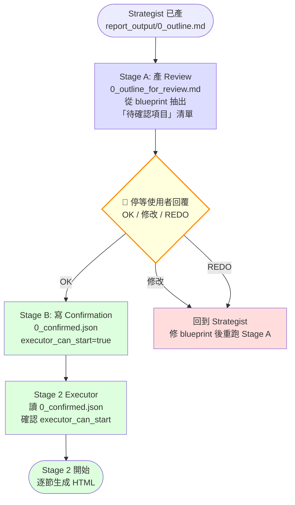

# user-confirmation — Report-master 確認環節（Problem 2 修）

> **文件版本：v1.0** · 對應 SPEC.md v0.3 + SKILL.md v1.0 + `workflows/strategist.md` v1.1 + `references/strategist.md` v1 + `references/executor-base.md` v1
> **啟動時機**：Stage 1 結束（Strategist 已產出 `report_output/0_outline.md`）、Stage 2 啟動之前
> **產出物**：
>   1. `report_output/0_outline_for_review.md`（給人讀的待確認單）
>   2. `report_output/0_confirmed.json`（給機器讀的確認旗標，Executor 觸發開關）
> **輸入物**：`report_output/0_outline.md`（Strategist 產的 Section Blueprint）

> **S 等級**：小工具 / 產物有結構。不寫 HTML、不跑 LLM、不跑 Stage 2；唯一的職責是「把人讀的 outline 轉成機讀的 confirmation gate」。

---

## 1. 為什麼需要這個 workflow

### 1.1 舊版的問題（Problem 2 根因）

```
舊版流程（❌）：
  Stage 1 Strategist → report_lock.md → Stage 2 Executor 立即啟動
```

問題：

- 使用者可能誤解 Q6 的章節大綱，但 Executor 不會再問
- 使用者可能忘了某個關鍵主題，要到 Stage 2.5 整段重寫才發現
- Executor 一旦開工就難回頭（spec_lock anti-drift 設計）
- 沒有 audit trail（哪個版本是「OK」的？什麼時候 OK 的？）

### 1.2 新版的解法

```
新版流程（✅）：
  Stage 1 Strategist → 0_outline.md → 0_outline_for_review.md
       ↓
  🔔 停等使用者確認
       ↓
  0_confirmed.json (executor_can_start=true)
       ↓
  report_lock.md → Stage 2 Executor 啟動
```

**新增的保護**：

1. **顯式產物**：`0_outline_for_review.md` 是使用者唯一要看的檔
2. **機讀旗標**：`0_confirmed.json` 是 Executor 的「開工證」
3. **拒絕啟動**：Executor 啟動前必檢查 `executor_can_start`，缺檔或 false → BLOCKING
4. **Audit trail**：timestamp / approved_by / approved_at 都有紀錄

---

## 2. 何時使用本 workflow

| 觸發情境 | 啟動 |
|----------|------|
| Strategist 已產 `0_outline.md`，準備進入 Stage 2 | ✅ |
| 使用者主動要求「review 章節架構」 | ✅ |
| Stage 2.5 改 > 30%，需重跑 Stage 1 | ✅（再次進入本 workflow） |
| Stage 2.5 改 < 30% | ❌（走 delta_checker，不需重新確認） |

**一句話判斷**：要做任何「**章節層級**」的改動 → 走本 workflow。

---

## 3. 兩階段流程（Mermaid）



---

## 4. Stage A — 產 `0_outline_for_review.md`

### 4.1 輸入：`0_outline.md`（Section Blueprint）

Strategist 寫的 blueprint，含：
- 每章的「目標」「預估頁數」「重點子節」「對應 sub-question」「預期圖表」「預期引用密度」「備註」

### 4.2 輸出：`0_outline_for_review.md`

格式（給人讀）：

```markdown
# 🔔 Stage 1 確認請求 — 請檢視後回覆

> 對應 `workflows/user-confirmation.md` v1.0
> 產生時間：{timestamp}
> 等待中：Stage 2 Executor 將在您回覆後啟動

## 待確認項目

### A. 章節架構（{N} 章）

| # | 章節標題 | 預估頁數 | 對應 SQ | 圖 | 表 |
|---|----------|---------|--------|----|----|
| 1 | {title_1} | ~{N1} 頁 | — | 0 | 0 |
| 2 | {title_2} | ~{N2} 頁 | {sq_id} | {X} | {Y} |
| ... | ... | ... | ... | ... | ... |

### B. 章節順序

1 → 2 → 3 → ... → {N}

### C. 每章目標（重點子節是否正確？）

| 章 | 目標摘要 | 重點子節 |
|----|---------|---------|
| 1 | {goal_1} | {subsets_1} |
| 2 | {goal_2} | {subsets_2} |
| ... | ... | ... |

### D. 預期圖表總數

- 圖：{fig_count} 張
- 表：{tbl_count} 個
- 特殊元素：{mermaid / katex / code_block / none}

### E. 引用條目數

~{cite_count} 條（{APA / MLA / Chicago / GBC / none}）

### F. 預估總頁數

{page_range} 頁

---

## 回覆方式

請挑選下列其中之一回覆：

- **`OK`**（或 ✅）：全部接受，Stage 2 立即啟動
- **`修改 {章節} ...`**：具體指出要改的章節與內容（例：「修改第 2 章：新增『亞洲政策比較』子節」）
- **`REDO`**：整體重來，回到 Stage 1 Q1

---

## 確認後自動產出

- `report_output/0_confirmed.json`（Executor 開工證）
- `report_lock.md`（17 欄位齊備）
- `report_spec.md`（章節大綱 + 每章預估頁數）
- `glossary.md`（≥ 3 條術語）

---

*0_outline_for_review.md — 由 workflows/user-confirmation.md v1.0 自動產生*
```

### 4.3 CLI 介面

```bash
# 從 0_outline.md 產出 0_outline_for_review.md
python -m scripts.user_confirmation prepare \
    --outline report_output/0_outline.md \
    --output report_output/0_outline_for_review.md
```

**產出**：
```
✅ Review generated: report_output/0_outline_for_review.md
   sections: 5
   estimated pages: 30-50
   Waiting for user confirmation...
```

---

## 5. Stage B — 寫 `0_confirmed.json`（Executor 觸發開關）

### 5.1 觸發時機

使用者回覆 `OK` 之後（手動或自動）。

### 5.2 產物格式

```json
{
  "confirmed": true,
  "timestamp": "2026-06-13T14:30:00",
  "total_sections": 5,
  "section_titles": [
    "第一章 緒論",
    "第二章 生成式 AI 在 K-12 的應用現況",
    "第三章 對學習成效的影響",
    "第四章 風險與倫理反思",
    "第五章 結論與未來展望"
  ],
  "section_targets": {
    "1": "交代研究背景、目的、章節安排",
    "2": "盤點各國生成式 AI 進入教室的場景",
    "3": "分析生成式 AI 對學習成效的影響",
    "4": "反思抄襲、隱私、過度依賴等風險",
    "5": "提出未來研究方向與政策建議"
  },
  "section_pages_est": {
    "1": "3",
    "2": "10",
    "3": "12",
    "4": "10",
    "5": "5"
  },
  "total_pages_est": "30-50",
  "figures_total": 3,
  "tables_total": 2,
  "citation_style": "APA",
  "estimated_citations": 30,
  "special_elements": ["mermaid"],
  "approved_by": "user",
  "approved_at": "2026-06-13T14:35:00",
  "executor_can_start": true,
  "outline_source": "report_output/0_outline.md"
}
```

### 5.3 欄位說明

| 欄位 | 型別 | 用途 |
|------|------|------|
| `confirmed` | bool | 是否已確認（true = 通過） |
| `executor_can_start` | bool | **Executor 開工的唯一判斷** |
| `section_titles` | string[] | 給 Executor 對照 lock |
| `section_targets` | object | 給 Executor prompt 注入（每節目標） |
| `section_pages_est` | object | 給 live-preview 長度提示 |
| `figures_total` / `tables_total` | int | 給 Executor 預先規劃 assets/ |
| `citation_style` | string | 給 Executor / citation_manager |
| `approved_by` / `approved_at` | string | Audit trail |
| `outline_source` | string | 反查 blueprint 路徑 |

### 5.4 CLI 介面

```bash
# 寫入 0_confirmed.json
python -m scripts.user_confirmation confirm \
    --outline report_output/0_outline.md \
    --output report_output/0_confirmed.json \
    --approved-by "user"

# 從 CLI stdin 讀「OK / 修改 / REDO」自動決定
python -m scripts.user_confirmation confirm \
    --outline report_output/0_outline.md \
    --output report_output/0_confirmed.json \
    --auto --user-input "OK"
```

---

## 6. Executor 端的拒絕啟動保護

### 6.1 啟動前檢查（強制）

```python
# 在 scripts/executor.py 開頭
import json
from pathlib import Path

CONFIRMED_PATH = Path("report_output/0_confirmed.json")

def _check_confirmation() -> None:
    if not CONFIRMED_PATH.exists():
        raise FileNotFoundError(
            "[BLOCKING] 找不到 report_output/0_confirmed.json。\n"
            "請先跑 Stage 1 Strategist + user-confirmation workflow：\n"
            "  python -m scripts.user_confirmation prepare ...\n"
            "  python -m scripts.user_confirmation confirm ..."
        )
    data = json.loads(CONFIRMED_PATH.read_text(encoding="utf-8"))
    if not data.get("executor_can_start"):
        raise RuntimeError(
            "[BLOCKING] 0_confirmed.json 標記 executor_can_start=false。\n"
            "請回 Stage 1 重新確認。"
        )
    logger.info(
        "Confirmation OK (approved_at=%s, sections=%d)",
        data.get("approved_at"),
        data.get("total_sections"),
    )
```

### 6.2 錯誤訊息設計

- **找不到檔** → 給出可執行的修正指令
- **檔存在但 executor_can_start=false** → 提示回 Stage 1
- **JSON 損壞** → 提示 regenerate

---

## 7. 失敗 / 求助指引

| 症狀 | 原因 / 處理 |
|------|-------------|
| `0_outline.md` 不存在 | Strategist 沒跑；先跑 Stage 1 |
| `0_outline_for_review.md` 找不到 SQ 對應 | blueprint 漏欄位；回 Strategist 補 |
| 使用者回覆模糊（「看起來不錯」但沒說 OK） | 視為需要再確認；列在 `0_confirmed.json.attempts` |
| `0_confirmed.json` 寫入後 Executor 仍拒啟動 | 檢查 `executor_can_start` 真的是 `true`（不是字串 `"true"`） |
| 使用者中途反悔（OK 後又改） | 回到 Stage A 重產 review，重新確認 |
| `0_confirmed.json` 與 `report_lock.md` 不一致 | BLOCKING；Strategist 必須保證 blueprint → confirmation → lock 是 deterministic |

---

## 8. 與其他 workflow / 檔案的關係

| 檔案 | 關係 |
|------|------|
| `workflows/strategist.md` v1.1 | 上游；產 `0_outline.md` 給本 workflow |
| `references/executor-base.md` v1 | 下游；本 workflow 的 `0_confirmed.json` 是其啟動條件 |
| `scripts/user_confirmation.py` | CLI helper；產 review + 寫 confirmation |
| `report_lock.md` | 平行產物；由 Strategist 在確認後產出 |
| `scripts/executor.py` | 啟動前必跑 `_check_confirmation()` |

---

## 9. 版本演進

| 版本 | 狀態 | 說明 |
|------|------|------|
| v1.0 | **current** | **新增** Confirmation Loop（Problem 2 修）；產 `0_outline_for_review.md` + `0_confirmed.json`；Executor 拒絕啟動保護 |

---

*workflows/user-confirmation.md v1.0 — 對應 SPEC.md v0.3 + SKILL.md v1.0 + workflows/strategist.md v1.1 + references/executor-base.md v1, 2026-06-13*
