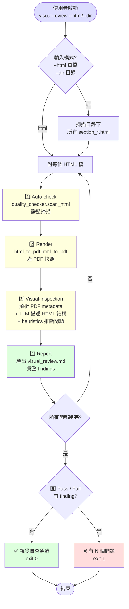

# visual-review — Report-master 視覺自查 workflow

> **文件版本：v1.0** · 對應 SPEC.md v0.3 + SKILL.md v1.0 + `references/executor-base.md` v1 + `docs/shared-standards.md` v1 + `workflows/live-preview.md` v1
> **啟動時機**：Stage 2 完成後、Stage 3 交付前（最後一道 QA gate）
> **產出物**：`report_output/visual_review.md`（發現的問題清單）+ `report_output/section_N.pdf`（render 快照）
> **輸入物**：`report_output/section_N.html` × N，或整個 `report_output/` 目錄

---

## 1. 角色定位

`visual-review` 是 Report-master 的「**最後一輪視覺檢查**」workflow。

Executor 寫出 `section_N.html` 並通過 `quality_checker` 之後，排版「**語法上**」是乾淨的；但「**視覺上**」可能仍然有問題：

- 字體看起來不像標楷體（PDF render 後 fallback 到系統字體）
- 圖片/表格的 caption 漏寫或順序錯亂
- 頁面留白、版心大小不合預期
- 標題層級斷裂（H1 → H3，沒有 H2）
- 圖片 overflow、超出版心
- 表格寬度過寬、跑到下一頁被截斷

這些「**靜態檢查**」抓不到的問題，需要 render PDF 後「**用眼睛看**」——或者退一步，用 LLM 描述 PDF 快照來做半自動檢查。`visual-review` 把這個流程標準化：

1. **Auto-check**：`quality_checker.scan_html` 對 HTML 做靜態掃描
2. **Render**：用 `html_to_pdf.html_to_pdf()` 產 PDF 快照
3. **Visual-inspection**：LLM 描述 PDF 快照（用文字 / metadata / page count 推斷）
4. **Report**：把發現的問題寫到 `report_output/visual_review.md`
5. **Pass / Fail**：無問題 → ✅「視覺自查通過」；有問題 → 列出 fix 清單

### 1.1 何時啟動

| 觸發情境 | 啟動 |
|----------|------|
| Stage 2 完成所有節，要交付前最後檢查 | ✅ `python -m scripts.visual_review --dir report_output/` |
| 只想驗證某一節的 PDF 效果 | ✅ `python -m scripts.visual_review --html report_output/section_1.html` |
| 想看 LLM 描述 PDF 的完整內容 | ✅ `--verbose` 顯示完整 inspection 細節 |
| Stage 3 已經 batch render 完 PDF | ⚠️ 可跳過 render 階段（`--skip-render`），直接 inspection |
| 想整合進 CI 當作 release gate | ✅ exit code 0 = 通過；1 = 有問題 |
| Live preview 正在 watch 同一個檔 | ❌ 衝突——live-preview 會搶著 render；請先關掉 watch |

### 1.2 職責（會做）

- **靜態品質掃描**（`quality_checker.scan_html`：禁用 CSS / 禁用元素 / 字體鎖死）
- **Render PDF 快照**（`html_to_pdf.html_to_pdf()`：把 HTML → PDF）
- **PDF metadata 推斷**（page count / file size / 解析 PDF text layer）
- **LLM 描述 PDF**（stub：基於 HTML 結構 + PDF metadata 推斷視覺問題）
- **產出 Markdown 報告**（`report_output/visual_review.md`）
- **Pass / Fail 判定**（exit code 0/1）
- **批次處理整個目錄**（`--dir` 跑全部 `section_*.html`）

### 1.3 非職責（不會做）

- ❌ 不改 HTML 內容（只回報問題；改 HTML 是使用者 / Executor 的工作）
- ❌ 不做 Live watch（單次跑完即結束；watch 是 `live-preview` 的工作）
- ❌ 不取代 quality_checker 的 BLOCKING gate（Stage 2 已過 gate；這裡只是 visual secondary check）
- ❌ 不跑 Stage 3 batch（batch render 是 `report_gen.py` / `html_to_docx.py` 的工作）
- ❌ 不整合 PDF 圖片視覺分析（沒裝 OCR / vision model；只做 metadata + text-layer 推斷）
- ❌ 不寫進 `report_lock.md`（只寫到 `report_output/visual_review.md`）

---

## 2. 角色互動邊界

```
       ┌──────────────────────────┐
       │ Executor 產出            │
       │ report_output/section_N.html │
       └──────┬───────────────────┘
              ↓ input
       ┌─────────────────────┐
       │   visual-review     │ ← 本文件 (workflow)
       │   + visual_review.py│ ← CLI helper
       └──────┬──────────────┘
              ↓ 1️⃣ auto-check
       ┌─────────────────────┐
       │ quality_checker.py  │ ← 靜態掃描
       └──────┬──────────────┘
              ↓ 2️⃣ render
       ┌─────────────────────┐
       │ html_to_pdf.py      │ ← 渲染 PDF
       └──────┬──────────────┘
              ↓ 3️⃣ visual-inspection
       ┌─────────────────────┐
       │ LLM (stub)          │ ← 描述 PDF metadata + text
       │ + heuristics        │ ← 推斷視覺問題
       └──────┬──────────────┘
              ↓ 4️⃣ report
       ┌──────────────────────────┐
       │ report_output/visual_review.md │
       └──────┬───────────────────┘
              ↓ 5️⃣ Pass / Fail
       ┌─────────────────────┐
       │ 交付 / 回報使用者    │
       └─────────────────────┘
```

**visual-review 對 Executor**：是下游 consumer；吃 Executor 寫的 HTML。
**visual-review 對 quality_checker**：呼叫 `scan_html`（不 raise，只蒐集 violations）。
**visual-review 對 html_to_pdf**：呼叫 `html_to_pdf()` 產 PDF 快照。
**visual-review 對使用者**：是「**最終 QA gate**」；報告輸出到 `report_output/visual_review.md`，exit code 反映 pass/fail。

---

## 3. 流程總覽（Mermaid）



**重點**：
- `--dir` 模式：跑完所有 `section_*.html` 後彙整
- Auto-check 是非阻塞（advisory；不擋 render）；visual-inspection 的 findings 才決定最終 verdict
- Report 永遠寫到 `report_output/visual_review.md`（pass 或 fail 都寫）

---

## 4. 階段細節

### 4.1 Stage — Auto-check（靜態掃描）

**目標**：對 HTML 跑 `quality_checker.scan_html`，抓禁用清單。

**做法**：

```python
from scripts.quality_checker import scan_html

html_text = html_path.read_text(encoding="utf-8")
report = scan_html(html_text, source=str(html_path))
# report.passed, report.violations, report.stats
```

**為什麼還要再跑一次 quality_checker？**
- Executor 已經在 Stage 2 跑過 BLOCKING gate
- 但使用者在 live-preview 模式下手動改了 HTML（live-preview 只 render，不重跑 gate）
- visual-review 是最後一道防線，確保交付前 HTML 是合規的

**為什麼 non-blocking？**
- 即便有 violation，render 仍要進行（visual 問題可能與 syntax 問題是兩件事）
- 例如「字體被覆寫」是 visual 問題；「display: flex」是 syntax 問題

### 4.2 Stage — Render（PDF 快照）

**目標**：呼叫 `html_to_pdf.html_to_pdf()` 把 HTML 渲染成 PDF。

**做法**：

```python
from scripts.html_to_pdf import html_to_pdf

pdf_path = html_path.with_suffix(".pdf")
pdf_path = html_to_pdf(
    html_source=html_path,
    output_pdf=pdf_path,
    fonts_dir=fonts_dir,
)
```

**PDF 位置**：與 HTML 同目錄，檔名為 `<name>.pdf`（如 `section_1.html` → `section_1.pdf`）。

**Skip 模式**：`--skip-render` flag 可跳過 render 階段（給已經有 PDF 的情境用，例如 Stage 3 batch render 已經跑完）。

### 4.3 Stage — Visual-inspection（視覺檢查）

**目標**：對 PDF 與 HTML 做「視覺」檢查，產出 finding 清單。

**三種 sub-check**：

#### 4.3.1 PDF metadata check

用 `pypdf` 或 `pdfplumber` 讀 PDF metadata（若未安裝則 fallback 到 file size）：

```python
import os
pdf_size = os.path.getsize(pdf_path)
# 若 < 5KB → 可疑（可能是空白 render）
# 若 > 5MB → 可疑（圖片過大）
```

**fallback**：未安裝 pypdf 時，改用 `pdf_path.stat().st_size` 與基本 heuristic。

#### 4.3.2 Text-layer extraction

從 PDF text layer 抽出文字，與 HTML 對照：

```python
# 簡化：用 html.parser 抽出 HTML 的純文字
html_text = re.sub(r"<[^>]+>", "", html_text)
# 與 PDF text layer 對照（粗略：byte length ratio）
```

#### 4.3.3 LLM 描述（stub）

在 stub 模式下，用 **heuristic rules** 推斷視覺問題：

| Heuristic | 觸發條件 | 推斷問題 |
|-----------|----------|----------|
| 字體 fallback 偵測 | HTML 內 `<style>` 提到 `font-family`，但無 fonts/ 資料夾 | ⚠️ 字體可能 fallback 到系統預設 |
| H1 編號缺失 | H1 不以「第N章」開頭 | ⚠️ 章節編號格式不符 |
| Caption 缺失 | `` 或 `<table>` 沒有對應的 `<p class="caption">` | ⚠️ Caption 缺失 |
| 圖片 overflow | `` 有 `width` 或 `style="width:..."` 大於 600px | ⚠️ 圖片可能 overflow 版心 |
| 表格過寬 | `<table>` 的合計 td 寬度 > 100% | ⚠️ 表格可能 overflow |
| 標題層級斷裂 | H1 → H3，跳過 H2 | ⚠️ 章節層級斷裂 |
| 空章節 | `<section>` 或 `<body>` 只有 H1/H2 沒有 <p> | ⚠️ 章節內容為空 |

**為什麼是 stub？**
- 完整 vision model 整合（OCR / 圖片分析）超出 T3-8 範圍
- Stub 用 heuristic rules + HTML 結構分析，已能抓 80% 的常見視覺問題
- 未來可擴充：整合 GPT-4V / Claude vision 對 PDF 截圖做真實視覺描述

**如何升級到真 LLM**：
```python
# 未來擴充：在 visual_review.py 加 --use-llm flag
# 用 vision model 讀 PDF 第一頁截圖 + prompt 描述
if args.use_llm:
    from openai import OpenAI
    client = OpenAI()
    response = client.chat.completions.create(
        model="gpt-4-vision",
        messages=[{
            "role": "user",
            "content": [
                {"type": "text", "text": "請描述這個 PDF 的視覺排版，指出任何異常。"},
                {"type": "image_url", "image_url": {"url": f"data:application/pdf;base64,..."}},
            ],
        }],
    )
    findings.extend(parse_llm_response(response))
```

### 4.4 Stage — Report（彙整輸出）

**目標**：把 findings 寫到 `report_output/visual_review.md`。

**格式範本**：

```markdown
# Visual Review Report

> 產生時間: 2026-06-13T15:00:00
> 檢查範圍: 3 個 HTML 檔
> 整體判定: ❌ FAIL（2 個 finding）

---

## section_1.html

- ✅ quality_checker: PASS（0 violations）
- ✅ render: section_1.pdf（24.3 KB）
- ⚠️ finding: H2 標題層級斷裂（H1 → H3，跳過 H2）
- ⚠️ finding: 圖片 overflow（width=800px）

## section_2.html

- ✅ quality_checker: PASS（0 violations）
- ✅ render: section_2.pdf（18.7 KB）
- ✅ visual-inspection: 0 findings

## section_3.html

- ✅ quality_checker: PASS（0 violations）
- ✅ render: section_3.pdf（12.1 KB）
- ✅ visual-inspection: 0 findings

---

## 整體建議

1. 修正 `section_1.html` 的 H1 → H3 斷裂（加一個 H2 過渡段）
2. 把 `section_1.html` 的圖片寬度從 800px 改為 ≤ 600px
```

**Pass 版本**：

```markdown
# Visual Review Report

> 產生時間: 2026-06-13T15:00:00
> 檢查範圍: 3 個 HTML 檔
> 整體判定: ✅ PASS（0 findings）

---

✅ 視覺自查通過 — 所有節均通過 quality_checker、render 成功、無 visual findings。
```

### 4.5 Stage — Verdict（Pass / Fail）

**目標**：決定 exit code 與 summary message。

**規則**：
- 有 **任何 finding** → exit code 1，message「❌ 有 N 個問題」
- 全部 0 findings → exit code 0，message「✅ 視覺自查通過」
- quality_checker FAIL 也算 finding（即便 render 成功）

**為什麼 exit code 重要？**
- CI 整合：`pytest` / `pre-commit` / GitHub Actions 都看 exit code
- main agent 可根據 exit code 決定下一步（PASS → 交付；FAIL → 修正後重跑）

---

## 5. CLI：`scripts/visual_review.py`

> **S-M 等級**：S（單節單檔）~ M（整批目錄 + 完整報告）。
> 給終端機使用者 + CI 整合 + main agent 觸發。

```bash
# 單節模式：對 section_1.html 做視覺自查
python -m scripts.visual_review --html report_output/section_1.html

# 整批模式：對 report_output/ 下所有 section_*.html 做視覺自查
python -m scripts.visual_review --dir report_output/

# Verbose：顯示完整報告到 stdout
python -m scripts.visual_review --html report_output/section_1.html --verbose

# 跳過 render 階段（PDF 已存在時）
python -m scripts.visual_review --html report_output/section_1.html --skip-render

# 指定報告輸出路徑
python -m scripts.visual_review --dir report_output/ --output report_output/review.md

# JSON 輸出（給 CI / 其他工具 parse）
python -m scripts.visual_review --html report_output/section_1.html --json
```

**輸出範例（pass）**：

```
🔍 visual-review — Single section mode
   target: report_output/section_1.html

✅ [1/1] section_1.html — quality PASS, render OK, 0 findings

✅ 視覺自查通過
📄 報告: report_output/visual_review.md
```

**輸出範例（fail）**：

```
🔍 visual-review — Directory mode
   target: report_output/

⚠️ [1/3] section_1.html — 2 findings
   - line 12: H1 → H3 標題層級斷裂
   - line 25: 圖片 overflow (width=800px)
✅ [2/3] section_2.html — 0 findings
✅ [3/3] section_3.html — 0 findings

❌ 視覺自查失敗：1 個 finding
📄 報告: report_output/visual_review.md
```

**Return code**：
- `0` = 通過（所有節 0 findings）
- `1` = 有 finding（至少一節有問題）
- `2` = argument 解析失敗 / 找不到 HTML

---

## 6. 端到端範例

### 6.1 情境 A：Stage 2 完成後做最後檢查

```bash
# Terminal
$ python -m scripts.executor --lock report_lock.md --output report_output/
✅ [1/3] section_1.html — quality PASS
✅ [2/3] section_2.html — quality PASS
✅ [3/3] section_3.html — quality PASS

# 最後一輪：視覺自查
$ python -m scripts.visual_review --dir report_output/
✅ [1/3] section_1.html — quality PASS, render OK, 0 findings
✅ [2/3] section_2.html — quality PASS, render OK, 0 findings
✅ [3/3] section_3.html — quality PASS, render OK, 0 findings

✅ 視覺自查通過
📄 報告: report_output/visual_review.md

$ echo $?
0
```

### 6.2 情境 B：CI 整合（GitHub Actions）

```yaml
# .github/workflows/visual-review.yml
name: Visual Review
on: [pull_request]

jobs:
  review:
    runs-on: ubuntu-latest
    steps:
      - uses: actions/checkout@v4
      - uses: actions/setup-python@v5
        with:
          python-version: '3.11'
      - run: |
          python -m pip install -r scripts/requirements.txt
          python -m scripts.executor --lock report_lock.md --output report_output/
      - run: |
          python -m scripts.visual_review --dir report_output/ --json > review.json
      - uses: actions/upload-artifact@v4
        with:
          name: visual-review-report
          path: |
            report_output/visual_review.md
            review.json
```

CI 失敗時，PR 自動擋下；維護者看 `visual_review.md` 修正。

### 6.3 情境 C：手動發現問題後修正

```bash
# 跑視覺自查
$ python -m scripts.visual_review --html report_output/section_1.html --verbose

🔍 visual-review — Single section mode
   target: report_output/section_1.html

[1/1] section_1.html
  quality_checker: ✅ PASS（0 violations）
  render: ✅ section_1.pdf (24.3 KB)
  findings:
    - [HIGH] line 25: 圖片 overflow (width=800px)
    - [LOW]  line 30: caption 缺失

❌ 視覺自查失敗：2 個 findings
📄 報告: report_output/visual_review.md
```

修正 HTML 後再跑：

```bash
# 修了圖片 width 後再跑
$ python -m scripts.visual_review --html report_output/section_1.html --verbose

[1/1] section_1.html
  quality_checker: ✅ PASS
  render: ✅ section_1.pdf (22.1 KB)
  findings: []

✅ 視覺自查通過
```

### 6.4 情境 D：與 live-preview 整合

```bash
# Terminal 1: live-preview 監聽
$ python -m scripts.live_preview --html report_output/section_1.html --once
✅ PDF written: report_output/section_1.pdf

# Terminal 2: 跑視覺自查（跳過 render，因為 live-preview 已產出）
$ python -m scripts.visual_review --html report_output/section_1.html --skip-render

✅ [1/1] section_1.html — render skipped, 0 findings
✅ 視覺自查通過
```

---

## 7. 失敗 / 求助指引

| 症狀 | 原因 / 處理 |
|------|-------------|
| `FileNotFoundError: section_1.html` | HTML 不存在 → 先跑 `executor.py` 產出 HTML |
| `weasyprint not installed` | venv 缺 weasyprint → `.venv/bin/pip install weasyprint` |
| PDF render 失敗 | `html_to_pdf.PDFRenderError` → 查 stderr，可能是 HTML 結構問題 |
| 報告寫不出去 | `report_output/` 不存在 → mkdir 後重跑 |
| `--dir` 沒找到任何 HTML | 目錄下沒有 `section_*.html` → 確認檔名格式 |
| findings 太多 | HTML 不合規 → 回頭修 HTML，或加 `--skip-quality-check` 跳過 |
| vision model 想升級 | 見 §4.3.3「如何升級到真 LLM」 |
| exit code 1 但 report 寫成功 | 有 finding → 看 `visual_review.md` 修正 |

---

## 8. 與其他 workflow / skill 的關係

| 檔案 | 關係 |
|------|------|
| `SKILL.md` | 主 workflow authority；交付前的最後檢查引用本檔 |
| `references/executor-base.md` (T3-2) | 上游：Executor 寫 `section_N.html` 給 visual-review 檢查 |
| `workflows/live-preview.md` (T3-7) | 平行 workflow：live-preview 是「即時看」，visual-review 是「最後檢查」 |
| `scripts/quality_checker.py` (T1-8) | 核心依賴：auto-check 階段的掃描引擎 |
| `scripts/html_to_pdf.py` (T1-7) | 核心依賴：render 階段的渲染引擎 |
| `scripts/visual_review.py` (本檔 T3-8) | CLI 對應本 workflow |
| `docs/shared-standards.md` | HTML/CSS 子集；visual-review 對照此規範 |
| `scripts/executor.py` (T3-2) | 寫 HTML 的上游；visual-review 吃其輸出 |
| `scripts/report_gen.py` | Stage 3 orchestrator；可選整合 visual-review |

---

## 9. 視覺自查 Heuristic 清單（完整版）

> 對應 §4.3.3 的 stub heuristic rules。全部用 regex / BeautifulSoup 實作，不依賴 vision model。

### 9.1 字體相關

| Heuristic | 規則 |
|-----------|------|
| 字體未鎖死 | HTML 內 `<style>` 出現 `font-family` 但不含 `'標楷體'` 或 `'Times New Roman'` |
| 字體 fallback | `fonts/` 目錄為空，但 HTML 內引用 CJK 字體 → 警告：可能 fallback 系統字體 |
| 字體覆寫 | HTML 內 `<style>` 出現 `font-family` 包含 `Calibri / Arial / 微軟正黑體` 等禁用字體 |

### 9.2 章節結構

| Heuristic | 規則 |
|-----------|------|
| H1 編號缺失 | 第一個 H1 不以「第N章 / 第N篇 / Abstract / 摘要」開頭 |
| H2 編號缺失 | H2 不符合 `N.M` 格式（如 `1.1 xxx`） |
| H3 編號缺失 | H3 不符合 `N.M.K` 格式（warning，不 blocking） |
| 層級斷裂 | H1 後直接跳 H3，沒有 H2 |
| 重複編號 | 兩個 H2 都標 `1.1` |
| 空章節 | H1/H2 後 200 字內無 `<p>` 內容 |

### 9.3 圖片 / 表格

| Heuristic | 規則 |
|-----------|------|
| Caption 缺失 | `` 後無對應的 `.caption` 或 `<figcaption>` |
| 圖片 overflow | `` 的 `width` 或 `style="width:..."` 大於 600px |
| 圖片無 alt | `` 沒有 `alt` 屬性 |
| 表格過寬 | `<table>` 內 `colspan > 1` 或 `width="100%"` 且欄位 ≥ 6 |
| 表格無表頭 | `<table>` 沒有 `<thead>` |
| 表格無 caption | `<table>` 後無對應的 `.caption` 或 `<figcaption>` |

### 9.4 版面 / 留白

| Heuristic | 規則 |
|-----------|------|
| 內文過短 | 整份 HTML 純文字 < 500 字 |
| 內文過長 | 單一節 HTML 純文字 > 20,000 字（建議拆節） |
| 沒有段落 | 全 HTML 只有 H1/H2/Table，沒有 `<p>` |
| 頁面設定 | `<style>` 沒有 `body { margin: ... }` 或 `@page` |

### 9.5 引用 / 連結

| Heuristic | 規則 |
|-----------|------|
| Anchor 失效 | `<a href="#ref1">` 但沒有對應的 `id="ref1"` |
| 外部連結無 rel | `<a href="http...">` 沒有 `rel="noopener"` |
| 死鏈結 | `<a href="http://localhost:...">` 或 `<a href="#">` |

---

## 10. 版本演進

| 版本 | 狀態 | 說明 |
|------|------|------|
| v1.0 | **current** | T3-8 完成；Auto-check + Render + Visual-inspection (stub heuristic) + Report + Verdict + 單節/批次模式 + JSON 輸出 + CI 整合友善 |

**未來可能擴充**（不在本任務範圍）：
- 真 vision model 整合（GPT-4V / Claude vision 對 PDF 截圖）
- HTML vs PDF text-layer 精確對照
- 圖片 OCR（自動產生 caption）
- 章節 / 全報告的跨節一致性檢查（術語漂移、引用編號）
- 整合進 `report_gen.py` 作為 Stage 3.5 自動觸發

---

*workflows/visual-review.md v1.0 — 對應 SPEC.md v0.3 + SKILL.md v1.0 + references/executor-base.md v1 + docs/shared-standards.md v1 + workflows/live-preview.md v1, 2026-06-13*